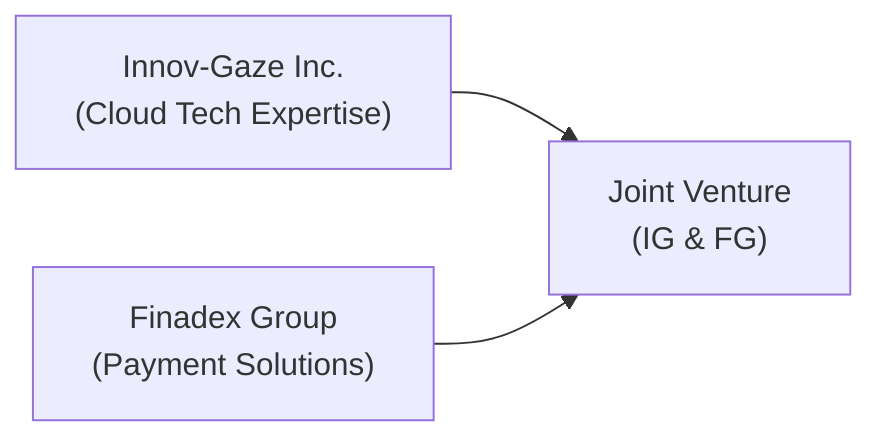

## The Case Context

Let’s imagine two large multinational corporations, Innov-Gaze Inc. (IG) and Finadex Group (FG), joining forces in a strategic partnership to develop next-generation digital payment solutions. IG is well-known for its cloud-based infrastructure, and FG brings decades of expertise in financial services. Both companies operate globally, but they’re particularly eyeing expansion in emerging markets where mobile adoption is skyrocketing.

Their strategic plan? Form a joint venture (JV) with the goal of combining advanced cloud technologies (from IG) and established payment platforms (from FG). They expect to gain from each other’s distribution networks, brand reputation, and financial know-how. You can’t help but feel a bit excited whenever you see big players coordinate like this because, well, the synergy could be huge… but also a tad complicated.

Below is a simplified Mermaid diagram showing how these two firms connect to the JV:

This scenario, dear Level II candidate, is typical in real-world corporate finance, especially when companies see potential in leveraging each other’s intangible assets—like brand and intellectual property—while pooling resources to reach new markets. Throughout this vignette, we’ll apply standard valuation approaches, but we’ll also consider intangible factors, labyrinthine governance matters, cross-border risks, and an assortment of “what if?” outcomes.

## Setting the Stage: Key Deal Elements

IG and FG have agreed on an initial capital outlay of USD 200 million each. They anticipate:

• Projected Revenue Streams: The JV’s revenue is expected to begin at USD 600 million in Year 1 and to grow at roughly 10% annually over the next five years (assuming synergy-based revenue enhancement).

• Capital Expenditures (CapEx): Significant investment in new cloud infrastructure, mobile security integration, and compliance frameworks worth about 150 million over five years.

• Synergy Estimates: Management teams project cost savings of around USD 40 million per year due to integrated IT solutions and shared back-office functions. Also, revenue synergies—like cross-selling opportunities—are expected to add up to USD 60 million a year. That said, intangible synergies (brand credibility, managerial expertise, and technology sharing) could generate further value that is trickier to quantify.

• Target ROI: Both companies have set an internal benchmark that the JV should yield an internal rate of return (IRR) of at least 14%. Their estimated weighted average cost of capital (WACC) stands at about 9%, factoring in the JV’s capital structure, business risk, and projected market outlook.

Take these numbers with a pinch of salt—everyone knows once you dive into cross-border CFO work, details can shift quickly. But they give a framework for how the initial valuation analysis might begin.

## The Valuation Approaches

### Discounted Cash Flow (DCF)

Most alliances, especially capital-intensive ones, will have you start with a base-case DCF analysis: forecast free cash flows, discount them back to the present, and see where the net present value (NPV) sits. DCF is an old friend that we rely on precisely because it forces us to lay out assumptions explicitly—growth rates, capital spending, and discount rates—while revealing the sensitivity of results to slight changes in these assumptions.

DCF can be summarized in a straightforward formula:


\text{NPV} = \sum_{t=1}^{n} \frac{FCF_{t}}{(1 + r)^t} - \text{Initial Investment}


Where \\( FCF_t \\) is the free cash flow in year \\( t \\) and \\( r \\) is the discount rate (often the WACC).

In practice, you’d do something like:

1. Project operating cash flows (taking synergies into account).  
2. Subtract incremental working capital needs and CapEx.  
3. Arrive at free cash flows for each year.  
4. Discount them back at, say, 9%.  
5. Compare the sum of discounted cash flows to the total JV investment.

If the NPV is positive, the JV looks good relative to the required rate of return—but you’ll test it again under different scenarios to see how results change when reality surprises you (which it always does).

### Relative Valuation (Multiples)

DCF can miss short-term market sentiment or intangible brand factors. That’s where multiples help. The JV might be benchmarked against comparable companies or alliances in the FinTech or Payment Processing space. For instance:

• Price-to-Sales (P/S) ratio.  
• Enterprise Value-to-EBITDA (EV/EBITDA).  
• Price-to-Earnings (P/E), although early-stage ventures often have negative or near-zero earnings.  

Even large strategic partnerships sometimes anchor their negotiations on these barometers—especially if one partner is investing more intangible capital (say, brand or patents) while the other invests in physical infrastructure. Negotiations often revolve around, “Wait, how do we put a multiple on intangible synergy?”

Ultimately, a blended approach is often used: anchor your analysis in DCF to capture the long-term cash flow potential and tack on a multiples-based “sanity check” or “market-based cross-check.” If all the approaches are in the same ballpark, your JV is likely to be fairly valued.

## Intangible Factors and Synergies

Here’s where things can get fuzzy. We get intangible synergy in:

• Brand Leverage: If FG has a classy global finance brand, and IG is known for cutting-edge technology, merging those reputations in marketing campaigns might attract more customers.  
• Managerial Expertise: Some teams hold patents. Others have extensive networks. Combining them can lead to new product lines that might not exist if each firm stayed in its silo.  
• Innovative Culture: This is intangible, but partnerships sometimes spark new R&D breakthroughs simply because you have more diverse engineering talent under one roof.

Quantifying intangible synergy is tough. My friend once told me about a cross-border JV he observed that started out with big intangible synergy expectations—like co-branding new products—only to realize that local customers perceived the brand differently, and synergy took longer (and more money) to materialize. So intangible synergy is real but not guaranteed, and it certainly complicates valuations.

## Risk Factors in the JV

Naturally, big opportunities attract big risks. For IG and FG:

1. Exchange Rate Volatility: Emerging markets can experience currency swings that render revenue forecasts volatile. The JV might consider hedging via currency swaps or forward contracts to ensure stable local cash flows.  
2. Political Instability: Regulatory environments in key markets may shift suddenly—especially regarding data privacy or financial regulations. That can influence compliance costs and time-to-market.  
3. Unexpected Competition: The payment industry moves lightning-fast. Startups or big tech entrants could undercut the JV’s offering with sleeker apps or better user experiences.  
4. Governance Disputes: With equal investments, who controls the JV’s board? How do they handle disagreements on new product launches, cost allocations, or IP ownership? These conflicts can be subtle but have major long-term impact.

One tried-and-true approach is robust risk allocation in the governance documents—like specifying procedures for major strategic decisions, establishing how many board seats each partner holds, and clarifying how intangible assets (like new patents from the JV) will be owned or licensed.

## The Potential Conflicts and Resolution

If there’s anything you learn in finance, it might be that “what can go wrong, will go wrong” is more than just a saying. Partnerships can run into friction from:

• Different Corporate Cultures: IG’s workforce might be more “Silicon Valley casual,” while FG has a strict finance environment emphasizing compliance.  
• IP Ownership: The JV might develop new fintech solutions. Who ultimately holds the rights to those solutions? One or both?  
• Reinvestment vs. Return of Capital: IG might push to reinvest in product enhancements, whereas FG might want to pay out dividends or do share buybacks to see immediate returns.

Conflicts can be mitigated through:

• Detailed Shareholder Agreements: Defining exit clauses, forced buyouts, or mandatory funding calls.  
• Third-Party Mediation: In some deals, complicated disputes are referred to neutral experts or arbitrators.  
• Regular Performance Reviews: Monitoring synergy performance vs. initial targets, then adjusting approach if synergy is underachieving.

## Scenario Analysis

Given uncertainties, scenario analyses become essential. You might define:

- Optimistic Scenario: Achieve revenue synergy swiftly; intangible brand synergy is fully realized by Year 2. The JV experiences no major regulatory hurdles, exchange rates remain favorable, and the IRR might exceed 16%.  
- Base Case Scenario: Realistic synergy ramp-up, with moderate cost savings and stable (but not spectacular) brand synergy. Annual revenue growth hits 8%–10%, IRR around 14%.  
- Pessimistic Scenario: Delays in synergy, expensive regulatory compliance, or currency devaluations hamper success. Maybe IRR dips to 10% or lower, putting the JV’s viability at risk.

A quick (simplified) numeric scenario table for the JV’s projected annual free cash flow (FCF) might look like this (all figures in USD millions):

| Year   | Optimistic FCF | Base Case FCF | Pessimistic FCF |
|--------|----------------|---------------|-----------------|
| 1      | 200            | 150           | 100             |
| 2      | 280            | 210           | 140             |
| 3      | 360            | 270           | 180             |
| 4      | 450            | 320           | 220             |
| 5      | 540            | 390           | 260             |

If you discount each series of FCF at 9%, you’ll end up with three different NPVs. The JV’s overall viability would typically be determined by weighting these scenarios or referencing some risk tolerance measure. If, for example, the base-case DCF suggests an NPV well above zero and the IRR is around 14%, that’s your green light from a purely financial standpoint—subject to also factoring intangible synergy, potential conflicts, and risk management.

## Constructing Integrated Answers

In an exam setting, you’ll be asked to propose integrated recommendations. A typical question might say:

“Given the DCF outcome, intangible synergy, risk allocation, and governance challenges, propose a plan for a successful strategic partnership.” 

Your recommended solution would ideally cover:

1. **Financial**: Validating the JV’s ROI with rigorous DCF or IRR.  
2. **Operational**: Building flexible internal processes that adapt to cross-cultural or market-based issues.  
3. **Risk Management**: Implementing currency hedges, scenario planning, and contingency budgets.  
4. **Governance**: Defining roles, dispute resolution processes, decision-making authority, and IP ownership.  
5. **ESG / Sustainability** (if relevant): For cross-border JVs, how do environmental, social, or local governance regulations affect operational strategy?

And do it all while keeping an eye on synergy execution. In short, the exam will push you to take a holistic view—just as you would in real life.

## Best Practices and Common Pitfalls

• **Best Practices**  
   - Use both DCF and relative valuation multiples to get a balanced perspective of the JV’s worth.  
   - Don’t ignore intangible factors—especially brand synergy or key technology integrations.  
   - Employ scenario and sensitivity analyses to gauge the JV’s resilience across different environments.  
   - Document risk allocation: Hedge foreign exchange exposures where feasible, and keep an eye on interest rates and inflation.  
   - Negotiate governance terms up front to prevent crippling stalemates later.

• **Common Pitfalls**  
   - Basing synergy estimates purely on top-line revenue growth, ignoring intangible or hidden obstacles.  
   - Overlooking cultural integration issues—especially in cross-border deals.  
   - Failing to account for new entrants or disruptive tech in dynamic markets.  
   - Underestimating the legal, compliance, and tax complexities that come with multi-jurisdictional operations.  
   - Lack of a Plan B when synergy milestone targets fall behind schedule.

## Practical Tips for the CFA Exam

Yes, it’s fun to debate intangible synergy. But on exam day, you need to be methodical. For item sets:

1. **Scan the Vignette**: Note revenue forecasts, synergy assumptions, discount rates, intangible synergy claims—these details tie back to your final calculations.  
2. **Identify Red Flags**: If the vignette hints at potential conflicts or risk exposures, expect questions regarding governance or scenario analysis.  
3. **Show Your Work**: Even if you have limited time, highlight the major formula applications or discount rates you used.  
4. **Interpret Intangibles**: If brand synergy is part of the data provided, discuss it. In other words, show the examiners you understand intangible synergy isn’t just a throwaway line.  
5. **Time Management**: Don’t get bogged down in minor details. Keep an eye on the big synergy picture and how the numbers might shift under different assumptions.  

## References

- Damodaran, A. (2012). Investment Valuation: Tools and Techniques for Determining the Value of Any Asset. 3rd ed. Wiley.  
- Bruner, R.F. (2004). Applied Mergers and Acquisitions. Wiley.  

Additional reading from the CFA Institute’s official curriculum on Corporate Finance and M&A synergy valuations can also reinforce your foundation.

## Practice Questions on Partnership Valuation Scenarios

Below are sample item set–style questions. They focus on core valuation, synergy modeling, intangible factor considerations, risk management, and governance. Please select the best answer(s) based on the discussion above.

## Test Your Knowledge: Strategic Partnership & Synergy Valuation



### Which statement best describes a potential benefit of intangible synergy in a joint venture?

- [ ] Increased compliance costs resulting from brand collaboration.  
- [ ] Reduced capital investment resulting from intangible branding.  
- [x] Enhanced product credibility and innovative culture from combining brands.  
- [ ] Immediate revenue gains purely from executive reassignments.  

> **Explanation:** Intangible synergies, such as brand credibility or fostering an innovative culture, can drive enhanced long-term performance even though the benefits are not always immediate or easily quantified.

### In the scenario where the JV’s IRR falls below 9%, which action might align best with typical risk management practices?

- [ ] Cancel the JV immediately without further analysis.  
- [ ] Increase intangible synergy estimates to offset the shortfall.  
- [ ] Reduce the discount rate until IRR meets the investment threshold.  
- [x] Investigate cost reductions, renegotiate risk allocations, or consider currency hedges.  

> **Explanation:** If the IRR is below the WACC, standard practice is to re-examine operational costs, synergy assumptions, and broad risk mitigation before launching or proceeding with the JV. Simply changing discount rates or artificially boosting synergy estimates is not appropriate.

### A base-case DCF for the JV might best capture which of the following data elements?

- [x] Projected free cash flows, synergy savings, and a suitable discount rate.  
- [ ] Only intangible synergy estimates without tangible cost figures.  
- [ ] Industry-wide EPS estimates for unrelated companies.  
- [ ] Board composition details affecting brand strategies.  

> **Explanation:** A proper DCF analysis includes projected free cash flows factoring synergy, discounted at an appropriate rate. It excludes purely external metrics that do not directly affect free cash flow (e.g., unrelated industry EPS data).

### If a valuation uses enterprise value-to-EBITDA multiples from comparable alliances, what is one key concern in the JV context?

- [ ] Overdependence on intangible synergy projections.  
- [x] Differences in capital structure or risk profiles between the JV and comparables.
- [ ] Inability to calculate EBITDA in large multinationals.  
- [ ] Requirement of a negative WACC for synergy.  

> **Explanation:** Comparable multiples can fail if the JV’s capital structure or overall risk profile differs substantially from the benchmark companies, leading to a misaligned valuation.

### Which of the following intangible factors is typically hardest to measure when evaluating a new cross-border JV?

- [ ] Patents and trademarks with known licensing fees.  
- [ ] Shared software platforms that have known market value.  
- [x] Cultural integration and managerial expertise.  
- [ ] Transaction fees for cross-border banking.  

> **Explanation:** Cultural integration and managerial expertise are inherently more qualitative and complex to measure compared to patented IP or software, which often have more defined market values or licensing agreements.

### Which scenario might cause a significant downward revision of synergy estimates?

- [x] Emergence of a fintech competitor with a disruptive technology.  
- [ ] A slight drop in short-term interest rates.  
- [ ] Minor differences in corporate governance style.  
- [ ] A stable political environment in a key market.  

> **Explanation:** A disruptive competitor can erode synergy value by taking market share or forcing the JV to invest more in product improvements, reducing the net benefits originally projected.

### The governance structure of the JV is equally split between IG and FG. The board is deadlocked on reinvestment strategy. Which solution aligns with best practices?

- [ ] Carry on without resolution, as synergy is unaffected by board disputes.  
- [ ] Let a single executive from FG decide.  
- [x] Refer to a predefined dispute resolution process or third-party mediator.  
- [ ] Immediately dissolve the JV due to conflict.  

> **Explanation:** Effective governance agreements outline conflict resolution mechanisms (often a third-party neutral mediator) to avoid prolonged deadlocks that could hamper operations and synergy realization.

### Why might scenario analysis be particularly critical for cross-border JVs?

- [ ] Single-equation DCF models rarely apply to such ventures.  
- [ ] Regulators forbid using discount rates in cross-border deals.  
- [x] Economic and political variables can shift rapidly, altering cash flows and synergy realization.
- [ ] Cultural differences eliminate the need for synergy-based forecasting.  

> **Explanation:** Cross-border ventures face dynamic risks—exchange rates, regulatory changes, and political instability—that can significantly sway actual cash flows from initial forecasts, making scenario analysis a must.

### Which statement is most accurate regarding intangible brand synergy?

- [ ] Brand synergy never materializes in real alliances.  
- [x] Brand synergy can yield customer loyalty but often requires additional marketing investment.  
- [ ] Brand synergy requires minimal marketing to monetize.  
- [ ] Brand synergy is always fully realized within one year.  

> **Explanation:** Brand synergy usually involves leveraging and integrating both partners’ brand equity, but it takes time, investment in marketing, and alignment of corporate cultures to realize the benefits.

### Are governance disputes solely a short-term issue in newly formed JVs?

- [x] True  
- [ ] False  

> **Explanation:** Actually, this statement is false. Governance disputes can arise at any stage of the JV. They can flare up when external conditions change, or when the strategic direction shifts. Proper governance mechanisms are vital for the long haul.



Remember, these practice questions are designed to illustrate common themes in partnership valuations. On exam day, you may face additional complexities—detailed synergy models, advanced risk-hedging approaches, or intangible asset allocations—but the fundamental principles remain the same. Good luck, and keep refining your valuation skills in every scenario you encounter!
