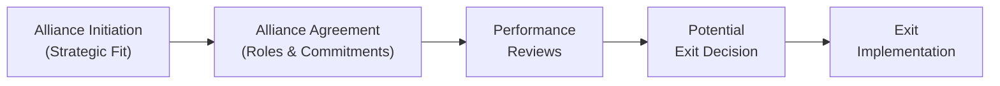

## Introduction and Context

Alliances can be exciting. They hold the promise of synergies, combined market clout, and innovative product offerings. But they can also be tricky—so many moving pieces, multiple cultures, and sometimes conflicting objectives. I remember a close colleague telling me about an alliance that looked terrific on paper but never quite delivered the results they projected. That’s the thing: measuring the performance of an alliance is key to understanding whether it's flying high or just coasting (or worse, sinking). And if things do start sinking, you need a plan to exit gracefully.

In the previous sections on Strategic Corporate Alliances, we talked about how alliances get formed and the strategic considerations behind them. Now let’s dive into how you track and measure an alliance over time, figure out when it’s time to let go, and—importantly—manage a smooth exit without burning bridges.

## Key Performance Indicators (KPIs)

While many alliances initially focus on good old-fashioned financial metrics, effective performance measurement usually goes beyond just revenue or net profit. You might want to track:

• Financial Metrics:  
  – Revenue and margin contributions from alliance-related products/services  
  – Cost synergies (like supply-chain efficiencies)  
  – Return on investment (ROI) from specific alliance-driven R&D projects  

• Non-Financial Metrics:  
  – Market share in targeted segments  
  – Brand synergy (e.g., increased brand recognition, improved brand sentiment)  
  – Employee satisfaction and retention rates associated with alliance-driven roles  
  – Technology transfers or knowledge sharing  

A balanced mix of financial and non-financial KPIs can give you a fuller picture of the alliance’s performance. Let’s lay out a brief table that might help you organize your alliance KPIs:

| KPI Category         | Metric Example                 | Interpretation                                            |
|----------------------|--------------------------------|-----------------------------------------------------------|
| Financial KPIs       | Revenue growth, profit margin  | Evaluates synergy impact on revenues and profitability    |
|                      | ROI of alliance R&D            | Determines capital efficiency in cross-firm innovation    |
| Non-Financial KPIs   | Market share, brand awareness  | Assesses intangible benefits of cooperative efforts       |
|                      | Employee satisfaction rating    | Measures internal readiness for collaborative processes   |

I’ve seen alliances where the non-financial metrics really made a difference in decision-making. For example, two technology companies might measure how effectively employees can integrate new software routines shared through the alliance. If employees are frustrated, that’s a leading indicator that your synergy assumptions might need revisiting.

## Rolling Evaluations and Ongoing Benchmarking

Even stable alliances need regular checkups. Ideally, you’d do some form of evaluation quarterly or semi-annually. The length and frequency depend on the alliance complexity and the pace of changes in your market. A typical approach might include:

• Setting Measurable Targets:  
  Alliance partners jointly set targets (like 10% revenue growth from cross-selling).  
• Establishing Regular Reports:  
  Both firms prepare updates that show actual performance vs. targets.  
• Conducting Review Meetings:  
  Senior leaders from both sides discuss deviations from plan, share insights, and decide next steps.  

### Practical Tip

If you’re scheduling performance reviews, try to keep them forward-looking. Don’t only focus on the past. Ask, “What can we do better, or differently, in the next quarter?” That helps you adapt proactively to market changes rather than playing catch-up.  

## Early Detection of Underperformance

One of the biggest advantages of rolling evaluations is you can spot underperformance early—hopefully before it snowballs. I’ve heard of alliances that only realized they had serious issues after multiple quarters of missed targets. By that time, trust was eroded on both sides.

A balanced scorecard approach helps you pinpoint warning signals across four dimensions:

• Financial outcomes (e.g., repeated margin shortfalls)  
• Customer metrics (e.g., poor feedback from shared clients)  
• Internal processes (e.g., cost overruns or timeline extensions)  
• Learning and growth indicators (e.g., R&D capability not improving)  

When these signals persist, someone has to raise the red flag. In bigger, more complex alliances, each company’s finance and strategy teams might do variance analyses to compare actual results with budgeted or forecast figures. Persistent negative variances can indicate that synergy assumptions or resource commitments need to be reevaluated.

## Formulating Exit Criteria

Every alliance, no matter how wonderful, should have a contingency plan. That includes deciding, upfront, under what conditions either or both partners can exit. Exit triggers might include:

• Chronic Financial Underperformance:  
  If the alliance fails to meet agreed-upon performance thresholds (e.g., less than 5% net margin for six consecutive quarters).  
• Strategic Misalignment:  
  Maybe your partner pivots to a new strategy or merges with a competitor, making your original collaboration goals obsolete.  
• Resource Constraints:  
  If your company needs to shift capital or personnel to a more pressing project.  
• Reputation Risk:  
  Should the alliance partner face regulatory issues or reputational harm that spills over onto your brand.  

These exit criteria should be spelled out in initial contracts or alliance charters, so everyone’s clear. Think of it like a prenuptial agreement: you hope you never need it, but it’s good for everyone to have it in writing.

## Planning Orderly Transitions

So, what if you do need to exit an alliance? Maybe synergy just isn’t happening, or maybe the market changed drastically. The next step is to ensure that your exit is smooth and minimally disruptive. Some best practices:

• Asset Transfers:  
  – Determine who retains which assets (e.g., intellectual property, product lines, proprietary data).  
  – If needed, facilitate buyout clauses for licensing patents or technology.  

• Customer Contract Assignments:  
  – Decide if there’s a transitional period where both parties support existing clients.  
  – Communicate changes in a timely manner to preserve goodwill with customers.  

• Employee Redeployment:  
  – Clarify how to reallocate or absorb staff who have been dedicated to the alliance.  
  – Offer training or career transition support if roles are eliminated.  

• Legal & Accounting Considerations:  
  – Develop guidelines for financial settlement to ensure fairness (e.g., cost reimbursements, final profit splits).  
  – Prepare final statements clarifying any outstanding liabilities.  

This step might sound administrative, but it’s crucial for avoiding future litigation and maintaining the possibility of collaborating again someday.

## Retaining Goodwill and Brand Reputation

Even if an alliance unravels, you can still preserve goodwill. Being respectful, transparent, and fair goes a long way. For instance, if your alliance partner invests heavily in joint marketing, you might offer them a bridging arrangement so they’re not left high and dry. Preserving brand reputation often matters more in the long run than “winning” in a one-off exit negotiation. 

As a side note, I’ve seen major consumer product giants maintain cordial relationships after dissolving alliances precisely because they wanted to keep the door open to future collaborations in other product lines or geographies. In some industries—like technology or pharmaceuticals—there’s a good chance you’ll partner again at some point, so burning bridges is rarely wise.

## Post-Alliance Review

When the dust settles, it’s good practice to conduct a thorough post-alliance review:

• Evaluate Performance:  
  – Which KPIs were consistently met, and which ones lagged?  
  – Did the alliance deliver the synergy benefits you expected?  

• Governance Insights:  
  – Were the governance structures (joint steering committees, project management offices) effective, or did they stifle agility?  
  – How about cultural fit—did it help or hinder the partnership?  

• Lessons Learned:  
  – Document key findings to shape future alliances, highlight best practices, and avoid repeating mistakes.  
  – Share these lessons with key decision-makers and your corporate strategy team.  

### Sample Mermaid Process Flow

Below is a quick visualization of an alliance life cycle, from formation to potential exit:

## Practical Example: Tech Collaboration Gone Awry

Let’s say you have two technology firms, InnovateX and BrightWare, forming an alliance to develop an AI-enabled financial planning app. Initially, they projected $20 million in new annual revenue, a brand synergy boost, and a big leap in R&D capabilities.

• After 12 months, revenue is barely half of target. Revenue shortfalls are persistent.  
• Rolling evaluations reveal overlaps in administrative costs and friction in product teams.  
• Underperformance triggers: Key developers keep leaving for rival firms.  
• Exit criteria: InnovateX documented a clause stating if synergy-based revenue lags by over 40% for two consecutive quarters, they can walk away.  
• The alliance dissolves. InnovateX purchases certain IP rights. BrightWare reassigns staff. Both maintain a cordial relationship by continuing cross-licensing some technology.  

Despite the dissolution, the relationship didn’t devolve into endless lawsuits. They parted politely, and ironically, they re-collaborated two years later on a new project after reorganizing their teams.

## Glossary of Key Terms

• Key Performance Indicators (KPIs): Measurable metrics used to assess ongoing operations, typically spanning quantitative (profits, costs) and qualitative (customer engagement, brand reputation) dimensions.  
• Balanced Scorecard: A framework for blending financial and non-financial measures to align day-to-day operations with overarching strategic aims.  
• Exit Criteria: Predefined signals or conditions that allow one or both parties to halt the alliance when it’s no longer viable.  
• Amicable Separation: A structured, respectful dissolution approach that preserves brand reputation and maintains a path for future cooperation.  
• Post-Alliance Review: A final analysis of strategic, operational, and financial successes or shortfalls from the alliance, used to refine future partnerships.  

## Best Practices and Common Pitfalls

• Best Practices  
  – Clearly define objectives, KPIs, and exit criteria at the onset.  
  – Use periodic evaluations to keep a close eye on results and pivot as needed.  
  – Foster transparent communication and maintain mutual trust.  
  – Preserve goodwill through respectful exit processes.  

• Common Pitfalls  
  – Overemphasizing financial metrics while ignoring cultural or strategic alignment.  
  – Missing early warning signs of underperformance.  
  – Failing to document a thorough exit strategy.  
  – Creating animosity by handling termination haphazardly, thus risking future collaborations.  

## Exam Relevance

In the CFA Level II exam context, you may encounter item sets describing alliances between two corporate issuers. The vignette might include partial financial and operational data over multiple periods, along with narrative elements indicating strategic friction. Your challenge is to assess alliance performance, determine whether the exit criteria have been met, and recommend an exit strategy or an adjustment plan. Remember to consider intangible factors (culture, brand synergy, and governance issues) as well as the purely financial numbers.

## References and Further Reading

• Ireland, R.D., Hitt, M.A., & Vaidyanath, D. (2002). “Alliance Management as a Source of Competitive Advantage.” Journal of Management.  
• Kaplan, R.S., & Norton, D.P. (1992). “The Balanced Scorecard—Measures that Drive Performance.” Harvard Business Review.  

You can check out the works of these authors to further understand how alliances can be a strategic lever for growth and how to measure them effectively.  

## Test Your Knowledge: Alliance Performance & Exit Strategies



### An alliance is most effectively evaluated by using:
- [ ] Only quantitative metrics such as revenue, margins, and ROI.
- [ ] A single metric representing all financial benefits.
- [x] A blend of quantitative and qualitative metrics.
- [ ] Year-end financial statements alone.

> **Explanation:** Alliance performance should be measured using both financial metrics (like revenue growth, profit margins) and non-financial KPIs (e.g., market share, brand synergy). A single metric or financial statements alone may not capture the full performance picture.

### Which of the following is least likely a non-financial KPI for an alliance?
- [ ] Employee satisfaction rating.
- [ ] Brand recognition improvements.
- [x] Earnings before interest and taxes (EBIT).
- [ ] Customer feedback surveys.

> **Explanation:** EBIT is purely a financial metric. Non-financial KPIs typically include employee satisfaction, brand awareness, and customer engagement.

### A balanced scorecard approach helps alliance partners by:
- [ ] Focusing exclusively on short-term financial gains.
- [x] Considering both financial and non-financial metrics in performance assessment.
- [ ] Evaluating only marketing synergies.
- [ ] Eliminating the need for revenue-based metrics.

> **Explanation:** The balanced scorecard framework is designed to incorporate multiple perspectives (financial, customer, internal processes, learning, and growth), ensuring a comprehensive approach to alliance evaluation.

### What is the primary purpose of rolling performance evaluations in alliances?
- [ ] Punishing the underperforming partner. 
- [ ] Minimizing communication between partners. 
- [ ] Meeting annual compliance requirements. 
- [x] Identifying and addressing issues or declining performance early.

> **Explanation:** Rolling evaluations allow timely detection of problems (financial or strategic), enabling corrective actions before underperformance escalates.

### When forming a new alliance, setting exit criteria is critical because it:
- [ ] Allows partners to trade stocks in the open market more effectively.
- [x] Provides clarity on conditions that would trigger alliance dissolution.
- [ ] Ensures that the alliance will never dissolve.
- [ ] Eliminates the need for performance measurement.

> **Explanation:** Exit criteria define the specific conditions under which an alliance will be reassessed or dissolved, protecting both parties from staying in an unproductive relationship.

### If an alliance persistently fails to meet revenue targets, a prudent next step would be to:
- [ ] Immediately dissolve the alliance with no further analysis.
- [x] Use variance analyses and balanced scorecards to identify root causes.
- [ ] Double the marketing budget regardless of cost.
- [ ] Ignore the shortfall if non-financial KPIs are satisfactory.

> **Explanation:** Variance analyses and balanced scorecards help pinpoint reasons for the shortfall and help guide whether strategic or operational changes are necessary.

### Which of the following best describes an amicable separation?
- [ ] Legal action against the alliance partner.
- [ ] Immediate contract termination without notice.
- [ ] Selling IP without proper licensing arrangements.
- [x] A structured, respectful approach to alliance dissolution.

> **Explanation:** An amicable separation involves a planned, mutually respectful exit process that preserves goodwill and brand reputation.

### During an exit scenario, determining how customers’ contracts will be handled is important because:
- [ ] Alliances do not typically have any customers.
- [ ] Accounting regulations require it.
- [x] It protects brand image and ensures customer retention or orderly handover.
- [ ] Regulators seldom review customer contracts during an exit.

> **Explanation:** Customer contract assignments, communications, and responsibilities need to be clearly outlined to avoid customer confusion and reputational damage.

### The final step in alliance dissolution typically involves:
- [ ] Ceasing all communication with the partner.
- [ ] Re-hiring employees under a new brand.
- [x] Conducting a post-alliance review to learn from successes or failures.
- [ ] Maintaining each other’s intellectual property without agreement.

> **Explanation:** A post-alliance review ensures that the partners draw lessons and document any relevant improvements for future projects or collaborations.

### True or False: Retaining goodwill after an alliance dissolution can facilitate future collaborations between the same parties.
- [x] True
- [ ] False

> **Explanation:** Even if an alliance ends, preserving goodwill makes subsequent partnerships or ventures easier and more fruitful, as the parties maintain a foundation of mutual respect.


