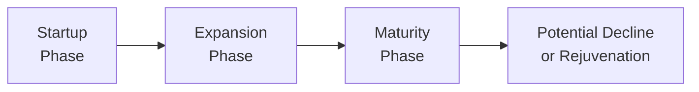

## Introduction
Well, you know how sometimes a company seems to be zooming along, doubling sales almost every year, and then—suddenly—it stalls out? It’s like everyone in the boardroom is scratching their heads thinking, “Uh, so what happened?” This phenomenon isn’t just chance; it typically marks the passing of a “breakpoint” in corporate growth. Breakpoints serve as clear signposts along a company’s life cycle, pointing to new strategic imperatives—like funding expansions, refining operational processes, or rethinking product lines.

In CFA® 2025 Level II, especially within Corporate Issuers, recognizing these growth inflection points is essential. Vignette questions often hinge on whether you can pinpoint a shift from expansion to maturity, or identify a looming decline. In this section, we’ll get into the drivers behind these breakpoints—covering everything from internal signals (like capacity utilization) to external forces (like competitor moves or regulation). We’ll sprinkle in some ratio analysis and scenario planning to give you the big picture.

## Recognizing Growth Stages
It helps to first lay out the broad corporate lifecycle stages: startup, expansion, maturity, and decline. While not every company follows this exact path—some might skip or combine stages—the general framework is invaluable.

• Startup: At this point, revenue is typically minimal, and costs are high relative to sales. Cash flow is often negative.  
• Expansion: The organization experiences rapid increases in sales and market share. Profit margins may widen as the firm benefits from economies of scale.  
• Maturity: Growth stabilizes. Cash flow becomes more predictable, and the company shifts focus to optimizing efficiencies.  
• Decline: Revenues can stagnate or decrease because of market saturation, competition, or changing customer preferences.

### The S-Curve Model  
You might hear about the S-curve, which visually portrays how growth starts off slowly, then rapidly accelerates, and later tapers off. Early in the curve, small changes in market positioning can bring huge leaps in revenue. But as the company approaches market saturation, keep an eye out for that flattening part of the “S.” That’s often where important decisions—like diversifying products or pivoting strategy—must be made to stave off decline.



## Monitoring Internal and External Indicators
Let’s face it: sometimes growth plateaus creep up on you. But you can often spot trouble (or opportunity) by staying hyper-aware of both internal and external indicators.

### Internal Metrics
• Capacity Utilization: If your production lines are running at full tilt, you might need extra investment to maintain growth. Alternatively, if there’s plenty of unused capacity, growth might be stalling.  
• Production Bottlenecks: Backlogs in orders or supply chain constraints can either signal robust demand or poor operational management.  
• Sales Pipeline Trends: A sudden drop in your future orders may point to a looming slowdown.

### External Signals
• Market Share Volatility: If you are suddenly losing market share to a competitor, consider whether a product refresh or strategic pivot is overdue.  
• Competitor Announcements: New product lines or big acquisitions by your rivals might knock you off your previously comfy perch.  
• Regulatory Changes: New regulations can spark or stifle industry growth. Think about how a tax incentive might catalyze expansion or how stricter environmental regulations can hamper certain industries.

### Scenario Analysis
One approach is to lay out “what-if” stories:  
• Best Case: Market demand stays robust; your production scales up nicely.  
• Moderate Case: Sales growth slows as competition intensifies.  
• Worst Case: Demand dramatically falls, or an external shock (like a supply chain crisis) hits.

Scenario analyses let you see whether small shifts (e.g., 2% difference in expected sales growth) can trigger breakpoints. This helps with budgeting, risk management, and deciding if you need new financing.

## Quantitative Tools for Identifying Breakpoints
Numbers tell a story. A firm might look fine at a glance, but a deep ratio analysis or break-even calculation could reveal that it’s teetering on the edge of a new growth phase.

### Ratio Analysis over Multiple Periods
• Profitability Ratios (e.g., Net Profit Margin, ROE): A steady decline in these metrics might foreshadow a shift from expansion to maturity.  
• Leverage Ratios (e.g., Debt-to-Equity): If these creep too high, the company could be overextending during the expansion stage and setting itself up for trouble.  
• Efficiency Ratios (e.g., Asset Turnover, Inventory Turnover): Slow-down in turnover might be an early signal of looming overcapacity or weaker demand.

### Break-Even Analysis
Break-even analysis calculates the point at which total revenues equal total costs. If a company edges closer to that break-even point over time, it indicates cost structures might need adjusting, or fresh sales volume is necessary to propel the firm to the next stage of growth. Here’s a simple formula:


\text{Break-Even Quantity} = \frac{\text{Fixed Costs}}{\text{Price per Unit} - \text{Variable Cost per Unit}}


Minor changes in price or variable cost can dramatically alter break-even output, thus giving you a heads-up on when you might cross into a new growth trajectory or potentially slip into decline.

### Sensitivity Analysis
Small variations in revenue drivers, discount rates, or cost assumptions can anywhere from accelerate to decelerate corporate growth. For instance, if the discount rate you use in valuation spikes (say due to rising interest rates), your entire growth outlook can look less rosy. This approach reveals how close you are to a tipping point in new product development or acquisition strategy.

#### A Quick Python Example
Let’s say you have a dataset tracking multiple years of sales, costs, and net income. You might do a simple ratio trend analysis in Python:

```python
import pandas as pd

data = {
    'Year': [2021, 2022, 2023, 2024],
    'Revenue': [500000, 700000, 900000, 950000],
    'CostOfGoodsSold': [300000, 420000, 540000, 570000],
    'NetIncome': [50000, 80000, 120000, 110000]
}

df = pd.DataFrame(data)

df['GrossMargin'] = (df['Revenue'] - df['CostOfGoodsSold']) / df['Revenue']
df['NetMargin'] = df['NetIncome'] / df['Revenue']

print(df)
```

This short script can help you spot year-over-year changes in margins. For example, a sharp drop in net margin from 2023 to 2024 might suggest a looming plateau or decline (i.e., a breakpoint).

## Identify Catalysts for New Growth
So let’s say your firm is hitting a growth plateau. How can you reignite your trajectory?

• Product Innovation: Launching new features or business lines can jumpstart growth. Watch R&D expenses for signs that a firm is getting ready to pivot.  
• Geographic Expansion: Tapping new international markets. This often requires capital to set up distribution and manage currency risk.  
• Acquisitions & Partnerships: Inorganic growth can provide immediate capability expansions and market share. But keep an eye on integration costs—it can worsen leverage ratios if not managed carefully.

## Assess Organizational Readiness
Growth is more than a sales number. It’s also about whether the organization’s structure, management experience, and culture can handle the next stage. In some expansions, leadership can’t keep pace, causing confusion and operational hiccups.

• Management Expertise: Confirm the leadership team can handle larger scale operations, new regulations, or cross-border complexities.  
• Processes & Controls: Increasing capacity often requires robust internal controls—especially important in industries with strict compliance requirements.  
• Financing Needs: If expansion demands substantial capital outlays, see whether existing cash flow can support it or if you need to issue debt or equity.

## Correlate Life-Cycle Position with Capital Structure
Across the life cycle, companies typically rely on different financing types:

• Early Stage (Startup): Venture capital or angel investors tend to be more common (e.g., equity heavy, limited debt).  
• Expansion: Bank loans or bond issuance might come into play once there is a track record of revenue.  
• Maturity: The firm may move to stable, long-term debt or prefer share repurchases instead of expansion.  
• Decline: If stuck, some companies try to restructure debt or raise equity in a pinch—but that can be expensive.

Your job is to see if a company’s financing approach lines up with its ability to handle the obligations. For instance, a firm that’s moving into the maturity stage might prefer moderate debt because stable cash flows can support regular interest payments. But if they’re still in a high-growth phase, you might see them leaning more heavily on equity to avoid too much leverage risk.

## Interpreting Growth Signals for Investors
Changes in growth stage can influence valuation multiples, like the price-to-earnings ratio or enterprise-value-to-sales. Investors might assign higher multiples to a growing pharma startup (due to future potential) than a mature utility company with stable but modest returns.

Investors also weigh intangible factors such as brand strength, the so-called “buzz,” and management credibility. For example, repeated references to “capacity constraints” in earnings calls might be interpreted as a sign of robust demand (expansion) or management’s inefficiency.

## Vignette-Style Applications
In an exam scenario, you could see a vignette describing a company with climbing sales but flattening margins. The question might ask: “Which stage of growth best describes this company, and how should management respond?” You’ll need to parse out:

• Whether the flattened margins indicate more competition or cost inefficiencies.  
• The ratio trends over multiple quarters or years.  
• Qualitative signals, like new competitor announcements or internal product pipeline status.

Practice carefully reading each piece of data. Item set questions often include distractors (like a rumored product launching two years from now) that may or may not be relevant to the immediate growth breakpoint.

## Common Pitfalls and Best Practices

• Overlooking Non-Financial Factors: Cultural alignment and governance structures matter a lot when shifting from one phase to another.  
• Ignoring External Risks: Focus too much on internal metrics, and you might miss a competitor’s big move.  
• Misreading Ratios: Check that your ratio analysis is over consistent time periods and matches industry standards.  
• Jumping to Conclusions: A single quarter of lower margins might be a blip—look for sustained trends instead of random noise.

**Best Practices**:  
• Use a mix of qualitative and quantitative data.  
• Leverage forward-looking scenario analyses.  
• Always factor in the broader economic cycle—e.g., interest rate environments can shift the cost of capital significantly.

## Glossary
• **S-Curve Model**: A graphical representation of growth that accelerates rapidly early on, peaks, and then tapers as markets saturate.  
• **Break-Even Analysis**: Determines the sales volume at which total revenues equal total costs.  
• **Organic Growth**: Growth achieved internally through existing capabilities and products.  
• **Inorganic Growth**: Growth fueled by mergers, acquisitions, or external partnerships.  
• **Sensitivity Analysis**: Evaluates how changes in variables (e.g., costs, discount rates) affect outcomes.  
• **Inflection Point**: The moment where a growth trend changes direction significantly—often indicating transition from expansion to maturity or the onset of decline.  
• **Capacity Utilization**: Assesses what percentage of a company’s production capacity is currently being used.  
• **Early Warning Indicators**: Clues from internal or external data that hint at upcoming opportunities or challenges.

## References
- Damodaran, A. (2012). Investment Valuation: Tools and Techniques for Determining the Value of Any Asset. Hoboken, NJ: John Wiley & Sons.  
- Porter, M. (1998). Competitive Strategy: Techniques for Analyzing Industries and Competitors. New York, NY: Free Press.  
- McKinsey & Company. (2021). “Solutions for Corporate Growth.” https://www.mckinsey.com/business-functions/strategy-and-corporate-finance

## Test Your Knowledge: Identifying Corporate Growth Breakpoints



### During which stage of the corporate life cycle is the firm most likely to rely heavily on venture capital financing?  
- [ ] Maturity Stage  
- [ ] Decline Stage  
- [x] Startup Stage  
- [ ] Rejuvenation Stage  

> **Explanation:** Early-stage firms often lack sufficient cash flow or credit history to issue debt, so they rely on venture capital or angel financing.

### Which of the following are common early warning indicators for an upcoming growth plateau?  
- [x] Declining capacity utilization  
- [ ] Increase in organic growth  
- [x] Stagnating market share  
- [ ] Lower discount rates  

> **Explanation:** Declining capacity utilization and sagging market share often signal an imminent slowdown. Lower discount rates typically encourage more investment and may not in themselves indicate a plateau.

### What does the break-even quantity primarily reveal about corporate growth breakpoints?  
- [ ] The firm’s projected EPS  
- [x] The sales level needed to cover all costs  
- [ ] The internal rate of return on a project  
- [ ] The ratio of variable to fixed costs  

> **Explanation:** Break-even analysis clarifies the sales level needed so that total revenues match total costs. Firms hovering near this sales level may be at a precarious growth breakpoint.

### A firm has stable revenue growth but gradually declining net margins from 15% to 10% over two years. Which best describes a possible scenario?  
- [x] The firm is moving from expansion toward maturity.  
- [ ] The firm is on the cusp of a new startup phase.  
- [ ] Competitors have exited the market.  
- [ ] The S-curve is irrelevant in this scenario.  

> **Explanation:** Declining margins alongside stable or slightly slowing revenue growth often suggests the transition from expansion to maturity. The S-curve is still relevant.

### Which of the following pairs correctly describes potential catalysts for new growth?  
- [x] Launching a new product line and completing an acquisition  
- [ ] Eliminating R&D expenditures and increasing price discounts  
- [x] Entering an untapped geographic market and increasing R&D  
- [ ] Conducting mass layoffs and closing foreign markets  

> **Explanation:** New product lines, acquisitions, and entering new geographic regions can stimulate new growth phases. Cutting R&D and focusing on layoffs rarely drives fresh expansion.

### If a firm’s debt-to-equity ratio has sharply increased while sales growth is flattening, what might you infer?  
- [x] The firm could be over-leveraging in the late expansion stage.  
- [ ] The firm is lowering its break-even point.  
- [ ] The firm’s product portfolio guarantees indefinite growth.  
- [ ] The firm is unaffected by external indicators.  

> **Explanation:** A sharply rising debt-to-equity ratio while sales flatten suggests the company may be taking on more debt than it can support if growth remains muted.

### Which is the most likely example of an external signal indicating a potential growth breakpoint?  
- [x] A competitor’s major merger announcement  
- [x] Drastic new industry regulation  
- [ ] Internal morale survey results  
- [ ] A small batch of defective products  

> **Explanation:** Big competitor announcements or a significant regulatory shift can drastically alter market dynamics, signaling an impending breakpoint.

### What is one potential advantage of scenario analysis when identifying growth breakpoints?  
- [ ] It guarantees accurate forecasts.  
- [ ] It eliminates all sources of uncertainty.  
- [x] It allows you to see how small changes in assumptions can alter outcomes.  
- [ ] It is only relevant for startup companies.  

> **Explanation:** Scenario analysis helps decision-makers see how slight changes in assumptions—like a 1% drop in demand—can push the firm to a new phase.

### When analyzing a vignette about a tech firm with rapidly rising revenue but equally sharp increases in costs, which question is most critical?  
- [x] Are net margins decreasing or stabilizing?  
- [ ] Is earnings per share used for CAPM estimates?  
- [ ] Has the CEO produced a new mission statement?  
- [ ] Did the firm maintain a constant dividend payout ratio?  

> **Explanation:** Rapidly rising costs can erode profit margins. Understanding whether net margins are stable or declining is crucial to seeing if the firm is hitting a riskier breakpoint.

### True or False: A company in the maturity stage typically relies heavily on new equity issues to finance routine operations.  
- [ ] True  
- [x] False  

> **Explanation:** Mature companies usually have stable cash flows and may prefer cheaper debt or internal financing rather than issuing new equity, which can dilute existing owners.


