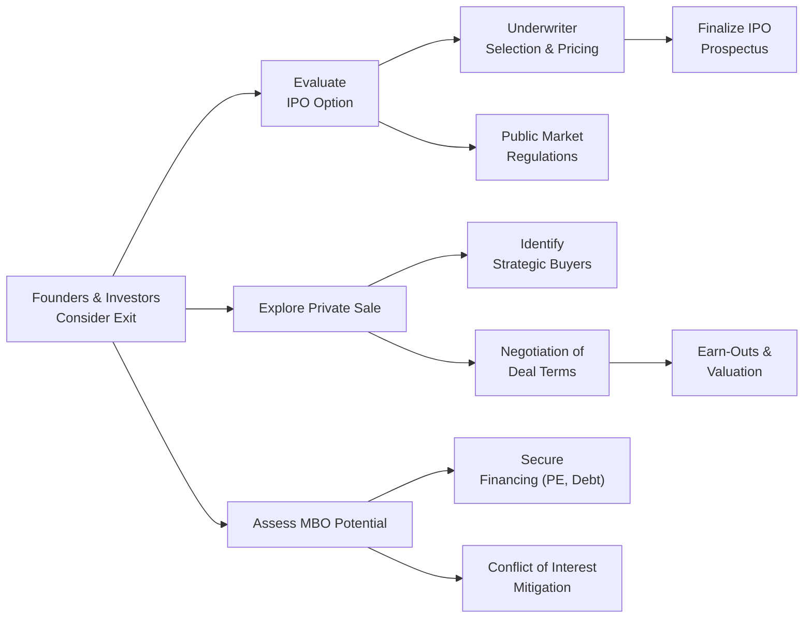

## Harvesting Objectives

When a company reaches a more mature stage of its life cycle, founders or key investors often look to “harvest” some or all of their investment. This is the moment you might see them take the company public, sell it to a strategic buyer, or even orchestrate a management buyout (MBO). Think of it like tending a garden: at some point, you have to harvest the produce, turning all that effort into tangible returns. But which approach do you pick—and why?

Harvesting objectives usually center on:
• Getting liquidity for early investors (venture capitalists, angel investors, or founders).  
• Diversifying wealth, because it is not always prudent to have so much personal net worth tied up in one company.  
• Paying down debt or building up the capital structure so the business can keep expanding.  
• Maximizing shareholder value at a moment when growth potential or market conditions might be especially favorable.

It’s not always just about cashing out. Sometimes, the best harvest strategy helps a company raise its profile, form new strategic partnerships, or improve governance by bringing in a stronger board. But get this wrong, and it can be messy—like letting your harvest rot in the fields.

Below, we’ll walk through three of the most common harvesting methods: the time-honored Initial Public Offering, a Private Sale, and a Management Buyout. Each has its own set of complexities, risks, and (hopefully) rewards.

## Implementing IPOs (Initial Public Offerings)

There’s something undeniably glamorous about an IPO. Companies ring bells on stock exchanges, enjoy a flurry of news coverage, and potentially tap a huge pool of capital. But take it from me: an IPO’s not just confetti and celebration. It’s also mountains of paperwork, strict regulations, and new stakeholder scrutiny.

### IPO Readiness

First, if you’re thinking of an IPO, you need to ask: are we really ready to become a public company? That question is crucial because once you’re listed, investors and analysts will be watching your every move.  

• Financial Statements and Governance: Clean, audited financial statements for multiple years are a must. Your governance structure—board composition, committees, internal controls—should align with regulatory requirements. For instance, in the U.S., we have Sarbanes-Oxley compliance. Elsewhere, IFRS might be the benchmark.  
• Public Market Requirements: Most exchanges have minimum thresholds—like net income, market cap, or shareholder equity. The IPO process also requires a detailed prospectus that regulators must approve.  

### Role of Underwriters

An underwriter (often a big investment bank) is your partner through the listing process. They’ll help:

• Price the offering and gauge market demand.  
• Prepare offering documents, including the prospectus.  
• Market your shares to institutional investors (the book-building process).  

Underwriters may underprice your stock to create a “pop” on listing day or price it higher if market conditions look strong. But underpricing can leave money on the table, while overpricing risks a big day-one sell-off. Finding the sweet spot is part art, part science.

### IPO Trade-Offs

Weigh the pros and cons carefully before jumping into an IPO.

| Advantages                                | Disadvantages                                 |
|-------------------------------------------|-----------------------------------------------|
| Broader market access to capital          | Ongoing regulatory filings and scrutiny       |
| Liquidity event for early investors       | Lock-up periods restrict insiders from selling|
| Greater brand awareness and prestige      | Potential undervaluation if market is bearish |
| Stock becomes “currency” for acquisitions | Market pressures can force short-term focus   |

My friend once joked that taking a company public is like agreeing to let thousands of strangers watch every aspect of your professional life—on top of that, you get a million new suggestions on how to run your business. So, yes, an IPO is not for the faint of heart.

## Evaluating Private Sales

Rather than deal with the public markets’ wild mood swings, some business owners prefer a private sale. This often means selling 100% of the company (or a majority stake) to a strategic buyer or private equity firm.

### Valuation and Due Diligence

Valuation gets complicated. You’ll negotiate with potential buyers, each doing intense due diligence—financial, operational, and legal. If you’re selling, you want to show that your company’s synergy potential justifies a premium price. If the buyer sees an opportunity to combine your brand, distribution networks, or R&D capabilities with their own, the synergy premium can sometimes push valuations well above standard metrics like EBITDA multiples or discounted cash flow fair values.

Buyers might propose an earn-out where part of the purchase price is contingent on hitting certain performance targets. Earn-outs can help bridge the gap between seller optimism and buyer skepticism—but they also require trust and clarity. You don’t want disputes over whether targets were fairly measured.

### Negotiating Key Terms

The main terms in a private sale often include:

• Purchase Price: Could be all cash, all stock (the buyer’s shares), or a blend.  
• Earn-Out Provisions: Tying payment to future EBITDA or revenue targets.  
• Non-Compete Clauses: Restricting sellers from jumping back into the same business for a time.  
• Management Retention: Sellers might be asked to stay on for a transition period or in a leadership capacity.  

Here’s a short personal anecdote: I once worked with a mid-sized tech startup that negotiated a partial private sale. The acquirer insisted on an earn-out that turned into quite the headache. The definition of “net revenue” became the subject of heated debate for a year. Ultimately, we hammered out a revised formula that satisfied both parties, but only after extra legal fees and some good old-fashioned haggling. Lesson learned: define everything meticulously from day one.

### Synergy Potential

Not every private sale is about synergy, though it’s common with strategic buyers. Private equity buyers might be more interested in operational efficiencies and then flipping the company in a few years. In contrast, a strategic buyer might want to merge product lines or cut overhead by leveraging a combined supply chain. Either way, synergy can justify a premium price, but synergy that never materializes can lead to buyer’s remorse. So from the seller’s perspective, keep that synergy story real and achievable.

## Considering Management Buyouts (MBOs)

An MBO is where existing management acquires the business, typically with outside financing. Why might they do this? Managers know the company’s inner workings and see potential for greater personal upside—and maybe they want more autonomy. But from an existing shareholder’s perspective, you want to make sure you’re selling at a fair price, not handing the company to management at a discount.

### MBO Structures

• Pure MBO: Management uses personal resources (and possibly bank loans) to buy out current owners.  
• Leveraged MBO: Think of it as a specialized leveraged buyout (LBO). Most of the financing might come from debt, with the assets of the company itself as collateral. The managers invest some equity, but private equity firms or mezzanine debt providers may cover the bulk of the purchase price.

### Financing and Conflicts of Interest

It’s pretty common that management doesn’t have all the cash needed to buy the company. They might bring in:

• Private Equity Sponsors: Provide equity capital in return for a controlling share or certain board seats.  
• Mezzanine Debt: Offer hybrid debt and equity-like positions to investors, who could convert to equity if the loan goes into default.  
• Bridging Loans: Short-term loans that fill a gap until longer-term financing is finalized.

A huge concern in MBOs is conflict of interest because management is both the operator and the prospective owner-buyer. If they somehow manipulate financial performance or withhold growth plans from external shareholders, the sale price could get depressed. That’s why a robust governance process (often requiring independent board committees) is critical to ensure the transaction is arm’s-length and fair. 

## Structuring Deal Terms

No matter the exit route—IPO, private sale, or MBO—deal terms can get intricate. Negotiations often hinge on how payment is structured, what liabilities remain with sellers or get transferred, and how post-deal roles are allocated.

### Cash, Stock, or Hybrid

As a seller, receiving cash is the cleanest exit. But you might prefer shares in the acquiring entity if you believe in that company’s future and want to defer capital gains taxes (subject to local tax laws, of course). A hybrid approach might be best: partial liquidity in cash plus some shares for upside potential.

### Buyer and Seller Considerations

• Ongoing Management Roles: Sellers may remain involved as consultants or even become employees. This is common in deals where buyer expertise is limited.  
• Earn-Out Triggers: If your earn-out structure says you get an extra $5 million if EBITDA grows by 15% over two years, be sure the buyer can’t “shift” costs or revenues around in ways that reduce your payout.  
• Purchase Price Adjustments: Typical adjustments might occur if the company’s net working capital on closing day differs from an agreed target.  

## Regulatory and Legal Review

When we talk about selling a company, we often think about the money part first. But oh boy, do not forget the legal and regulatory side. If you’re crossing borders or operating in a heavily regulated industry (like finance, healthcare, or telecom), things can get tricky fast.

### Securities Laws

An IPO obviously requires compliance with securities laws—filing a prospectus, adhering to listing standards, and so forth. But even private deals can trigger securities law requirements if minority shareholders are forced out.

### Competition and Antitrust

If the buyer is a major player in the same industry, regulators may review the deal for anticompetitive impacts. In certain jurisdictions, the seller has to notify competition authorities. They can block or impose conditions on the transaction. 

### Fairness for Minority Shareholders

Board members must typically demonstrate they’ve achieved a fair price for all shareholders—especially for an MBO. Many jurisdictions require official “fairness opinions” from independent financial advisors. Skimping on that can lead to legal battles down the line.

## Preparing for Vignette-Style Questions

CFA Level II heavy-lifts analysis and application. You’re not just memorizing definitions—no, you’re going to see scenario-based (vignette) questions that test your judgment. Here’s how you handle them:

• Compare and Contrast: Read the scenario carefully. Maybe the company is in a cyclical industry with high market volatility; an IPO might be riskier than a private sale. Could synergy with a strategic buyer overshadow the short-term gains from an IPO?  
• Spot Red Flags: If you see a proposed MBO with suspiciously low valuation assumptions or a tiny discount rate, that’s a red flag. Check for independence in the negotiating process.  
• Run the Numbers: The scenario might give you a simplified set of projected cash flows, synergy estimates, or earn-out thresholds. Evaluate them systematically. Is the synergy premium realistic? Does the discount rate reflect the company’s risk profile?  
• Governance Implications: Keep the interests of minority shareholders in mind. Are they adequately protected, or is conflict of interest overshadowing fairness?

### Numeric Example: IPO vs. Private Sale

Imagine a scenario:  
• Projected market capitalization if IPO’d at $40/share on 10 million new shares = $400 million. But the underwriter warns you’ll incur a 7% underwriting fee, and you risk a 10% discount for initial pricing.  
• A private buyer offers $350 million (cash) but includes an earn-out of up to $50 million if your new product line hits certain milestones.  

One might see, purely from an arithmetic viewpoint, the IPO’s stated “headline figure” is bigger. But net proceeds could be significantly lower after fees and possible market depressions. Meanwhile, the private buyer’s synergy forecast might be robust, making that earn-out quite achievable. The best choice? The answer depends on your risk appetite, your beliefs about future success, and your tolerance for regulatory burdens. The CFA exam loves these trade-off judgments.

## Sample Mermaid Diagram: Overview of Harvesting Decision Process

Interpretation: Founders weigh multiple harvesting strategies. They investigate IPO readiness, private sale negotiations (including synergy analysis), or management buyout structures. Each path involves distinct steps and complexities, such as underwriter selection, bridging finance, or regulatory compliance.

## Conclusion and References

Harvesting strategies are all about turning ownership stakes into actual realized value. For some, that’s an IPO with all the glitz and potential for future capital—and a lot of new oversight. For others, a private sale might net a clean exit and a robust synergy premium. MBOs can be a win-win, especially where management is deeply invested in the company’s success. But watch out for conflicts of interest.  

Moreover, real-life deals often blend elements of these strategies (like a partial sale combined with some form of management retention) or might occur in stages (like a pre-IPO partial sale to a private equity firm, followed by a subsequent public offering).

Wherever you land, the most important thing is aligning the harvesting decision with the long-term strategic goals of the firm and the fair treatment of all shareholders. If you can do that—and keep your sanity through the negotiation process—you’ll likely find a path that satisfies both your financial objectives and your sense of corporate stewardship.

### References

• Ross, S., Westerfield, R., & Jaffe, J. (2018). Corporate Finance. New York, NY: McGraw-Hill Education.  
• Harvard Business Review. (2001). “When to Take Your Company Public.” https://hbr.org/  
• International Private Equity and Venture Capital Valuation Guidelines (IPEV). https://www.privateequityvaluation.com/  

## Test Your Knowledge: Harvesting Strategies for Corporate Issuers



### Which of the following is the most likely primary motivation for a founder to pursue a harvesting strategy?  
- [ ] Enhancing revenue growth through new markets.  
- [x] Creating liquidity and realizing returns on investment.  
- [ ] Increasing synergy through strategic acquisitions.  
- [ ] Improving operational efficiencies via cost-cutting.  

> **Explanation:** Harvesting strategies are typically aimed at providing liquidity for founders and early investors, allowing them to realize the value of their stakes.

### A key role of an underwriter in an IPO process is to:  
- [ ] Write the final legal purchase agreement.  
- [ ] Provide management oversight for the issuing company.  
- [ ] Control the company’s internal governance committees.  
- [x] Assist in pricing the initial public offering and placing shares.  

> **Explanation:** Underwriters coordinate pricing, marketing, and share distribution in an IPO, helping determine the offer price and marketing the shares to investors.

### When a seller negotiates an earn-out clause in a private sale, the payment is typically:  
- [ ] Guaranteed regardless of future performance.  
- [ ] Determined by bond market interest rates.  
- [ ] Based solely on the buyer’s synergy perceptions.  
- [x] Contingent on the company achieving specific performance targets.  

> **Explanation:** Earn-outs tie a portion of the sale proceeds to the target’s subsequent performance (e.g., EBITDA, revenue), bridging valuation gaps between buyer and seller.

### One significant conflict of interest that arises in Management Buyouts (MBOs) is due to:  
- [ ] Government mandates on minority shareholder rights.  
- [ ] The underwriter’s attempt to set a favorable IPO price.  
- [x] Managers acting as both the sellers’ agents and potential buyers.  
- [ ] Non-compete clauses negotiated in acquisition deals.  

> **Explanation:** In an MBO, existing managers negotiate with shareholders while also attempting to purchase the business themselves, creating a conflict of interest if not properly overseen.

### Which of the following is most accurate regarding synergy premiums in private sales?  
- [ ] Sellers always provide a synergy premium to the acquirer.  
- [ ] Synergy premiums diminish the purchase price for the seller.  
- [x] Synergy premiums reflect expected benefits that the combined entity might achieve.  
- [ ] Synergy premiums commonly do not apply to strategic acquisitions.  

> **Explanation:** Synergy premiums typically represent the additional value that arises from combining two firms’ assets, markets, or operations, which justifies a higher purchase price.

### A major drawback of taking a company public is:  
- [x] Heightened regulatory scrutiny and disclosure requirements.  
- [ ] The inability to issue additional shares in the future.  
- [ ] The elimination of management autonomy.  
- [ ] The loss of brand recognition.  

> **Explanation:** Public companies face more rigorous compliance, disclosure obligations, and scrutiny from regulators and the public.  

### When deciding between an IPO and a private sale, a key factor is often:  
- [x] The volatility of public markets and the certainty of a negotiated private deal.  
- [ ] The guaranteed success of the IPO.  
- [ ] The timing of the next interest rate decision by the central bank.  
- [ ] The requirement that all shareholders remain with the company.  

> **Explanation:** In an IPO, you face market volatility and potential mispricing; with a private sale, you negotiate terms directly, often reducing uncertainty about proceeds.

### Which of the following financing sources is most common in a leveraged MBO structure?  
- [ ] Venture capital.  
- [ ] Stock buybacks.  
- [x] Significant debt funding, often secured by the target’s assets.  
- [ ] Employee profit-sharing agreements.  

> **Explanation:** Leveraged MBOs primarily rely on borrowed funds, typically secured by the target company’s assets and cash flows, to fund the buyout.

### A fairness opinion is generally sought in a sale transaction to:  
- [x] Confirm the appropriateness of the purchase price for all shareholders.  
- [ ] Approve the capital structure post-transaction.  
- [ ] Ensure the use of IFRS in financial reporting.  
- [ ] Validate the synergy assumptions in an acquisition.  

> **Explanation:** A fairness opinion aims to assure that the terms, especially the price, are fair to shareholders, often focusing on minority shareholders’ interests.

### True or False: An earn-out in a private sale always guarantees the seller a maximum payout at closing.  
- [ ] True  
- [x] False  

> **Explanation:** Earn-outs base part of the sale price on future performance targets; the seller may not receive the full earn-out amount if these targets are not met.


