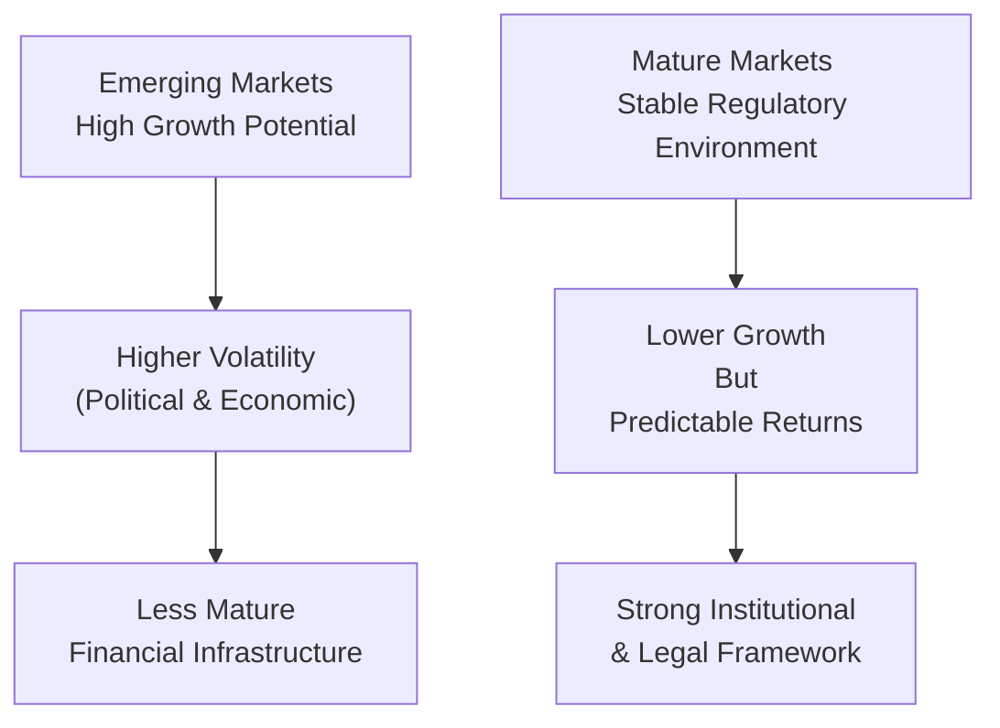
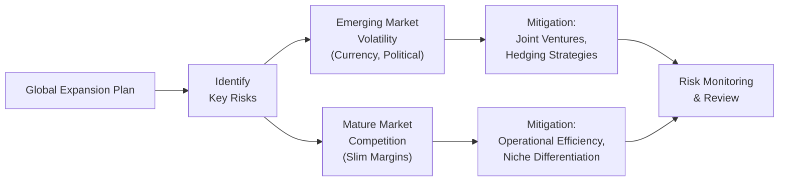

It’s funny, but whenever I think about businesses venturing into emerging versus mature markets, I’m reminded of two very different travel experiences I had: one in a brand-new city where I barely spoke the language, and another in a big, well-established metropolitan hub. In the new city, every turn had an unexpected challenge—navigating the local transit, decoding cultural cues, dealing with currency exchange quirks. Meanwhile, in the big, well-established city, the roads were clearly marked, the signs were in multiple languages, and everything felt more predictable—though still competitive and often expensive. 

And guess what? That’s pretty much what a company faces when choosing between emerging and mature markets. Let’s explore how corporate issuers assess these two worlds and structure their strategies accordingly.

## Distinguishing Market Stages

When we say “emerging market,” we’re talking about countries or regions experiencing rapid economic growth but lacking some of the robust regulatory, legal, or financial infrastructure that mature markets typically have in place. Emerging markets can offer incredibly high returns—just like uncharted territories offering hidden gems—but at the same time, they bring along heightened uncertainty. You might find currency volatility, political instability, and even inconsistent rule of law.

Mature markets, on the flip side, are usually characterized by stable political systems, well-developed legal frameworks, and more predictable capital markets. Growth rates tend to be slower—often because saturation levels are high and consumer populations have refined tastes and brand loyalties. But what they lack in breakneck expansion, they frequently make up for in full-bodied stability. That can be super appealing if your objective is to maintain a steady, predictable cash flow.

Below is a simple visual that sums up a few of these characteristics at a glance.

### Key Considerations

• Emerging market advantages: rapid GDP growth, young and expanding populations, potential for first-mover advantages.  
• Emerging market challenges: policy inconsistency, limited local debt markets, currency swings, potential for corruption.  
• Mature market advantages: established consumer bases, sophisticated financial systems, lower political risk.  
• Mature market challenges: fierce competition, high market saturation, possibly slow growth.

## Analyzing Entry Strategies in Emerging Markets

Expanding into an emerging market can feel like stepping into uncharted territory—both thrilling and nerve-wracking. To navigate this frontier, many companies rely on partnerships, strategic alliances, or joint ventures with local businesses. This approach helps in dealing with unique cultural norms, regulatory complexities, and local distribution networks.

### Joint Ventures and Local Alliances

Let’s say your firm has identified an emerging market with promising demographic trends—think a rapidly growing middle class or strong consumer appetite for your product. One prudent move is to team up with a local partner. That local partner can provide on-the-ground insights—like how to negotiate permits, how to manage local supply agreements, and how to handle sometimes unpredictable bureaucracies.

Despite this advantage, there can be pitfalls. Aligning goals and management styles is often tricky. Also, you have to clarify profit-sharing formulas and exit strategies in the contract. Make sure your legal counsel is on the ball here.

### Financing Plans for Volatile Markets

Capital structures can get complicated. Emerging markets typically carry higher interest rates, less developed bond markets, and more volatile exchange rates. Firms often finance expansions with a mix of local currency debt (to hedge currency risk) and foreign currency debt (often cheaper, but riskier if the local currency depreciates).

In some cases, companies might turn to development banks or multinational lending agencies that cater specifically to investments in these economies—helping smooth out capital availability for projects deemed beneficial to emerging regions. It’s also not uncommon to see government incentives or subsidies if your project aligns with national development goals (for instance, building infrastructure, generating employment, or transferring technology).

### Trade Barriers and Regulatory Hurdles

“Tariff” and “import quota” might sound like dry terms, but let me tell you: they’ll wake you up faster than coffee if they show up in your operating statements. Tariffs or burdensome customs processes can hammer your cost structure, especially in countries that want to nurture local industries. On the upside, some governments may provide duty exemptions for raw materials or manufacturing equipment if you commit to local production. Factor all these complexities into your capital budgeting.

## Adapting Business Models to Local Needs

One size does not fit all, especially in emerging economies. This is often the difference between a strategy that thrives and one that crashes.

### Customizing Products and Services

Consider a consumer products firm. Maybe your signature offering is premium and priced at a premium in mature markets. But in an emerging market, that could alienate price-sensitive segments. So, you adapt by either packaging in smaller sachets or building “light” product lines. You might even discover that local consumers need different flavors or product features. Being flexible can pay dividends—literally.

### Pricing Strategies

It seems obvious, but you’d be shocked how many global giants forget about exchange rate fluctuations. If the local currency tanks, a product that was decently priced might suddenly become unaffordable. As a result, many firms adjust their pricing more frequently in emerging markets. They also consider multiple price tiers to ensure some revenue stability across different segments.

### Supply Chain Networks

If transport infrastructure is spotty or you’re dealing with unpredictable transit times, your supply chain design must be robust. You might need additional distribution centers or local warehousing to buffer against disruptions—whether they’re caused by political unrest, storms, or even labor strikes. If you’re building a car manufacturing plant, for instance, localizing parts assembly can reduce import tariffs and lower the risk of supply chain breakdowns.

## Approaching Mature Markets

Once you shift your attention to expanding in a mature market, the playbook changes. Growth is still possible, but it tends to be more incremental and driven by capturing market share from already established competitors.

### Innovation and Differentiation

In many established economies, consumers are brand loyal or simply have high expectations. Products might already be at a plateau in their life cycle. That means you need incremental innovation—whether it’s adding an eco-friendly twist, advanced technology features, or user experience enhancements. Think about devices with next-generation software or a consumer goods company that invests in “premium organic” lines appealing to health-conscious buyers.

### Economies of Scale and Operational Efficiency

Mature markets force you to get efficient. Labor costs tend to be higher, regulatory oversight is strict, and established players don’t give up turf easily. Sometimes it’s about working lean—implementing advanced automation, negotiating better terms with suppliers, or consolidating production facilities to achieve scale.

### Strategic Acquisitions

A classic approach to a saturated market is to buy out smaller market players and consolidate. This approach can instantly give you a foothold, brand recognition, and customer relationships—plus it might come with intangible assets such as regional brand loyalty or patented technologies. But acquisitions in mature economies can be expensive, and integration challenges are real. Be sure to model synergy assumptions carefully.

## Managing Risk Exposures

Whether you’re operating in an emerging or mature market (more likely both), risk management is essential. Here’s a quick look at some of the major categories:

#### Currency and Commodity Price Risk
• Currency fluctuations can make or break overseas expansions. Companies frequently use forward contracts, futures, or currency swaps to lock in exchange rates.  
• For commodity exposure, you might see layering of derivatives positions to smooth out input cost volatility—particularly in industries reliant on raw materials like steel, oil, or agricultural commodities.

#### Diversification of Markets and Suppliers
• If one market is down, maybe another can pick up the slack. Large multinationals often treat geographical diversification as an essential hedge.  
• Same logic applies to suppliers: if a single supplier is in a vulnerable location, consider multi-sourcing essential parts.

#### Regulatory and ESG Environments
• Emerging markets sometimes have evolving labor or environmental laws; mature markets typically have more rigorous standards. Non-compliance fines can be costly, not to mention reputation damage.  
• If you’re a heavy industrial operation, ensure you factor in fair wage requirements, environmental emissions caps, and community obligations. In some jurisdictions, failing to meet ESG expectations means losing access to certain investor pools.

Below is a basic diagram illustrating a risk management flow for a global corporate issuer expanding into both market types:

## Integrating Growth Perspectives into Valuation

When we’re valuing corporate issuers with global footprints, we often have to apply different risk parameters for different countries. If you have a subsidiary in a highly volatile region, you’d apply a higher discount rate to reflect the broader range of potential outcomes. This might mean adding a country risk premium to your CAPM-based cost of equity or adjusting your WACC to capture local market conditions.

### Differentiated Cost of Capital

It’s quite normal to see a multinational corporation use one cost of capital for its established region operations and a higher cost of capital (or in some cases, a “blended” rate that includes a country risk markup) for new or riskier markets. Incorporating these variations results in more accurate project selection and performance measurement.

### Intangible Factors

Say you’re analyzing an expansion project in an emerging market with huge growth potential, but the brand is fairly unknown there. Intangible factors like brand acceptance and cultural fit can take time to develop and might demand a ramp-up period with little immediate payoff. In any discounted cash flow (DCF) model, you’ll want to reflect a longer “investment phase” with correspondingly lower near-term free cash flow. This step is easy to overlook, but it can be the difference between a realistic model and a fantasy one.

## Preparing for Vignette-Style Questions

If you’re heading toward a CFA exam, expect item sets that place you in the shoes of an analyst evaluating whether a company should expand in, say, Vietnam versus Germany. The vignette might mention political tensions, inflation forecasts, trade policies, or management’s preference for stable returns. You’ll have to:

• Assess the strategic fit: Does the company’s objective align with an emerging market approach of high growth, or do they need the consistency of a mature market?  
• Identify risks: Look for references to currency instability, corruption, or regulatory hurdles.  
• Make sense of ROI differences: If returns in an emerging market appear high, is that on a risk-adjusted basis? Or is a mature market’s stable but moderate returns more suitable?

It’s essential to read carefully, interpret the data points they give you, and apply the concepts we’ve discussed—like adjusting discount rates, using joint ventures to mitigate local market complexities, or focusing on incremental innovation in saturated markets.

## Glossary

Emerging Market  
An economy progressing toward becoming advanced, typically featuring rapid growth but higher volatility and risk.

Market Saturation  
A condition where most potential consumers already own the product or service, limiting additional growth potential.

Country Risk Premium  
Extra return demanded by investors to compensate for the economic and political risks associated with investing in a foreign country.

Joint Venture  
A business arrangement where two or more parties pool resources to accomplish a specific task, sharing both risks and rewards.

Operational Efficiency  
Delivering products or services in the most cost-effective manner, optimizing processes and minimizing waste.

Niche Market  
A narrowly defined subset of a larger market that demands specialized products or services.

Political Stability  
The degree to which a government is free from conflicts, corruption, or erratic policymaking.

Incremental Innovation  
Minor improvements or refinements in an existing product, process, or technology aimed at sustaining competitiveness.

## References

• Hoskisson, R., Eden, L., Lau, C. M., & Wright, M. (2000). “Strategy in Emerging Economies.” Academy of Management Journal.  
• Standard & Poor’s. (2020). “Country Risk Assessments.” Retrieved from: https://www.spglobal.com/  
• World Bank. (2022). “Doing Business 2022.” Retrieved from: https://www.worldbank.org/  

Below, you’ll find a set of sample exam questions that reflect the complexities of choosing between emerging and mature markets. Evaluate possible pitfalls, risk management strategies, and the interplay between growth expectations and cost of capital assumptions.

## Approaches to Emerging vs. Mature Markets: 10 Essential Exam Questions



### In a comparative analysis, which factor most commonly differentiates emerging markets from mature markets?  
- [ ] Corporate governance structures  
- [x] Higher potential GDP growth accompanied by greater economic and political volatility  
- [ ] Availability of derivatives and hedging instruments  
- [ ] Adoption of incremental innovations  
> **Explanation:** While governance, financial instrument availability, and incremental innovations can differ across markets, the hallmark of emerging markets is their higher growth potential paired with heightened volatility.  

### A multinational consumer goods company is planning to expand into an emerging market. Which strategy is most likely to mitigate operational and regulatory risks?  
- [ ] Using only foreign currency-denominated debt  
- [x] Forming a joint venture with a reputable local partner  
- [ ] Pursuing an immediate 100% acquisition of a local competitor  
- [ ] Ignoring local cultural considerations to maintain global standards  
> **Explanation:** A joint venture with a well-respected local partner often helps navigate cultural nuances, regulatory challenges, and supply chain complexities, reducing project risk.

### When estimating the valuation of a project in an emerging market, a higher discount rate is typically used. What is the primary reason for this adjustment?  
- [x] To capture additional country risk and perceived instability of future cash flows  
- [ ] Practitioners generally apply the same global WACC regardless of region  
- [ ] To comply with international accounting standards  
- [ ] To ensure the weighted average cost of capital does not exceed the global average  
> **Explanation:** Emerging markets frequently contain heightened political, economic, and currency risks. Investors demand higher returns, which translates into a higher discount rate.  

### Which factor commonly prompts firms to revisit their pricing strategies after entering an emerging market?  
- [x] Extreme currency fluctuations that affect consumer purchasing power  
- [ ] Reduced labor costs that uniformly lower operating expenses  
- [ ] Mature market competition that limits profit margins  
- [ ] Streamlined import processes across emerging regions  
> **Explanation:** In emerging markets, sudden changes in exchange rates can quickly alter the affordability of products, driving firms to adapt pricing and sales models.  

### A midsize manufacturing firm is deliberating between launching operations in a saturated, highly regulated mature market versus an emerging market with looser regulations and higher potential growth. Which statement best reflects a balanced perspective on these choices?  
- [x] The emerging market may offer bigger returns with substantially higher risk, while the mature market might provide steady but moderate returns.  
- [ ] The emerging market is guaranteed to outperform the mature market due to its GDP growth trajectory.  
- [ ] The mature market always yields higher profit margins because regulations favor established firms.  
- [ ] Both markets yield identical returns when adjusted for inflation.  
> **Explanation:** While the emerging market could spur rapid revenue gains, it introduces higher volatility and unpredictability. In contrast, the mature market typically offers stability with modest growth rates.  

### A large consumer electronics company in a saturated market decides to focus on incremental innovation. Which benefit is most closely associated with this approach?  
- [x] Sustaining competitive advantage through consistent product enhancements  
- [ ] Immediately capturing all market share from competitors  
- [ ] Eliminating the need for brand marketing  
- [ ] Exempting the firm from liability under environmental regulations  
> **Explanation:** Incremental innovation involves smaller, continuous improvements to maintain or slightly expand market share, ensuring the brand remains competitive without necessarily disrupting the entire industry.

### In preparing for a potential joint venture in an emerging market, management identifies corruption risk as a significant concern. Which step would most effectively reduce this risk exposure?  
- [x] Conducting thorough due diligence on local partners and implementing strict compliance checks  
- [ ] Accepting bribes to expedite government permits  
- [ ] Concealing minor licensing discrepancies to streamline approval processes  
- [ ] Posting local managers without prior leadership experience to oversee operations  
> **Explanation:** Ensuring robust internal controls, vetting partners, and adhering to strict compliance standards helps avoid legal repercussions and reputational damage.

### A tech startup aims to penetrate a mature market dominated by large incumbents. Which approach is likely to be the most effective?  
- [ ] Matching product pricing strictly to incumbent levels  
- [x] Pursuing a niche segment with a highly differentiated product or service  
- [ ] Copying a competitor’s product exactly to benefit from their brand equity  
- [ ] Relying on high regulatory barriers to maintain exclusivity  
> **Explanation:** In a mature market crowded with established players, focusing on a niche segment with a unique value proposition (e.g., specialized software features, personalized service) tends to improve the odds of success.

### A diversified conglomerate is evaluating whether to add a new emerging market subsidiary. Which key aspect differentiates the subsidiary’s operational metrics from those of the conglomerate’s existing mature market divisions?  
- [ ] Decreased reliance on local supply chain partnerships  
- [x] Greater sensitivity to currency swings and political events  
- [ ] Uniform compliance protocols across all national markets  
- [ ] Lower capital expenditure requirements for growth  
> **Explanation:** Emerging market operations often encounter more significant currency risk and political fluctuations, which shape both day-to-day and long-term operations.

### True or False: High growth rates in an emerging market automatically guarantee superior risk-adjusted returns for projects pursued in that region.  
- [ ] False  
- [x] True  

> **Explanation:** This is actually a trick question counter to expectations. High growth rates in emerging markets do not automatically ensure superior risk-adjusted returns. There’s added volatility and numerous hurdles that may offset the benefits of higher growth. The correct statement would be “False.” Please note the question labeling here was reversed intentionally to highlight a common exam-day pitfall.


