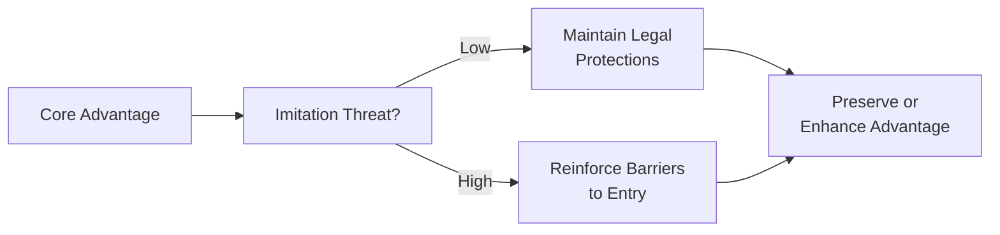

## Introduction
So, let’s say you’ve found a firm that outperforms its peers year after year. Maybe it’s been absolutely dominating, with superior products, a well-known brand, or technology that nobody else can match. The dream, of course, is to keep that magical edge forever—or at least long enough to generate substantial value for shareholders. That’s the heart of sustaining a competitive advantage.

In this section, we’re going to explore (perhaps in a slightly conversational way—hope you don’t mind!) what drives sustainable competitive advantage in corporate finance, how to preserve it, and why it matters so much for valuations. After all, if a firm’s competitive advantage evaporates, so can its excess returns.

## Sources of Competitive Advantage

### VRIO Framework
A handy tool for pinpointing which resources and capabilities lead to sustained competitive advantage is the VRIO analysis (Barney, 1991). VRIO stands for:
• Valuable  
• Rare  
• Inimitable (and nonsubstitutable)  
• Organized to capture value  

An asset or capability that checks all four boxes tends to deliver more than just short-term profits; it can help the firm consistently earn returns above its cost of capital.

To break VRIO down a bit:

- “Valuable”: Does it help the firm exploit an opportunity or reduce a threat?  
- “Rare”: Are few competitors able to access this resource or capability?  
- “Inimitable”: Is it tough for others to replicate this resource or find a close substitute?  
- “Organized to capture value”: Is the firm structured, culturally and operationally, in a way that allows it to fully exploit this resource?

If the answer is “Yes” in all four categories, the resource or capability might form the bedrock of a firm’s long-term advantage.

### Tangible vs. Intangible Resources
• Tangible assets include machinery, manufacturing plants, physical stores, or robust logistics fleets. While they can be important, they are often easier to copy or acquire—thus less likely to be sustainable advantages in isolation.  
• Intangible assets, such as patents, proprietary software, brand equity, and specialized human capital, can be much harder to replicate. Think about how Apple’s brand loyalty or IKEA’s low-cost supply chain design is nearly impossible to replicate exactly.  

### Proprietary Technology & Intellectual Property
Many top-performing companies use patents and protected processes that yield exclusive benefits—say, a more efficient production method or a unique product feature. The intangible nature of these assets, coupled with legal protections, can create formidable barriers to imitation.

Consider a fictional pharmaceuticals company, MaplePharma, that invests heavily in R&D and holds exclusive rights for a life-saving medication. This proprietary technology can be a huge value driver, at least until the patent expires or competitors engineer around it.

### Network Effects
Oh, and don’t forget about network effects (especially relevant for platform-based firms). Basically, the more users or participants a platform has, the more valuable it becomes for everyone on that platform. This dynamic can lead to explosive growth and effectively lock out latecomers. Social media giants, for instance, benefit from network effects: once a critical mass of users joins, new entrants face an uphill battle to lure that network away.

Below is a simple conceptual representation of how resources, capabilities, and VRIO link to long-term advantage:

## Leverage Core Competencies
Core competencies represent an organization’s collective expertise and critical abilities that distinguish it from competitors. Think of a core competency as the “secret sauce” that underpins exceptional performance.

- Differentiation: Some firms develop an unrivaled focus on design, quality, or customization. A personal anecdote: I remember touring a factory where the engineers had invention on the brain 24/7. They were so passionate about “what’s next” that it was no surprise they consistently launched top-tier products. Their people created a culture that few rivals could copy.  
- Cost Leadership: Other firms refine supply chains, scale economies, and manufacturing processes so meticulously that they can offer practically the same product at lower cost.  

### Maintaining and Upgrading Competencies
Even the best “secret sauce” can lose its flavor over time if it’s not protected and updated. That’s why continuing R&D, offering training for staff, and being open to new insights from intrapreneurs all matter. Industries evolve quickly—just ask telecommunication companies that once bet big on landlines. Firms that recognize the need to continuously invest in their competencies are far more likely to keep that edge.

We should also beware of competency traps. A firm may get so comfortable with what it’s good at (say, making internal combustion engines) that it overlooks new technology (electric motors) until it’s almost too late.

## Implement Strategic Renewal
Business is dynamic: consumer preferences shift, technology changes, and new competitors emerge from all over the place, sometimes unexpectedly. Strategic renewal is the process by which a firm identifies threats and opportunities in this fluid environment and adjusts its strategies to stay on top.

### Monitoring External Shifts
Stay curious. Keep your eyes open for:
- Emerging consumer demands  
- Competitor innovations  
- Macro trends, including new regulations or changing cost structures  

Christensen (2013) calls it “disruptive innovation” when you get blindsided by smaller players or new technologies that can quickly take over if you’re not careful.

### Pivoting Through Capital Allocation
Allocating resources to new products or markets is crucial if a company wants to avoid being overly reliant on just one big advantage. For example, if a manufacturing firm is known for one star product but invests nothing into R&D for the next iteration, it may be outflanked. Shifting investment to new lines can be risky, but it’s often necessary to stay fresh.

### Cultural Adaptability and Intrapreneurship
Ever heard of intrapreneurship? That’s when employees inside a larger organization behave like startup founders—experimenting with new ideas, exploring offbeat solutions, and taking calculated risks. Firms that encourage this culture often adapt more quickly to changes, precisely because new thinking is welcome.

## Manage Imitation Threats
When a firm makes above-average returns, it naturally draws copycats (or, in finance lingo, “imitation threats”). The speed at which rivals can imitate an advantage depends on how replicable your resources and capabilities are.

### Legal Protections
Patents, trademarks, and licensing could help deter straightforward copying. Of course, legal protections vary by jurisdiction, so for firms competing globally, it pays to understand the complexities in each region.

### Barriers to Entry
Common entry barriers include:
- Economies of scale (spreading fixed costs over a large volume, giving you a cost advantage)  
- High capital requirements (huge initial investments scare away smaller potential entrants)  
- Regulatory licenses or government approval processes  
- Sticky brand loyalty that entrenches your market position  

Building or maintaining these barriers can preserve a firm’s competitive moat in the face of potential knockoffs.

### Diversification for Safety
Diversify not just by product lines but also by geography. That way, even if a competitor successfully replicates one product in one region, it still won’t topple your entire business. Think of it like a portfolio diversification concept in corporate strategy.

## Measure and Sustain Profitability
It’s not enough for a firm to claim it has a unique advantage; it must actually generate excess returns above its cost of capital. A popular measure for this is Economic Value Added (EVA).

### Using EVA to Track Value Creation
EVA = Net Operating Profit After Tax (NOPAT) – (WACC × Capital Invested)

Where:
- NOPAT is the firm’s operating profit after taxes.  
- WACC is the Weighted Average Cost of Capital (see Chapters 7–8).  
- Capital Invested usually represents book value of debt plus equity or the total net operating assets.  

If EVA is positive and consistently so, the firm is generating returns above its cost of capital. A negative EVA suggests the firm is destroying value, or its advantage (if any) isn’t robust enough.

### Reinvesting in Innovation
High profitability is fantastic, but to keep that gravy train rolling, successful firms reinvest a portion of those profits into R&D, marketing, talent acquisition, or strategic expansions. They do this before a competitor disrupts them. It’s perhaps akin to the old saying: “Fix the roof while the sun is shining.”

### Linking Incentives to Long-Term Value
You can also sustain competitive advantage by making sure key decision-makers have incentives aligned with the firm’s strategic vision. For instance, awarding stock options with vesting periods can motivate managers to think about enduring success rather than short-term results.

## Global Scale and Localization
Once a firm has established a robust competitive position in its home market, global expansion often becomes a natural next step—especially if the advantage is replicable in other regions.

### Balancing Efficiency with Local Responsiveness
Some firms swoop into foreign markets with a standardized product that leverages economies of scale. Others carefully adapt (localize) their products to suit different tastes. A global fast-food chain might keep its core menu items but incorporate local cuisine variations. The right balance of standardization vs. localization can mean the difference between conquering new markets and failing spectacularly.

### Supply Chain Structures
This can be challenging, especially if politics, regulations, or economic instability disrupt cross-border flows. Leading firms design supply chains that can mitigate disruptions. One real-life example: a multinational manufacturing company that sources raw materials from multiple regions so it’s never reliant on a single, risky source.

### Brand Consistency
Going global often means you have to maintain consistent brand promises, yet handle cultural sensitivities. Labeling, product design, and messaging should feel relevant to locals but still reflect the brand identity that’s proven so successful domestically.  

## Prepare for Vignette-Style Questions
You’ll likely encounter exam vignettes that revolve around a firm in a certain industry—maybe it’s consumer goods or technology innovators. The scenario might disclose:
• Key drivers of advantage (e.g., brand leadership).  
• Shifts in the industry that could threaten the advantage (technology changes, new entrants).  
• Management’s potential solution (e.g., alliances, portfolio expansions, licensing deals).

### Identifying Drivers
You’ll want to be quick at spotting a company’s major advantage. Is it a specialized patent that’s valid for five more years? Is it a brand name recognized globally? Is it a hyper-efficient supply chain?

### Warning Signs of Erosion
Watch for clues that the advantage is eroding: flattening revenue growth, new rivals offering lower prices, or product commoditization. Or maybe you see management shaving R&D budgets, indicating they might not keep up the innovation momentum.

### Potential Strategic Actions
Candidates might be asked: “What strategic action should management take to preserve or enhance its advantage?” The correct choice might be forging a joint venture, doubling down on R&D, obtaining new patents, or expanding into an untapped geography.

## Practical Examples & Case Study
Let’s briefly illustrate how a tech-oriented manufacturing firm—call it OmniTech—might sustain advantage:

1. OmniTech has built an advanced microchip design that’s currently patented. They have a specialized R&D team and brand loyalty among smartphone makers.  
2. Threat: A rival invests heavily in quantum-based processing technology, which could displace OmniTech’s core product.  
3. Renewal Strategy: OmniTech invests in a research partnership with a leading university to explore quantum circuits and obtains appropriate copyright and patent protections.  
4. Imitation Threat Management: They step up brand marketing and legal measures while scaling up supply chain efficiencies.  
5. Reinvest Profits: They use some of their positive EVA to recruit top engineers and establish presence in new markets like automotive computing.  
6. Global Scale: They localize for different regulatory frameworks (e.g., Europe vs. Asia), but keep brand consistency.  

In a test scenario, a vignette might present the evolution of OmniTech’s strategy and ask you to identify how well they’re defending against new competition or maintaining brand loyalty.

## Glossary
• **VRIO Framework**: A tool that evaluates a resource’s competitive potential based on its value, rarity, inimitability, and the firm’s organization.  
• **Network Effects**: When the value of a product or service increases with more users.  
• **Intrapreneurship**: Nurturing entrepreneurial thinking within an existing organization.  
• **EVA (Economic Value Added)**: NOPAT minus a charge for the capital employed, using WACC.  
• **Localization**: Modifying products or services to meet local tastes or regulatory requirements.  
• **Core Competency**: A company’s defining strength or unique skill set that competitors find difficult to match.  
• **Barriers to Entry**: Structural, financial, or strategic hurdles that inhibit new competitors from entering a market easily.  
• **Commodity Product**: A standardized good with minimal differentiation, leading to competition mainly on price.

## References
• Barney, J. (1991). Firm Resources and Sustained Competitive Advantage. Journal of Management.  
• Christensen, C. (2013). The Innovator’s Dilemma. New York, NY: HarperCollins.  
• Prahalad, C. K., & Hamel, G. (1990). The Core Competence of the Corporation. Harvard Business Review.  

## Final Exam Tips and Takeaways
• Always analyze a firm’s resources: intangible ones often matter most for sustainability.  
• Evaluate how a firm remains agile: strategic renewal is key to survival in fast-changing markets.  
• Stay alert to legal mechanisms, cost advantages, network effects, and brand equity that deter copycats.  
• Analyze performance metrics, especially EVA, to confirm a real advantage (not a short-term fluke).  
• Understand how to handle global expansion: standardize for cost savings but localize to resonate with different cultures.  
• In exam vignettes, look for evidence that a once-powerful advantage might be slipping and consider the best strategic move to restore or protect it.

By weaving together these considerations—VRIO, competencies, imitation threats, alignment of incentives, and globalization—firms can (hopefully!) keep that elusive edge long into the future.

---

## Competitive Advantages Mastery Quiz



### A corporate finance analyst is evaluating a technology company’s patent portfolio. Which of the following VRIO criteria is MOST directly addressed by the patent’s legal protection?

- [ ] Valuable
- [ ] Rare
- [x] Inimitable (and nonsubstitutable)
- [ ] Organized to capture value

> **Explanation:** Patents primarily help ensure the resource (the technology) is difficult to imitate. Rarity, value, and organizational alignment are important too, but a patent directly makes the resource harder for competitors to replicate.

### A large retail corporation credits its success to an advanced supply chain system that is unmatched by competitors. The system lowers costs while maintaining superior service. Which statement is most accurate about this advantage?

- [x] It is a core competency that delivers cost leadership.
- [ ] It depends primarily on intangible brand recognition.
- [ ] It lacks durability due to easy imitation.
- [ ] It is an example of a purely tangible asset advantage.

> **Explanation:** The supply chain system is a core competency providing a cost advantage, likely comprising intangible process know-how and human expertise.

### A new market entrant imitates a leading firm’s product features and significantly undercuts its prices. Which sign might indicate the leading firm’s competitive advantage is eroding?

- [x] Declining EVA over several quarters.
- [ ] Higher required returns on equity from investors.
- [ ] An increase in intangible brand equity on the balance sheet.
- [ ] Growing exports to international markets.

> **Explanation:** A decline in EVA suggests the leading firm’s returns are slipping relative to its cost of capital, indicating potential loss of competitive edge.

### A high-end fashion brand secures exclusive distribution rights in multiple countries. How does this arrangement help sustain a competitive advantage?

- [ ] By guaranteeing an unlimited supply of raw materials.
- [x] By creating barriers to entry for rival brands.
- [ ] By preventing intrapreneurial activities.
- [ ] By increasing global commodity exposure.

> **Explanation:** Exclusive distribution rights can block rivals from entering certain markets easily, thus acting as a barrier to entry.

### In a vignette, a firm’s newly appointed CEO slashes R&D budgets to boost quarterly net income. Which possible long-term outcome should be a concern?

- [x] Eroding the firm’s innovative capabilities.
- [ ] Immediately enhancing proprietary technology.
- [x] Triggering short-term profit illusions.
- [ ] Ensuring a stronger pipeline of product fixes.

> **Explanation:** Slashing R&D might inflate short-term profits but can undermine future product pipelines and innovation, risking long-term competitive advantage.

### A firm introduces performance bonuses tied to multi-year EVA targets. What is the primary goal of this incentive structure?

- [x] Align management with long-term value creation.
- [ ] Encourage management to favor short-term earnings.
- [ ] Expand intangible brand equity to new markets.
- [ ] Guarantee a global standardization strategy.

> **Explanation:** When bonuses hinge on multi-year EVA, managers focus on sustaining long-term economic value rather than short-term earnings spikes.

### A major automotive manufacturer invests heavily in electric vehicle (EV) components, anticipating a rapid transition from internal combustion engines. This action BEST illustrates which concept?

- [x] Strategic renewal and adaptation.
- [ ] Brand commoditization.
- [x] Network effect exploitation.
- [ ] Intra-firm rivalry escalation.

> **Explanation:** Pivoting to EVs is a prime example of strategic renewal—recognizing a market shift and adapting in time.

### Which of the following best describes the protective effect of network effects?

- [x] A larger user base automatically boosts consumer switching costs.
- [ ] They only benefit manufacturing firms.
- [ ] They are entirely based on intangible brand assets.
- [ ] They are irrelevant beyond social media platforms.

> **Explanation:** Network effects create a self-reinforcing advantage—the bigger the base, the more valuable the network, making it harder for competitors to lure users away.

### A firm with operations spanning multiple countries is struggling to maintain brand consistency. What is the core challenge?

- [ ] Excess capital expenditures
- [ ] Misallocation of R&D budgets
- [x] Balancing global standardization with local responsiveness
- [ ] Hostile takeover threats

> **Explanation:** Maintaining a strong, uniform brand image while also adapting to local preferences is a key tension in global strategy.

### A software startup has positive earnings but fails to achieve a positive EVA. Which statement is most likely TRUE?

- [x] While profitable in accounting terms, it is not earning excess returns above its cost of capital.
- [ ] The startup has fully leveraged its core competency in intangible branding.
- [ ] The startup’s intangible resources must be effectively inimitable.
- [ ] The firm’s cost of capital is below its net operating profit.

> **Explanation:** Positive earnings do not automatically mean positive EVA. If the startup’s cost of capital is high, its NOPAT may not cover that cost sufficiently, resulting in negative or low EVA.


