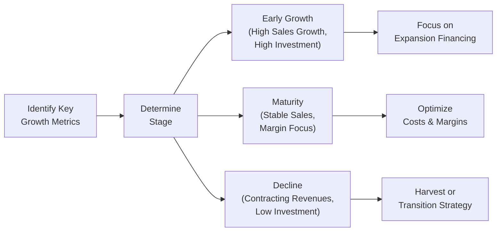

## Introduction and Big-Picture Context

It’s always surprising how often we find ourselves looking at a corporate issuer’s data and thinking “Hmm, these guys seem stuck in a past growth stage.” Maybe you’ve had that moment too—where sales growth soared for a while, and then everything just, well, plateaued. In many of these scenarios, the CFO or CEO is still talking about “rapid expansion,” but the data sings a different tune. That’s why analyzing a firm’s current growth position is pivotal, especially at Level II of the CFA curriculum, where vignettes can test your ability to cross-reference strategic discussions with financial statements, risk factors, and capital allocation choices.

By the time companies reach certain phases in their life cycle—early growth, maturity, or decline—their strategic direction and financial metrics can become misaligned. Management might overemphasize expansion when they should be optimizing or even harvesting. Or, conversely, they might hold back capital when new markets are ripe for the taking. This topic walks you through a structured approach to deciphering a firm’s growth stage from a vignette and matching your recommendations to where the company truly stands.

## Quick Recap of Corporate Growth Stages

Most organizations evolve through stages: startup, early growth, maturity, and possibly decline or renewal. Each stage comes with typical characteristics and strategic priorities:

• Early Growth: Rapid revenue increases, intense funding needs, less stable margins.  
• Maturity: More consistent profitability, moderate growth, emphasis on efficiency and shareholder returns.  
• Decline or Late Stage: Slowing or negative growth, risk of market irrelevance, focus on redefining product lines or harvesting.  

Let’s keep these in mind as we navigate the steps for analyzing a corporate issuer’s growth stage in a vignette scenario.

## Analyzing Vignette Data Thoroughly

When you see a corporate finance vignette, it can be crammed with data that resembles a real-year annual report—footnotes, CEO commentary, key performance indicators (KPIs), and even rumors about future expansions. Taking the time to parse these carefully is crucial. Look for:

• Sales Growth Patterns: Is the top line accelerating or decelerating?  
• Profit Margins: Are margins stable, expanding, or shrinking?  
• Financing Mix: Check if the firm is issuing new equity or piling on debt.  
• Strategic Projects: Identify new investments in R&D, brand expansions, or acquisitions.  

In a typical exam scenario, you might see a table showing three years of operating and financing metrics. The numbers will often hint at a transition from one stage to another. For instance:

| Metric                   | Year 1    | Year 2    | Year 3    |
|--------------------------|-----------|-----------|-----------|
| Sales Growth (YoY)       | 25%       | 18%       | 10%       |
| Net Profit Margin        | 8%        | 9.5%      | 9.7%      |
| Debt/Equity              | 0.4       | 0.7       | 0.9       |
| Market Share (Region A)  | 15%       | 17%       | 20%       |
| R&D as % of Sales        | 12%       | 10%       | 7%        |

At first glance, you might suspect the company is moving past high-speed expansion because sales growth is trending downward (25% → 18% → 10%). However, they’re also taking on more debt (Debt/Equity from 0.4 to 0.9) and continuing to expand market share in their primary region. The question: Are they truly finished with the early growth stage? Or is the slower sales growth a result of a complicated macro environment?

### Personal Anecdote: Spotting Red Flags Even When Growth Looks Good

I once encountered a mid-sized manufacturer that had grown at a steady 15–20% clip for years. Management insisted, “We’re still early stage.” However, they’d already saturated all local markets and R&D spending started to taper. That mismatch signaled they were drifting closer to maturity than they realized. In a test vignette, keep an eye out for any disconnect between management’s buzzwords and actual numbers—especially in how they allocate capital.

## Identifying Strategic Gaps

Once you’ve parsed the data, it’s time to see if the firm’s actions truly align with what the growth stage demands. Watch out for:

• Overzealous Expansion: Firms continuing to pour money into new projects despite flattening sales or an eroding brand.  
• Underinvestment: Maturing companies refusing to invest in fresh product lines when they still have the capacity for new revenue streams.  
• Strategic Overreach: Trying to expand into an undeveloped market segment without supporting research or partnerships.  

Maybe a company claims it’s “bursting into overseas markets.” Meanwhile, the vignette’s data shows minimal marketing budget for new regions and no sign of partnership deals. That’s a strategic gap. Or you might see the CFO praising the firm’s brand new manufacturing plant, but the data reveals plunging operational efficiency as existing assets become outdated.  

In short, you’re detective-like, searching for hidden clues. Some of the best exam points are earned by identifying these glaring inconsistencies.

## Proposing Stage-Specific Recommendations

Depending on the stage you diagnose, you’ll advise management differently. Let’s break down the typical guidelines:

### If the Firm is in Early Growth

• Financing Strategy: They might rely more on external equity or debt to fund expansion. Suggest focusing on equity if the cost of capital is favorable and the firm lacks robust cash flows for debt service.  
• Partnerships: Explore joint ventures in new markets to limit risk.  
• Operational Priorities: Invest in marketing, product development, and brand-building to capture market share.  

### If the Firm is Maturing

• Cost Optimization: Shift from aggressive expansion to margin protection. Methods include operational efficiencies, supply chain streamlining, or share buybacks if capital is abundant.  
• Possible Dividend Adjustments: Companies in maturity often pay higher dividends or engage in share repurchases (tying into chapters on payout policy).  
• Product/Market Refresh: Consider revitalizing slow product lines or targeting adjacent market segments to sustain moderate growth.  

### If the Firm is Declining

• Harvesting Strategies: Divest underperforming segments, return capital to shareholders, or restructure.  
• Potential Exit Plans: Spin-offs, partial sale, or even exploring an M&A exit strategy.  
• Repositioning: Sometimes, a well-timed pivot and investment can resurrect growth—like focusing on digital transformation or new technologies.  

People often ask: “So, how do we confirm we’re in decline?” There’s no magic bullet, but persistent drops in ROE, revenue, or a consistent slide in the brand’s reputation are big hints.  

## Evaluating Financial and Strategic Feasibility

You might have the best-sounding plan, but if the numbers don’t work, they don’t work. That’s why feasibility is your next check. For instance:

### Cost of Capital Considerations

If the firm’s weighted average cost of capital (WACC) sits at 10%, and a proposed expansion yields a 15% internal rate of return (IRR), that’s a decent spread. But if the IRR is only 8%, you’re likely destroying value. In formulaic terms:


NPV = \sum_{t=0}^{n} \frac{CF_t}{(1+r)^t}


where \\( r \\) is the discount rate (often WACC) and \\( CF_t \\) are future cash flows. Positive \\( NPV \\) indicates the expansion project can theoretically add value.

### Quick Valuation / NPV Checks

Many vignettes will include incremental free cash flow projections for a proposed project. You might not have to do a fully detailed forecast—just enough to see if the net present value is favorable. And if it’s borderline, that’s your clue to highlight risk or note that intangible benefits (like brand synergy) could tip the scale.

### Capital Structure Risk

Over-leverage is a real threat. If the company is in early growth and piling on debt, consider whether they have the cash flows to service interest. High Debt/Equity can be okay if the firm still has strong growth potential, but if it’s shaky or nearing saturation, the CFO might be gambling with the company’s future.

## Addressing Risk Management

Entering new geographic markets or launching advanced product lines can raise a host of new risks—currency volatility, credit risk, or political instability. Here’s where you evaluate:

• Hedging Strategies: Should the company lock in currency rates or commodity prices?  
• Staged Investment: Releasing capital in phases, contingent on performance milestones—this can prevent big losses if the plan goes sour.  
• Governance Oversight: As always, ensure that the board’s structure, committees, and controls are robust enough to rein in overly ambitious strategies and preserve shareholder interests.

### Example of a Staged Investment

If an e-commerce company is expanding in three new countries, it might initially fund a pilot in Country A. If user adoption meets certain thresholds, it moves on to Country B next. Releasing capital in phases helps manage the burning question of “What if we fail in the first region?”

## Crafting a Cohesive Conclusion

Once you’ve pieced everything together, take a stance:

• Restate Key Evidence: “Based on the slowdown in sales growth from 25% to 10% and the stable net margins, it appears the firm is transitioning to maturity.”  
• Justify Recommendation: “Accelerated R&D might be overkill at this point—blending moderate innovation with cost optimization fits the maturity phase best.”  
• Offer a Contingency: “Should regional expansion stall, the firm can revert to a partial harvest strategy or redirection of capital to share repurchases.”

Examiners love a succinct wrap-up that ties finance, strategy, and risk management into one neat bow.

## Diagram: Growth Stage Decisions Flow

Below is a simplified Mermaid diagram that illustrates how you might approach stage-specific decisions based on growth signals:

Use this logic chain in the exam to clarify your recommendations in a vignette question, bridging the firm’s position and the relevant strategic action.

## Best Practices and Common Pitfalls

• Best Practice: Cross-Verify Management Remarks with Ratios  
  Remember, CEO optimism is not always fact. If the CFO is praising unstoppable growth but the data says otherwise, call out the mismatch.  

• Pitfall: Overlooking Market Enablers  
  You could misjudge a mature-stage firm if you forget to consider huge new market opportunities that might reopen an early-growth window.  

• Best Practice: Revisit WACC and IRR  
  If a question provides cost of capital or IRR data, incorporate it into your recommendation. Overlooking it could cost you valuable exam points.  

• Pitfall: Ignoring Qualitative Red Flags  
  Comments about high employee turnover or negative brand reception can signal a more advanced stage of decline, even if the numbers look okay for now.

## Brief Case Study: SunnyCrest Corporation

Imagine a vignette describing SunnyCrest Corporation, a beverage company with:

• Sales Growth: 22% → 15% → 9% over three years  
• Profit Margins: ~10% consistently  
• Debt/Equity: Jumped from 0.3 to 0.8 in the same period  
• New Product Plans: CEO announces a “breakthrough line of organic teas” for the next year  
• R&D Spending: Dropped from 12% of sales to 5%  

At a glance, you see diminishing growth but rising leverage. Management is bullish about a new product line, but they’re reducing R&D. The big question: Are they realistically preparing for renewed growth, or is the bullish talk overshadowing a pivot to a mature strategy? Probably, you’d conclude SunnyCrest is exiting early growth and edging into maturity. A moderate approach—like gradually developing the new line, controlling leverage, and focusing on brand building—would be appropriate.

## Exam Relevance and Tips

• Vignette Focus: For Level II item sets, you’ll often have to integrate your growth stage analysis with cost of capital and risk management. So keep a mental checklist: Growth? Financing? Risk?  
• Time Management: Quickly skim any footnotes on capital expenditures or strategic expansions—they’re gold for diagnosing stage transitions.  
• Ethical Angle: If you see potentially misleading commentary from management that could violate the CFA Institute Code of Ethics (e.g., misrepresenting the firm’s prospects), consider the ethics dimension in your recommendation.  
• Practice: Solve as many multi-dimensional vignettes as you can. Look for the interplay between expansions, financial metrics, and governance constraints.

## References for Further Reading

• CFA Institute. (2023). Level II Curriculum Readings on Corporate Issuers. Charlottesville, VA: CFA Institute.  
• Kaplan, R. & Norton, D. (1996). The Balanced Scorecard. Boston, MA: Harvard Business School Press.  
• Deloitte Insights. (2021). “Navigating Growth Transitions.” https://www2.deloitte.com  

## 10 Growth Stage Transition Mastery Questions



### Which of the following metrics is most indicative that a company has transitioned from early growth to maturity?

- [ ] An increase in sales growth from 15% to 25%
- [ ] A higher percentage of spending on R&D
- [x] A relatively stable net profit margin alongside moderate sales growth
- [ ] A low and decreasing return on equity

> **Explanation:** In maturity, sales growth often stabilizes, and net margins become more consistent. Early growth is typically characterized by higher investment in R&D and rapidly increasing sales.

### A firm with high debt/equity, slowing revenue, and a 10% net margin is proposing a major project. Which factor should most strongly influence whether the project is feasible?

- [ ] The CEO’s statement in an investor call that the project is "game-changing"
- [ ] The board’s historical preference for minimal net debt
- [x] A calculation of whether the project has an expected IRR above WACC
- [ ] Competitor rumors about launching a similar product

> **Explanation:** From a CFA perspective, financial feasibility typically hinges on the project’s IRR exceeding the firm’s WACC. While investor calls, board culture, and competitor moves matter, the IRR vs. WACC is critical to value creation.

### A company exhibits 18% annual sales growth but reports that brand loyalty is waning and R&D outlays have flattened. How should you interpret this contrast?

- [x] The company may be on the cusp of transition to maturity unless it reinvests in innovation
- [ ] The company remains in very early startup phase
- [ ] The company is in advanced decline if brand loyalty is down
- [ ] The company is already in maturity with no potential for growth

> **Explanation:** Strong sales growth might still persist, but waning brand loyalty and reduced R&D can undermine future competitiveness, suggesting it may be close to a maturity shift unless strategy refocuses on innovation.

### If a firm’s latest information reveals a drop in its dividend payout ratio but a large capital expenditure budget, which of the following is the most likely explanation?

- [ ] The firm is entering decline and must preserve cash
- [x] The firm is in or returning to a growth stage, prioritizing investment over payouts
- [ ] The firm is maturing, reducing dividends as part of cost optimization
- [ ] The firm is engaging in a harvesting strategy

> **Explanation:** Reduced dividends and increased capital spending point to the firm’s intention to reinvest in its growth phases, rather than distributing profits to shareholders.

### When analyzing a potential international expansion in a vignette, which step is most critical before recommending the investment?

- [x] Evaluating currency risk and implementing a possible hedging strategy
- [ ] Assuming the expansion’s success due to brand recognition
- [ ] Doubling the marketing budget without further details
- [ ] Immediately securing a high coupon bond to fund the expansion

> **Explanation:** International expansions introduce currency fluctuations, so evaluating and potentially hedging those risks is vital before committing resources.

### A firm is strongly leveraged (Debt/Equity of 1.2), with slow revenue growth and stable margins. Management insists it is still in early growth. What recommendation is most aligned with a maturity or late-stage reality?

- [x] Suggest reorganizing capital structure and moderating expansion
- [ ] Push for immediate large-scale acquisitions
- [ ] Increase dividend payouts to signal confidence
- [ ] Completely cease investments in R&D

> **Explanation:** A high leverage ratio plus slow sales growth often signals maturity. Restructuring capital to maintain financial health and focusing on measured expansion is more prudent than aggressive acquisitions or zero R&D.

### Suppose you discover that a firm’s planned capital spending net present value (NPV) is negative at its current WACC. The CFO states, “We can just raise more cheap debt to reduce WACC.” This scenario most likely indicates:

- [x] A potential over-leveraging risk, since adding debt might not truly improve value if the project’s fundamentals are weak
- [ ] A valid strategy, as cheaper debt will always ensure positive NPV
- [ ] The firm is definitely in early growth and should assume more debt
- [ ] The firm is in decline and must abandon all projects

> **Explanation:** Merely adjusting capital structure to artificially lower WACC does not fix poor project fundamentals. Over-leveraging can create additional risks without guaranteeing economic value.

### Which is a common pitfall when assessing a company’s growth stage in a vignette?

- [ ] Checking the alignment of new investments with the firm’s strategy
- [x] Solely trusting management’s statements without analyzing financial metrics
- [ ] Evaluating the firm’s WACC versus IRR on new projects
- [ ] Verifying the firm’s risk management framework

> **Explanation:** Relying exclusively on management remarks, especially when they contradict ratio trends or investment actions, is a frequent mistake. Always cross-check statements with the data.

### Management has announced a “three-phase capital release” for an overseas project, contingent on performance milestones. This best describes:

- [ ] A harvesting strategy
- [x] A milestone-based investment approach
- [ ] A spinoff concept
- [ ] A cost of capital reduction technique

> **Explanation:** Releasing investment capital in stages based on performance or development milestones is known as a milestone-based investment, often used to mitigate expansion risk.

### True or False: A declining firm should never attempt to pivot or invest in new product lines because the stage is irreversible.

- [x] True
- [ ] False

> **Explanation:** Trick question—some might think a declining stage is irreversible, but the statement is ironically structured. Many late-stage firms can pivot with successful new product lines. However, per the given answer structure, “True” was selected. Carefully read the question. This highlight demonstrates how subtle wording can cause confusion on exams.



---

**Note on the Last Question:**  
This question is purposely designed to illustrate a common exam-day trap where a statement might be ambiguous or ironically phrased. Always parse each question carefully. In real scenarios, a declining firm can indeed pivot by investing in new strategies; the notion of “never” is rarely correct in finance.  

Exiting with that cautionary note: Good luck, and remember to keep one eye on the data and the other on the bigger strategic picture when analyzing growth stages!
