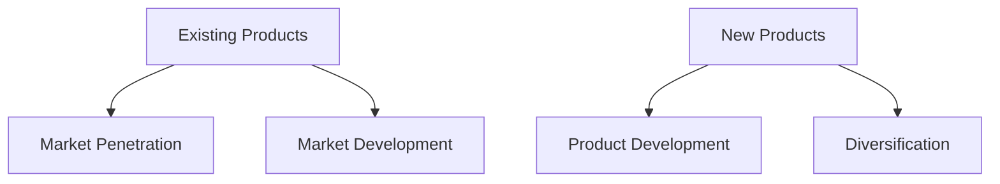
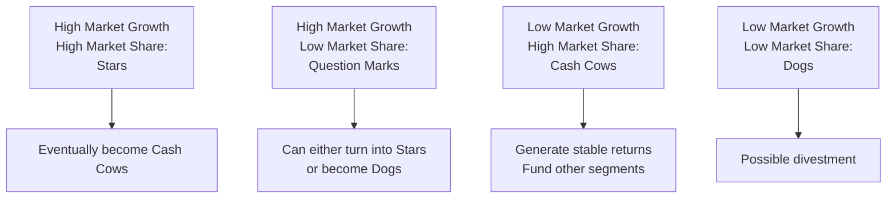
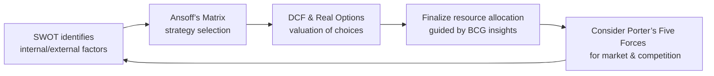

## Introduction

So, you’ve probably heard all sorts of exciting chatter about corporate growth: new product launches, expansions into different markets, or even big splashy acquisitions. It’s the kind of stuff that makes headlines. But from a financial analyst’s point of view, growth is also about carefully matching strategy to risk and ensuring that the firm’s cost of capital, resource capacity, and future investments align with sustainable value creation. In this section, we’ll explore a set of well-established tools that help corporate issuers navigate their growth options. We’ll walk through frameworks like Ansoff’s Matrix, the BCG Matrix, SWOT Analysis, Porter’s Five Forces, and more advanced valuation approaches, including real options. Along the way, we’ll highlight how these frameworks might appear in exam-style vignettes and how they can reinforce or contradict each other in practical applications.

## Applying the Product-Market Growth Matrix

One of the most popular frameworks for analyzing growth strategies is Ansoff’s Matrix. Let me tell you, I once watched a CFO lean on this matrix to figure out whether to push an existing product line into a new geography or to spin up a brand-new product altogether. Each choice carries implications for leverage, capital structure, and, of course, risk.

### Ansoff’s Four Growth Strategies

The matrix is traditionally presented in a 2×2 grid, with rows representing old vs. new products and columns representing old vs. new markets:

1. **Market Penetration**  
   – Focuses on increasing your share of existing markets with current products.  
   – Usually involves heavy marketing, promotions, bundling, or loyalty programs.  
   – Financially, consider the incremental cost of marketing campaigns versus anticipated sales lift.  
   
2. **Market Development**  
   – Targets expansion into new market segments or geographic regions with current products.  
   – Could mean establishing new distribution networks or forging partnerships to tap into unfamiliar territories.  
   – Watch out for the risk of misjudging local consumer preferences or overestimating cross-border synergies.

3. **Product Development**  
   – Entails creating new products or significantly upgrading existing ones for current markets.  
   – Valuation often involves forecasting incremental revenue streams and expecting some cannibalization of older product lines—be sure to incorporate that in your DCF.  
   – R&D expenses, shorter product lifecycles, and potential intangible asset write-downs can all factor into financial analysis.

4. **Diversification**  
   – Involves introducing new products to completely new markets.  
   – The riskiest path, but can also yield significant payoffs if done right.  
   – From a capital structure standpoint, diversification strategies may require external financing, especially if your company is venturing well beyond its core competencies.

When you’re working through item sets on the exam, keep an eye out for references to the firm’s competencies, target markets, and risk tolerance. You might see a scenario describing a firm with a dominant home-market presence, uncertain international brand recognition, and a CFO who’s deciding between Market Development and Diversification. Understand the trade-offs—particularly in how the cost of capital might differ if you’re going for a riskier strategy.

## Using the BCG Matrix for Portfolio Management

While Ansoff’s Matrix offers broad growth directions, the **BCG (Boston Consulting Group) Matrix** helps you allocate resources among multiple business units or product lines. A firm’s portfolio often includes some profitable, well-established lines as well as emerging areas that could become future stars. Here’s the gist:

1. **Stars**  
   – High growth, high market share.  
   – Require substantial investment to maintain share in a competitive market.  
   – Potential to evolve into Cash Cows over time.

2. **Cash Cows**  
   – Low growth, high market share.  
   – Generate significant cash inflows with fewer reinvestment needs.  
   – Typically, used to fund new initiatives.

3. **Question Marks**  
   – High growth, low market share.  
   – Could become Stars, but the outcome is uncertain.  
   – Often require heavy investment for market share increases.

4. **Dogs**  
   – Low growth, low market share.  
   – Minimal potential for future profitability, often prime candidates for divestiture.  

From a corporate finance angle, the BCG Matrix prompts the question: Where do we allocate capital? CFOs often funnel free cash flow from Cash Cows into more speculative initiatives (Question Marks) to grow them into Stars. However, misallocation can hamper overall growth. On exam item sets, you might see references to segments that are eating up capital without showing improvement (Dogs) or to lines that consistently bail out the rest of the business (Cash Cows).

## Leveraging SWOT Analysis

**SWOT Analysis** is a classic tool where you lay out the organization’s **Strengths**, **Weaknesses**, **Opportunities**, and **Threats**. It sounds almost too basic, but you’d be surprised how many corporate strategies get off track by ignoring a simple factor—like a competitor’s new technology or lack of internal synergy between departments. During a strategy session, an honest SWOT can surface critical issues well before any major capital budgeting decisions happen.

• **Strengths (Internal)**  
  – Unique capabilities, cost advantages, proprietary technologies, brand equity, or strong financials.  
  – For instance, a robust balance sheet can help fund more aggressive expansion.  

• **Weaknesses (Internal)**  
  – Operational inefficiencies, limited brand recognition, outdated technology.  
  – Weaknesses can constrain the firm’s capacity for big ticket expansions or M&A deals.  

• **Opportunities (External)**  
  – New market segments, regulatory changes that open up new categories, or industry disruptions that the firm can exploit.  
  – Many CFOs treat an identified opportunity like a real option—to be exercised if conditions are favorable.  

• **Threats (External)**  
  – Market saturation, new entrants, shifting consumer preferences, or legislative hurdles.  
  – Thoroughly analyzing threats ensures that your discounted cash flow projections factor in worst-case scenarios.

A lot of practice exam vignettes will toss in half-hidden references that map to a SWOT. For example, you might read about a competitor that’s just set up a distribution hub in your key territory (a Threat), or about your superior R&D pipeline (a Strength) that can expedite Product Development under Ansoff’s Matrix.

## Analyzing Five Forces

Next up: **Porter’s Five Forces**, which shapes how you analyze an industry’s competitive environment. The five forces are:

1. **Rivalry Among Existing Competitors**  
2. **Bargaining Power of Suppliers**  
3. **Bargaining Power of Buyers**  
4. **Threat of New Entrants**  
5. **Threat of Substitutes**

When rivalry is fierce, margins get squeezed, and that can drastically affect your growth strategy. If you’re a CFO planning to expand into a market with low barriers to entry, you might worry that new competitors will flood in, driving down prices. Or, if suppliers hold a ton of clout, that might cut into your profit margins.  

In an exam scenario, you might see a reference to an upcoming regulatory change that lowers barriers for new entrants, meaning the **Threat of New Entrants** is set to increase. If your firm is about to invest heavily in product development, you’d better factor that into your IRR forecasts.

## Conducting DCF and Real Option Valuations

### Discounted Cash Flow (DCF)

We all know DCF: you project a series of cash flows, discount them at a required rate of return (often WACC), and sum them up to get that net present value (NPV). In growth strategies, DCF helps you:

• Evaluate expansions, product launches, or acquisitions based on expected returns.  
• Integrate risk by adjusting the discount rate or running scenario and sensitivity analyses.  
• Compare multiple growth strategies (like entering a new market vs. a product revamp) using forecasted NPVs.  

Let’s say you’re deciding between:

• **Market Penetration**: Launch an aggressive ad campaign for your existing product.  
• **Market Development**: Tap into a new region with the same product.  

Each path involves different cost structures, timelines, and revenue potential. Standard procedure is to project the incremental cash flows for each approach, discount them by WACC, and see which yields the higher NPV.  

### Real Options Valuation

Sometimes, you discover strategic nuances that a traditional DCF might overlook. Real options revolve around the idea that management can make decisions at certain points, like deferring, expanding, or abandoning. 

Common real options include:

• **Option to Expand**: Invest more money if an initial pilot is successful.  
• **Option to Abandon**: Walk away if the market demand is weaker than anticipated.  
• **Option to Defer**: Delay investing until better information arrives.  

Real options add value by capturing flexibility in uncertain environments. For example, a biotech firm might invest in R&D for a new drug and hold the option to expand distribution only if the drug’s clinical trials succeed. This potential expansion is worth something, even if your base-case DCF is marginal.  

In exam vignettes, watch for language hinting that management can stage investments or pivot mid-course. That typically signals you should consider real options or at least mention them as part of your strategic recommendation.

## Preparing for Comprehensive Item Sets

CFA Level II item sets often combine frameworks. You might have a vignette describing a company’s current portfolio (hint: BCG categories) and also referencing an upcoming R&D project (hint: real option). Or, it might detail how intense competition (Porter’s Five Forces) intersects with an urgent product launch (Ansoff’s Product Development).  

Approach these item sets by:

1. **Identifying the Key Strategic Tools**: Is the vignette providing data suitable for a SWOT analysis or for a BCG classification?  
2. **Linking to Capital Budgeting**: How do these strategic considerations funnel into the firm’s cost of capital decisions or project-level evaluations?  
3. **Paying Attention to Contradictions**: Sometimes, a segment might look like a Star in BCG terms, but also might be threatened by new entrants. This tension shapes your final recommendation.  

When you see these comprehensive scenarios, you’ll often be asked for the best growth option, the correct classification in a matrix, or a recommended investment decision. If you’re thorough about applying each framework consistently, you’ll be primed to handle the exam’s trickiest corporate finance item sets.

## Practical Examples and Case Studies

• **Case Study (Market Penetration)**: A global beverage firm invests heavily in digital advertising to boost sales of its signature drink in existing markets. The CFO runs a DCF with incremental marketing costs of $80 million over five years, projecting $120 million in additional net cash inflows. The NPV is positive, so the board approves.  

• **Case Study (Diversification)**: A consumer electronics manufacturer notices a shift in consumer preferences toward smart home devices—an area it does not currently serve. The CEO proposes acquiring a small start-up. A real options approach shows that if AI-based voice control continues rising, the expansion option is extremely valuable.  

• **Counterintuitive BCG Example**: A business unit might appear to be a Dog based on low growth and low share. But recent product developments (Strength in SWOT) could turn it into a Question Mark. We see how these frameworks interact: BCG for broad categorization, and SWOT for nuance.  

## Best Practices, Common Pitfalls, and Challenges

1. **Overreliance on One Framework**  
   – It’s tempting to rely on just BCG or a quick SWOT. In practice, a combination yields deeper insights.  

2. **Poorly Calibrated or Stale Data**  
   – Using outdated market growth rates or ignoring current competitor moves can lead to flawed conclusions.  

3. **Failure to Incorporate Risk**  
   – Growth strategies often require flexible modeling. Ignoring real options, scenario analysis, or cost of capital revisions can hamper your accuracy.  

4. **Not Considering Implementation Costs**  
   – Strategies like diversification or market development often demand operational adjustments, marketing campaigns, or new supply chain investments. Omitting these can inflate the project’s expected return.  

5. **Neglecting Cultural and Governance Factors**  
   – In cross-border expansions, governance, regulatory differences, and cultural mismatches can undermine financially sound strategies.  

## Diagrams and Visual Summaries

Below is a quick reference diagram tying together how these frameworks might interact when you are confronted with a corporate growth decision:

It may look like a cyclical or iterative process: you spot opportunities via SWOT, use Ansoff’s to define strategic directions, run valuation models, refine allocations with BCG, and keep an eye on industry competition using Five Forces.

## References for Further Exploration

• Ansoff, H. I. (1965). Corporate Strategy. New York, NY: McGraw-Hill.  
• Henderson, B. (1979). Henderson on Corporate Strategy. Cambridge, MA: BCG.  
• Porter, M. E. (1980). Competitive Strategy: Techniques for Analyzing Industries and Competitors. New York, NY: Free Press.  
• Trigeorgis, L. (1996). Real Options. Cambridge, MA: MIT Press.  
• Copeland, T., & Tufano, P. (2004). A Real-World Way to Manage Real Options. Harvard Business Review, 82(3).  

Online courses, such as those found on Coursera, EdX, or through the CFA Institute’s own continuing education modules, can also deepen your comfort with these frameworks, particularly if you’re interested in hands-on modeling for real options.

---

## Test Your Knowledge: Growth Strategy Frameworks and Valuation Quiz



### Which growth strategy under Ansoff’s Matrix involves selling current products to new markets?

- [ ] Market Penetration
- [x] Market Development
- [ ] Product Development
- [ ] Diversification

> **Explanation:** Market Development is about taking existing products into new markets, whether that’s geographic expansion or targeting a new market segment.

### In the BCG Matrix, which category typically generates robust cash flows with lower reinvestment needs?

- [ ] Stars
- [ ] Question Marks
- [x] Cash Cows
- [ ] Dogs

> **Explanation:** Cash Cows have a high market share in low-growth industries, offering strong cash flows without needing large additional investments.

### Which of the following real options allows management to stop a project if it becomes unprofitable?

- [ ] Option to Delay
- [ ] Option to Expand
- [x] Option to Abandon
- [ ] Option to Scale Up

> **Explanation:** The Option to Abandon grants the flexibility to halt and exit a project if circumstances deteriorate.

### Which element of a SWOT analysis best addresses shifts in consumer preferences that create new opportunities?

- [ ] Strengths
- [ ] Weaknesses
- [x] Opportunities
- [ ] Threats

> **Explanation:** External factors such as shifting consumer trends would fall under Opportunities when they create favorable business conditions.

### In Porter’s Five Forces, if switching costs for buyers are very low, how does it affect the bargaining power of buyers?

- [x] Increases buyer power
- [ ] Decreases buyer power
- [ ] Has no effect
- [ ] Shifts power to suppliers instead

> **Explanation:** When buyers can switch providers easily, they typically gain bargaining power because the supplier must compete more vigorously to retain them.

### When analyzing a firm with many products/units, which tool systematically classifies them based on market share and growth rate?

- [ ] SWOT Analysis
- [ ] Porter’s Five Forces
- [ ] Ansoff’s Matrix
- [x] BCG Matrix

> **Explanation:** The BCG Matrix classifies products/units into Stars, Cash Cows, Question Marks, or Dogs using both market share and growth rate as criteria.

### Which of the following commonly represents a strategic challenge for firms pursuing Diversification?

- [x] High risk from entering unfamiliar markets
- [ ] Maximizing market share in existing markets
- [ ] Reducing R&D expenses
- [ ] Limiting optionality

> **Explanation:** Diversification involves new products and new markets, which is inherently more uncertain and risky compared to other Ansoff strategies.

### A firm’s decision to moderate competitive pressure by differentiating its product offering is most closely tied to which of Porter’s Five Forces?

- [x] Rivalry Among Existing Competitors
- [ ] Bargaining Power of Buyers
- [ ] Bargaining Power of Suppliers
- [ ] Threat of Substitutes

> **Explanation:** Product differentiation is a classic approach to reduce direct rivalry by creating unique value that competitors struggle to match.

### Which is a key risk of relying only on a standard DCF without considering real options for a large expansion project?

- [ ] Overestimating salvage value
- [x] Missing the value of managerial flexibility
- [ ] Excessive discount rates
- [ ] Ignoring cost of goods sold

> **Explanation:** Real options capture the flexibility managers have to adapt, expand, or abandon a project under changing market conditions. A standard DCF might omit this flexibility.

### True or False: A firm’s internal Strengths in a SWOT can never be threatened by external changes in the market.

- [ ] True
- [x] False

> **Explanation:** External changes (like new technologies from competitors) can erode a firm’s strengths, so internal advantages are not always permanent.


