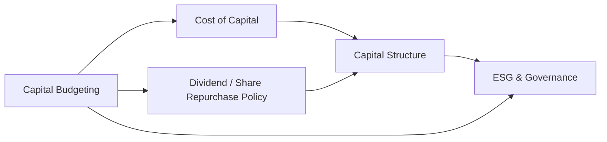

## Overview of the Holistic Perspective

Picture yourself in a board meeting, flipping through a thick deck of slides covering everything from dividend history to the latest ESG initiatives. The CFO asks you—casually, of course—how the newly proposed share repurchase will impact the firm’s cost of capital, and whether it’s still worth investing in that capital budgeting project overseas. You shift in your seat, and a wave of “Wait, which formula do I need again?” starts creeping in. If this scenario makes you go, “Uh, hold on,” then congratulations—you’ve just hit the heart of integrating multiple corporate finance concepts!

Throughout this volume, we’ve dived into topics like dividend payouts, capital structure, share buybacks, mergers, and ESG. But in real life (and on the CFA exam), these areas intersect. This integrative view is crucial. After all, a share repurchase might alter your capital structure, which in turn affects financial metrics, governance signals, and your ability to finance mergers. It’s like a giant puzzle, and each piece matters. Let’s take a big-step overview to see how everything fits together, from deciding on a stable payout policy to tracking synergy gains from an acquisition.

## Linking Payout Policy, Capital Structure, and Cost of Capital

### Dividend Decisions in a Larger Context

We spent a lot of time talking about dividend policy theories—Modigliani–Miller’s irrelevance theory under perfect markets, the Bird-in-Hand argument that dividends reduce uncertainty, and how taxes can tilt payout preferences. Once we add share repurchases into the mix, the waters get murkier. Because repurchasing shares can increase EPS (by reducing the shares outstanding), it might look like a neat way to bump valuations or “reward” shareholders under certain market conditions.

But remember: dividends and share buybacks both require cash. If that cash could earn a higher return reinvested in the firm’s projects (particularly those with a favorable Net Present Value, or NPV), a large payout could be an opportunity cost. So, a seemingly simple question—“Should we pay a dividend or repurchase shares?”—actually demands that you evaluate:

• The firm’s current and future profitability.  
• Potential investment opportunities with positive NPVs.  
• The cost of external capital if internal cash is insufficient.  
• The firm’s life cycle stage—start-ups typically reinvest rather than pay out, while mature firms may return capital.

### Capital Structure Implications

Once you choose your payout path, your capital structure can shift. Picture a scenario where you finance a share repurchase with additional debt. Suddenly, you’ve raised your leverage ratio. And that can affect:

• Risk of Financial Distress: Highly leveraged firms face stricter debt covenants and higher default risk.  
• Shareholder vs. Creditor Tensions: Creditors want stable payouts (or limited payouts), while equity holders might push for share repurchases. This is a key agency conflict.  
• Weighted Average Cost of Capital (WACC): If leverage rises, the cost of debt may be lower than equity—but only up to the point where default risk drives up the cost of debt. Ultimately, an optimal capital structure aims to minimize the firm’s overall cost of capital.

Stated simply, a well-chosen capital structure, combined with the right payout strategy, influences WACC. We know from earlier chapters that:


\text{WACC} = w_d \times r_d \times (1-T) + w_e \times r_e


Where:
- \\( w_d \\) and \\( w_e \\) are weights of debt and equity in the capital structure,  
- \\( r_d \\) is the cost of debt,  
- \\( r_e \\) is the cost of equity,  
- \\( T \\) is the corporate tax rate.

Choosing a higher debt ratio might reduce taxes (due to the interest tax shield), but it can also raise the firm’s risk profile and cost of equity. So there’s no one-size-fits-all approach. Everything depends on your firm’s unique context, risk tolerance, and growth aspirations.

## ESG and Governance: Reinforcing or Undermining Decisions

### Aligning ESG with Corporate Strategy

Maybe you’re thinking, “Ah, ESG—just a checklist item for compliance, right?” Actually, integrating ESG can have a substantial impact on capital allocation and risk management decisions. Suppose you’re analyzing a new capital project that is environmentally friendly but also has a slightly lower rate of return. ESG considerations might justify that investment if it reduces regulatory risks and fosters customer goodwill. Or consider the board’s stance on governance—strong oversight can reduce empire-building acquisitions that destroy value.

### Board Composition, Executive Pay, and Payout Policy

Executive compensation often ties to EPS or share price performance. If your CEO’s bonus depends heavily on short-term stock gains, you might see more buyback programs or special dividend announcements. That, in turn, can reduce the pool of funds available for sustainable growth. On the flip side, robust governance can mitigate such short-termism, pushing for balanced capital budgeting. So yes, ESG factors and governance structures can either enhance or undermine a carefully planned payout or capital structure decision.

## Short-Term vs. Long-Term Strategy: Working Capital vs. M&A

### Working Capital Policies

Managing inventory, payables, receivables, and short-term liquidity is not a glamorous job—but it’s essential. A firm with haphazard working capital controls can face liquidity shortfalls, leading to forced (and often costly) financing. If you can’t pay short-term bills, your credit rating can plummet, which impacts your cost of capital. So even though it might not sound as exciting as an acquisition spree, short-term discipline can be the bedrock that enables bigger strategic plays later on.

### Mergers, Spin-Offs, and Big-Ticket Moves

Now, let’s talk about the splashier side of corporate finance: M&A, spin-offs, or carve-outs. These are typically long-term strategic moves aimed at synergy creation or focusing the firm’s resources on core operations. But synergy can be elusive—one of the biggest mistakes is overpaying for acquisitions that never realize the rumored “additional 2 + 2 = 5” effect.

In evaluating an acquisition:

• Check the post-merger capital structure. Will new debt be added? Will the combined firm meet existing covenants?  
• Anticipate changes in future payout policy. Some boards cut dividends to preserve cash for integration.  
• Assess how the target’s ESG profile meshes with your own. Acquiring a controversial company could trigger reputational (and even regulatory) risks.  
• Evaluate synergy carefully—both revenue synergy (pricing power, cross-selling) and cost synergy (economies of scale).

## Stakeholder Interests: Beyond Just Equity Holders

Good corporate finance recognizes that shareholders, creditors, employees, and regulators all matter. A leveraged recap might boost returns for equity holders but can raise the firm’s default risk, antagonizing bondholders. Or an aggressive share buyback could overshadow ESG objectives around reinvestment in employee well-being. Maintaining a balance among stakeholder interests is crucial—especially in exam scenarios where you’ll be asked to weigh multiple perspectives.

## Decision Matrix: A Visual Overview

One helpful way to capture these cross-linkages is a simple decision-matrix or chart. Let’s use a Mermaid diagram to visualize some of the key intersections among capital budgeting, payout policies, cost of capital, and ESG.

- Capital Budgeting (A) influences both the cost of capital (B) (through risk profile and financing needs) and payout policy (C) (through cash demand).  
- Cost of Capital (B) links to capital structure (D).  
- Payout Policy (C) also affects capital structure (D).  
- Governance and ESG factors (E) form an overarching framework that can reinforce or undermine each of these decisions.

## Scenario Example: Combining Projects, Dividends, and Buybacks

Let’s walk through a quick hypothetical scenario:

• Company ABC has $500 million in excess cash. Management is torn between launching a new plant overseas (expected Internal Rate of Return of 12%, above their 10% WACC), buying back shares, or raising dividends.  
• If ABC invests in the new plant, it can expand its global footprint, potentially boosting future free cash flow. However, an international move carries currency and political risks (ESG might also be relevant if it’s a socially sensitive location).  
• A share buyback could boost the short-term stock price (and possibly executive pay if tied to EPS). But using up that cash might limit ABC’s ability to weather downturns without taking on more debt.  
• An increased dividend yields consistent returns for current shareholders but may not impress growth-oriented investors if the firm misses out on valuable expansion projects.

In the CFA exam (and real life), you’d weigh each stakeholder’s point of view—shareholders seeking immediate returns, management eyeing growth, and creditors watching leverage. Ultimately, the “right” path typically merges rational capital budgeting decisions with a disciplined payout policy, while respecting the constraints of capital structure and ESG objectives.

## The Role of the Firm’s Life Cycle

We can’t ignore the life cycle. An early-stage firm is likely to reinvest all earnings to scale up. A mature firm with stable cash flows, moderate growth, and fewer positive NPV projects is a more likely candidate for consistent dividends or share repurchases. In declining stages, firms might pay out or reinvest selectively to pivot strategies. That’s why, for exam purposes, never forget to ask: “What stage is this firm in?”

## IFRS, US GAAP, and Tax Issues

It’s easy to get caught up in the “fun stuff,” but let’s not forget the accounting side:

• Under IFRS vs. US GAAP, share-based compensation or certain capital transactions might be treated differently. That could affect reported earnings and key ratios.  
• Double taxation of dividends might encourage share buybacks in some jurisdictions, making the firm’s payout preference a function of tax policy.  
• Imputation systems (often found in countries like Australia) offset some or all of the shareholder’s tax liability on dividends. So paying dividends in such a system might carry less penalty.

Being mindful of these nuances is essential for an integrated approach. In your exam item sets, a footnote about “share-based accounting standards” or “local withholding taxes” can change your entire recommendation.

## Best Practices and Common Pitfalls

### Best Practices

1. Always Check WACC Assumptions: Are you using the right market data, risk-free rates, and beta estimates to calculate the cost of equity? If WACC is understated, you might accept unprofitable projects.  
2. Incorporate Scenario Analysis: Evaluate how changes in interest rates, tax policy, or market sentiment affect both capital budgeting projects and share repurchase decisions.  
3. Keep Stakeholders in Mind: A decision that maximizes shareholder returns may breach debt covenants or hamper employee morale.  
4. Maintain a Transparent Governance Structure: Good board oversight can reduce the tendency for short-term, stock-price-based decisions.  

### Common Pitfalls

1. Overestimating Synergy: Overly optimistic synergy estimates lead to overpayment in acquisitions.  
2. Neglecting Opportunity Costs: Announcing a big dividend might seem great, but not if high-return projects go unfunded.  
3. Ignoring the Life Cycle: Paying large dividends when you’re really in growth mode can force expensive external financing later.  
4. Misjudging ESG/Reputational Risks: A “profitable” project that violates environmental standards could trigger legal and reputational costs down the line.

## Final Exam Tips

• Practice Holistic Thinking: When reading item sets, draft a quick mini-matrix in your scratch paper. Identify potential ripple effects: “If the firm changes the dividend, does that affect interest coverage or governance signals?”  
• Be Wary of Subtle Clues: A single sentence about “the CFO plans to raise new debt” might imply changes in the WACC or potential covenant concerns.  
• Don’t Overcomplicate: Sometimes, the simplest approach—like consistently applying the NPV rule—dominates.  
• Time Management: Pay attention to how many calculations you really need. Some item set questions are more about conceptual linkages than raw math.

## One-Page Quick Reference Guide

Below is a concise overview of major formulas and frameworks:

| Concept                  | Key Formula / Idea                                                                                                    | Linkages                             |
|--------------------------|-----------------------------------------------------------------------------------------------------------------------|---------------------------------------|
| Weighted Average Cost of Capital (WACC) | \\( \text{WACC} = w_d \times r_d (1 - T) + w_e \times r_e \\)                                                  | Affects hurdle rate for capital budgeting; impacted by capital structure |
| Dividend Policy          | Bird-in-Hand, Tax Preference, Signaling                                                                               | Impacts retained earnings, future growth |
| Share Repurchases        | EPS Impact = \\(\frac{\text{Earnings} - \text{Cost of Buyback}}{\text{Shares Outstanding after Buyback}}\\)             | Alters leverage if funded by debt; can signal undervaluation |
| Capital Budgeting        | \\( \text{NPV} = \sum \frac{\text{CF}_t}{(1 + r)^t} - \text{Initial Investment} \\)                                     | Funding depends on payout policy and WACC |
| M&A Synergy              | Combined Firm Value > Sum of Pre-Merger Values                                                                        | Relies on cost savings, revenue growth, and cost of integration |
| ESG & Governance         | Sustainability, Stakeholder Alignment, Board Independence                                                             | Shapes investment horizon, risk mitigation, cost of capital |
| Life Cycle Stage         | Growth vs. Maturity vs. Decline                                                                                      | Informs capital structure and payout decisions |
| IFRS/US GAAP Differences | Revenue Recognition, Share-Based Compensation, Goodwill                                                               | Affects reported earnings and ratios; can guide policy decisions |

## References

• CFA Institute Level II Curriculum (Corporate Issuers Readings)  
• Berk & DeMarzo, “Corporate Finance”  
• McKinsey & Company, “Valuation: Measuring and Managing the Value of Companies”  

---

## Test Your Understanding of Integrated Corporate Finance Concepts



### Which of the following best describes how a firm's life cycle stage affects its payout decisions?

- [ ] Mature firms typically reinvest more and pay minimal dividends.  
- [ ] Early-stage firms generally have plenty of free cash to distribute to shareholders.  
- [x] Mature firms often distribute higher dividends, while early-stage firms tend to retain cash for growth.  
- [ ] Life cycle stage does not significantly influence dividend policy.  

> **Explanation:** Firms in early growth stages usually need cash for investments in projects and expansions, while mature companies often have fewer growth projects and can afford higher payouts.

### A firm planning a share buyback while taking on substantial debt should be most concerned about:

- [ ] Improving its price-to-book ratio.  
- [x] Violating existing debt covenants or increasing default risk.  
- [ ] Signaling that its shares are undervalued.  
- [ ] Complying with IFRS share-based compensation standards.  

> **Explanation:** A buyback financed by significant debt raises leverage and the risk of breach of covenants, along with higher default probability. Signaling and accounting standards might matter, but covenant violations are often the most acute risk.

### When considering synergy in a merger transaction:

- [ ] Synergy only refers to cost cuts from combining operations.  
- [ ] All synergy projections are reliable if properly audited.  
- [x] Management should carefully distinguish between realistic and over-optimistic synergy estimates.  
- [ ] Synergy is irrelevant if the target firm is already profitable.  

> **Explanation:** Synergy includes both cost and revenue enhancements, and the biggest pitfall is overestimating synergy benefits. Conducting thorough due diligence ensures that synergy expectations are realistic.

### Which of the following is a direct consequence of a dividend cut aimed at preserving cash for high-return projects?

- [x] Potential negative market reaction if investors interpret the cut as a signal of future problems.  
- [ ] The firm’s WACC decreases with immediate effect.  
- [ ] Creditors are likely to insist on immediate repayment of existing debt.  
- [ ] EPS is likely to decrease.  

> **Explanation:** A dividend cut is often viewed with suspicion as it can signal financial distress or diminished earnings outlook, even if the true motive is to fund promising projects. The move doesn’t automatically lower WACC or trigger debt repayment.

### A company’s Weighted Average Cost of Capital (WACC) is most likely to increase if:

- [ ] The firm substitutes equity with debt in its capital structure.  
- [x] The firm’s credit rating worsens, increasing its cost of debt.  
- [ ] The firm reduces its dividend payout ratio.  
- [ ] The corporate tax rate rises, increasing the tax shield on debt.  

> **Explanation:** A higher cost of debt directly drives up WACC if the company relies on debt financing. Substituting equity with debt might reduce or increase WACC depending on the relative costs and risk levels. A higher corporate tax rate usually increases the tax shield for debt, which could lower WACC.

### How do strong governance mechanisms such as an independent board typically influence major strategic decisions?

- [x] They often limit short-term actions that could undermine long-term value.  
- [ ] They are primarily focused on boosting the CEO’s annual bonus.  
- [ ] They rarely factor into M&A or capital budgeting decisions.  
- [ ] They encourage higher dividend payouts above industry benchmarks.  

> **Explanation:** A strong, independent board generally maintains a long-term focus, ensuring that strategic moves like M&A and capital budgeting are not dominated solely by short-term earnings targets or CEO-centric motivations.

### What is a key reason a company would choose to reinvest cash rather than initiate a share repurchase?

- [ ] The company wants to reduce reported earnings per share.  
- [ ] The company is required by regulators to maintain zero-dividend policies.  
- [x] The company wants to pursue positive NPV projects that yield higher returns than the benefits of a buyback.  
- [ ] The company believes share buybacks are fundamentally illegal.  

> **Explanation:** Companies with attractive investment opportunities (i.e., positive NPV projects) often retain cash to fund those growth initiatives, which can create more value for shareholders than a share repurchase.

### In analyzing stakeholder interests, which of the following is critical when considering capital structure changes?

- [ ] Ensuring employees receive higher wages as leverage increases.  
- [ ] Maximizing manager bonuses regardless of default risk.  
- [ ] Minimizing the stock price for new issues.  
- [x] Balancing equity holder returns with bondholder requirements and credit covenant restrictions.  

> **Explanation:** Altering capital structure must balance the interests of shareholders, who may benefit from higher levered returns, and bondholders, who aim to keep default risk low.

### Which statement about short-term (working capital) decisions and long-term strategic moves is most accurate?

- [x] Effective working capital management underpins the firm’s capacity to undertake larger strategic initiatives.  
- [ ] Merger activity has no bearing on short-term liquidity.  
- [ ] Working capital strategies never affect the cost of capital.  
- [ ] Long-term projects are typically funded by trade credit only.  

> **Explanation:** Strong working capital policies ensure the firm has enough liquidity and financial stability, laying the groundwork for major long-term ventures like M&As or expansions.

### True or False: Under IFRS and US GAAP, share-based compensation is always treated identically on the income statement, with no effect on reported earnings.

- [ ] True  
- [x] False  

> **Explanation:** While IFRS and US GAAP have converged on many points, differences may still exist in classification, expense timing, or disclosure requirements, which can lead to variations in reported earnings.


