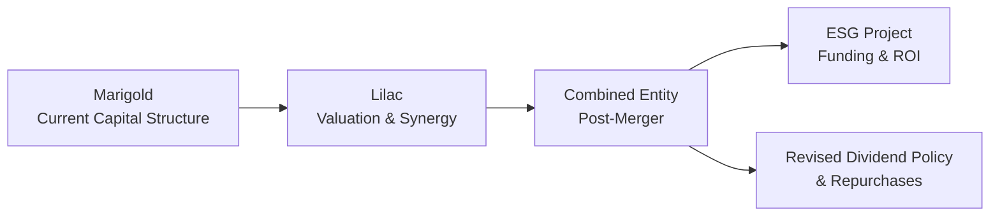

## Introduction and Purpose

So, picture this scenario: you’re deep in the CFA Level II exam, and you’ve just been hit with a multi-page vignette that seems to combine everything you’ve learned—capital budgeting, synergy analysis, cost of equity, dividends, partial data, and even a dash of ESG. All in one breath. Um...that’s a lot, right? In these moments, it’s easy to feel overwhelmed or get lost in the details.

This section focuses on how to handle exactly those “mega-cases.” These item sets test your ability to connect the dots across chapters: from shareholder payouts to M&A synergies, from ESG considerations to cost of capital computations. We’re talking serious, end-to-end analysis that demands a consistent, methodical approach. 

Below, we’ll walk through strategies to dissect a comprehensive case study, referencing major corporate finance topics from across this volume. We’ll also explore partial or missing data, advanced ratio analyses, and that dreaded time constraint. You’ll see an example scenario weaving multiple issues into a single storyline—just like the real exam. Let’s jump in.

## The Multi-Topic Nature of Mega-Cases

Let’s be honest: a mega-case is more than just a bunch of numbers. A properly constructed item set weaves in:
• Corporate actions like mergers, share repurchases, or major capital investments.  
• Governance angles and ESG preferences from stakeholders.  
• Subtle details about capital structure changes or board approval processes.  
• Potential conflicts such as new synergy estimates vs. the original synergy plan.  

The exam’s main objective here is to see if you can unify all these data points with a consistent framework. For example, if you’re valuing synergy for two merging companies, your cost of equity probably shouldn’t change between synergy analysis and the capital budgeting portion (unless there’s a stated reason for it).

## Building an End-to-End Analysis

Before diving into a sample universe of data, let’s outline some best practices. These steps will help you control the narrative when the vignette flings details at you from every angle. In my opinion, a bullet-point process can be a lifesaver—especially under exam pressure:

• Skim for Overarching Themes: Is it an M&A scenario? Is there a new capital project? Are they also discussing payout changes like dividends or share buybacks? Jot down the big pieces immediately.  
• Map Out Relevant Facts: Identify which data belong to which subtopic. You could highlight synergy estimates for the M&A portion, cost of capital data for capital budgeting, dividend yields for payout policy, and so on.  
• Watch the Timeline: Sometimes, the vignette lays out a sequence—like a share repurchase before an acquisition. Keep the chronological order clear so you don’t inadvertently apply outdated capital structures to future calculations.  
• Check Consistency: Are you using the same discount rate for synergy as for the capital budgeting project? Are you factoring in the same tax rate across the case? A single mismatch can throw off final answers.  
• Perform Calculations in Steps: Don’t try to do everything in one giant spew of numbers. Break it down: WACC, synergy NPV, coverage ratios, pro forma statements, etc.  
• Document Assumptions: If a piece of data is missing (like market risk premium?), you might assume the standard from the text or track a normal range. Just be explicit about it.

## A Sample Mega-Case: The Marigold–Lilac Merger and ESG Payout Strategy

Let’s walk through a stylized example. While exam cases can be even more detailed, this illustrates how to unify different corporate finance pieces into a single scenario:

Marigold Corporation (“Marigold”) is considering acquiring Lilac Inc. (“Lilac”) to bolster its technology portfolio. The case also includes a potential expansion project, a revised dividend policy, and additional ESG targets. The vignette might look something like this:

• Marigold’s Current Capital Structure:  
  – Equity: $500 million (market value)  
  – Debt: $300 million (book value equal to market value, 5% interest rate)  
  – Tax rate: 25%  

• Lilac’s Key Financials:  
  – Forecasted free cash flows to equity: $30 million next year, growing at 4% annually  
  – Beta: 1.1  
  – Debt-to-equity ratio: 0.40  

• Risk-Free Rate & Market Risk Premium:  
  – Risk-free rate: 3%  
  – Market risk premium: 6%  

• Proposed Merger Synergy: $50 million total NPV from combining resources and eliminating redundancies. But partial synergy data suggests that a portion (around $10 million) depends on uncertain client renewals.  

• Proposed Project for ESG Initiative:  
  – Initial outlay: $40 million  
  – Internal Rate of Return (IRR): 10.5%  
  – Project’s risk level is deemed slightly higher than the firm’s core business, but not enough to drastically alter the discount rate.  

• Dividend Policy Shift:  
  – Marigold’s management is considering cutting its regular dividend from $2.00/share to $1.50/share and using the difference for share repurchases that might offset dilution from the Lilac acquisition.  

• Partial or Incomplete Data:  
  – The vignette might withhold Lilac’s cost of debt and absolute synergy breakdown, meaning you’ll have to make assumptions.  

And yes, that’s a lot of info. But that’s the point: your job is to integrate it consistently. Let’s see how we might tackle it.

## Identifying Key Subtopics

It helps to label the main subtopics right away:

• Subtopic A: Marigold’s Cost of Capital.  
• Subtopic B: Lilac’s Valuation (and synergy analysis).  
• Subtopic C: The Combined WACC after Merger.  
• Subtopic D: ESG Capital Project Feasibility.  
• Subtopic E: Dividend Policy Adjustments and Repurchases.  

Keep these subtopics in mind so you know which facts belong to which calculations.

## Visualizing the Flow

Below is a quick Mermaid diagram to illustrate how these topics might flow together in a mega-case:

## Performing the Calculations

Let’s give a short demonstration of how we might compute synergy, WACC, or the project’s NPV. Because we’re bridging multiple subtopics, you’ll see references back and forth.

### Marigold’s Cost of Equity

Using CAPM:


r_e = r_f + \beta ( \text{Market Risk Premium} ) 


Given the risk-free rate (3%) and the market risk premium (6%), if Marigold’s beta is 1.0 (not provided, so let's assume 1.0 for demonstration), you get:


r_e = 3\% + 1.0 \times 6\% = 9\%


### Marigold’s WACC

Assume Marigold has 500 million in equity and 300 million in debt. The cost of debt is 5%, corporate tax rate is 25%. The classic WACC formula is:


\text{WACC} = 
\frac{E}{E + D} \times r_e
+ \frac{D}{E + D} \times r_d (1 - t)


Plugging in:


\text{WACC} = \frac{500}{800} \times 9\% 
+ \frac{300}{800} \times 5\% \times (1 - 25\%)
= 0.625 \times 0.09 
+ 0.375 \times 0.05 \times 0.75 
= 0.05625 
+ 0.01406 
= 7.03\%


### Lilac’s Cost of Equity and Valuation

If Lilac’s beta is 1.1:


r_e(\text{Lilac}) = 3\% + 1.1 \times 6\% = 3\% + 6.6\% = 9.6\%


Its free cash flows to equity (FCFE) next year are $30 million, growing at 4% indefinitely, so you might do a quick Gordon Growth approach:


\text{Value of Lilac} = \frac{\text{FCFE}_{1}}{r_e - g} 
= \frac{30}{0.096 - 0.04} 
= \frac{30}{0.056} 
\approx 535.7 \text{ million}


### Merger Synergy

Total synergy is $50 million in NPV, though $10 million is uncertain. That’s a classic partial data scenario—maybe we assume the uncertain portion is only partially realizable (say a 50% chance of happening), making the synergy effectively $5 million from that piece. So your synergy might be $45 million in “most likely” scenario. Another approach is to show multiple synergy outcomes.

We can define synergy as:


\text{Synergy} = \text{NPV}(\text{Combined}) - [\text{NPV}(\text{Marigold Standalone}) + \text{NPV}(\text{Lilac Standalone})]


In the exam’s item set, you might get a question that has you confirm synergy is $45 million or $50 million based on partial data or additional assumptions.

### Post-Merger WACC

If Marigold issues new shares or takes on additional debt for the deal, the post-merger WACC might change. Watch out for statements that Lilac can repay some of its debt instantly, or that the combined entity’s beta might shift. You might have to recalculate the combined D/E ratio in a pro forma statement. That’s your consistency check: if the total debt level changes, your new WACC changes.

### ESG Project Feasibility

For the $40 million outlay with an IRR of 10.5%, you might compare that IRR to the relevant discount rate. If the firm’s adjusted WACC (maybe 7.5% to factor a small risk premium) is below 10.5%, you accept the project. If we wanted the NPV, we’d discount the forecasted cash flows. Let’s say the project yields net cash inflows of $8 million annually perpetually:


\text{NPV} = \frac{8 \text{ million}}{0.075} - 40 \text{ million} = \frac{8}{0.075} - 40 \approx 106.7 - 40 = 66.7 \text{ million}


### Dividend Policy and Repurchases

Now, after the synergy-based transaction, Marigold wants to shift from a $2.00/share dividend to $1.50/share. If that frees up, say, $10 million in annual cash, are they using it for share buybacks? That might help offset any dilution from an equity-financed merger. 

Watch for questions about how the share price might react or how coverage ratios change if large amounts of cash go to repurchases. The exam item set could ask you to confirm the new payout ratio or compute post-buyback EPS.

## Handling Partial or Incomplete Data

The real exam might not give you everything you need. For instance, maybe Lilac’s cost of debt is missing. You might need to assume it equals Marigold’s cost of debt or estimate it from the text’s references to Lilac’s credit rating. The trick is to:

• State your assumption clearly.  
• Stay consistent throughout subsequent calculations.  
• If the item set’s question or footnotes give slight hints about a 6% yield on Lilac’s bonds, latch onto that.

## Pitfalls and Potential Oversight

Sometimes, candidates get so locked onto synergy or cost of capital that they forget details in the vignette. Always keep an eye on:

• Different discount rates for different project risks.  
• Varying betas if the business lines differ significantly.  
• Potential changes in the risk-free rate or tax rates.  
• The intangible nature of certain synergy components or intangible assets.  
• The possibility that an ESG project might require capital structure adjustments.

In the real world—and in the exam—these complexities are rarely spelled out cleanly, so be prepared to cross-check everything you do.

## Time-Pressure Techniques

When that clock is ticking, you might be tempted to rush. But ironically, going too fast often leads to more mistakes. Here are a few pointers:

• Use a Table or Quick Cheater Sheet: List data for cost of equity, beta, synergy, WACC, tax rate, etc., in a single table so you don’t keep flipping pages.  
• Tackle the Low-Hanging Fruit: Quick questions about dividend policy or quick synergy calculations might be easier than a brand-new WACC.  
• Double-Label Calculations: Write something like “(WACC = 7.0%)” next to your synergy calculation as a reminder.  
• Don’t Over-Think: If the question tells you to assume a synergy figure of $45 million, do it. Overthinking might just waste time.  

## Governance, ESG, and Risk Management Angles

Exam vignettes these days love to slip in references to board oversight, compliance with sustainability goals, or the push toward certain ESG targets. Even if these are short paragraphs, they can yield questions about:

• Whether the new capital budgeting project aligns with the firm’s ESG objectives.  
• How the board composition or new debt covenants might shape the firm’s risk tolerance.  
• If the synergy is hindered by certain governance restrictions (e.g., anti-trust concerns).  

Sometimes, these are purely conceptual questions with no number crunching. Stay alert.

## Summary and Layered Answer Explanations

If you were confronted with an item set that spanned everything from synergy calculations to ESG compliance, your final step is to present your answers with clear justification. Show your numeric results, reference each assumption, and maybe indicate alternative solutions if an assumption changes. Be prepared to highlight the typical slip-ups—like forgetting to discount synergy properly or mixing up cost of equity for the merged entity.

In exam solutions, you’ll often see layered explanations:

• Step 1: Identify WACC for Marigold.  
• Step 2: Identify cost of equity for Lilac.  
• Step 3: Calculate synergy.  
• Step 4: Present the combined scenario.  
• Step 5: Show the payoff from the ESG project.  
• Step 6: Conclude with how the new dividend policy or repurchase plan fits into the capital structure.  

Creating such an outline answers each sub-question systematically.

## Practice and Repetition

Truly, the only way to get great at dealing with mega-cases is to do them repeatedly. If you can find old mock exams or third-party practice items that blend multiple areas (like a leveraged acquisition plus an ESG spin), jump on them. In the real test environment, your comfort with sifting through eight or ten paragraphs of financial data might just be your secret weapon.

## Further Reading

• Official CFA Level II Curriculum and end-of-chapter item sets.  
• “Cases in Finance” by DeMello, for real-world stylized examples that mirror exam complexities.  
• Third-Party Practice Exams (Kaplan Schweser, Wiley, etc.), focusing on multi-topic item sets.  

-----

## Test Your Mastery: Corporate Issuers Mega-Case Concepts



### In evaluating a mega-case that involves an M&A scenario, capital budgeting, and dividend policy, what is the most crucial first step?

- [ ] Immediately calculate WACC.
- [ ] Identify the risk-free rate and market risk premium.
- [x] Skim the entire scenario and categorize data by subtopic or event timeline.
- [ ] Start with synergy calculations to see total NPV.

> **Explanation:** The most effective approach is to first scan the entire vignette and note which details belong to each subtopic so you don’t overlook any relevant piece of data.  

### A synergy figure of $40 million is stated in your exam vignette, but the footnotes explain that there is an additional $10 million of potential corporate cost savings limited by uncertain contract renewals. Under exam pressure, the best strategy is usually to:

- [x] Use the stated synergy and mention assumptions around the uncertain amount.
- [ ] Ignore the uncertain synergy entirely.
- [ ] Redo the synergy calculation with a partial probability approach only.
- [ ] Subtract the entire $10 million from synergy.

> **Explanation:** When partial data appear, it’s generally safer to stick with the provided synergy figure (here $40 million) and note any partial-likelihood portion as an assumption.  

### In a mega-case that discusses both pre-merger and post-merger WACC, one of the biggest consistency checks is to confirm that:

- [ ] The cost of debt remains exactly the same.
- [ ] The dividend payout ratio is identical to pre-merger levels.
- [x] Any capital structure changes are properly reflected in the new WACC calculation.
- [ ] The risk-free rate is adjusted only after synergy is calculated.

> **Explanation:** If new equity or debt is raised for the merger, the firm’s capital structure changes. That directly affects the weighting in WACC.  

### When dealing with a partial-data scenario for a capital budgeting project within a mega-case:

- [ ] You must always use the CAPM formula.
- [ ] Disregard the missing data and move on.
- [x] State reasonable assumptions clearly and proceed with the best-available inputs.
- [ ] Use a higher discount rate to account for the uncertainty.

> **Explanation:** Exam vignettes often include incomplete data. The recommended approach is to specify assumptions and maintain internal consistency.  

### A combined entity introduces new intangible assets that are challenging to value in synergy calculations. The best practice is to:

- [x] Provide a separate intangible asset analysis or at least label them with assumptions about future revenue contribution.
- [ ] Treat intangible assets exactly like tangible ones for synergy NPV calculations.
- [ ] Assign a zero value to remain conservative.
- [ ] Use a risk-free rate for intangible asset valuation to simplify.

> **Explanation:** When intangible assets are material, separate assumptions or discounted cash flow analysis often helps clarify how they contribute to synergy.  

### Suppose the ESG project under consideration has an IRR of 10.5%, while the merged firm’s adjusted WACC is 9.0%. Which statement is true?

- [x] The project likely has a positive NPV, so it should be pursued given its IRR exceeds WACC.
- [ ] The project is definitely negative-NPV because ESG projects are riskier.
- [ ] More data are needed to confirm interest rates before proceeding.
- [ ] The project is not financeable due to synergy friction.

> **Explanation:** If IRR > WACC, the net present value is positive (assuming data consistency).  

### A mega-case reveals that Marigold wants to reduce its dividend from $2.00/share to $1.50/share and use the difference for share buybacks, primarily to offset new shares issued for an acquisition. This strategy implies:

- [ ] The firm is deferring synergy gains until the next year.
- [ ] The firm is increasing leverage significantly.
- [x] The firm is shifting from cash dividends toward repurchases, while potentially stabilizing ownership dilution.
- [ ] The firm is violating common corporate governance standards.

> **Explanation:** Reducing dividends to fund share repurchases is a standard approach for offsetting dilution and adjusting payout policies without significantly weakening capital structure.  

### The exam question asks for the “Pro Forma Debt-to-Equity Ratio” after a merger. This ratio likely appears in a mega-case to:

- [ ] Make you guess what synergy figure was used.
- [ ] Confirm that intangible assets were handled correctly.
- [x] Demonstrate consistent integration of new debt or equity into the merged entity’s capital structure.
- [ ] Evaluate only the acquiring firm’s original metrics.

> **Explanation:** Mega-cases often require you to recast the balance sheet post-merger, reflecting new capital infusions or debt.  

### If you see conflicting mentions of the tax rate (e.g., 20% in the opening paragraph versus 25% in a footnote), your next step is to:

- [ ] Assume no taxes apply to synergy calculations.
- [x] Re-read carefully; the discrepancy might be a trick or might relate to a statutory vs. effective tax rate. Clarify and choose one consistently.
- [ ] Use whichever tax rate yields a higher synergy.
- [ ] Split the difference at 22.5%.

> **Explanation:** Data inconsistencies can be deliberate. Your best move is to check context—maybe 20% is an effective tax rate for operating income, while 25% is corporate statutory. You must pick the right figure consistently.  

### A case references a board’s commitment to certain greenhouse gas reduction goals when deciding to finance an acquisition. True or False: This detail is likely irrelevant because it does not affect synergy or cost of capital calculations.

- [ ] True
- [x] False

> **Explanation:** ESG factors can influence project approvals, risk assessments, or the trajectory of synergy. They might also affect the firm’s long-term cost of capital or stakeholder alignment.  


