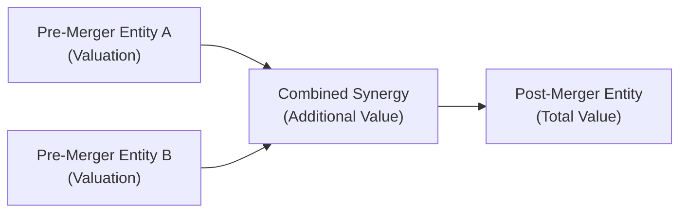

When you’re tackling multi-chapter questions on the CFA® Level II exam, you’ll often find that the biggest headache isn’t the content itself. It’s how all these concepts weave together in a single vignette—plus how easy it is to overlook a crucial detail. I remember once hearing about a candidate who meticulously calculated synergy for a merger scenario but ended up double-counting the synergy gains three times just because the vignette referenced “operational synergy,” “cost synergy,” and “tax synergy”—and, well, each found its way into the final valuation. It’s like adding the same chocolate chips three times into the same cookie dough; sure, it might taste good in theory, but the final “treat” is definitely off-balance!  

Below, we’ll explore the most common pitfalls that crop up across multiple chapters of Corporate Issuers. Throughout this discussion, we’ll use a friendly, down-to-earth tone to help you spot these mistakes before they derail your exam-day performance.

## Overlooking the Web of Interconnected Concepts

One major theme in Level II is how the examiners love to blend topics from different chapters. For example, you might see a scenario requiring you to figure out a new share count after a stock repurchase (Chapter 3) and then use that updated share count to compute your revised Debt/Equity ratio (Chapter 7) before finalizing a synergy calculation (Chapter 9 or 10). If you miss one step, the entire chain of calculations crumbles.

At times, it’s not just forgetting to integrate different data points but also forgetting to incorporate intangible factors like ESG impacts (Chapter 6) or changes in governance structure (Chapter 20). A synergy might look awesome on paper, but if local regulations or cultural alignment issues hamper post-merger integration, the real synergy effect might be watered-down—or vanish altogether.

## Double-Counting Synergy

Double-counting synergy is arguably the granddaddy of multi-chapter pitfalls. You’ll see synergy pop up in M&A discussions (Chapters 9 and 10), capital structure (Chapters 7 and 8), and even intangible asset analysis (Chapters 5 and 6) when evaluating advanced ESG or reputational impacts. Candidates see synergy in multiple forms—like tax shields, cost savings, revenue boosts—and then accidentally sum them all more than once.

It helps to visualize synergy and confirm it’s counted exactly once in the final valuation. A small diagram can keep you on track:

Think of synergy as an incremental layer that rests on top of the individual valuations of A and B. You layer it in once. That’s it.  

• Practice Tip: In your scratch work, create a separate synergy schedule. Mark down each synergy factor—tax synergy, cost synergy, revenue synergy, intangible synergy. Make sure each item is entered once and only once.

## Missteps in Cost of Capital Adjustments

Another perennial trip-up is forgetting to recalculate your Weighted Average Cost of Capital (WACC) when the capital structure changes. Candidates might see new debt layered onto the balance sheet in a leveraged buyout context (Chapter 10), but they continue to use the old WACC from the first exhibit. That old WACC is no longer valid because the firm’s cost of debt—and possibly the cost of equity if leverage risk changes—has shifted.

A quick refresher with a KaTeX formula:


\text{WACC} = \frac{E}{V} R_{E} + \frac{D}{V} R_{D}(1 - T)


• E = Market value of equity  
• D = Market value of debt  
• V = E + D (total value)  
• R_E = Required return on equity  
• R_D = Required return on debt  
• T = Tax rate  

If E or D changes, or if the cost of debt changes, your WACC is different. If you’re asked to compute synergy or a new project’s NPV using the “firm’s WACC,” make sure you’re using the updated capital structure.  

## Overlooking the Impact of Payout Changes on Financial Ratios

It’s surprisingly easy to ignore a change in the share count from a repurchase or new issuance—especially if the item set jumps around from dividend policy (Chapters 2 and 3) to ratio analysis (Chapter 7) to final valuation. All it takes is a quick oversight—using the old share count when calculating EPS or the new Debt-to-Equity ratio—and your entire analysis goes sideways.

• Don’t forget that share repurchases affect both the denominator in EPS calculations and many equity-based ratios (e.g., Debt/Equity, Return on Equity).  

• If the firm issues new shares or has employee stock options converting, your share base might swell. That changes the weighting in the capital structure and can even impact the cost of capital if those new shares alter the risk profile.

## Using the Wrong Discount Rates

Sometimes you’ll see synergy or project-specific questions that require different discount rates than the standard WACC. For example, a synergy from a cross-border expansion might demand a risk premium for country risk (see Chapter 8’s discussion on forward-looking equity risk premiums). Meanwhile, a standard domestic project might only need the usual CAPM-based discount rate.

Make sure not to mix these up. I’ve seen candidates apply their default 12% WACC to a synergy that clearly needs a 16% discount rate because of additional country and foreign exchange risk. That leads to overestimating synergy—since you discounted the synergy’s future cash flows at a rate that’s too low.  

## Ignoring Footnotes with Critical Details

The footnotes in a vignette are pure gold. Sometimes they clarify what tax rate to use, or they indicate that part of the synergy is not indefinite (maybe it expires after 3 years). Or maybe that intangible brand synergy is contingent on local approvals. If you breeze past these footnotes—perhaps because the pressure to finish quickly is high—you’ll miss out on these vital clarifications.

Think of the footnotes as a “mini-chapter” that modifies everything else in the item set. Spend a few seconds reading them carefully.

## Neglecting Intangible Aspects

ESG factors (Chapters 5 and 6) and intangible synergies can drastically affect whether a project or merger is actually worth pursuing. Handling greenhouse gas compliance, improving product safety, or adjusting corporate governance can lead to higher or lower expected returns based on brand perception, stakeholder support, or regulatory compliance costs.

• Underestimating intangible positives: Maybe you assume synergy is purely cost-related and ignore brand expansion. This might understate synergy.  
• Ignoring intangible negatives: If you assume you can lay off half the staff to reduce costs but there are heavy severance rules or strong labor laws, guess what? You might end up with lawsuits or regulatory penalties that eat those savings.

## IFRS vs. US GAAP Confusions

I vividly recall one candidate who calculated an M&A synergy scenario purely under IFRS rules for revenue recognition, while the vignette specifically stated the target used US GAAP. The mismatch introduced differences in how the intangible assets were recognized and amortized. If they’d read the entire item set carefully, they would have seen that the synergy was supposed to be recognized differently under US GAAP, especially for intangible items like reacquired rights or brand valuations.

These differences also arise in pension expense (which might be separately identified under IFRS) or share-based compensation. If you’re not sure which standard is guiding the scenario, check the pinned detail at the top of the vignette or watch for those footnotes again.  

## Book Value vs. Market Value Errors

Remember that WACC uses market values, not book values. The same goes for calculating synergy valuations or comparing financial ratios that are typically analyzed on a market-value basis. If you’re not sure which is appropriate, check: The question usually states whether you should incorporate the market value of debt or the book value. If they don’t specify, assume market values for ratio analysis that references expected capital structure and cost of capital.

• Book values might be fine for certain accounting-based ratios (like Book Value per Share in Chapter 2 or certain bank regulatory capital calculations). But for valuations, synergy, and cost-of-capital metrics, you want current market values.  

## Building a Quick “Checkpoint List”

One of the best ways to avoid these pitfalls is to have a short mental or written checklist you apply to every item set:

• Check the capital structure: Did it change mid-vignette?  
• Verify synergy: Are we counting it exactly once?  
• New share count: Did we incorporate the latest data for EPS, book value per share, or ratio calculations?  
• IFRS or US GAAP: Which standard is being used, and how does it impact the recognition or measurement of key items?  
• Discount rate consistency: Do we need extra risk premiums or a different discount rate?  
• Intangibles and ESG: Did we consider the intangible costs or benefits mentioned?  
• Market value vs. book value: Which is requested or appropriate for cost of capital and ratio analysis?

Just like a pilot’s pre-flight checklist, this quick reference can save you from a big mid-flight meltdown.

## Relying Too Heavily on Memorized Formulas

Formulas are great short-cuts, but if you rely on them blindly, you might improperly use, say, the classic CAPM formula when the scenario calls for an expanded CAPM including a country risk premium. Or you might assume a synergy discount rate equals the project’s WACC—when the question specifically mentions a higher risk level.  

When in doubt, make sure your formula is relevant to the scenario. If the question is unusual or the prompt states an abnormal assumption, adapt accordingly.

## Common Reading Mistakes

Sometimes the question prompt will say: “What is the net impact on the firm’s free cash flow?” and the candidate answers with net earnings changes. While those might be related, free cash flow typically includes adjustments for interest, depreciation, changes in working capital, and so on. Similarly, the question might ask about EPS changes, and the candidate lumps in after-tax synergy that has no effect on shares outstanding or depreciation.

Always re-check what, exactly, you’re being asked to compute: net income, net cash flow, EPS, or something else.

## Data Consistency: Mid-Year Changes and Overlooked Adjustments

It’s not uncommon for vignettes to say something like, “All of the following information is as of June 30,” then reference new data for the second half of the year that modifies your previous ratio. If you skip the detail that the new debt is added in Q4, you’ll apply the same debt ratio for the entire year. That’s a mismatch.  

Data threads are scattered in the text, footnotes, and exhibits—take a few seconds to unify them in your scratch paper so you’re consistent about when changes happen and how they affect your final answer.

## Additional Pitfalls to Watch For

• Mixing up synergy horizon: Not all synergy is perpetual. Some synergy might last only 3 or 5 years—read the footnotes or the synergy schedule.  
• Neglecting non-operating items: If synergy includes selling off non-core assets, you might have one-time net gains that you shouldn’t capitalize like an ongoing stream.  
• Failing to factor in taxes or repatriation rules in cross-border synergy.  

## A Visual Example of Integrating Topics

Let’s walk through a quick hypothetical. Suppose you’re given:

• A merger scenario: Company A has 1 million shares outstanding, Company B has 2 million. The synergy is expected to be $10 million.  
• Company A’s WACC is 10%. Company B’s is 12%. Combined, the new capital structure leads to an 11% WACC.  
• The synergy includes cost savings plus intangible ESG brand benefits, but the footnotes say the brand synergy ends in 3 years.  

A well-prepared candidate will:  
1) Exclude intangible synergy in the final valuation after Year 3.  
2) Recompute synergy using the combined 11% WACC, not the old 10% or 12%.  
3) Recalculate the share count if new equity gets issued for the buyout or if it’s a stock swap.  
4) Avoid double-counting intangible synergy by clarifying which portion is cost savings vs. ephemeral brand boost.  

## Final Thoughts

These multi-chapter scenarios are essentially the “grand finale” of Level II. You’re expected not only to remember the material but also to connect the dots. Don’t let synergy, changed share counts, or intangible ESG issues slip through the cracks. Build a habit of carefully reading each part of the vignette—including those footnotes. Keep a personal checklist. Confirm your discount rates, and watch for IFRS vs. US GAAP differences.

Mistakes happen when we assume we “already know” how to handle synergy or that “the old WACC is fine.” Gently remind yourself each time: “Wait, do we need to recalculate? Is that synergy real—or intangible? Do we have new debt? Are we dealing with IFRS or US GAAP?” And, well, double-check it once more for good measure.

### References & Further Reading

• Past CFA Institute Level II Mock Exams and Guides – these regularly showcase common mistakes around synergy calculations and capital structure changes.  
• Howard Schilit’s “Financial Shenanigans” – a deeper look into how financial statements can be misread or misapplied.  
• IFRS vs. US GAAP resources:  
  – The International Financial Reporting Standards (IFRS): https://www.ifrs.org  
  – U.S. Generally Accepted Accounting Principles (US GAAP): https://www.fasb.org  

Use these references to grasp how accounting differences, synergy recognition, and intangible factor treatments can vary in surprising ways.

---

## Test Your Knowledge: Common Pitfalls in Multi-Chapter Scenarios



### A firm undergoes a leveraged recapitalization by issuing new debt to repurchase shares. Which of the following errors is most likely if a candidate fails to recalculate the capital structure?
- [ ] Underestimating the firm’s interest expense.
- [x] Using the original WACC in valuing post-recapitalization cash flows.
- [ ] Double-counting synergy benefits from new intangible assets.
- [ ] Treating the share repurchase as an operating cash flow.

> **Explanation:** When leverage changes, the firm’s WACC often changes too. Failing to update it is a common and major pitfall.

### A candidate includes the same “tax synergy” in both pretax earnings and net cash flow calculations. What is the main danger here?
- [ ] Mixing up the cost of equity with cost of debt.
- [x] Double-counting synergy.
- [ ] Confusing IFRS with US GAAP rules.
- [ ] Using book value instead of market value.

> **Explanation:** By including the same tax saving component in both pretax and after-tax calculations, the candidate essentially overstates synergy benefits. This is the classic double-counting problem.

### An item set references that the intangible synergy from a target acquisition will phase out in 3 years, but a candidate treats it as indefinite. What’s the most likely result?
- [x] Overvaluation of the combined entity’s cash flows.
- [ ] Properly timed synergy recognition.
- [ ] Undervaluation of cost savings.
- [ ] Correct transition to IFRS standards.

> **Explanation:** If intangible synergy is assumed permanent instead of three years, the candidate overstates the future cash flows and yields an inflated valuation.

### A candidate uses the book value of equity to compute WACC instead of the market value. Which mistake does this represent?
- [ ] Mixing IFRS and US GAAP.
- [ ] Double-counting synergy.
- [x] Book vs. market value confusion.
- [ ] Misclassifying intangible assets.

> **Explanation:** WACC is computed with market values. Using book values often understates or overstates the firm’s true capital structure weights.

### What’s the primary risk when you see new share issuance mid-year but fail to adjust EPS calculations?
- [ ] Overstating intangible synergy.
- [x] Incorrectly computing the denominator when calculating EPS.
- [ ] Using after-tax metrics in synergy calculations.
- [ ] Applying an incorrect discount rate for synergy.

> **Explanation:** If additional shares are issued, the EPS denominator changes. Failing to update share count leads to inaccurate EPS.

### When a candidate sees a synergy discount rate that includes a country risk premium but proceeds with the standard domestic WACC anyway, the result is most likely:
- [x] Overstated net present value for the synergy.
- [ ] Properly discounted intangible benefits.
- [ ] Understated synergy if the synergy extends too long.
- [ ] Correct integration of synergy and cost of capital.

> **Explanation:** Using a lower discount rate than justified by country risk inflates the present value of those cash flows.

### Which detail in an M&A vignette is most commonly overlooked but critical for synergy valuation?
- [x] Footnotes clarifying partial or conditional synergies.
- [ ] Management’s general optimism in synergy presentations.
- [ ] The standard WACC used for all expansions.
- [ ] Book values for intangible assets.

> **Explanation:** Footnotes often disclose conditions (like synergy being contingent on certain approvals or limited in time) that drastically affect the valuation.

### A candidate calculates synergy assuming “always IFRS,” but the question states the target’s financials are under US GAAP. What does this likely cause?
- [ ] Consistent synergy assumptions across frameworks.
- [x] Mismatched recognition of intangible items and revenue.
- [ ] Lower synergy numbers due to intangible assets being counted twice.
- [ ] No impact as IFRS and US GAAP are identical in synergy matters.

> **Explanation:** IFRS vs. US GAAP can differ significantly in goodwill, intangible asset treatment, or revenue recognition. Mixing them leads to incorrect synergy valuations.

### The question prompt specifically asks for the “net impact on free cash flow,” but the candidate calculates the change in net income instead. This is an example of:
- [ ] A synergy double-counting error.
- [ ] Mismatch in discount rates.
- [x] Misreading the question’s requested metric.
- [ ] IFRS vs. GAAP confusion.

> **Explanation:** The question wants free cash flow, which includes items beyond net income (e.g., changes in working capital, capital spending, non-cash charges). Focusing purely on net income might be incomplete or incorrect.

### A firm is recognized for strong ESG practices, which the vignette suggests can generate additional brand-related revenue over five years only. True or False: Treating this brand effect as perpetual is an acceptable approximation for synergy valuation.
- [ ] True
- [x] False

> **Explanation:** Failing to respect the specified five-year limit on ESG-driven brand revenue will overstate synergy because that extra revenue was assumed to continue indefinitely.


