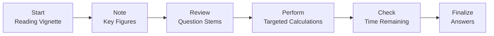
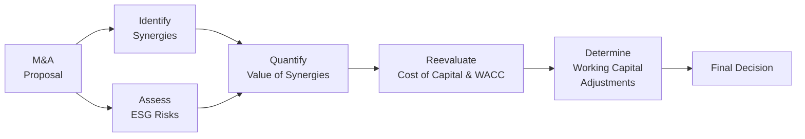

## Overview and Purpose

By now, you’ve explored nearly every nook and cranny of Corporate Issuers—from payout policies in Chapters 2 and 3 to the intricacies of multinational expansions in Chapter 21. This section helps tie everything together with multifaceted vignettes that replicate the complexity and scope of real CFA Level II item sets. Think of these final practice vignettes as your personal “dress rehearsals.” They’re there to expose blind spots, sharpen your problem-solving skills, and boost your confidence under timed exam conditions.

In the spirit of being slightly informal, let’s just say: sometimes, we get so wrapped up in theoretical material that we forget the exam is more about applying that knowledge in a structured, time-pressured environment. So we’re going to get practical—and maybe a little chatty—so you feel at ease tackling these vignettes on your own.

## Why Final Practice Vignettes Matter

You’ve studied capital structure decisions, share repurchases, ESG considerations, governance frameworks, M&A synergy estimates, and more. One of the biggest differences between breezing through readings and facing exam-day pressure is how you manage time, juggle multiple concepts, and interpret ambiguous details. These final practice vignettes illustrate how topics like dividends (Chapters 2–4), ESG analysis (Chapters 5–6), capital structure (Chapters 7–8), and corporate restructuring (Chapters 9–10) might collide in a single item set.

By practicing with realistic item sets, you’ll:

• Hone your time management (aim for about 18 minutes per vignette).  
• Recognize how a single detail (like changes in the dividend tax rate) can ripple across cost of capital, payout decisions, or synergy estimates.  
• Learn to spot and incorporate intangible elements, such as ESG-related risks or brand impact, which can be easy to overlook.  

## Structured Note-Taking and Review

One candidate I remember taught me something valuable about structure: instead of diving headfirst into calculations, he first summarized the scenario in bullet points. This approach anchored him each time he got stuck. Here’s a recommended system, which you can tweak to your liking:

• Summarize the overall scenario in a short paragraph.  
• Extract key facts: what industry are we dealing with, what’s the current capital structure, how does ESG factor in, what are the risk exposures, and so on.  
• List relevant formulas (like synergy valuations, cost of equity, or net present value for CAPEX decisions).  
• Perform your calculations step by step—don’t skip writing out the formula.  
• Conclude with your recommended action: is the share repurchase feasible, does the M&A target truly create synergy, is leverage too high for the company?  

Review your solutions right away, if possible. Identify exactly which concept from which chapter you tripped on. If synergy calculations reference Chapter 10, you can pull out those notes and compare your approach to the original method. This immediate feedback loop cements your learnings so you don’t repeat the same mistakes.

## Time-Management Essentials

Exam day has a way of slipping through your fingers if you’re not ruthless about pacing. You want to allocate around 18 minutes per item set, but that’s just a guideline. Some will take longer if they involve more calculations or require close reading of footnotes. A useful trick is to skim the question stems to see what the item set demands before reading every word of the vignette. That way, you know where to zoom in.

Here’s a quick visual representation of a structured approach to tackling an item set under time pressure:



When you see that you have devoted, say, 12 minutes and still have multiple sub-questions left, move more quickly or skip a tricky calculation to come back later. It’s better to get partial credit on multiple questions than to run out of time on entire sub-questions.

## Escalating Complexity in Vignettes

Below, you’ll find four comprehensive vignettes structured to escalate in complexity. Each includes nods to multiple topics:

### Comprehensive Vignette A: Capital Structure, Payout Policy, and ESG

Imagine a mid-sized technology enterprise, Zavalon Tech, that has historically financed itself with a moderate mix of 50% equity and 50% debt (Chapter 7 references for WACC). Recently, it introduced a quarterly dividend (Chapter 2). Now the CFO wants to explore a share repurchase (Chapter 3) while also adopting a formal ESG policy (Chapters 5–6). 

Key points might include:  
• New environmental standards in the industry—do they necessitate more capital?  
• Interest rates are on the rise, affecting cost of debt calculations (Chapter 7).  
• Proposed buyback is open market, with partial funds from issuing additional debt (Chapters 3 and 8).  
• The CFO wants to ascertain the effect on EPS, leverage, and any intangible ESG benefit for brand reputation.  

Sub-questions often test your ability to:  
• Compute new interest costs.  
• Estimate revised WACC.  
• Incorporate dividends vs. buyback trade-offs.  
• Discuss intangible brand benefits from ESG leadership.  

You might see something like:

(1) “Calculate the post-repurchase EPS,” referencing Chapter 3.  
(2) “Evaluate the effect on cost of equity when the firm’s debt-to-equity ratio changes,” referencing Chapter 7 or 8.  
(3) “Discuss how adopting an ESG policy could lower the firm’s perceived risk profile,” referencing Chapters 5–6.  

### Comprehensive Vignette B: M&A Synergy, Cost of Capital, and Working Capital

Rhapsody Manufacturing, a multinational auto-part supplier, plans to acquire a smaller competitor, EcoAuto (Chapters 9–10). This deal involves synergy calculations (cost synergies from shared overhead plus revenue synergies by cross-selling). The combined entity, post-merger, needs to reevaluate short-term financing to integrate working capital requirements (Chapters 13 and 21 references). 

Some details you might see:  
• Proposed synergy includes US$10 million in annual cost savings and US$5 million in added revenues (Chapter 10).  
• Ten-year timeline with a 10% discount rate.  
• Potential overrides for exchange rates because EcoAuto’s sales in Asia may face currency risk (Chapter 21).  
• Shifts in working capital management policies (Chapter 13).  

One sub-question could be: “Using the synergy horizon of 10 years, a discount rate of 10%, and ignoring terminal value synergies, what is the present value of these synergies?” A simple synergy formula to recall might be:


\text{Synergy Value} = \sum_{t=1}^{10}\frac{\Delta \text{Cash Flow}_t}{(1 + r)^t}


where ΔCash Flow includes cost and revenue synergies minus integration costs. Another sub-question might highlight intangible synergistic benefits like brand recognition or ESG alignment (Chapters 5–6) that can be harder to price but might reduce the firm’s cost of capital.

### Comprehensive Vignette C: Real Options, Corporate Governance, and Debt Covenants

Within advanced capital budgeting processes (Chapter 14), you’ll often see real options (for instance, the option to expand or abandon a project). Now toss in a dash of governance oversight (Chapter 20), and you might have a scenario where the Board is divided on whether to invest in a new product line that has uncertain payoffs but possible large future expansions.

Sprinkle in debt covenants (Chapter 15). A newly negotiated bond covenant might restrict the firm from exceeding certain leverage or coverage ratios. This can affect the real options approach because a higher debt level might hamper the firm’s flexibility to invest further down the line.

Expect sub-questions testing:  
• Calculation of an expansion option value using a simplified binomial approach.  
• Analysis of how strict governance fosters or inhibits risk-taking.  
• The interplay between interest coverage ratios, dividend restrictions, and new project financing.  

### Comprehensive Vignette D: Cross-Border M&A, ESG Risk, and Executive Compensation

Here, a large North American corporation acquires a foreign energy company in an emerging market (Chapters 21–22). The Board wants a robust executive compensation package that aligns management with global ESG standards (Chapters 5–6 and 19). The synergy might revolve around technology sharing and the consolidation of supply chains.

Potential sub-questions:  
• Estimate the synergy from combining distribution channels.  
• Adjust cost of capital for country risk (Chapter 8).  
• Consider how new executive incentive structures (stock options, performance-based restricted stock) affect immediate EPS and diluted ownership (Chapter 19).  
• Highlight the intangible ESG risk (e.g., local environmental regulation) in the target’s home country.  

## Immediate Feedback Loops and Post-Mortem Analysis

Seriously, don’t skip the step where you check solutions right after you finish each vignette. Here’s a classic trap that many candidates—myself included—have fallen into: we incorrectly sum up synergy benefits or misapply the discount rate, then forget all about it and repeat the same mistake a few days later. Keep a log of errors. If you discover you’ve messed up your weighting of cost of capital (say, incorrectly weighting the new debt issue), note down how and why. This “post-mortem” ensures that each error turns into a permanent learning opportunity.

## Keeping an Eye on Partial Credit

In item-set questions, partial credit can be tough. You either choose the best response or you don’t. But the intellectual process behind your calculation still matters. If you’re tackling the essay portion in other parts of the CFA Program or practicing for item sets that have multi-step calculations, remain meticulous. If you guess or skip steps, it becomes easy to lose the entire question. In your personal practice, hold a high standard: if you’re not thorough, mark it as wrong and revisit. That might sound strict, but it’s better to discover the oversight now rather than on exam day.

## A Quick Example of Synergy Calculation (Python)

If you’re comfortable scripting or just curious how synergy might look in a simple code snippet, check out this illustrative approach:

```python
import math

cost_synergy_annual = 10_000_000
revenue_synergy_annual = 5_000_000
discount_rate = 0.10
years = 10

annual_synergy = cost_synergy_annual + revenue_synergy_annual
present_value = 0
for t in range(1, years+1):
    present_value += annual_synergy / ((1 + discount_rate)**t)

print(f"Present Value of Synergies: ${present_value:,.2f}")
```

While Python isn’t allowed in the exam, you can replicate the logic in your calculator.

## Diagrams for Clarity

Here’s another quick flowchart to illustrate how synergy, cost of capital, ESG considerations, and working capital might interrelate during an M&A scenario:



Keep in mind that each node could feed back into earlier steps if your analysis uncovers new concerns or constraints.

## Study Groups and Discussion

Sometimes you’ll see complex assumptions (like synergy for 8 years vs. 10 years, or partial-year synergy) that can drastically change the answer. Studying with a friend can help you catch these details. One of you might interpret the synergy as starting immediately; the other might assume a one-year delay. Chatting through these variations helps ensure you’re better prepared for any curveballs.

## Reflecting on Weak Spots

Try to notice your patterns across multiple vignettes:

• Do you consistently forget to adjust the discount rate for country risk?  
• Are you mixing up the direction of the exchange rate in cross-border expansions?  
• Is EPS calculation your Achilles’ heel?  

When you figure out what you get wrong the most, practice those specific sections again (it’s handy that each sub-question references a prior chapter). Over time, you’ll see improvement and fewer guesswork moments.

## Final Encouragement

Look, we all know it can be nerve-wracking. But these final practice vignettes are crucial windshield time. As you go from simpler item sets—like quick cost of capital recalculations—to more intricate lumps of synergy, payout policy, and ESG overlays, you’ll see your confidence build. Remember: each time you do a formal post-mortem on your mistakes, you grow drastically. Embrace the process, keep your note-taking structured, and you’ll hit exam day with sharper instincts and calmer nerves.

## References for Further Study

• CFA Institute’s official “Mock Exams” for Level II, available through the CFA Learning Ecosystem.  
• AnalystForum (www.analystforum.com) for peer discussion on tricky synergy or cost of capital item sets.  
• Chapters 2, 3, 7–10, 13, 21 in this volume for deeper reference on any of the topics mentioned.  
• CFA Institute’s “Exam Day Tips,” especially around time management and strategically allocating your remaining minutes.  

## Test Your Mastery: Corporate Issuers Integration Quiz



### Each share repurchase question often involves…
- [ ] Directly increasing the total shares outstanding.
- [ ] Dampening the overall P/E multiple of the firm.
- [x] Reducing outstanding shares, thus potentially boosting EPS.
- [ ] Being more expensive than paying a dividend in every scenario.

> **Explanation:** A share repurchase reduces outstanding shares, which often increases EPS. Dividends and buybacks each have strategic trade-offs, but it’s not universally true that one is always cheaper or more expensive.

### From an ESG standpoint, a firm’s decision to adopt rigorous environmental standards might…
- [x] Lower the firm’s cost of equity in the long term by signaling reduced risk.
- [ ] Automatically reduce the weighted average cost of capital to zero.
- [ ] Have no bearing on investor perception or required returns.
- [ ] Violate IFRS guidelines.

> **Explanation:** ESG adoption can lower perceived overall risk and attract investors who demand lower risk premiums. It won’t magically make the cost of capital zero, nor is it an IFRS violation.

### When calculating synergy in an M&A context, a key step is often to…
- [ ] Add intangible synergies only if they exceed the risk-adjusted WACC.
- [x] Discount expected future incremental cash flows at an appropriate rate.
- [ ] Assume synergy is a constant growth perpetuity every time.
- [ ] Ignore integration costs.

> **Explanation:** Standard synergy analysis involves identifying incremental after-tax cash flows and discounting them at the firm’s cost of capital. Integrations costs aren’t ignored; they reduce net synergies.

### A post-mortem analysis of a wrong synergy estimate typically means…
- [ ] Immediately discarding synergy-based valuation models.
- [x] Reviewing each calculation step to identify errors, assumptions, or overlooked data.
- [ ] Ignoring intangible benefits entirely next time.
- [ ] Increasing the synergy assumptions to compensate for mistakes.

> **Explanation:** Post-mortem analysis is about deep introspection—figuring out mistakes in assumptions or arithmetic, not drastically changing or discarding the methodology.

### Introducing additional debt to fund a share buyback (while leaving equity constant) generally…
- [x] Changes the firm’s leverage and potentially affects WACC.
- [ ] Lowers the firm’s leverage ratio.
- [x] May increase the firm’s cost of equity due to higher risk.
- [ ] Has no effect on debt covenants.

> **Explanation:** Debt financing changes the capital structure, usually increasing financial risk and potentially the cost of equity. Debt covenants might also be affected if leverage thresholds are crossed.

### Evaluating an acquisition target in an emerging market often requires…
- [x] Adding a country risk premium to the cost of equity.
- [ ] Decreasing the discount rate to offset local currency fluctuations.
- [ ] Ignoring currency hedging strategies.
- [ ] Eroding intangible synergy benefits.

> **Explanation:** In emerging markets, country risk adjustments are typically added to the discount rate or risk premium. Currency hedging might also be relevant; intangible synergies aren’t necessarily eroded just because the deal is cross-border.

### Real options analysis in capital budgeting may involve…
- [x] Evaluating the flexibility to abandon or expand a project at a future date.
- [ ] Assuming project cash flows remain constant no matter the market conditions.
- [x] Considering the possibility of deferring a project if market signals are unfavorable.
- [ ] Ignoring the time value of money for expansions.

> **Explanation:** Real options analysis provides a framework for measuring the value of managerial flexibility under uncertainty, including options to expand, delay, or abandon a project.

### Multi-year synergy projections should…
- [x] Be discounted back to present value for each year.
- [ ] Assume identical synergy each year without adjustments for growth or attrition.
- [ ] Exclude general overhead savings.
- [ ] Eliminate intangible brand synergy from the model.

> **Explanation:** Synergy calculations follow the usual discounted cash flow approach. Overhead savings are typically part of cost synergy. Even intangible brand synergy can be estimated or at least disclosed.

### When dealing with cross-functional ESG and governance issues in a merger…
- [x] A Board oversight committee might be formed to ensure compliance and ethical standards.
- [ ] The synergy analysis is disconnected from ESG considerations.
- [ ] The cost of capital is unaffected by corporate governance issues.
- [ ] The merger is automatically disallowed under IFRS guidelines.

> **Explanation:** Good governance and ESG oversight often involve specialized committees to manage compliance and stakeholder interests. Governance can influence risk and thus cost of capital.

### Considering intangible ESG factors in a financial model is primarily…
- [x] A forward-looking approach to capturing potential risk reductions or brand value gains.
- [ ] Prohibited by standard discounted cash flow practice.
- [ ] Random guesswork that typically lowers net present value.
- [ ] A non-financial approach that is irrelevant to capital budgeting.

> **Explanation:** ESG factors can affect both risk profiles and revenue potential. They should be integrated in forward-looking models to present a more complete picture of corporate opportunities and threats.


