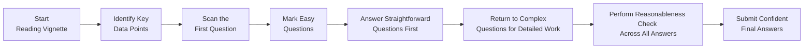

## Maintaining a Positive Mindset

Before we get into the nitty-gritty of strategies and triage methods, let’s start with the most important aspect: your mindset. Honestly, if you walk into the exam room feeling like you’ve already lost, you’re just making it so much harder on yourself. Many of us—myself included—have at some point stared down a daunting CFA vignette convinced it was written in another language. You know that panicky feeling? Where your pulse races, and you're tempted to skip everything and just guess?

That’s why, at least a few weeks before the exam, it pays to start establishing healthy habits and building mental resilience. Do your best to get real sleep (yes, actual eight hours, if possible) instead of pulling late-night study marathons with energy drinks. Take occasional breaks to regroup, and engage in quick mindfulness exercises, such as simple deep-breathing or a brief walk outdoors. Trust me, exam success often hinges as much on your state of mind as it does on your knowledge of cost of capital or synergy valuation.

## Triage with Confidence

You may have heard the term “triage method” in these materials. Triage means do not let the complicated item sets hold you hostage while precious minutes slip away. When you sit down to a Corporate Issuers vignette—from a big synergy-laden M&A scenario (Chapters 9 and 10) to analyzing dividend policies (Chapters 2 and 3)—you should:

• Scan the first question quickly.  
• Identify which data or detail the question really wants.  
• Move swiftly through the entire item set, picking off the straightforward questions first.  

This approach is essential because you can lock in quick wins. Nothing chills you out better than nailing a question or two right away, especially if they’re freebies like a standard formula calculation or an easy conceptual question. Later, you can return to the complex tasks involving fancy synergy valuations or partial spinoff analyses.  

### A Quick Triage Visualization

Take a moment to internalize that flow. Notice how you loop back to more challenging pieces only after locking in the easy ones.

## Time Management + Personal Pacing

We typically estimate about 1½ to 2 minutes per question. That’s a rule of thumb, so it’s okay if you take longer for a question that’s worth more points or that hits a crucial concept—like cost of capital computations from Chapters 7 and 8. 

I once got stuck on a leveraged buyout question for over 10 minutes because I was so determined to get the precise post-deal debt ratio down to the decimal. Terrible move. By the time I finished, I had barely any room left to tackle the rest, and I felt the stress piling on. So yeah, if you find yourself going down a rabbit hole, punching your calculator repeatedly without new insights, pause, guess logically if needed, and come back later. You’ll gain more by maintaining a balanced pace throughout the entire exam.

## Handling Surprises

Let’s be real: the exam can throw surprises at you. Maybe you’ll see a brand-new style of synergy question tying in complicated intangible assets or some governance twist you haven’t studied in depth (perhaps referencing the ESG chapters—5 and 6). Just remember, every question is still grounded in the official curriculum objectives. If you see something unusual, resist the urge to panic. Focus on what you do know: corporate finance logic, the cost of capital frameworks, common sense synergy checks, or the standard capital budgeting formulas from Chapter 14.  

In short, calmly dissect the question, see if the vignette clarifies unusual assumptions, and keep going. Don’t let unexpected details sabotage your entire strategy. Sometimes the exam is just testing your ability to remain centered and think critically under pressure.

## Embracing Partial Knowledge

In the CFA exam, there’s no penalty for guessing. If a question stumps you, or if you’re missing a piece of data, use partial knowledge. Eliminate any nonsense answers. For instance, if you’re calculating the impact of a share repurchase (Chapter 3) and see an obviously incorrect ratio or an EPS that doesn’t even come close to typical results, toss it out. By the time you’ve narrowed it down to two plausible choices, pick the better fit and move on.  

Professionally, we often make decisions with incomplete data—financial analysts rarely get the perfect numbers. So, think of partial knowledge not as a weakness but as a well-honed survival skill.

## Cross-Verification and Reasonableness Checks

Even after you solve a question, try to do a quick “sanity check” to confirm your result is in the ballpark. For instance, if you’re dealing with an M&A synergy question from Chapter 10 and your synergy estimate is larger than the entire market cap of the target company, that’s probably a red flag. Similarly, if your WACC from Chapter 7 ends up negative or unbelievably high (like 30%), something might be off unless the vignette states extremely unusual capital structure conditions. 

This method of verifying reasonableness also applies to smaller conceptual details—like do the new financial ratios after a share repurchase reflect a typical directional move? If you see something that stands out as bizarre, revisit your calculations or assumptions.

## The “Exam Day Toolkit”

Consider preparing and mentally rehearsing a personal toolkit—a series of practical resources you’ll rely on during the exam. This might include:

• A bullet list of the most common formulas you might need from the cost of equity (CAPM) to synergy valuations.  
• Time allocation rules (e.g., 1½ minutes per question, but being ready to cut losses if a question bogs you down).  
• A mental or written “stress checklist”—inhale, exhale, remind yourself that partial points are better than none, and move on.  
• Essentials to keep physically with you: your calculator, extra batteries, writing utensils, and an ID that doesn’t expire at 11:59 p.m. on exam day. (I’ve seen that happen—trust me—it’s no fun.)

## Consistency: The Key to Confidence

You also want to ensure consistent methodology. If you’re discounting cash flows, do you consistently use the same approach to compute WACC or cost of equity? Or do you jump from CAPM to a historical average premium without reason? In the real world, you might mix it up, but in the exam, stick to standard formulas that the curriculum endorses, so you don’t confuse yourself. For instance, if you used the expanded CAPM (Chapter 7) for a private company, be consistent about applying the additional risk premiums. If your synergy question is based on cost savings, don’t suddenly switch to a revenue synergy approach unless the vignette specifically instructs you.

We all know how easy it is to overcomplicate. Keep it as straightforward as possible, consistent from one question to the next, and you’ll be fine.

## Putting It All Together: Mastery Perspective

At Level II, the exam is about depth and integration. Corporate finance ties everything together—capital budgeting (Chapter 14) merges with capital structure (Chapter 7), which might connect to share buybacks (Chapter 3) or ESG decisions (Chapters 5 and 6). By Chapter 24, you’ve seen how it all fits. The final “mastery perspective” is your ability to see those cross-topic connections: if a question references a planned acquisition financed by new debt, you should mentally connect how that might alter the firm’s cost of capital, future dividend possibilities, or governance constraints.

Essentially, if you feel confident pivoting among these concepts—recognizing their interplay, applying your well-honed triage to get the easy points, cross-checking your synergy or ratio calculations, and finishing with realistic final answers—you’re golden. Even if you, well, guess on some tough ones, you’ll likely do better than you think.

## References & Further Reading

• “The Mental Game of Testing” by John Resig (for tips on psychological preparation).  
• Official CFA Institute resources on exam day best practices (including the candidate prep portal).  
• “Peak Performance” by Brad Stulberg and Steve Magness (research-based methods to maintain mental sharpness and reduce burnout).  

## Exam Mindset and Strategy – Test Your Knowledge



### In which stage of your exam approach should you answer the simplest questions first, leaving complex ones for later?

- [ ] Immediately after reading the entire vignette.  
- [x] During the initial triage stage.  
- [ ] Only in the final review stage after completing all item sets.  
- [ ] Never; you should spend equal time on each question.  

> **Explanation:** The “triage” method is about quickly securing easy wins and saving more complex or data-heavy questions for a second pass.

### What is a key advantage of partial knowledge when answering exam questions?

- [ ] It guarantees a 100% success rate.  
- [ ] It prevents you from having to guess.  
- [x] It improves odds by eliminating clearly incorrect choices.  
- [ ] It only applies to quantitative questions.  

> **Explanation:** When you aren’t sure of the correct answer, partial knowledge helps remove unlikely choices, which increases your probability of picking the correct one.

### Which of the following is the most important reasonableness check when evaluating synergy valuations?

- [ ] Ensuring synergy is always more than 50% of the target’s market capitalization.  
- [x] Confirming that synergy figures are plausible relative to the size and market of the target.  
- [ ] Making sure synergy is expressed in nominal terms only.  
- [ ] Disregarding synergy entirely if it exceeds the acquirer’s cost of capital.  

> **Explanation:** A synergy figure that exceeds the total market value of the target or is unreasonably large relative to the size of the companies may signal calculation errors.

### If you find yourself spending too long on one question, which strategy is recommended?

- [ ] Keep working until you get a definitive answer.  
- [x] Make an educated guess and move on, returning later if time permits.  
- [ ] Skip all questions related to that topic.  
- [ ] Abandon the entire vignette.  

> **Explanation:** It’s best to maintain overall momentum. Guess logically, mark the question for review, and come back if time allows.

### Why might an M&A question include extra paragraphs toward the end that contradict earlier data?

- [ ] It’s an error on the exam.  
- [x] To test adaptability and confirm candidates read the entire vignette carefully.  
- [ ] To ensure no candidate can answer correctly.  
- [ ] To gauge partial knowledge.  

> **Explanation:** Some item sets provide updated or contradictory details late in the vignette to see if candidates adjust calculations accordingly.

### In the context of the CFA exam, which approach to time allocation is most accurate?

- [x] Allocate roughly 1½ to 2 minutes per question and adjust if needed.  
- [ ] Spend as much time as possible on each question.  
- [ ] Never look at a clock during the exam.  
- [ ] Attempt all easy and hard questions equally.  

> **Explanation:** The common guideline is 1½ to 2 minutes per multiple-choice question, adjusting per personal pacing and question difficulty.

### When a question references an unusually low or high WACC, what should you do first?

- [x] Double-check the assumptions for any missing or inconsistent data.  
- [ ] Accept it without question and move on.  
- [ ] Immediately change the WACC to 10%.  
- [ ] Disregard cost of capital in synergy calculations.  

> **Explanation:** A WACC that is abnormally high or low suggests re-checking your inputs for potential errors or unusual exam conditions.

### Which study habit best supports a positive mindset going into exam day?

- [ ] Pulling an all-nighter before exam day.  
- [x] Spacing out study sessions and prioritizing enough rest.  
- [ ] Exclusively focusing on practice exams, ignoring weak areas.  
- [ ] Discarding all your notes 48 hours before the exam.  

> **Explanation:** Consistent, well-paced study and adequate rest are critical to maintaining calm and preparedness under test conditions.

### What helps minimize stress when you encounter unfamiliar terms in a vignette?

- [x] Use context and your existing knowledge to reason through the question.  
- [ ] Immediately give up on that item set.  
- [ ] Complain to the proctors.  
- [ ] Avoid reading the entire vignette.  

> **Explanation:** The best approach is to focus on what you do know—corporate issuers principles—and glean clues from context to address the question logically.

### True or False: There is a penalty for guessing on CFA exam multiple-choice questions.

- [x] True  
- [ ] False  

> **Explanation:** Actually, this statement is reversed. There is no penalty for guessing. Every question guessed still offers a chance of being correct.


