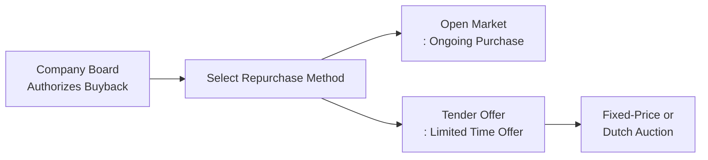

## Overview and Rationale

Picture this: You’re an executive in a publicly traded company. You see your firm’s stock trending sideways and you feel it’s undervalued. You've got surplus cash. A next-step alternative to just paying that out as dividends is: buy your own shares back. But why repurchase shares rather than dish out bigger dividends? This conversation gets interesting because share repurchases can achieve multiple goals—boosting earnings per share (EPS), adjusting capital structure, or sending a market signal that “Hey, we think our stock is worth more than the market price.” So, in short, share repurchases (or “buybacks”) are another tool in the firm’s payout policy arsenal, complementing or occasionally replacing dividends altogether.

Below, we’ll cover two primary repurchase strategies: open market repurchases and tender offers. We’ll do a pit stop at variations like fixed-price versus Dutch-auction tender offers. Then we’ll peek at additional repurchase methods, from private or negotiated repurchases to block trades with large shareholders. We’ll also talk about potential pitfalls and some ethical considerations. Grab a coffee, because there’s a lot to digest.

## Why Companies Buy Back Shares

Before diving into the mechanics, it helps to understand the “why.” Here are some big reasons companies go for repurchases:

• Adjusting Capital Structure: Companies may want to optimize their debt-to-equity ratio. By buying back shares, they reduce equity without increasing debt, potentially lowering their average cost of capital.

• Signaling Undervaluation: Management might feel the stock price is too low. Buying shares often signals confidence—like corporate leadership “puts money where their mouth is.”

• Distributing Excess Cash: Similar to dividends, a buyback channels surplus funds to shareholders. However, it can be more tax-efficient for some shareholders—depending on local tax regimes—than receiving dividends.

• Boosting EPS: Reducing shares outstanding can boost reported earnings per share. If you suspect certain short-term investors focus heavily on EPS, you might see a short-term price bump.

• Flexibility and Control: A share repurchase program can be ramped up or paused depending on market conditions and internal cash flows—dividends, by contrast, are often viewed as long-term commitments that shareholders expect will not be reduced.

## Open Market Repurchases

Open market repurchases are the “workhorse” method of share buybacks. Companies go out into the exchange (like the NYSE) and buy their own shares at the prevailing market price.

### How It Works

The board of directors authorizes an amount—say, “We will spend up to $1 billion across 24 months.” That’s not a legally binding promise; it’s more of an upper limit. Then, under safe harbor rules (in the U.S., SEC Rule 10b-18), the company quietly purchases shares at or below certain volume thresholds to avoid spooking the market. No big splashy statements each time. They can keep these transactions discreet, and they typically have the flexibility to stop or continue at will.

### Advantages

• Flexibility: Management can adjust the pace of buybacks depending on changes in market price or shifts in operating conditions.  
• Discretion: You don’t have to announce daily trades. For instance, if the price suddenly spikes, you might hold off. Or if it dips, you can buy more aggressively.  
• Cost-Effectiveness: Usually no premium is required. You just buy at market rates, maybe with modest brokerage fees.

### Disadvantages

• Uncertain Impact on Share Price: Because of daily price fluctuations, you might pay more or less than an expected average.  
• Speed Constraints: Regulations and best practices usually cap the volume of shares that can be repurchased in a single day.  
• Less Immediate Signal: Though an announcement might have a short-term effect, open market repurchases generally create smaller waves than tender offers, which are more overt “We want your shares” statements.

## Tender Offers

Compared to open market repurchases, tender offers are more direct and time-limited. The company announces a plan to buy a specific number of shares at a set price (or range of prices) within a defined window. Shareholders who want to accept the offer tender their shares back to the firm.

### Fixed-Price Tender Offer

This is the more traditional approach. Management states a single price—often at a premium to the current market price—and invites shareholders to sell. If shareholders collectively offer up more shares than the company wants, the company accepts a portion of each shareholder’s tender (prorates them). If fewer shares are tendered, the company might extend the offer or proceed to buy only the tendered amount.

• Signaling Effect: The company is willing to pay a premium, broadcasting confidence in the firm’s value.  
• Certainty in Price: Shareholders know exactly what they’ll get.

### Dutch-Auction Tender Offer

Sometimes called a “modified Dutch auction,” the company proposes a price range—let’s say $45 to $50—and invites shareholders to specify the price within that range they’d be willing to accept. After all submissions, the company chooses the lowest price that allows them to repurchase the desired quantity. Shareholders who tendered at or below that “clearing price” get that amount.

• Efficiency: The market effectively sets the price. It can be less arbitrary than a single premium.  
• Encourages Participation: Shareholders who want a quick sale might tender at the lower end, while those seeking a higher payoff can aim at the top.  
• Price Discovery: Offers insights into shareholder sentiment about the firm’s valuation.

### Potential Pros and Cons of Tender Offers

• High-Impact Signal: Compared to open market repurchases, tender offers can cause sharper, more immediate price reactions—everyone sees a big premium.  
• Shareholder Choice: Investors can opt in or ignore the offer. Some prefer to hold long-term.  
• Costly Premium: Companies have to pay more than market price. In a Dutch auction, the final clearing price could be quite high.  
• Visibility: Tenders attract public attention, which can be good or bad depending on how the market perceives management’s motives.

## Additional Methods: Private/Negotiated Repurchases

Now and then, companies want to buy back shares from a specific stakeholder (like a venture capital fund that wants to exit). These private or negotiated repurchases are more specialized. A direct negotiation sets the price. This can be cheaper or more efficient than a broad tender offer, especially if you want to remove a large block of shares from an activist investor or a significant stakeholder who complicates your governance structure.

• Pros: Possibly quick and discreet. Helps in removing undesirable major shareholders.  
• Cons: Risk of perceived favoritism—what if other shareholders wanted to sell at that price? Also, may spark legal or fairness concerns.

## Tracking Repurchase Activity and Financial Statement Disclosures

Share repurchases typically show up in the shareholders’ equity section of the balance sheet as “treasury stock” (under U.S. GAAP). In IFRS-based statements, it may be reflected similarly as a deduction from equity. Also, companies must disclose repurchase programs, typically in press releases and quarterly or annual filings (like the 10-Q and 10-K in the U.S.). You might see lines reading:  
• “Shares repurchased during the year”: The actual number of shares and the average price paid.  
• “Remaining authorized amounts”: How much is left in the board-approved plan.

From an analyst standpoint, you’ll want to keep an eye on these disclosures to see how aggressively management is buying, whether they reached the repurchase limit, or if they’re going at a snail’s pace. Some companies announce big, flashy buyback plans but never follow through—something to watch out for.

## Market Impact and Signaling

Repurchase announcements can cause a short-term price pop—though it’s rarely as large as a dividend initiation might cause (because dividends are viewed as more permanent). The perceived undervaluation message can reassure investors. If management invests heavily in buybacks but the market remains unimpressed, that can be a red flag too—maybe the fundamentals are weaker than we thought.

Consider the liquidity angle: By removing shares from the market, a buyback can reduce the float. This might amplify price volatility if a large portion of shares disappears from the tradable pool. Good news if you’re hoping for higher valuations, but it can cut both ways.

## Potential Pitfalls and Ethical Considerations

Let’s address the “dark side” for a moment:

• Earnings Management: Some executives might use buybacks chiefly to juice EPS or help meet compensation targets (like performance bonuses tied to EPS). This can blur the line between legitimate shareholder returns and short-term metric manipulation.

• Overpaying: If management misjudges intrinsic value, they might repurchase shares at inflated prices—effectively destroying shareholder value.

• Regulatory Scrutiny: Governments often set rules or safe harbors limiting how aggressively companies can buy back shares in a single day. Violations lead to legal penalties and reputational damage.

• Signal Mismatch: The firm might attempt to signal strength, but if the broader fundamentals are weak, the short-term pop in price might be short-lived or overshadowed by negative fundamentals.

## Timeline and Pricing Considerations

In open market repurchases, the timeline might span months or even years, with the company pacing itself in response to market conditions. Meanwhile, tender offers have a set end date (maybe 20 business days). If the goal is a large, immediate redemption of shares, a tender offer fits better. If you want flexibility—like, “We’ll buy some shares when we see the market dip”—open market works nicely.

Open market programs typically outline a maximum buyback each day, guided by volume or safe harbor constraints. In the U.S., for instance, daily purchases can’t exceed a certain percentage of average daily trading volume. This ensures the firm doesn’t unfairly manipulate the stock price.

## Best Practices

• Align with Long-Term Strategy: Repurchases should reflect real fundamental value, not a short-term fix.  
• Communicate Clearly: Let investors know the rationale—be it capital structure goals, undervaluation, or returning excess cash.  
• Avoid Overpaying: Conduct thorough valuation analysis first, or you risk burning capital.  
• Monitor Equity-Based Compensation: Repurchases can offset potential dilution from stock-option exercises, but watch out for the appearance of manipulation.

## Personal Reflection

I still recall chatting with a CFO friend at a midsize tech firm who joked, “We keep announcing buybacks, but the board never fully commits the funds.” Investors were excited each time, but months later, the repurchase volume was minuscule. The moral? Some announcements are mostly to pacify certain shareholder groups, so be sure to check the actual follow-through in quarterly statements. As a Level II candidate, keep these real-life nuances in mind—especially for item-set or vignette questions focusing on corporate finance. They love testing your ability to interpret management motives and the real impact of these programs.

## References and Further Reading

• CFA Institute Level II Program Curriculum (Corporate Issuers readings).  
• Damodaran, A. (n.d.). “Share Buybacks: The Good, The Bad and The Ugly.” http://pages.stern.nyu.edu/~adamodar/  
• SEC Rule 10b-18 Guidelines (U.S.): https://www.sec.gov/rules/final/33-8335.htm  

----------------------

## Test Your Knowledge: Share Repurchase Methods Quiz



### A company that wishes to quickly reduce its share count at a known premium to the current market would likely use which repurchase method?

- [ ] Open market repurchase
- [x] Fixed-price tender offer
- [ ] Negotiated private purchase
- [ ] Stock dividend

> **Explanation:** A fixed-price tender offer is the most direct route for a company seeking a large, rapid share reduction at a stated premium to market.

### In an open market repurchase, management has the added advantage of:

- [x] Executing buybacks at its own discretion without a binding obligation.
- [ ] Making daily disclosures on share volume purchased.
- [ ] Paying a required premium over market price.
- [ ] Avoiding all regulatory oversight.

> **Explanation:** Open market repurchases let management buy shares at market prices when they choose, subject to maximum daily volume constraints under safe harbor provisions.

### Which of the following is true regarding a Dutch-auction tender offer?

- [ ] The company sets one fixed price that all shareholders receive.
- [ ] It is always more expensive than a fixed-price tender offer.
- [x] Shareholders specify acceptable prices, and the company selects a clearing price.
- [ ] It avoids the possibility of prorating acceptances.

> **Explanation:** In a Dutch-auction tender offer, shareholders submit bids displaying the number of shares and the prices they’re willing to accept. The firm finds the lowest price that allows repurchase of the desired share quantity.

### One potential ethical risk of share repurchases is:

- [x] Management using buybacks solely to inflate EPS-based compensation metrics.
- [ ] Regulatory bodies mandating daily public auctions for repurchases.
- [ ] Dividend distribution being outlawed as a result.
- [ ] Announcing a share repurchase automatically lowering the stock price.

> **Explanation:** A common criticism is that managers attempt to meet EPS targets (and earn bonuses) by reducing the share count, sometimes at the expense of long-term shareholder value.

### Which of the following best describes a private/negotiated repurchase?

- [x] The company repurchases shares directly from a single large shareholder.
- [ ] The company lets all shareholders submit bids at different prices.
- [ ] The company pays a uniform, publicly announced premium for shares.
- [ ] The company uses safe harbor provisions for secret daily transactions.

> **Explanation:** A private or negotiated repurchase is a direct transaction with a particular stakeholder, usually outside the open market.

### A major advantage of announcing a tender offer is:

- [x] Strong immediate signaling effect to the market of potential undervaluation.
- [ ] The ability to buy shares unnoticed by the public.
- [ ] Zero requirement for board authorization.
- [ ] Guaranteed increase in the debt ratio.

> **Explanation:** Because tender offers are explicit and often come with a premium, they send a powerful signal that management believes the company is undervalued.

### If a company announces a sizable buyback but ultimately purchases very few shares, it could indicate:

- [x] Management was attempting to placate shareholders with minimal actual cost.
- [ ] The tender offer mechanism was used improperly.
- [x] The firm’s valuation or fundamentals changed mid-program.
- [ ] A guaranteed breach of securities law.

> **Explanation:** Sometimes firms announce large repurchase authorizations to create favorable impressions but do not follow through, possibly due to market price changes or changing strategic priorities.

### Which statement is most accurate regarding daily repurchase constraints?

- [x] Safe harbor provisions typically limit how many shares can be repurchased daily.
- [ ] Companies can buy unlimited shares each day and still claim safe harbor.
- [ ] Daily repurchase constraints only apply to private/niche markets.
- [ ] Regulators do not impose daily constraints if the company has adequate cash.

> **Explanation:** Regulatory bodies—like the SEC in the U.S.—often have specific guidelines for maximum daily repurchase volume.

### A Dutch-auction tender offer may be attractive to shareholders who:

- [x] Wish to influence the sale price by selecting a more favorable price level.
- [ ] Seek the guaranteed highest premium without any bidding.
- [ ] Want to avoid competition with other shareholders.
- [ ] Are mandated by regulators to sell shares.

> **Explanation:** With a Dutch auction, shareholders can name their price, hoping it will be accepted if it’s within the clearing price range.

### A key difference between a dividend payout and a share repurchase is that repurchases:

- [x] Reduce the number of shares outstanding and can boost EPS.
- [ ] Are almost always treated more favorably by tax authorities in all jurisdictions.
- [ ] Never require board approval.
- [ ] Are an irreversible commitment that must be sustained for years.

> **Explanation:** Share repurchases shrink share count, which often increases EPS. Dividends don’t reduce shares outstanding.


