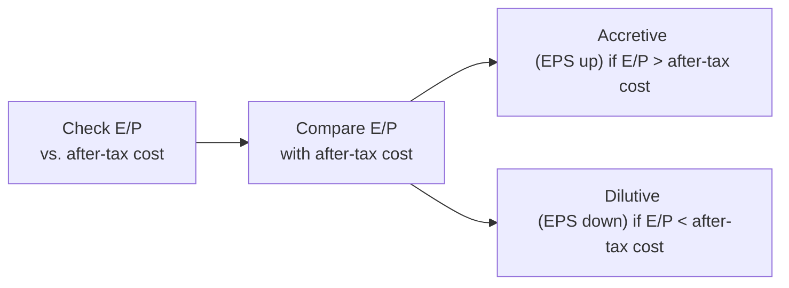

## Introduction and Core Concepts

Share repurchases can have an immediate and sometimes dramatic impact on a company’s financial metrics. You know how it goes: one moment you have this big chunk of equity on the balance sheet and a certain number of shares outstanding, and the next minute you’ve used corporate cash (or new debt) to buy back shares, leaving fewer shares in circulation. And that can really shift things like EPS, book value per share (BVPS), and those all-important financial ratios. So let’s dig in.

In this section, we’ll dissect how and why a share buyback affects:
• Earnings per share (EPS)  
• Book value per share  
• Common financial ratios such as ROE, P/E, and Debt/Equity  

We’ll also examine partial-year effects, future cash flow constraints, how to recast historical statements, and potential manipulation concerns. By the end, you’ll be able to spot whether a buyback is accretive or dilutive and connect the dots on the deeper issues this type of transaction can create.

## Immediate Effect on EPS

It might be obvious at first glance: repurchasing shares can raise EPS if net income remains the same (or doesn’t drop much). Since there are fewer shares outstanding, the denominator in the EPS calculation shrinks, and EPS may well go up (assuming net income stays roughly constant).

But it’s not always that straightforward. Why? Because sometimes the company borrows money to repurchase shares, which adds interest expense. That interest expense reduces net income—especially after tax. Or, a company might use cash that was generating interest income, so there’s an opportunity cost. So the top line (net income) might decline, just as the share count declines; the net effect on EPS can be positive, negative, or negligible.

### The Earnings Yield vs. After-Tax Cost of Funds

A simple way to know if the repurchase is “accretive” or “dilutive” is to compare the stock’s earnings yield (E/P) to the after-tax cost of the capital used to fund the buyback. Let’s keep it real: that’s basically saying, if the company’s expected return on the cash used to buy back shares is higher than the cost of using that cash (including any tax benefits or interest expense), then the buyback likely increases EPS.

Below is a quick flowchart to visualize the concept:

• Accretive Buyback: Occurs if the E/P (earnings per share / share price) is greater than the after-tax cost of funds. EPS typically rises because the company in effect “earns more” on an after-tax basis than it is paying to retire shares.  

• Dilutive Buyback: Occurs if the E/P is lower than the after-tax cost of funds. EPS tends to fall because the capital used for the buyback costs more than the earnings “provided” by the repurchased shares.  

#### Example: Quick EPS Calculation

Consider a company called MapleTech. MapleTech has:  
• Net income: $100 million  
• Shares outstanding: 50 million  
• EPS: $2.00  

MapleTech plans to repurchase 5 million shares at $30 per share, for a total of $150 million. Suppose they use $100 million of excess cash on hand and finance the remaining $50 million with debt at 4% interest, and that their marginal tax rate is 25%.

1. Interest on new debt = $50 million × 4% = $2 million.  
2. After-tax interest expense = $2 million × (1 – 0.25) = $1.5 million.  
3. New net income = $100 million – $1.5 million = $98.5 million (because the existing cash presumably earned negligible returns or we just ignore it for simplicity).  
4. New shares outstanding = 45 million (50 million – 5 million repurchased).  
5. New EPS = $98.5 million ÷ 45 million = $2.19.  

EPS rises from $2.00 to $2.19. The buyback is accretive in this example.  

## Impact on Book Value per Share

In addition to EPS, share repurchases often shift the firm’s book value per share. Book value is the difference between a company’s total assets and total liabilities. Dividing that net figure by the total number of outstanding shares gives BVPS. 

### Key Insight

When a company repurchases shares above its BVPS, the buyback will (usually) reduce the firm’s overall book value per share. Conversely, if it repurchases shares below its BVPS, it can bump BVPS higher. 

To see how this works, think about “buying someone out” of their proportion of net assets:
• If share price > BVPS → The company effectively “pays” more than the book value that portion of equity represents. So total book value shrinks more than the reduction in share count. BVPS goes down.  
• If share price < BVPS → The company “buys” each share for less than the chunk of net assets that share would represent, pushing up the BVPS for the remaining shareholders.  

#### Example: Continuing MapleTech

Before repurchase, MapleTech’s total equity is $400 million. Book value per share is $400 million ÷ 50 million = $8.00. They repurchased shares at $30, which is way above $8. So you can guess that BVPS will likely drop.

After the repurchase, the equity portion is reduced by the cash portion used to repurchase shares. Let’s assume MapleTech used $100 million of its equity to repurchase shares (the rest came from debt, which doesn’t directly reduce equity). So new equity is $400 million – $100 million = $300 million. The new share count is 45 million.  

New BVPS = $300 million ÷ 45 million = $6.67, a drop from $8.00.  

In short, the company paid a premium over its existing book value. That premium effectively reduced the value of equity on a per-share basis.  

## Shifts in Key Financial Ratios

Share buybacks can alter common financial ratios. Sometimes these changes are beneficial from a performance or investor-perception standpoint; other times they might raise eyebrows.

### Return on Equity (ROE)

Return on equity = Net income / Shareholders’ equity. After a buyback, shareholders’ equity generally decreases (particularly if the repurchase is funded with retained earnings). Meanwhile, if net income remains stable or only slightly declines (due to added interest expense), the smaller equity base can inflate the ROE.

This “boost” might look like improved profitability, but be aware: it could be mostly due to the firm reducing its equity base, not an actual improvement in operating performance.

### Leverage Ratios (Debt/Equity)

If the company uses debt to repurchase shares, that obviously increases total debt while lowering equity. So the Debt/Equity ratio can jump, indicating higher financial risk. A firm that was historically conservative might suddenly appear more leveraged, leading to changed perceptions from lenders or credit rating agencies.  

For MapleTech, if they had $200 million in existing debt before the buyback, their old Debt/Equity ratio was $200 million ÷ $400 million = 0.50. After adding $50 million in new debt and reducing equity to $300 million, Debt/Equity becomes $250 million ÷ $300 million = about 0.83—a decent jump in leverage.

### Price/Earnings (P/E) Ratio

With fewer shares, the market might reevaluate the company’s P/E. Because P/E = Price per share / EPS, rising EPS can cause a drop in P/E if the share price lags behind the EPS increase. This might make the company appear “cheaper” from a multiple standpoint—but only if the market doesn’t immediately reprice the stock.

### Potential Distortions

• A newly leveraged company could see heightened volatility in net income, which distorts year-over-year comparisons.  
• If the P/E ratio changes significantly, investors might misinterpret the reason behind the shift.  

## Partial-Year Effects and Normalizing Earnings

A more nuanced part of buyback analysis is partial-year accounting. For instance, if MapleTech executed the share repurchase in June rather than at the start of the fiscal year, you might have to weight the share count accordingly for EPS.  

In real life, most analyses “normalize” or “annualize” the effect:  
• Weighted-average shares outstanding over the period is used.  
• The portion of time the shares are out of circulation is accounted for in calculating basic or diluted EPS.  

This can get tricky quickly, so be sure to carefully read footnotes in financial statements! Some companies might do big repurchases at mid-year and possibly show a nice pop in EPS, but that pop might be overstated if you don’t factor in that the shares were outstanding for half the period.

## Considering Future Cash Flow Constraints

Share buybacks can tie up (or deplete) precious cash. If the buyback is financed with debt, the company now has to make higher interest payments from future cash flows. That could impede growth investments, hamper R&D, or reduce the ability to weather economic downturns.  

In practice, you should look at:  
• The firm’s operating cash flow stability.  
• Upcoming debt maturities or capital expenditure requirements.  
• Dividend policy (if the company also pays dividends, it has to keep paying those—even if times get tough).  

If a firm dedicates a huge chunk of its free cash flow to repurchases, it might be setting itself up for a liquidity crunch later. So you gotta ask: is this a sustainable distribution of capital or just a temporary booster shot?

## Recasting Historical Financial Statements

Sometimes, analysts will “recast” or restate past financial statements “as if” the share buyback had happened at an earlier date or a different share price. This helps them compare year-over-year performance on a consistent basis.

For example, if MapleTech does a buyback in mid-2025, you might want to see what 2024 would have looked like if that buyback had already taken place. You’d adjust shares outstanding, equity, interest expenses (if financed with debt), and any foregone interest income (if financed with cash).  

The steps to recast typically include:
1. Removing the shares bought back from the outstanding count.  
2. Subtracting the repurchase cost from cash (and from retained earnings if existing cash is used).  
3. Adding the incremental debt and the related interest expense if it’s a debt-funded repurchase.  
4. Revising EPS, ROE, and leverage ratios, etc., with the new share count and new net income.  

A thorough recast ensures you’re comparing apples to apples, especially if the buyback is large enough to change the company’s fundamental capital structure.

## Potential for Management Manipulation

Hate to say it, but share repurchases can provide management with an opportunity to juice up EPS-based compensation targets. If the CEO’s bonus or stock options plan hinges on hitting certain EPS thresholds, one sneaky way to get there is to reduce the denominator by buying back shares.  

It’s not always nefarious—sometimes it’s a perfectly valid strategy to return excess capital to shareholders. But be on the lookout for the possibility that a repurchase is less about corporate strategy and more about personal incentives. The CFA Institute Code of Ethics encourages you to watch for conflicts of interest, so be mindful of the corporate governance environment when analyzing buyback motives.

## Conclusion

Share repurchases affect EPS, book value per share, and all sorts of financial ratios, and these changes can be either signs of better capital efficiency or illusions of growth in performance metrics. It’s critical to investigate the reason behind the repurchase, how it’s funded, and the real impact on the firm’s cash flows and balance sheet. If the earnings yield is higher than the after-tax cost of financing, it’s typically accretive for EPS. If it’s lower, it’s likely dilutive. Meanwhile, paying more than the current BVPS typically reduces book value per share.

Keep an eye out for partial-year share counts, potential shortfalls in future cash, and the possibility of managerial opportunism. Also, remember that a buyback can alter the company’s leverage profile, so evaluate carefully how that might change risk and valuation. Ultimately, a good buyback analysis requires you to look beyond just an EPS bump—and decide whether the repurchase genuinely enhances shareholder value or merely massages the numbers.

---

## References, Further Reading, and Resources

• CFA Institute Level II Program Curriculum, Corporate Issuers (sections on stock buyback effects on ratios)  
• Brigham, E., & Ehrhardt, M. (2019). Financial Management: Theory & Practice.  
• Various Journal of Finance articles on corporate payout policy (particularly share repurchases and earnings management).  

---

## Test Your Knowledge: EPS, Book Value, and Ratios after Share Buybacks



### A company is considered to have an “accretive” repurchase if:
- [ ] The total debt increases.
- [ ] The after-tax cost of debt decreases.
- [x] The stock’s earnings yield exceeds the after-tax cost of funds.
- [ ] The share price is lower than book value per share.

> **Explanation:** Accretion occurs when the earnings yield (E/P) is greater than the after-tax cost of the capital used to fund the buyback.  

### Which of the following best describes a situation where a share repurchase at a market price above the company’s current book value per share would typically reduce the firm’s BVPS?
- [ ] Price is higher than EPS.  
- [x] Price is higher than the firm’s BVPS.  
- [ ] Price is lower than EPS.  
- [ ] EPS is lower than before the repurchase.

> **Explanation:** When the repurchase price is above the firm’s BVPS, the book value per share often declines because the equity used to buy back shares is reduced by more than the proportion of outstanding shares.  

### Analyzing the Debt/Equity ratio after a share repurchase often reveals:
- [ ] The ratio will always decline due to fewer shares.  
- [ ] The ratio is irrelevant for post-buyback analysis.  
- [x] An increase if the repurchase is financed with debt.  
- [ ] No change if equity is used instead of debt.

> **Explanation:** When the firm takes on new debt to repurchase shares, the numerator (debt) increases. Meanwhile, equity often decreases, so Debt/Equity can rise. If the repurchase is funded entirely from existing cash, the ratio may not increase as dramatically, but equity still decreases.  

### Which of the following is a primary reason for recasting previous financial statements when analyzing a share buyback that took place mid-year?
- [ ] To identify whether the firm is paying dividends.  
- [x] To compare performance on a like-for-like basis across periods.  
- [ ] To comply with IFRS but not US GAAP.  
- [ ] To increase the reported BVPS artificially.

> **Explanation:** Recasting statements helps gauge year-over-year performance as if the buyback had occurred earlier, ensuring consistency in comparisons.  

### A firm repurchases 10% of its outstanding shares using retained earnings. Assuming net income remains unchanged and no new debt is issued, which of the following is likely?
- [x] ROE may increase due to fewer shares outstanding and lower equity.  
- [ ] ROE will definitively decrease.  
- [x] EPS will likely increase because the denominator is reduced.  
- [ ] Both EPS and ROE will definitely decline.

> **Explanation:** Using retained earnings for the share repurchase lowers the equity base. With fewer shares, EPS typically rises, and with a smaller equity balance, ROE may also rise.  

### When managers repurchase shares primarily to meet EPS-based bonus targets, there is a potential risk of:
- [x] Earnings management or manipulation.  
- [ ] Improved corporate governance.  
- [ ] Lower net income.  
- [ ] Reduced free float but higher BVPS.

> **Explanation:** Management might use buybacks to manipulate performance metrics and meet short-term bonuses, raising ethical concerns.  

### If a firm’s cost of debt rises above its earnings yield, and the firm continues buybacks using debt, the result is:
- [x] Potentially dilutive to EPS.  
- [ ] Guaranteed accretion to EPS.  
- [x] Greater risk to future liquidity.  
- [ ] Lower financial leverage.

> **Explanation:** The repurchase can become dilutive if the after-tax cost of the borrowings exceeds the firm’s earnings yield. It also raises leverage, increasing risk to future liquidity.  

### Which of the following partial-year considerations is most relevant for calculating EPS in a year when a share repurchase took place in Q2?
- [x] Weighted-average shares outstanding.  
- [ ] Deferred tax liabilities.  
- [ ] Convertible bond calculations.  
- [ ] LIFO inventory adjustment.

> **Explanation:** The key partial-year factor for EPS calculations is accurately weighting the share count for the months those shares were actually outstanding.  

### When evaluating the P/E effect of a share buyback, which statement is true?
- [x] EPS may rise, causing the P/E ratio to fall if the share price doesn’t adjust proportionately.  
- [ ] The P/E ratio always increases after a buyback.  
- [ ] Repurchases never affect P/E.  
- [ ] The buyback has no influence on share price at all.

> **Explanation:** If EPS benefits from the buyback and the stock price does not fully reprice, P/E may drop, giving a perception (possibly misleading) that the shares are now cheaper.  

### A firm’s share repurchase is considered dilutive when:

- [x] True 
- [ ] False

> **Explanation:** A share repurchase is considered dilutive when the company’s after-tax cost of funds exceeds the stock’s earnings yield.  


