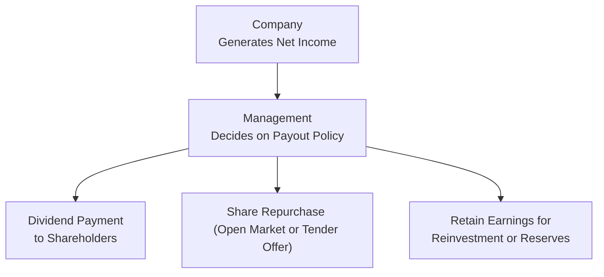

## Introduction

Sometimes, folks ask me, “Why would a company choose to do a share repurchase rather than pay dividends?” It’s a perfectly fair question, because at first glance, both approaches look like ways to return value to shareholders. Dividends give you a nice steady check, while buybacks might quietly reduce the outstanding share count and (potentially) nudge the stock price upward over time. In this section, we’ll break down the many angles of how dividends and repurchases compare—tax implications, signaling, shareholder preferences, management’s motivations, global variations—basically everything you need to know to make sense of real-world corporate payout policies.

## Dividends vs. Buybacks: The Basics

A dividend is a direct cash distribution to shareholders. It’s often paid quarterly (in many markets) and serves as a sign of ongoing profitability. Share buybacks, on the other hand, are transactions in which a firm uses cash to purchase shares from existing holders, reducing the number of shares outstanding. From a theoretical vantage point—looking at Dividend Irrelevance Theory (by Miller and Modigliani)—payout method might not affect firm value if we assume perfect markets, no taxes, etc. But in the real world, markets aren’t perfect. Taxes matter; signals matter; investor preferences definitely matter. These factors shape a company’s strategic decision on whether to pay dividends or buy back shares.

Here’s a quick snapshot of how to visualize the payout policy decision path:

In practice, many companies adopt a mix of both. For instance, you might see a stable, predictable dividend complemented by opportunistic share buybacks when a firm has surplus cash or sees its stock as undervalued.

## Signaling Mechanisms

One reason (and it’s a big reason, trust me) that companies emphasize “steady” dividends is the powerful signal they send to investors. Dividends often reflect management’s confidence in consistent future earnings. Cutting a dividend is typically viewed as dreadful news—like your favorite sports team suddenly saying they can’t afford next season’s lineup. If a board announces a dividend reduction, the market tends to read it as “uh-oh, trouble ahead,” and the stock price might drop significantly. That’s why dividends are often described as “sticky”: managers don’t raise them unless they feel sure they can sustain them.

Buybacks, however, are perceived differently. If a firm announces a big repurchase, it can say “Hey, we believe our stock might be undervalued,” or “We have excess cash and want to return value.” But unlike a dividend, a share buyback doesn’t usually commit the firm to do it repeatedly. If the company slows or suspends a buyback in the future, it doesn’t typically cause the same panic as a dividend cut might. For that reason, buybacks give management a little more flexibility to scale up or slow down capital payouts, with less reputational risk if they need to back off.

## Tax Considerations

Tax is a massive factor in this conversation—this is something many exam candidates forget, but trust me, it matters a lot in practice. Dividends usually trigger immediate tax liability for many shareholders (depending on the tax jurisdiction and investor type). It’s as if you’re forced to realize that income straight away, so the shareholder’s after-tax income might be lower.

Buybacks, by contrast, can allow shareholders to defer taxes. If you, as a shareholder, don’t sell into the repurchase, you won’t be taxed on that buyback event. If you do sell, you might owe capital gains tax—but it’s partially at your choosing, because you decide whether and when to sell. In many jurisdictions, capital gains are taxed at different rates than dividends (often lower, but not always). Hence, buybacks can yield a higher after-tax return to certain investors who prefer to delay realizing gains or who are subject to lower capital gains rates.

A quick formula to put this in perspective might be:


\text{After-Tax Dividend} = D \times (1 - T_\text{dividend})



\text{After-Tax Capital Gain (if realized)} = (P_1 - P_0) \times (1 - T_\text{capitalGain})


Where D is the dividend paid per share, \\( P_1 - P_0 \\) is the price appreciation (i.e., the gain if you sell), \\( T_\text{dividend} \\) is the effective dividend tax rate, and \\( T_\text{capitalGain} \\) is the capital gains tax rate. In many markets, \\( T_\text{capitalGain} < T_\text{dividend} \\), so share repurchases can be comparatively tax-efficient.

## Investor Preferences and the Clientele Effect

One dimension that’s super important—and that often gets overshadowed—is the “clientele effect.” Not all investors want the same thing. Some retirees might love dividends because they want a predictable cash flow. Younger investors might prefer capital gains, especially if they are in high tax brackets or simply want the share price to grow over time. The clientele effect basically says that individual investors and portfolios sort themselves into the stocks that match their desired payout policy:

• High-dividend clientele: Often want the immediate income, may rely on steady payouts to fund living expenses, or prefer the simplicity of dividends.  
• Low-dividend clientele: Often in higher tax brackets or prefer capital gains. May see repurchases as more attractive.  

Because of these differing preferences, companies often signal their target audience with their payout policies. This can influence both the share price and the type of investor base they attract over time.

## Opportunistic Buybacks

One neat aspect of buybacks is the chance for opportunistic timing. If management truly believes the stock price is undervalued, they can launch a repurchase program to scoop up shares at what they consider a discount. In theory, this is beneficial for all shareholders (those who remain) because the firm invests in itself at a bargain, potentially boosting the future per-share metrics such as EPS once the market revalues the stock.

However, there’s a flip side: If management is overly optimistic or if buybacks happen when the stock is richly valued, the company may be overpaying, effectively destroying value. It’s kind of like a personal experience I had once—buying too many shares of a fancy tech company just before its price collapsed. We all like to think we’re good at timing, but that’s rarely guaranteed.

## Effects on Volatility, Ownership, and Cash Requirements

• Volatility: Dividends can act like a stabilizer in some sense, because the stock’s price typically adjusts by the dividend amount on the ex-dividend date, but the total return is somewhat predictable. Buybacks don’t necessarily stabilize the short-term price. In fact, if a buyback is announced unexpectedly, it can create a surge in price due to investor enthusiasm. Going forward, fewer shares outstanding might amplify volatility, since fewer shares trade in the market if the buyback is large.

• Ownership: Dividends keep the ownership percentage the same for everyone. Everyone gets a piece of cash, but the slice of the pie you hold in terms of voting rights doesn’t change. (Unless new shares are issued for a DRIP, but that’s a side story.) With buybacks, investors who don’t participate see their ownership stake slightly increase as other shareholders sell their shares back to the company and exit.

• Cash Requirements: Dividends are fairly rigid. Once you set one, markets expect it to recur. You have to plan for that cash outflow every quarter or every year. Buybacks provide more flexibility since you can time them based on your cash flow cycles, strategic needs, or stock price conditions. However, if you run into a liquidity crunch and you’ve committed to a big buyback, you might have to slow or cancel it (which typically, though not always, is less scandalous than cutting a dividend).

## Global Variations in Payout Policy

It’s really fascinating to see how region-specific factors influence whether companies favor dividends or repurchases. In some countries, dividends face higher tax rates. This encourages share repurchases. Meanwhile, in places with strong preferences for stable, long-term income or cultural expectations for dividends, you’ll see bigger emphasis on paying out dividends. Some corporate governance codes also push for consistent dividend policies to ensure minority shareholders get a fair cut of profits.

In certain jurisdictions, you might find advanced features like:
- Imputation tax systems (Australia, New Zealand) where corporate taxes can be used as a credit for shareholders, making dividends more appealing.
- Split-rate systems (some European countries) that tax retained earnings differently from distributed earnings.
- DRIPs (Dividend Reinvestment Plans) that encourage reinvestment and can partially offset the tax bite.

All these variations impact how a firm crafts its payout policy and how shareholders interpret that policy.

## Case-Style Example

Let’s say you’re the CFO of a mid-sized manufacturing company, Zenith Works, operating in a country where dividends are taxed at a slightly higher rate than capital gains. You’ve had record earnings over the past two years, so you’ve built a healthy cash cushion. You’re debating: “Should I initiate a dividend or launch a share buyback?”

1. If you go with a brand-new dividend, it’ll be interpreted as a stable, possibly permanent commitment to shareholders. Investors who like steady income will cheer. But if your earnings dip next year and you need that cash for reinvestments, you might face the dreaded choice of cutting the dividend or taking on debt.

2. If you go with a buyback, you can buy shares over, say, the next 12 months depending on market conditions. If your stock is trading at a price you believe is too low, it’s a chance to create value for your long-term shareholders. Though if you misjudge (the price is actually fully valued or even expensive), you might effectively waste the cash. Also, the buyback might not send as strong or clear a signal as a dividend, because markets know buyback activity can be scaled back quietly.

In practice, companies like Zenith might balance both: a modest initial dividend that’s comfortably sustainable, plus share repurchases when there’s extra liquidity. That approach can cater to multiple investor clienteles, manage the tax implications, and preserve optionality for the future.

## Best Practices and Pitfalls

• Avoid “Overcommitting” to Dividends: If uncertain about future earnings, consider a more conservative dividend. Signaling is a double-edged sword; once you promise, the market expects you to keep that promise.  
• Time Buybacks Prudently: If the stock appears overvalued, a buyback may destroy value for shareholders. Be wary of using precious cash for share repurchases at peak prices.  
• Mind Investor Preferences: Align your policy with your core shareholder base. If you cater to retirees, stable dividends might be more critical. If you have primarily institutional investors with sophisticated tax strategies, buybacks might be more appealing.  
• Think Long Term: Payout policy is never just about today’s tax or price. It’s about building a consistent reputation that fosters the right clienteles, ensures adequate reserves for growth, and maximizes long-run shareholder value.

## Glossary

• Dividend Irrelevance Theory (Miller and Modigliani): In a perfect market (no taxes, transaction costs, etc.), the form of payout (dividends or buybacks) should not affect firm value.  
• Clientele Effect: Different groups of investors gravitate toward stocks whose payout policies match their personal tax or cash flow preferences.  
• Sticky Dividends: Companies tend to avoid cutting dividends once established, given negative market perceptions.  
• Opportunistic Buybacks: Repurchases that occur when management perceives the stock to be undervalued or especially attractive.  
• Residual Dividend Policy: Aligning dividends with leftover earnings after funding all positive NPV projects.  
• Tax Shield: Certain financing or payout decisions provide tax advantages (e.g., debt interest deductibility). In the context of payouts, some jurisdictions effectively tax dividends differently from buybacks.  
• Dividend Reinvestment Plan (DRIP): A program allowing shareholders to reinvest their cash dividends in additional shares, often at a discounted price.  
• Cash Reserve Impact: The effect on liquidity and risk profile when cash leaves the firm via dividends or buybacks, impacting future financial flexibility.

## References and Further Reading

• CFA Institute Level II Program Curriculum, Dividend and Buyback Policy Comparisons.  
• DeAngelo, H., DeAngelo, L., & Stulz, R. (2006). Dividend Policy and the Earned/Contributed Capital Mix.  
• Damodaran, A. (n.d.). Dividend Policy: Setting the Dividend.  

## Strategic Trade-Offs: Practice Questions on Dividends vs. Buybacks



### Which of the following is considered a key advantage of dividends over share repurchases?
- [ ] Dividends provide immediate tax benefits for all investors.
- [ ] Dividends allow companies to buy shares at undervalued prices.
- [ ] Dividends are typically more flexible to adjust than buybacks.
- [x] Dividends can attract investors who desire a predictable and stable income stream.

> **Explanation:** Dividends provide shareholders a predictable return, making them especially appealing to those who value consistent income. However, dividends do not typically offer immediate tax benefits (in many jurisdictions they incur taxes), and they are generally less flexible because cutting a dividend sends a negative signal to the market.

### Which statement best describes a benefit of share repurchases in comparison to regular dividend payments?
- [x] Share repurchases can be flexibly scaled down without attracting the same negative signaling as a dividend cut.
- [ ] Share repurchases always avoid taxes for shareholders.
- [ ] Share repurchases typically cater to investors seeking stable, predictable cash flow.
- [ ] Share repurchases are never used by companies that pay dividends.

> **Explanation:** One main advantage of share repurchases is their flexibility. Management can slow or halt repurchases if conditions change, generally without the severe negative market reaction associated with cutting a dividend. They do not always completely avoid taxes (selling shareholders can incur capital gains), but they give shareholders control over the timing of those tax events.

### In many jurisdictions, dividends are taxed at:
- [ ] A rate lower than capital gains to encourage retail investment.
- [ ] Exactly the same rate as interest income from bonds.
- [x] A rate that can be higher than (or the same as) capital gains, depending on local tax laws.
- [ ] No tax at all, as part of a corporate initiative to boost share price.

> **Explanation:** Dividends, in many places, are taxed upon receipt and often at a rate higher than or equal to capital gains. The exact tax rules vary by jurisdiction, but the key takeaway is that dividends typically trigger immediate tax liability, whereas gains from share repurchases can be deferred until the shares are sold.

### Which investor demographic is most likely to favor high-dividend stocks?
- [ ] Investors in the highest tax bracket looking to defer taxes.
- [ ] Investors with a very long investment horizon who prioritize capital growth over income.
- [x] Retirees or others seeking steady current income.
- [ ] Young investors who are beginning to accumulate shares.

> **Explanation:** Investors who need consistent payouts—often retirees—generally favor stocks paying stable, predictable dividends. Investors who want to defer taxes or who focus on capital appreciation might prefer lower-dividend or buyback-oriented companies.

### A company implementing an opportunistic buyback program perceives its stock as:
- [ ] Overvalued in the short term.
- [x] Undervalued, to potentially enhance remaining shareholders’ value.
- [ ] More volatile than the overall market.
- [ ] Equally priced to its intrinsic value.

> **Explanation:** Opportunistic buyback programs are typically launched when management believes the market price understates the firm’s intrinsic value, so they can repurchase shares cheaply, benefiting shareholders who remain invested in the firm.

### A major downside of share repurchases compared to dividends, from a signaling perspective, is that:
- [ ] Investors punish buybacks even more than a dividend cut.
- [ ] Companies must continue buybacks indefinitely.
- [x] Buybacks do not communicate as strong a long-term commitment to distribute cash as dividends do.
- [ ] Buybacks fully shield investors from all tax liabilities.

> **Explanation:** Dividends typically send the message that a company is confident about ongoing, sustainable profits. A share repurchase is more flexible and is not always read as a long-term commitment. That can be a downside if the company wants to cultivate a stable “income” investor base.

### Which term describes companies’ reluctance to reduce dividend payouts once they have been set?
- [ ] Residual dividend policy.
- [ ] Opportunistic buyback.
- [ ] Resistance effect.
- [x] Sticky dividends.

> **Explanation:** The concept of “sticky dividends” refers to the strong reluctance of corporate managers to cut dividends due to the negative signaling effect.

### Under the clientele effect, investors who prefer high dividends are most likely to:
- [ ] Consistently sell their shares upon dividend payments.
- [ ] Lobby the company to shift entirely to a buyback policy.
- [x] Invest in firms exhibiting higher and more stable dividend payout ratios.
- [ ] Avoid investing in any equities and focus solely on bonds.

> **Explanation:** The clientele effect suggests investors gravitate toward companies aligning with their payout preferences. Those whowant consistent cash income will seek out firms with a history of stable or high dividends.

### The term “cash reserve impact” refers to:
- [x] How distributing cash through dividends or buybacks affects a firm’s liquidity and risk profile.
- [ ] The idea that repurchases fully hedge a firm’s operating risks.
- [ ] A mandatory deposit that companies must hold at the central bank.
- [ ] Federal-level restrictions on how investment banks can allocate their capital.

> **Explanation:** “Cash reserve impact” is about how returning capital to shareholders, whether via dividend or buyback, influences the company’s available liquidity, possibly leaving less cushion for future investments or unexpected events.

### True or False: Under Dividend Irrelevance Theory by Miller and Modigliani, in a perfect market, a firm’s value is affected by its choice of dividends versus buybacks.
- [ ] True
- [x] False

> **Explanation:** Dividend Irrelevance Theory states that, in a perfect market scenario (no taxes, no transaction costs, etc.), the choice of payout method (dividends vs. buybacks) does not affect the overall value of the firm.


