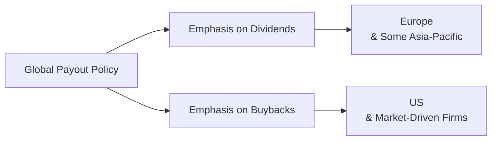

## Introduction: Evolving Global Payout Landscape

Sometimes, when I’m chatting with friends who invest globally, they ask me: “Why do companies in Country A keep boosting share buybacks, while those in Country B prefer consistent dividends?” And honestly, it’s a fair question, because corporate payout policy—whether dividends, share repurchases, or a mixture—can vary dramatically across the globe.

In this section, we aim to uncover how legal frameworks, cultural norms, tax regimes, and even interest rate environments shape how firms distribute profits to shareholders. Our target is to link these patterns to real-world observations—like the prolonged era of low interest rates in some developed nations that led to surging buybacks, or the cultural emphasis on retained earnings in certain emerging markets. If you’re preparing for the CFA Level II exam, you can bet that understanding these nuances will help you tackle item sets involving multinational corporations and their payout decisions.

## Regional Patterns in Developed vs. Emerging Markets

### Developed Markets: The Rise of the Buyback Boom
In many developed markets—especially the United States—share repurchases have become a go-to strategy for returning cash to shareholders. The so-called “Share Buyback Boom” of the 2010s emerged when rock-bottom interest rates made debt incredibly cheap. Companies borrowed at historically low rates and channeled those funds into stock repurchases, boosting earnings per share (EPS) and, often, stock prices. Take the U.S., for instance: many large-cap companies consistently announced buyback programs, encouraging strong equity demand and sometimes overshadowing dividend announcements.

Across parts of Europe, however, the approach is more mixed. While share repurchases certainly occur, there’s a preference—especially in traditionally conservative sectors like utilities—for predictable, stable dividends. In some European countries, regulatory constraints and cultural expectations push companies to maintain steady dividend streams; there’s a sense that shareholders see dividends as a sign of financial health. At the same time, politics and social norms can shape decisions: Some corporate boards might worry about negative media attention if repurchases are perceived as a way to inflate share prices instead of reinvesting in the local economy.

### Emerging Markets: Balancing Growth and Payout
Meanwhile, emerging markets display a wide variety of payout behaviors. Certain countries in Asia, for example, have historically retained earnings to fuel growth. This inclination is partly cultural—some local shareholders prefer seeing a company reinvest rather than pay out large dividends—and partly a reflection of where those companies are on their growth curves. 

But we should be careful not to overgeneralize. In Latin America, you might see heavily resource-based companies that distribute consistent dividends, especially if they’re mature, profitable, and have limited reinvestment opportunities. On the flip side, new tech or manufacturing sectors in the same region might mirror the “growth-first” approach, minimizing payout in favor of expansion. It’s crucial to distinguish the firm’s life-cycle stage and sector strategy. 

## Cultural and Shareholder Influences on Payout

If you’ve ever invested in companies across different continents, you’ve probably noticed that some corporate boards are extremely mindful of local investor sentiment. Many European and Japanese firms, for instance, have cross-shareholding structures or are heavily influenced by government (or quasi-government) pension funds that prefer stable dividends. These investors rely on regular income. In contrast, in the United States, institutional investors—such as hedge funds and private equity—often push aggressively for share repurchases, particularly if they believe the stock is undervalued or if buybacks can optimize short-term returns.

When corporations are cross-listed (e.g., traded on both the NYSE and the Tokyo Stock Exchange), they may adopt a kind of “blended approach,” using moderate dividends to satisfy domestic investors’ expectations while also scheduling share repurchases to align with foreign market preferences. 

## Macroeconomic Drivers and the Impact of Low Interest Rates

Well, it’s hardly surprising that macroeconomic conditions put serious weight on payout decisions. Picture a scenario in which a company can issue debt at 2% while its equity cost of capital might be higher. Channeling cheap debt to buy back equity can quickly boost EPS—this was a major factor behind the U.S. repurchase trend. Conversely, in higher-rate environments, paying consistent dividends (or even special dividends) might be more appealing if the cost of debt is too high. 

In some emerging markets, interest rates can be variable or significantly higher than in developed markets, making heavily leveraged buyouts or share repurchases less attractive. Companies in these settings might prefer to build up cash reserves or channel funds into expansions rather than distribute them.

## Regulatory and Tax Considerations

### Double Taxation vs. Imputation Systems
A fundamental detail in global payout policy is how governments treat dividends. Under certain regimes, dividends are taxed twice—first at the corporate level (through corporate taxes) and then again at the investor level (personal income taxes). This double whammy can discourage dividend distributions, prompting firms to consider alternatives like buybacks.

By contrast, in places like Australia that use an imputation system, shareholders receive tax credits for corporate taxes already paid. This effectively neutralizes or reduces the double taxation effect. As a result, many Australian companies long maintained relatively generous dividends because shareholders benefited from tax credits, making dividends more appealing than repurchases.

### Changes in Government Regulations
Government policy can shift corporate payout decisions. For instance, if regulators impose new rules limiting the deductibility of interest payments, companies may find debt-financed buybacks less appealing. Or if a government suddenly decides to lower the tax rate on dividends while leaving capital gains taxes unchanged (perhaps to court certain voter segments), you might see a spike in dividend announcements.

It’s also worth noting that some jurisdictions have historically restricted share repurchases, viewing them as potential price manipulation. Over time, these restrictions have eased in many developed markets, but the lingering regulatory environment can still color a company’s decision on how to return capital to shareholders.

## Sector Differences and Cross-Listing Effects

### Technology vs. Utility Firms
Picture a risk-oriented tech startup in Silicon Valley: consistent dividends usually aren’t top of mind. With expansion goals and R&D needs taking priority, many of these firms reinvest a large portion of earnings, often resorting to share repurchases later in their life cycle when growth slows or they have excessive cash on their balance sheets. Apple’s massive buyback programs in the last decade come to mind.

Now contrast that with a stable, regulated electric utility in Europe under public scrutiny: they tend to anchor on a reliable, periodic dividend. Shareholders see this as a predictable income source, and it aligns with the firm’s conservative posture.

### Cross-Listing and Blended Payout
Companies that list on multiple global exchanges often adopt a balanced payout policy. You might see moderate buybacks to appease more market-driven investors in the U.S. or the UK, while continuing to pay stable dividends to satisfy local or long-standing shareholders who expect that consistent check in the mail. This balancing act can sometimes be tricky—firms need to carefully communicate these decisions through investor relations. 

## Diagram: High-Level Overview

Below is a simple diagram illustrating how global payout policy might differ across regions:

The reality is more nuanced, of course—some firms in Europe also engage in robust repurchases, and some in the U.S. pay dividends steadily. But overall, you can think of the big picture as shifting from a primarily dividend model in many parts of Europe to an increased reliance on buybacks in the U.S.

## Mini-Case Examples

### 1. A UK-Based Energy Giant
In 2021, a large UK energy producer announced that due to newfound regulatory relief on dividends, they intended to maintain a 5% annual dividend yield. Despite having sufficient free cash flow, they opted for minimal buybacks, largely because many of their institutional investors—pension funds, specifically—relied on steady dividends for income. This decision was widely applauded by local media and trade unions, reflecting cultural and regulatory factors that favor continuity in payouts.

### 2. A Chinese Tech Innovator
A well-known Chinese tech company rapidly expanded overseas. Freed from the conventional approach of retaining all earnings, they introduced a modest share repurchase plan once they got listed in the U.S. While they continued to plow back significant funds into R&D, the buyback was partly aimed at global investors who expected the firm to manage capital more “Western-style,” rewarding existing shareholders and supporting share prices.

### 3. A Cross-Listed Australian Mining Firm
Australia’s imputation system gives shareholders franking credits for the corporate tax the firm has already paid. Because this cross-listed miner also trades on the London Stock Exchange, it adopted a layered approach: a stable dividend to appease Aussie investors who benefit from imputation credits and occasional buybacks when commodity prices surge and free cash flow is abundant. This is a prime example of a “blended approach.”

## Best Practices, Common Pitfalls, and Strategies

• Understand Stakeholder Profiles: Firms must gauge their major investor segments. If pension funds are heavily invested, stable dividends typically trump buybacks.  
• Monitor Regulatory Shifts: Changes in tax law, capital requirements, or interest deductibility can flip the script on whether buybacks or dividends are more appealing.  
• Communicate Clearly: Whatever the policy—buybacks, dividends, or a mix—companies need transparent disclosure. Ambiguous or inconsistent messaging can confuse shareholders or, worse, trigger suspicion about the firm’s true performance.  
• Align with Corporate Objectives: In some instances, it may make sense to reinvest in high-return projects rather than distribute capital. The decision must align with the firm’s long-term strategy.  
• Avoid Overleveraging: Sizable buybacks financed by debt can weaken the balance sheet, a vulnerability during economic downturns. Corporate finance strategies should consider future volatility and liquidity needs.

From a CFA exam perspective, keep your eyes open for vignettes that show a company pivoting from one payout policy to another following macro or regulatory changes. This can be a signal to re-evaluate the risk-return trade-offs, tax impacts, and how soon that pivot might affect the firm’s cost of capital or share price.

## Final Thoughts and Exam-Day Tips

When dealing with a case on global payout policy, start by carefully reading the vignette for any mention of the firm’s location(s), applicable tax regimes, major shareholder types, and macroeconomic cues (like interest rates or credit availability). Jot these key points down:

• Is there mention of new legislation regarding share buybacks?  
• Are institutional shareholders in the story pushing for stable dividends?  
• Did the firm recently acquire cheap financing?  
• Is the company a mature “cash cow” or a high-growth disruptor?

Answering these questions will help you frame the reasons behind a given payout strategy. On exam day, the item set might ask you to calculate the impact of dividends vs. repurchases on EPS or to identify which approach best fits the firm’s operational environment. Synthesize what you already know: synergy between capital structure, tax considerations, and investor preferences is crucial for scoring well.

Remember, understanding the bigger picture—globally—can be a secret weapon. It helps you explain those subtle nuances, like why a firm might choose a stable dividend in a certain market or how cross-listing compels a balance between repurchases and dividends. This macro-to-micro approach can make all the difference on those specialized Level II vignettes.

---

## Test Your Knowledge: Global Payout Policy in Practice



### Which of the following factors is most likely to explain why U.S.-based firms frequently use share buybacks?
- [ ] Strict regulation preventing stable dividend distribution
- [x] Historically low interest rates facilitating debt-funded repurchases
- [ ] Higher taxation on capital gains than dividends
- [ ] Anti-manipulation laws favoring share buybacks over dividends

> **Explanation:** Low interest rates in the U.S. over much of the 2010s reduced the cost of debt, incentivizing companies to fund repurchases. 

### A European utility company is most likely to:
- [ ] Rely heavily on share buybacks to enhance EPS
- [x] Maintain a consistent dividend payout to align with conservative investor expectations
- [ ] Avoid dividend payments altogether due to strict legislation
- [ ] Eliminate cash returns to focus on R&D

> **Explanation:** Traditional utilities in Europe generally favor stable, periodic cash dividends due to investor preference and sector conventions.

### Which term describes the scenario where corporate profits are taxed twice—at the corporate level and again at the individual shareholder level?
- [ ] Imputation
- [ ] Single-tier system
- [x] Double taxation of dividends
- [ ] Waiver approach

> **Explanation:** Double taxation of dividends occurs when profits are taxed once at the corporate level, then distributed and taxed again at the shareholder level.

### Under an imputation system (e.g., Australia):
- [x] Shareholders receive tax credits for corporate taxes paid
- [ ] Dividends are taxed at a special high rate
- [ ] Companies are not allowed to pay dividends
- [ ] Buybacks are mandatory when profits exceed a threshold

> **Explanation:** The imputation system provides shareholders with tax credits for corporate taxes the firm has already paid, reducing or eliminating additional dividend taxes.

### A technology startup in a high-growth phase is more likely to:
- [ ] Emphasize high dividend payouts
- [x] Retain cash for expansion and possibly initiate future buybacks
- [ ] Purchase other tech companies’ shares instead of its own
- [ ] Offer dividends to create immediate shareholder returns

> **Explanation:** High-growth tech firms typically prioritize reinvesting earnings rather than distributing large dividends. They may consider buybacks later when growth tapers off.

### Which of the following is a key driver of the “Share Buyback Boom” observed in some developed markets?
- [x] Access to cheap debt
- [ ] High double taxation rates
- [ ] Cultural discouragement of dividends
- [ ] Consistent high cash flow and zero growth opportunities

> **Explanation:** Easy access to historically low-cost debt was central to fueling the share repurchase boom, making financed buybacks more attractive.

### A cross-listed company on both a domestic and U.S. exchange might:
- [ ] Always favor dividends to satisfy both markets
- [ ] Eliminate all payouts to maintain neutrality
- [x] Adopt a blended payout approach that includes dividends and repurchases
- [ ] Incur double taxation in both markets on a mandatory basis

> **Explanation:** Firms that list in multiple markets often combine dividends (to appease domestic preferences) with buybacks (for foreign and institutional investors).

### When analyzing an emerging market firm’s payout policy, which factor is least likely relevant?
- [ ] Cultural attitudes toward dividend retention
- [ ] The firm’s growth phase and reinvestment needs
- [ ] Local regulatory constraints on repurchases
- [x] Full immunity from global business cycles

> **Explanation:** An emerging market firm is not immune from global business cycles; in fact, it’s often influenced strongly by them. All other factors are highly relevant.

### Which scenario would most likely discourage a firm from conducting share repurchases?
- [ ] They want to increase EPS
- [ ] They have free capital at a low interest rate
- [ ] The government recently relaxed regulations on buybacks
- [x] The cost of debt has risen significantly

> **Explanation:** High borrowing costs reduce the attractiveness of debt-funded buybacks, making firms cautious about taking on expensive leverage.

### True or False? Firms in countries with more lenient rules on share repurchases are universally required to prefer buybacks over dividends.
- [x] True
- [ ] False

> **Explanation:** Actually, this statement is a trick. Firms are not “required” to prefer buybacks. Even if share repurchases have fewer restrictions, firms will still consider tax, strategic, and cultural factors. The correct label is “False”—they are not universally required to prefer buybacks. 



---

**References and Further Reading**  
• CFA Institute Level II Program Curriculum – Corporate Issuers, “International Considerations for Dividend Policy.”  
• OECD Reports on Corporate Payout Trends in Developed Economies.  
• Regulators such as the Monetary Authority of Singapore (MAS) and the Australian Securities & Investments Commission (ASIC) for region-specific rules.  
• Various financial news articles on post-2010 share repurchase trends (e.g., Financial Times, Wall Street Journal).  

Use these resources to deepen your grasp of global payout policy patterns, and keep honing your ability to dissect these nuanced topics for the Level II exam.
