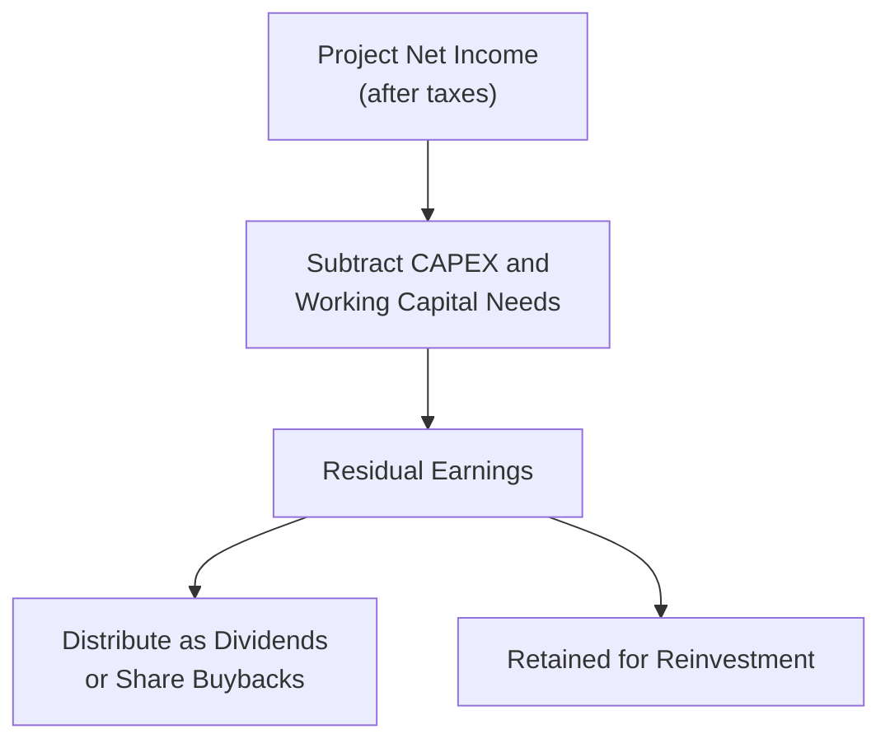

## Introduction

So, let’s talk about dividends and buybacks. You’d think a simple question like “Should a company pay a high dividend or hold back and reinvest more?” would have a straightforward answer. But—ah—there’s a bit of nuance here. How firms distribute cash to shareholders intricately impacts valuation, capital structure, and growth potential. In this section, we’ll explore how varying payout ratios, share repurchases, and reinvestment decisions shape the intrinsic value of a firm.

This conversation matters a lot at Level II, because you’re moving beyond the surface-level definition of dividends and into detailed modeling of cash flows, analyzing how different payout strategies ripple through a firm’s metrics like EPS, ROE, and P/E. With a robust grasp of these concepts, you’ll be ready to tackle scenario-based item sets that test your ability to adapt valuation models under changing payout assumptions.

## High vs. Low Dividend Payout and Intrinsic Value

Investors often hold strong opinions about dividends. Some prefer high-payout companies because the cash hits their accounts right away. Others see dividends as potentially costly if opportunities for reinvestment can deliver higher growth. Let’s break down a few key considerations:

• Opportunity cost of not reinvesting: If a firm has potentially lucrative projects with high returns on capital, paying out large dividends too soon could stifle growth.  
• Shareholder preference: Different investor segments may desire different payout practices. Some stable, income-focused investors might favor consistent or high dividends, while growth-oriented investors might prefer lower payouts and higher reinvestment.  
• Capital structure: Large dividend payouts reduce equity on the balance sheet, potentially increasing a firm’s leverage ratio if debt levels remain constant.  

### Impact on Firm Value

In a perfect capital market (hello, Miller–Modigliani world), dividends don't affect firm value because shareholders can create homemade dividends by selling or buying shares. But in reality, taxes, flotation costs, and possible signaling effects make things more complicated.

High dividends can be seen as a signal that management expects strong and stable future cash flows. At the same time, a high payout might raise concerns if the company appears to be neglecting worthwhile growth investments. Conversely, a low payout ratio, or even no dividends, could signal that the firm sees big growth opportunities, but it could also leave investors unsure if the cash will be deployed effectively.

## Setting up Pro Forma Financial Statements for Different Payout Policies

Pro forma statements help us model how varying decisions about dividends or share repurchases might alter a firm’s financials. In general, here’s the process:

• Forecast revenue, operating costs, and net income.  
• Decide on capital expenditures (CAPEX) and working capital needs.  
• Subtract out cash needed for capital requirements.  
• Whatever remains can be distributed under your chosen payout policy.

Let’s do a brief hypothetical. Pretend Company ABC has $1,000 in net income. If management uses a residual dividend policy, they first check growth projects. Suppose $400 is needed for CAPEX and working capital. With $600 left, that might go out as dividends—unless management decides to keep some as a cushion for possible acquisitions or to reduce debt.

Below is a simple Mermaid diagram sketching how you might lay out these pro forma steps:



This approach can be adapted to alternative policies (like a constantly stable payout ratio).

## Modeling Dividend Discount Valuation under Varying Growth

The Dividend Discount Model (DDM) is a core valuation method. The basic formula for a stable-growth scenario is:


V_0 = \frac{D_1}{r - g}


Where:  
• \\(D_1\\) is next year’s expected dividend.  
• \\(r\\) is the required rate of return (cost of equity).  
• \\(g\\) is the constant growth rate of dividends.

### Stable-Growth Model

If the firm’s pace of dividend growth is expected to remain constant, the stable-growth DDM is straightforward. For instance, if \\(D_1 = \$2\\), \\(r = 10\%\\), and \\(g = 4\%\\), then the intrinsic value is \\(\frac{2}{0.10 - 0.04} = \$33.33\\) per share.

### Two-Stage and Three-Stage Models

Now, maybe you suspect a firm’s dividend growth will be high in the near term (let’s say 15% for five years) and then level off (say 5% perpetually after that). This is a classic two-stage DDM, where you forecast dividends year by year for the high-growth period, discount each dividend, and then calculate a terminal value at the start of the stable-growth period. Add them up for total present value.

Life rarely follows a strict two-step path, so we sometimes push further into a three-stage model. Maybe there’s an initial super-growth stage, a transitional phase, and finally a long-run stable growth. The math is more extensive, but conceptually it’s about discounting separate growth periods individually, then applying a stable-growth perpetuity for the last stage.  

## Incorporating Share Repurchases

Dividends aren’t the only way companies distribute cash. Share repurchases have become increasingly popular worldwide. When a firm buys back its own shares, the share count decreases. If earnings stay the same, EPS can go up simply because the earnings are spread over fewer shares.

### Adjusting for Share Repurchases in Valuation

Here’s where it gets interesting: under a buyback scenario, the total equilibrium value of the firm might remain the same in theory, but the composition changes. You’ve reduced equity capital on the balance sheet, and each remaining share represents a larger slice of the pie. Often, we’ll adjust our valuation approach by:

• Reducing the share count.  
• Incorporating the cost of financing if the company borrows to fund the buyback.  
• Ensuring the net income or free cash flows reflect the changes in interest expenses (if debt is used) or the reduction in cash (if internal funds are used).

### Effect on Leverage and Capital Structure

A major share repurchase can tilt the firm’s capital structure toward higher leverage. A heightened debt level implies a higher risk to equity holders. In the presence of a riskier capital structure, the required return on equity (r) could rise. The net effect on share price depends on balancing any beneficial tax shields from additional debt versus the higher cost of capital associated with elevated financial risk.

## EPS and P/E Dynamics under Different Payout Strategies

Even though “earnings per share” is not always a perfect measure of economic wealth, it’s still heavily watched by analysts. Let’s see how the mechanics play out:

1. All-Dividend Scenario: The firm pays out everything in dividends. In that case, no share reduction occurs, so the share count stays constant. EPS might grow slowly (only from net income changes), but dividends are straightforward.  
2. Partial-Repurchase Scenario: The firm splits its cash flows between dividends and repurchases. EPS may rise as share count drops, but not as drastically as if all free cash flow went to buybacks.  
3. Full-Repurchase Scenario: Management uses essentially all free cash flow to buy back shares (zero or minimal dividends). EPS might accelerate quickly if the net income is spread over a shrinking base of shares—at least in the short run.

The Price-to-Earnings (P/E) ratio might also shift for reasons unrelated to the firm’s actual operating performance. For example, a buyback in an overvalued market could be considered a poor investment that might not truly add value, even if it lifts EPS. Markets occasionally see through such “financial engineering,” so you must weigh fundamentals alongside the purely mechanical EPS impact.

## FCFE vs. DDM When Dividends and Repurchases Interchange

Let’s say a firm traditionally paid dividends, but now it’s switching to repurchases. The classic Dividend Discount Model might get messy, especially if actual dividends become inconsistent or minimal. That’s where the Free Cash Flow to Equity (FCFE) approach can shine, because FCFE is the actual cash available to equity holders—dividends or otherwise. You discount that FCFE at the cost of equity to reach an intrinsic value.

### FCFE Formula Overview

While different forms exist, one standard approach is:

\text{FCFE} = \text{Net Income} + \text{Depreciation} - \text{CAPEX} - \Delta \text{Working Capital} + \text{Net Borrowing}


You estimate FCFE each year, discount it by the required equity return, and sum the results for total equity value. Because FCFE accounts for both dividends and other forms of distribution (like share repurchases), it can be a more holistic measure when the firm’s payout policy is in flux.

## Market Sentiment, Tax Policy, and Identical Total Distributions

Investors obviously pay attention to how distributions are structured. Some markets or investor classes face different tax rates on dividends versus capital gains from share buybacks. Tax policy can influence the cost of distributing capital via dividends (which might be taxed more heavily) vs. buybacks (where shareholders typically realize capital gains). Also, in certain jurisdictions, share buybacks are occasionally viewed more favorably because they give shareholders some flexibility in timing their eventual tax liability—they can hold onto shares and only pay capital gains tax once they sell.

### Behavioral and Signaling Impact

Let me tell you a quick anecdote: I once watched two nearly identical companies, with nearly identical payout capabilities, choose drastically different methods—one paid a high regular dividend, the other used buybacks. Investors initially gave a higher valuation multiple to the buyback firm because they saw it as “tax-efficient,” plus it hinted that management thought their shares were undervalued. But over time, the narrative flipped when the buyback firm’s growth slowed unexpectedly, and paying zero dividends suddenly looked like a lack of confidence. That is to say, market sentiment can shift abruptly, and it’s critical to keep your eyes on the fundamentals, not just the distribution method.

## Scenario Analysis and Sensitivity Tests

Valuation is typically based on best estimates of future cash flows, cost of capital, and growth. But what if the actual outcomes deviate? Scenario analysis helps you see the range of possible valuations under different assumptions:

• **Best Case:** Lower cost of capital, stronger revenue growth, more cash available for distribution.  
• **Base Case:** Expected scenario using realistic operating assumptions.  
• **Worst Case:** Higher financing costs, slower growth, and less stable free cash flow.

Sensitivity analysis is about tweaking one key variable at a time—like the growth rate (g) in a DDM or the required return (r)—and observing how that alone impacts the valuation. If a slight change in r or g causes wild swings in predicted value, you know you’re dealing with a high-sensitivity scenario, so caution is warranted.

For instance, you can easily set up a Python snippet to do it:

```python
import numpy as np

D1 = 2.0
r_values = np.arange(0.08, 0.13, 0.01)  # 8% to 12% in steps
g_values = np.arange(0.02, 0.07, 0.01)  # 2% to 6% in steps

for r in r_values:
    for g in g_values:
        if r > g:
            v0 = D1 / (r - g)
            print(f"Req Ret: {r:.2%}, Growth: {g:.2%}, Value: {v0:.2f}")
```

This code lumps through different required returns and growth rates, giving you a matrix of valuations. It’s a quick demonstration of how a half-percent change in either variable can drastically alter the theoretical share price.

## Reinvestment Rate and Sustainable Growth

Payout policy depends on how much you need to plow back into the business to maintain or spur growth. The sustainable growth rate, \\(g\\), can be approximated by:


g = b \times ROE


where \\(b\\) is the retention ratio (the fraction of net income retained, i.e., \\(1 - \text{payout ratio}\\)) and \\(ROE\\) is return on equity. If a firm’s actual growth rate overshoots this sustainable rate without additional external financing, it might be forced to cut dividends or issue new equity or debt. Conversely, if the firm’s growth rate lags behind, it can afford a higher payout and still maintain stable operations.

## Using Residual Income to Reconcile Varying Payout Policies

Residual income valuation can provide a cross-check. Residual income looks at net income relative to a firm’s cost of equity capital. Even if the firm shifts from dividends to buybacks, the fundamental question remains: Are the firm’s earnings in excess of what shareholders require for their opportunity cost?

In formulas, residual income can be computed each period as:

\text{RI} = \text{Net Income} - (r \times \text{Beginning Book Value of Equity})


If a firm consistently generates positive residual income, that typically points to the creation of shareholder value, whether or not the firm pays dividends or conducts buybacks. The difference is purely in how those cash flows get distributed.

## Conclusion

Valuing a firm under varying payout scenarios can feel like juggling a million moving pieces: dividend assumptions, buyback strategies, shifting tax realities, and evolving investor sentiment. But by combining stable or multi-stage DDMs, FCFE models, residual income methodologies, and a healthy dose of scenario analysis, you develop a multifaceted viewpoint. The big takeaway? No single payout strategy is always superior. Each firm’s optimal approach depends on growth prospects, market conditions, investor preferences, and capital structure goals.

Keep in mind that the CFA exam at Level II wants to make sure you’re nimble with these concepts. If you see a vignette describing a shift in payout policy, ask yourself: “How does this affect the share count, debt levels, reinvestment, and taxes? Which valuation model is best suited for these new assumptions?” Answering those questions systematically is your key to item-set success.

## Test Your Knowledge: Valuing a Firm under Varying Payout Scenarios Quiz



### A company that fully pays out its earnings as dividends every year is most likely to experience:

- [ ] Rapid growth in its asset base from reinvestment.
- [x] Little to no retained earnings for expansion.
- [ ] Reduction in the value of existing shares.
- [ ] Lower cost of capital relative to competitors.

> **Explanation:** Paying out all earnings as dividends leaves minimal internal funds for reinvestment, constraining growth potential.

### Under a residual dividend policy:

- [ ] Management maintains a fixed payout ratio regardless of investments.
- [ ] Dividends are paid first, and leftover cash finances new projects.
- [x] Capital expenditures and working capital needs are prioritized, and any leftover is paid as dividends.
- [ ] Share buybacks always take precedence over dividends.

> **Explanation:** In a residual dividend policy, the firm funds its capital needs first. Any surplus earnings are distributed as dividends.

### Which valuation model typically remains valid even if a firm shifts entirely to share repurchases instead of dividends?

- [ ] Constant-growth Dividend Discount Model (DDM)
- [ ] Residual Dividend Policy Model
- [x] Free Cash Flow to Equity (FCFE) approach
- [ ] P/E multiple approach only

> **Explanation:** FCFE captures all cash flows available to equity holders, regardless of whether they are distributed as dividends or used for buybacks.

### If a firm’s cost of equity increases due to higher financial leverage from a buyback, the theoretical effect on share value under a perfect capital markets assumption is:

- [ ] Guaranteed increase due to lower share count.
- [ ] Guaranteed decrease due to new leverage.
- [x] Indeterminate (it depends on the net trade-off between the new capital structure and risks).
- [ ] No impact whatsoever.

> **Explanation:** While a buyback reduces share count and may raise EPS, the higher cost of equity from increased risk could offset or surpass those gains.

### Under a two-stage DDM with a high-growth phase followed by stable growth, the terminal value is estimated using:

- [ ] A perpetuity formula at the current dividend.
- [x] A stable-growth formula applied to the dividends at the start of the stable-growth phase.
- [ ] The sum of all discounted dividends in the high-growth phase.
- [ ] The present value of net income in perpetuity.

> **Explanation:** Terminal value in a two-stage model is typically found by applying the constant-growth (Gordon Growth) formula to the first dividend after the high-growth phase, then discounting it back to present.

### A key difference between residual income and DDM is that residual income:

- [x] Focuses on earnings in excess of the required return on equity.
- [ ] Requires higher payouts to be valid.
- [ ] Ignores the firm’s book value of equity.
- [ ] Cannot capture the effects of share repurchases.

> **Explanation:** Residual income valuation centers on whether the firm’s net income exceeds the charge for equity capital (r × beginning book value of equity).

### Tax policy may cause share buybacks to be more attractive to certain investors primarily because:

- [ ] All investors must pay taxes immediately on buybacks.
- [ ] Dividends are always tax-free.
- [x] Capital gains from buybacks can often be deferred until shares are sold.
- [ ] Government subsidies reward firms for conducting buybacks.

> **Explanation:** In many jurisdictions, dividends are taxed annually when received, whereas capital gains may be delayed until the investor sells the shares.

### When performing sensitivity analysis, you generally:

- [x] Vary one input at a time (e.g., cost of equity or growth rate) to see the effect on value.
- [ ] Shuffle all assumptions randomly to simulate real-world complexity.
- [ ] Only examine best-case and worst-case scenarios.
- [ ] Keep cost of equity constant and only alter growth rates.

> **Explanation:** Sensitivity analysis traditionally isolates changes in individual variables, evaluating the effect on the outcome.

### Which ratio is used in the sustainable growth rate formula to determine how much of earnings are retained?

- [x] Retention ratio
- [ ] Payout ratio
- [ ] Debt-to-equity ratio
- [ ] Dividend yield

> **Explanation:** The sustainable growth rate is b × ROE, where b = 1 − (payout ratio). The portion of earnings not paid out (retention ratio) is b.

### True or False: A firm’s P/E ratio can shift simply due to a share repurchase, without any real change in its operating performance.

- [x] True
- [ ] False

> **Explanation:** Reducing share count can mechanically increase EPS, which may alter the P/E ratio. This effect might not reflect a fundamental improvement in the business itself.



## References and Further Reading

• CFA Institute Level II Curriculum, Corporate Issuers readings on “Equity Valuation and Payout Policies.”  
• Brealey, Myers, and Allen. Principles of Corporate Finance, particularly chapters on payout policy and capital structure.  
• Damodaran, A. Damodaran on Valuation, sections addressing dividend discount models and share buybacks.  
• Industry articles on the implications of dividend vs. buyback strategies, including tax and signaling considerations.  
