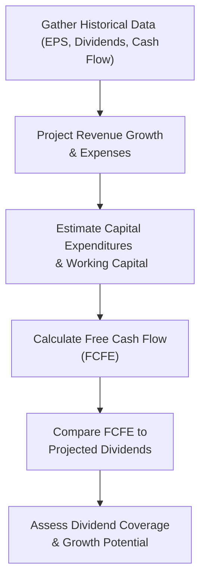

## Introduction

So let's talk about sustainable dividends—one of those topics that might sound straightforward, but the more you dig into them, the more you realize there’s so much going on behind the scenes. The idea is simple: a dividend is “sustainable” if a company can comfortably (and consistently) keep paying it over time, without hurting its ability to grow or fulfill future capital needs. But in reality, everything from free cash flow (FCF) to unexpected capital expenditures (CAPEX) to the occasional market downturn can throw a wrench into even the best-laid plans. 

And, well, here’s a personal confession: I once looked at a cyclical mining company that boasted a robust dividend payment history. At first glance, I was impressed—until I saw how their free cash flow had been negative for the past year. They were borrowing heavily just to keep that dividend going. Inevitably, the next big slump in metal prices arrived, and guess what? Their dividend got cut. The moral: We need to know how to spot whether a dividend is actually sustainable or if it’s just waiting to be trimmed in a downturn.

Below, we’ll explore the concept of sustainable dividends and delve into good old-fashioned ratio analysis, multi-period forecasting models, and red-flag indicators that a dividend might be on shaky ground. We’ll also compare cyclical versus stable firms and examine how different payout policies (stable vs. constant payout ratio) factor into your analysis. Your future exam items might serve up a vignette about a company’s payout policies, and you’ll want to be able to confidently say, “Yes, that dividend’s safe” or “Uh oh, time to watch out.”

## Relationship Among Free Cash Flow, Earnings Volatility, and Capital Needs

Sustainable dividends don’t happen in a vacuum. They’re rooted in a company’s ability to generate enough cash flow above and beyond its operational and capital expenditure requirements. That means:

• Free Cash Flow (FCF): This is often measured as cash flow from operations minus capital expenditures. Some analysts refine it further to free cash flow to equity (FCFE), which is also net of debt repayments. If FCF is stable and consistently outpaces the dividend commitment, that’s a good sign. If it’s volatile or occasionally negative, the dividend might be in danger.

• Earnings Volatility: Earnings can fluctuate for many reasons—commodity price swings, changing consumer demand, or cyclical macro conditions. When earnings bounce around a lot, it can be challenging for a firm to stick to a high fixed dividend commitment. High volatility usually goes hand-in-hand with a cautious approach to dividends. 

• Capital Needs: Does the company need to invest heavily in new projects or expansions? Or do they have stable CAPEX and minimal working capital growth requirements? If you see a firm with big capital plans but only modest free cash flow, that’s a clear sign the current dividend may not be sustainable.

Simply put, if there’s an ongoing tug-of-war between capital needs and a desire to distribute cash to shareholders, it’s typically capital needs that take priority—eventually. If not, management can run into bigger problems, like insufficient funds for growth, higher borrowing costs, or investor backlash if the dividend is cut unexpectedly.

## Dividend Coverage Ratio

A key ratio you’ll see popping up in exam vignettes and countless sell-side reports is the Dividend Coverage Ratio (DCR). It’s a measure of a firm’s capacity to pay dividends out of earnings (or free cash flow) without stretching its finances too thin. There are different ways to define DCR, but a standard one is:


\text{Dividend Coverage Ratio} = \frac{\text{Earnings per Share (EPS)}}{\text{Dividends per Share (DPS)}}


Some practitioners prefer a cash-flow-based metric:


\text{Dividend Coverage Ratio (Cash-Based)} = \frac{\text{Free Cash Flow (FCFE)}}{\text{Dividends}}


High coverage (e.g., 2.0x or more) often indicates the dividend is in a comfortable range. Extremely low coverage (sub-1.0x) can be a red flag—meaning the company must dip into debt or reserves to meet its dividend commitments. Understanding which version of coverage ratio the question or management commentary uses is essential, because a coverage ratio based on EPS might be misleading if the company has high non-cash charges that inflate EPS but not actual cash flow.

## Constructing a Multi-Period Forecast Model

Analysts rarely rely solely on a single snapshot ratio to assess dividend sustainability. Instead, they often build multi-period forecast models that integrate assumptions about:

• Revenue growth  
• Operating margins  
• Capital expenditures  
• Working capital requirements  
• Debt financing costs  

You might say, “Yes, but do I need to get super fancy with discounted cash flow (DCF) and everything?” Possibly—but in an exam scenario, you’re typically asked to do something more straightforward, like forecasting free cash flow for the next few years and comparing it to the planned dividends. Seeing the trend is crucial.

### Example: Forecasting Dividend Coverage over Three Years

Let’s say you have a hypothetical company, MapleTech Corp. They currently pay an annual dividend of $2.00 per share. Their net income per share is $3.20, and their CFO suggests a 5% annual revenue growth rate for the next three years. The firm’s historical payout ratio is around 60%. You want to test if they can maintain or grow that $2.00 dividend.

Below is a simplified forecast approach:

| Assumption / Year                 | Year 1    | Year 2     | Year 3     |
|-----------------------------------|-----------|------------|------------|
| Net Income per Share (starting)   | $3.20     |            |            |
| Growth Rate                       | 5%        | 5%         | 5%         |
| Forecasted Net Income per Share   | $3.36     | $3.53      | $3.71      |
| Desired Dividend per Share        | $2.00     | $2.10      | $2.20      |
| Dividend Coverage (EPS-based)     | 1.68x     | 1.68x      | 1.69x      |

In our example, MapleTech’s projected coverage ratio (EPS-based) hovers around 1.68–1.69 over the next three years, suggesting they can sustain modest dividend growth (from $2.00 to $2.20) in line with net income expansion. Of course, you’d also want to check the free cash flow story—if their CAPEX or working capital needs suddenly jump, the real coverage could drop. 

### Visual Representation of Forecast Flow

Below is a Mermaid diagram showing the general sequence for building a multi-period forecast to assess dividend sustainability:

## Early Warning Signals That Indicate a Dividend Might Be Cut

We’ve all seen it: companies maintain a dividend…until suddenly they can’t. So, what are the red flags?

• Rising Payout Ratio: If the ratio of dividends to net income climbs steadily over time (e.g., from 40% to 80%), it could be a sign that management is pushing too hard to keep investors happy with larger dividends.  
• Declining Free Cash Flow: Even if reported earnings look okay, watch out if operating cash flow is falling or if the firm’s CAPEX is too high relative to operational cash inflows.  
• Increasing Leverage: When firms issue more debt (especially if interest rates are rising at the same time), interest payments can chew into free cash flow, making dividend payments riskier.  
• Frequent Equity or Debt Issuances: Repeated capital raises might indicate that the company cannot internally fund both operations and dividends.  
• Management Qualitative Guidance: Sometimes corporate leadership might “hint” that they see forward challenges, or they shift their language around dividends from “committed to a rising dividend” to more ambiguous statements like “dividends remain a board-level decision.”

In an exam vignette, you might see something like, “Company X’s CFO has decided to finance ongoing dividend payments with short-term debt because the company is also ramping up capital expenditures.” That’s essentially a red flag that a dividend cut might be just around the corner—especially if there’s a downturn in the industry or the debt is coming due soon.

## Cyclical vs. Stable Defensive Firms

Cyclical firms operate in industries (think steel mills, auto manufacturing, or resource extraction) where revenues and earnings fluctuate with the broader economy. For them, a stable and relatively high dividend is risky because during down years, their cash flows can drop dramatically. You may see cyclical companies adopt a constant payout ratio policy to naturally adjust dividends with earnings.

By contrast, stable or “defensive” firms (think consumer staples, utilities, or large healthcare companies) have less volatile earnings streams. These firms can adopt a stable dividend policy, paying out a set dollar dividend (or slowly increasing it) regardless of small dips in earnings. Investors expect these companies to be predictable. 

So maybe you’re analyzing a large utility with regulated revenues. They can forecast their cash flows with relative confidence, which often lets them put in place a modest, gradually rising dividend. Then again, a highly cyclical mining outfit would probably not want to lock in a fixed dividend that it can’t easily cover during tough times. They might prefer paying out a percentage of net income or free cash flow so that shareholders can ride the ups and downs along with the business cycle.

## Stable Dividend Policy vs. Constant Payout Ratio

“Stable dividend” means the company tries to keep dividends relatively constant from period to period. They only make changes after carefully assessing long-term earnings trends. This approach fosters investor confidence (“We rarely cut dividends unless times are really tough.”). However, it can lead to big coverage ratio swings if earnings slip significantly in a bad year.

A “constant payout ratio” means the firm pays out a consistent fraction of net income. If net income is $100 million and the payout ratio is 40%, then $40 million gets paid out. This policy helps keep coverage ratio consistent, but investors face more dividend volatility—because if net income suddenly falls from $100 million to $50 million, the dividend also halves.

Which is more conducive to sustaining dividends? It depends on the firm’s business model, growth profile, and capital needs. Defensive firms typically lean toward stable dividends because it aligns with their more predictable earnings flow. Cyclical firms often favor the constant payout ratio precisely because it helps them “take a break” automatically when earnings tumble.

## Estimating Retention Rate vs. Payout Ratio

The retention rate is just the flip side of the payout ratio. If your payout ratio is 60% (i.e., you pay out 60% of net income in dividends), your retention rate is 40%. 

Retention rate matters because it tells you how much is reinvested in the company to fund growth. Formally:


\text{Retention Rate} = 1 - \text{Payout Ratio}



\text{Payout Ratio} = \frac{\text{Dividends per Share}}{\text{Earnings per Share}}


Why do we care about retention? Because internal financing is critical—if your retention rate is too low, you might be forced to issue more debt or equity to fund expansions. So while a high dividend payout ratio can delight investors in the short term, it can also starve the company of capital, hamper growth, or push the firm into heavier borrowing, potentially putting the dividend at risk down the road.

### Mini-Example: Retention vs. Payout

Consider RadiantFoods, paying out an annual dividend of $1.50 per share with an EPS of $3.00. That means:

• Payout ratio: $1.50 / $3.00 = 50%  
• Retention rate: 1 – 0.50 = 50%  

RadiantFoods is retaining half its profits, presumably using that to fund new product lines in emerging markets. If Radiant decides to bump its dividend to $2.00, the payout ratio jumps to about 67%. That leaves just 33% for reinvestment, potentially constraining growth.

## Peer Comparison to Validate Dividend Policy

Analyzing a dividend policy in isolation isn’t enough. Exam questions often push you to look at how a firm stacks up against its closest competitors. Does a pharmaceutical company typically pay out 35% of net income, or is it more like 50%? If the entire sector’s average payout ratio is near 40%, and your firm’s at 75%, that might be a red flag that the firm’s policy could be unsustainable—unless their free cash flow is exceptionally strong, or they’ve got a unique revenue stream that peers lack.

Peer comparison might involve:

• Average payout ratio in the sector  
• Dividend yields among comparable firms  
• Growth rates vs. dividend policy  
• CAPEX intensity across the peer group  

In a real-world scenario, you’d gather at least three or four relevant peers, check their coverage ratios, payout ratios, and growth trajectories to see if your target firm is an outlier. If it is, dig deeper to confirm whether that position is justified or a sign of trouble ahead.

## Best Practices and Common Pitfalls

• Best Practices:  
  – Use a multi-dimensional approach. Don’t just rely on one coverage ratio. Check free cash flow coverage, net income coverage, and track both historically and in the forecast.  
  – Incorporate cyclical factors into your forecast. If the firm is cyclical, build both “upside” and “downside” scenarios.  
  – Align the dividend policy with capital structure strategy. If the company has high debt service obligations, can it realistically maintain a 70% payout ratio?  

• Common Pitfalls:  
  – Overlooking capital needs. People sometimes see a robust coverage ratio today but forget that a major investment project is set to start in a year or two that will drain free cash flow.  
  – Ignoring changes in working capital. A company growing quickly in a working-capital-intensive industry might use more cash than expected.  
  – Treating management statements at face value. Some management teams may be overly optimistic in their dividend guidance. Combine management statements with your own fundamental analysis.  

## Putting It All Together

Ultimately, “sustainable dividends” come down to a company’s ability to balance cash flows between reinvestment and payout. You’ll want to keep an eye on coverage ratios, watch for red flags, stay aware of cyclical versus stable business models, and not forget that changes in CAPEX or working capital can shift the entire equation. On exam day, you might be given a short vignette with a few years of historical data plus management’s forecast. Your job will be to piece it all together to see if the dividend is on solid ground. 

If you see a consistent shortfall of free cash flow relative to dividends, a rising payout ratio, or big upcoming capital expenditures, that’s your clue that the dividend may not be sustainable. And if you spot a cyclical firm with an unusually high dividend coverage ratio that’s purely based on last year’s “peak” earnings, watch out—things can snowball quickly in a down cycle.

## References and Further Reading

• CFA Institute Level II Curriculum, “Dividend and Share Repurchase Policy.”  
• “A Tale of Two Dividends,” Harvard Business Review (https://hbr.org/).  
• Aswath Damodaran’s research on payout policy sustainability (http://pages.stern.nyu.edu/~adamodar/).  

• For deeper coverage on modeling dividend sustainability, see also:  
  – “The Little Book of Valuation” by Aswath Damodaran  
  – “Applied Corporate Finance” by Aswath Damodaran  
  – “Equity Asset Valuation” by Jerald E. Pinto, CFA

Anyway, if you remember just one thing, keep your eyes on both coverage ratios and forward-looking indicators. Don’t be lulled into a false sense of security by a big, splashy dividend that can’t be backed up when times get tough.

---

## Practice Questions: Forecasting Dividend Coverage and Sustainability



### Which of the following is the most direct metric for assessing if a firm’s earnings can comfortably cover dividends?

- [ ] Debt-to-Equity Ratio
- [x] Dividend Coverage Ratio
- [ ] Current Ratio
- [ ] Interest Coverage Ratio

> **Explanation:** The Dividend Coverage Ratio compares a company’s net income (or free cash flow) to its dividends paid, providing a direct measure of how well dividends are covered by available earnings or cash flow.

### Which of the following is a red flag that a dividend may not be sustainable?

- [ ] An increase in capital expenditures that improves production efficiency
- [x] A rising payout ratio coupled with declining free cash flow
- [ ] A slight reduction in the dividend coverage ratio from 2.1x to 2.0x
- [ ] Stable debt levels over several years

> **Explanation:** A rising payout ratio in conjunction with declining free cash flow is a strong indicator that dividends might soon be under pressure. It shows the firm is increasingly straining its resources to maintain or grow the dividend.

### A firm that chooses a “constant payout ratio” policy:

- [ ] Maintains a constant dollar amount of dividends per share, regardless of earnings changes
- [x] Pays a set percentage of net income as dividends each period
- [ ] Prioritizes stable or gradually rising dividends without regard to earnings fluctuations
- [ ] Automatically suspends dividends during economic downturns

> **Explanation:** Under a constant payout ratio policy, the firm’s dividend is a fixed percentage of net income, which naturally fluctuates as net income changes.

### One advantage of a stable dividend policy for a defensive (low-volatility) firm is:

- [ ] It automatically adjusts dividends downward when earnings drop
- [ ] It leads to minimal balance sheet scrutiny by investors
- [x] It provides predictability to investors and signals confidence in future cash flows
- [ ] It reduces the need for external financing

> **Explanation:** Stability in dividends indicates that management expects steady or modestly growing earnings, which can reassure investors and suggest confidence in the firm’s cash-flow-generating ability.

### The retention rate for a company with an annual dividend of $2.50 per share and earnings per share (EPS) of $5.00 is:

- [x] 50%
- [ ] 60%
- [ ] 25%
- [ ] 40%

> **Explanation:** The payout ratio is $2.50 / $5.00 = 50%, so the retention rate is 1 – 0.50 = 50%.

### Which of the following signals might indicate that a cyclical firm’s dividend could be at risk?

- [ ] Consistent dividend coverage ratio of over 2.5x for the last five years
- [ ] Low leverage and capital expenditures
- [x] Earnings heavily reliant on high commodity prices that recently dropped
- [ ] A year-over-year increase in retained earnings

> **Explanation:** If earnings are highly dependent on volatile commodity prices, a recent drop in prices could severely impair cash flow. That would directly threaten the firm’s ability to sustain its dividend.

### In a multi-period forecast model, which factor might reduce future dividend coverage if all else stays the same?

- [ ] Lower operating costs
- [ ] Higher revenue growth
- [x] A significant increase in working capital requirements
- [ ] A decrease in capital expenditures

> **Explanation:** Greater working capital needs can absorb cash that would otherwise be available for dividends, causing dividend coverage to shrink.

### Why might an analyst prefer a cash-flow-based dividend coverage ratio over an earnings-based one?

- [ ] Earnings-based coverage ratios are simpler to calculate
- [ ] Cash-flow-based coverage ratios ignore capital expenditures
- [ ] Cash flow is less stringent than net income
- [x] Cash flow represents actual funds available to pay dividends, making it a more realistic measure of coverage

> **Explanation:** Earnings might include non-cash items, so analyzing free cash flow (FCFE) helps confirm whether the funds truly exist to support the dividend.

### When conducting a peer comparison to validate a firm’s dividend policy:

- [x] It is crucial to examine sector averages for payout ratios, dividend yields, and leverage
- [ ] Industry norms are irrelevant if the firm’s dividend coverage ratio is above 1.0x
- [ ] Growth rates can be ignored if dividends are high
- [ ] Board commitments are the primary factor in sustaining dividends

> **Explanation:** Peer group norms help contextualize a firm’s dividend policies. If a firm is a significant outlier without compelling justification, that policy might be at greater risk.

### A firm reports $5.00 EPS, pays an annual dividend of $3.00, and has a constant payout ratio policy. If EPS declines next year, the dividend will most likely:

- [x] Decrease in proportion to the decline in EPS
- [ ] Remain the same and be unsustainable
- [ ] Immediately be eliminated
- [ ] Automatically shift to a stable dividend policy

> **Explanation:** Under a constant payout ratio policy, the firm pays a fixed percentage of EPS, so if EPS declines, the absolute dividend distribution will also decline proportionally.


