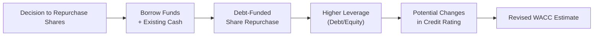

## Introduction
Cost of equity and capital structure decisions can feel pretty abstract, right? Sometimes we see corporate finance research telling us, “Under certain magical conditions, dividends or share repurchases don't matter for firm value.” But in practice, real-world considerations—taxes, agency relationships, credit ratings, signals to the market—make payout decisions central to a firm’s financial strategy. This section analyzes how dividend policy and share repurchases can move the needle on cost of equity, Beta, the weighted average cost of capital (WACC), and the firm’s overall capital structure.

Sure, we’d all like to believe in the neat equations and proofs of Modigliani–Miller (M-M). But let's be honest: we live in a world of taxes, transaction costs, illiquidity, interest rate hikes, and the occasional corporate CFO who changes strategy midyear. So, let’s dive in and see how it all actually comes together.

## Revisiting the Cost of Equity
Cost of equity (rₑ) represents shareholders’ required rate of return. It’s how much investors expect to earn on average for holding equity. A common formula to estimate rₑ is the Capital Asset Pricing Model (CAPM):


r_e = R_f + \beta (R_m - R_f)


• Rᵣ is the risk-free rate.  
• β (Beta) measures the sensitivity of the stock’s returns to the market’s returns.  
• (Rₘ − Rᵣ) is the market risk premium.

Now, a big question is: how might paying dividends (versus repurchasing shares) alter the risk profile, and therefore the Beta, of a firm’s equity? Dividends can be perceived by investors as a signal of financial health, which may lower the perceived riskiness of the firm. But in practice, the story is more nuanced. Returns to shareholders always reduce retained earnings, either as cash dividends or funds spent on share repurchases. That shift often changes the firm’s debt-to-equity ratio, which can increase or decrease the firm’s Beta, depending on how the transaction is financed and how the market interprets the action.

## Dividend Payout Impact on Perceived Risk
Let’s assume a firm increases its dividend payout significantly. Theoretically, this change could:

• Convey confidence in stable, ongoing free cash flow (lower perceived risk).  
• Reduce the firm’s internal funds for reinvestment, potentially requiring additional debt financing or external equity if the firm wants to expand (higher leverage risk).  
• Signal “excess cash” in the mature phase of its growth cycle, which can also be interpreted as fewer investment opportunities or a shift in capital allocation priorities.

In well-developed markets, a higher dividend can calm some investors (e.g., income-focused or risk-averse types) who like more “bird-in-hand” returns, possibly exerting downward pressure on rₑ. Alternatively, heavier reliance on external financing due to less money retained in the firm may push up the firm’s debt ratio. Greater leverage can increase both the Beta of equity and the firm’s overall cost of equity if the additional debt makes the firm riskier.

So there is a bit of a trade-off: cutting dividends might free up cash to pay down debt and lower leverage risk, but it can also aggravate dividend-focused shareholders who might see that cut as a negative signal. The net effect on the cost of equity will hinge on market sentiment, the firm’s capital needs, and its broader strategic posture.

## Real-World Implications of Modigliani–Miller
In an ideal M-M world with no taxes, no transaction costs, and fully efficient markets, the choice between dividends and share repurchases or between high leverage and low leverage wouldn’t matter for total firm value. The cost of equity would adjust in a perfectly offsetting way to changes in capital structure, and the weighted average cost of capital (WACC) would remain constant.

But reality is, well, not so convenient:

• Taxes exist and differ for corporate earnings and personal dividends.  
• Signals in the market strongly influence Beta if the market perceives a dividend policy shift as risk-related.  
• Agency costs shape how managers use free cash flow. Increased payouts can reduce managerial waste but may also limit growth potential if managers forego positive NPV investments.

Hence, M-M is still super useful for building conceptual intuition—but we must fill in the real-world missing pieces like credit rating constraints, interest rate environments, and shareholder preferences.

## Share Repurchases and Capital Structure
Share repurchases can be more flexible than fixed dividend payouts, because a firm can choose to buy back shares when it has excess cash, or even finance part of that buyback with debt. In effect, share repurchases might:

• Increase financial leverage (if part of the repurchase is debt-funded), raising the firm’s risk profile and cost of equity.  
• Send a market signal that the firm’s shares are undervalued, or the firm has more free cash than it needs.  
• Potentially reduce Beta by decreasing outstanding shares if the repurchase is associated with stable corporate fundamentals and a lower risk outlook. Alternatively, if the repurchase is large and financed by new borrowing, the levered Beta can jump.

Over time, a consistent share repurchase program can help maintain some stability in share price, especially if the firm times its repurchases during perceived undervaluation. But with debt-fueled repurchases (rather than just using extra cash), the firm’s leverage ratio creeps up, possibly attracting a higher risk premium from investors.

## Debt-Funded Partial Repurchases
Suppose a company decides to partially repurchase 10% of its outstanding shares and finances half of that transaction with new debt. That new borrowing raises the firm’s debt level. If we measure the firm’s capital structure before and after, we might see:

• Higher debt-to-equity ratio, potentially leading to a downgrade by credit rating agencies if the shift is material.  
• Changes in interest obligations, depending on the cost of new debt.  
• Future limitations on borrowing capacity, which can reduce the firm’s ability to pivot quickly if new projects arise.

Below is a simple diagram showing how a partial repurchase using debt can affect equity, debt, and the overall cost of capital:

As the leverage ratio (D/E) grows, the equity Beta typically increases, raising shareholders’ required returns. The firm must carefully balance the benefits of share buybacks with the costs of higher risk and possibly higher interest rates.

## Global Macroeconomic Factors
It’s not just about the firm itself: global interest rates and market liquidity can be game-changers. If borrowing costs are low—think an environment of historically low interest rates—companies might be more inclined to fund repurchases with debt. But if rates spike (like we sometimes see when central banks tighten monetary policy), the strategy might become prohibitively expensive. Meanwhile, liquidity conditions in the debt market can determine whether large-scale buybacks are practical without incurring excessive borrowing premiums.

## WACC Under Different Payout Scenarios
The weighted average cost of capital (WACC) is a function of the costs of equity and debt, weighted by the proportion each occupies in the capital structure:


\text{WACC} = \frac{E}{E + D} r_e + \frac{D}{E + D} r_d (1 - t)


• E = market value of equity  
• D = market value of debt  
• rₑ = cost of equity  
• r_d = cost of debt  
• t = marginal corporate tax rate

Imagine two different payout approaches:

• Scenario A: High dividends. The firm has less internal cash, can’t finance many projects internally, may need more debt if it wants to seize new opportunities. This higher leverage can push up rₑ and also raise r_d if credit risk concerns appear.  
• Scenario B: Frequent share repurchases. If the firm finances these repurchases partially with debt, the leverage ratio may rise similarly, increasing rₑ. Over time, however, the firm might manage the repurchase pace, avoiding large one-time jumps in leverage.

In practice, we often see that stable dividend-paying companies with steady cash flows and moderate leverage can maintain a relatively low cost of equity because they’re perceived as safer investments. Conversely, companies known for aggressive share repurchase programs can see short-term boosts in equity valuation, but if the repurchases rely heavily on debt, their WACC might eventually climb.

## Trade-Offs: Financial Flexibility vs. Returning Capital
Returning more capital to shareholders can reduce the agency costs that arise when management holds onto too much free cash, which can be used for less productive investments or managerial perks. That’s a plus for shareholders expecting discipline in corporate finances.

On the flip side, distributing capital means the firm might have fewer internal funds to weather economic downturns or jump on strategic acquisitions. The potential trade-off is between:

• Retaining cash (maximizing financial flexibility, but possibly incurring agency problems).  
• Paying out cash through dividends or buybacks (reducing agency concerns, but possibly limiting future growth or pushing the firm toward external financing at higher costs if a big investment comes along).

It’s not always an either–or choice, either. Most large companies set a baseline “safe” dividend policy and then use occasional buybacks to return capital when market conditions are favorable, or the stock appears undervalued. This hybrid approach tries to balance the certainty valued by some investors and the financial flexibility needed for long-term growth.

## Best Practices in Capital Structure Adjustment
I recall once being in a meeting (years ago) with a CFO who joked that “No shareholder ever complains when you give them their own money back—until the next quarter, when you have to borrow more.” That was his cheeky way of highlighting how carefully we need to coordinate payout policy and debt management. Some best practices include:

• Maintaining a target leverage range based on industry norms, volatility of cash flows, and the firm’s appetite for financial risk.  
• Stress-testing WACC under various levels of dividends and share repurchases to see when credit ratings might slip or cost of equity might spike.  
• Communicating transparently with investors about the rationale for dividends vs. buybacks. Investors generally dislike surprises.  
• Considering the maturity profile of debt. If the firm expects interest rates to rise, it might lock in longer-term debt at current rates or avoid new borrowing altogether.

## Common Pitfalls
• Assuming that one-off repurchases will not significantly affect the cost of equity. Debt burdens can accumulate if partial repurchases become habitual.  
• Overestimating the signal effect of a dividend hike. If the firm’s fundamentals do not support the payout, investors may interpret the move as shortsighted, eventually pushing the stock price down.  
• Ignoring the link between new debt and credit rating. Even moderate changes in leverage may tip the firm into a lower rating bracket, raising the cost of debt more than anticipated.  
• Focusing solely on short-term EPS accretion from share buybacks while missing the broader implications for capital structure and risk.

## Conclusion
Dividend payout policies and share repurchases can absolutely influence the cost of equity and, by extension, the firm’s overall WACC. Yes, the underlying logic of M-M can remind us that in a perfect world these mechanics might not matter. But we live in an anything-but-perfect environment where taxes, credit ratings, investor sentiment, market liquidity, and global macro conditions all play roles.

A well-calibrated approach to payouts—balancing the firm’s strategic needs, investor preferences, and risk tolerance—often leads to better outcomes for both shareholders and management. CFOs who get it right tend to avoid unwanted surprises, maintain financial flexibility, and still keep investors satisfied with consistent returns. Ultimately, understanding these choices is vital for analyzing corporate issuers at CFA Level II, especially in scenarios that integrate dividends, share repurchases, risk management, and capital structure decisions all rolled into one.

## References and Further Reading
- CFA Program Curriculum, Level II, “Cost of Capital Implications of Payout Policies.”  
- Ross, Westerfield, and Jaffe. Corporate Finance, chapters on the interaction of capital structure and payout policy.  
- Graham, John R., and Harvey, Campbell R. “The Theory and Practice of Corporate Finance: Evidence from the Field.” Journal of Financial Economics.  

## Practice Questions: Test Your Knowledge on Cost of Equity and Capital Structure



### Which of the following best describes how an increase in the dividend payout ratio might affect a firm’s cost of equity?

- [ ] It has no effect on the cost of equity.  
- [x] It could reduce the perceived risk for certain investors but may lead to higher leverage if less cash is retained.  
- [ ] It always lowers the overall risk of the firm, decreasing both cost of equity and cost of debt.  
- [ ] It drastically reduces Beta to zero.  

> **Explanation:** An increase in dividend payout often signals confidence and reduces some investors’ perceived risk, potentially putting downward pressure on required returns. However, if the firm retains less cash, it may increase leverage when seeking additional financing, which can raise the cost of equity.

### Under Modigliani–Miller propositions (without taxes), which statement aligns with theoretical expectations for payout policy?

- [ ] Paying dividends always decreases the WACC.  
- [x] Payout policy does not affect the firm’s overall value or WACC.  
- [ ] Stock repurchases are strictly better than dividends.  
- [ ] Dividend cuts must increase the firm’s cost of capital.  

> **Explanation:** In a perfect market without taxes or frictions, Modigliani–Miller predicts that payout policy has no effect on firm value or the WACC. Real-world factors such as taxes, agency costs, and market signals can, however, alter outcomes.

### A firm consistently uses large share repurchases financed with debt. Which of the following is a likely long-term effect on the firm’s cost of equity?

- [ ] No long-term effect on cost of equity or Beta.  
- [x] The cost of equity may rise due to increased financial leverage and risk.  
- [ ] The cost of equity will always fall, as share buybacks lower share count.  
- [ ] The cost of equity will be unaffected if the market is efficient.  

> **Explanation:** If the repurchases are debt-funded, leverage increases. Higher leverage raises equity risk, thus increasing Beta and cost of equity.

### When a firm repurchases shares using only excess cash (no new debt), which outcome is most likely?

- [x] The debt-to-equity ratio may decrease if debt stays the same while equity base shrinks.  
- [ ] The debt-to-equity ratio skyrockets because the firm’s risk doubles.  
- [ ] The firm’s WACC must rise because it has fewer outstanding shares.  
- [ ] The cost of equity must rise to match the new capital structure.  

> **Explanation:** Using excess cash for a buyback does not directly raise debt, so the total equity falls while debt remains the same. This can reduce the leverage ratio if the proportion of debt relative to equity remains stable or decreases slightly, though the final effect depends on the market response.

### Which factor commonly influences how a higher dividend payout changes the firm’s capital structure?

- [x] The need for additional borrowing to fund growth projects.  
- [ ] A permanent reduction in the Beta of equity.  
- [x] The possibility of reducing retained earnings, thereby increasing reliance on external capital.  
- [ ] The automatic improvement in the firm’s credit rating.  

> **Explanation:** Paying out more in dividends means the firm retains less cash, so it may rely on more external financing (debt or equity issuance) for future growth. This reliance on external capital can affect leverage.

### If market conditions lead to higher global interest rates, what might be the impact on debt-funded repurchases?

- [x] The cost of new debt rises, making such repurchases potentially less attractive.  
- [ ] The firm’s cost of equity automatically falls.  
- [ ] The repurchases become cheaper to finance since the stock price is higher.  
- [ ] No impact on the cost structure or WACC.  

> **Explanation:** Higher interest rates increase the cost of borrowing. That makes debt-funded repurchases more expensive, potentially raising WACC and reducing the attractiveness of the buyback strategy.

### Which statement highlights an agency cost rationale for higher shareholder payouts?

- [x] Larger payouts reduce cash under managerial control, minimizing the possibility of wasteful spending.  
- [ ] Larger payouts always increase the firm’s net income.  
- [x] Larger payouts help managers retain earnings for future projects.  
- [ ] Larger payouts automatically reduce the firm’s cost of debt.  

> **Explanation:** By returning surplus cash to shareholders, the firm reduces the potential for managers to allocate resources to suboptimal or non-value-adding projects, addressing some agency cost issues.

### A partial share repurchase financed 50% by new debt is likely to:

- [ ] Have zero effect on the credit rating if the market is efficient.  
- [ ] Always lower the WACC because the tax shield from debt grows.  
- [x] Raise the leverage ratio, with potential implications for credit rating and cost of debt.  
- [ ] Permanently eliminate the need for future equity financing.  

> **Explanation:** New debt used to buy back shares instantly increases financial leverage, which can trigger a higher risk perception and a possible credit rating downgrade, raising the firm’s cost of debt.

### Which of the following is a typical reason firms might prefer share repurchases rather than dividends?

- [x] They believe the stock is undervalued.  
- [x] Some shareholders owe lower taxes on capital gains than dividend income.  
- [ ] They want to show that dividends are worthless.  
- [ ] They have no intention of signaling anything to the market.  

> **Explanation:** Firms often use share buybacks to signal undervaluation and to provide a tax-advantaged return for shareholders who prefer capital gains over dividends.  

### In assessing how payouts affect the firm’s Beta, which statement is most accurate?

- [x] Changing the capital structure through higher debt can lead to a more levered Beta.  
- [ ] Dividends have no influence on firm risk.  
- [ ] Capital structure changes only matter for short-term Beta calculations.  
- [ ] Issuing debt never alters the firm’s equity risk profile.  

> **Explanation:** A firm that introduces or increases debt typically raises its financial leverage, increasing the volatility of equity returns and thus elevating the firm’s levered Beta.


