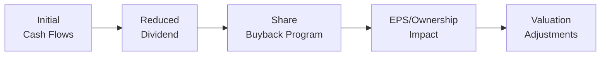

## Introduction and Key Considerations

So, we’ve all been there—staring at a lengthy item set on the CFA exam about a company’s dividend and buyback policy, feeling a bit overwhelmed by the swirl of numbers (EPS, free cash flow, tax rates, cost of capital, and so on). You know you’re supposed to piece it all together, but where do you even start? In this section, we’ll tackle advanced payout vignette exercises head-on, applying formulas like the Dividend Discount Model (DDM), Free Cash Flow to Equity (FCFE), and Weighted Average Cost of Capital (WACC) to figure out how dividend and repurchase decisions can rock a firm’s valuation.

We’ll also explore the interplay among corporate actions such as funding capital expenditures, maintaining sustainable dividend coverage, and managing capital structure. Along the way, we’ll talk about potential misalignments between management and shareholders (you know, the classic manager-wants-a-bigger-jet sort of scenario). Don’t worry; we’ll keep it friendly and straightforward, peppering in a few personal insights and time-management hints so you can stay calm under exam pressure. 

## Dissecting an Advanced Payout Vignette

Exam vignettes often throw a ton of data at you:  
• Dividend per share history, growth rates, or planned changes.  
• Share repurchase announcements (e.g., open-market, tender offers).  
• Capital structure info: debt levels, interest rates, and coverage ratios.  
• Tax rates for dividends vs. capital gains (double taxation or imputation systems).  
• Corporate strategy elements—maybe management wants to fund a big acquisition or new product line.  

Your job is to pick out the gold nuggets of information and map them to formulas. At Level II, it’s about taking multiple pieces of corporate finance knowledge—dividend policy, capital budgeting, cost of equity, capital structure—and forging them into an integrated analysis.

### Practical Tip: Organize Key Facts Quickly

One fiercely helpful exam strategy: within the first 30 to 60 seconds of reading the vignette, scribble a quick bullet list of the major data points. Jot down EPS, DPS (dividends per share), share price, cost of equity, WACC, growth rates, and relevant tax rates. That way, your brain has a handy reference without having to scan the text again and again. Then, as you read further, tie each piece to the formulas or conceptual frameworks you’ll need.

## Core Formulas for Payout Evaluations

When dealing with advanced payout vignettes, you’ll often need a combination of these formulas:

1. Dividend Discount Model (DDM)  
   The basic constant-growth DDM is:  
   
   P_0 = \frac{D_1}{(r - g)}
     
   where \\(D_1\\) is the dividend expected next period, \\(r\\) is the required return on equity (cost of equity), and \\(g\\) is the sustainable dividend growth rate.  

2. Free Cash Flow to Equity (FCFE) Valuation  
   Alternatively, the equity can be valued using free cash flow to equity discounted at the cost of equity:  
   
   \text{Equity Value} = \sum_{t=1}^{\infty} \frac{\text{FCFE}_t}{(1 + r)^t}
     
   This approach might be used if the company’s dividend policy does not reflect its true capacity to pay dividends (for example, if the firm retains large amounts of cash but pays a small dividend).

3. Weighted Average Cost of Capital (WACC)  
   For the big-picture perspective on the firm’s valuation (including debt financing), you’ll see:  
   
   \text{WACC} = \left(\frac{E}{E + D}\right) r_e + \left(\frac{D}{E + D}\right) r_d (1 - T)
     
   Here, \\(E\\) is equity market value, \\(D\\) is debt market value, \\(r_e\\) is cost of equity, \\(r_d\\) is cost of debt, and \\(T\\) is the corporate tax rate.

4. Sustainable Payout Ratio  
   The sustainable payout ratio comes from balancing the firm’s retained earnings needed for growth and the desire to distribute. If management sets dividends such that growth is funded internally, we have:  
   
   \text{Retention Ratio} = 1 - \text{Payout Ratio}
     
   Then, the firm’s growth could be approximated by:  
   
   g \approx \text{ROE} \times \text{Retention Ratio}
   

5. EPS and Share Buyback Loads  
   When a firm repurchases shares, it can increase EPS (simply due to fewer shares outstanding), although the effect on valuation depends on the repurchase price vs. intrinsic value.  

## Story Time: A Small Anecdote on Payout Policy

I remember once chatting with a CFO who was grappling with a long-standing high dividend policy. The board was convinced the stock price would take a hit if they dared reduce the payout. But guess what? The CFO pointed out that the firm had a bunch of potential growth projects that could generate returns above its 12% cost of equity. She pitched a partial pivot: lower the dividend and redirect half of those funds to share repurchases, half to project investments. The result? Over time, the share price improved because earnings growth outpaced the effect of reduced dividends. It was a perfect real-life illustration of how “less on dividends, more on growth” can sometimes create higher overall shareholder value—if well executed.

## Step-by-Step: Valuing a Pivot from High Dividends to Buybacks

Let’s do a hypothetical example that might mirror what you’ll see in advanced exam vignettes. Suppose you have the following data:

• Current EPS: \$5.00  
• Current Dividend per Share (DPS): \$3.00  
• Number of Shares Outstanding: 100 million  
• Cost of Equity (r): 10%  
• Perpetual Growth Rate (g): 3%  
• Corporate Tax Rate: 25%  
• The firm is considering shifting from \$3.00 DPS to \$1.50 DPS and using the saved \$1.50 per share for a share repurchase program.  

Now, if the firm stuck to its \$3.00 DPS policy, we might apply a simple constant-growth DDM to get an indication of the equity value.

### Calculating Value Under the Original High Dividend Policy

Expected next dividend \\( D_1 = \$3.00 \times 1.03 = \$3.09 \\). Then, using constant growth DDM:


P_0 = \frac{3.09}{0.10 - 0.03} = \frac{3.09}{0.07} \approx \$44.14


That’s a rough estimate of the per-share intrinsic value purely from a constant-growth dividend perspective. The market cap under this scenario would be roughly \$44.14 × 100 million shares = \$4.414 billion.

### Calculating Value Under the New Dividend + Buyback Strategy

Under the new plan, the dividend per share would be \$1.50 initially, presumably growing at 3% in perpetuity. So:


D_1 = 1.50 \times 1.03 = \$1.545


P_0 = \frac{1.545}{0.10 - 0.03} = \frac{1.545}{0.07} \approx \$22.07


That’s obviously lower. But wait, the difference is that we’ve only valued the dividend portion here. The leftover \$1.50 per share is used to buy back shares. How do we incorporate that? Usually, with a buyback, the total market cap might remain the same, but the share count decreases, possibly boosting intrinsic value per share for those who hold on.

A simplified approach is to assume the \$1.50 “excess” is essentially returned to shareholders each year via an ongoing buyback. That can raise the share price because the total equity pie is distributed among fewer shares.

One route to do the next-level analysis is to treat the buyback portion as an additional yield to shareholders. Alternatively, you can reduce the total share count and recalculate the equity value per share. In a real exam vignette, your steps might look like this:

1. Calculate total cash allocated to buybacks ( \$1.50 × 100 million = \$150 million per year).
2. Estimate how many shares that amount can repurchase each year (based on the share price).
3. Project the revised EPS and DPS in subsequent years with decreasing share count.
4. Use a multi-stage or FCFE approach to see how the evolving share count affects the leftover cash flow.

It can get a bit complicated, but the gist is that if the repurchase price is at or below intrinsic value, it tends to boost the per-share metrics for remaining shareholders. The exam might ask for the difference in per-share valuations or the effect on EPS, or simply which policy yields the greatest total shareholder return after taxes.

## Timeline Analysis in Payout Decisions

Sometimes, you’ll see a timeline of planned dividends and buybacks spanning several years. You may have to track how those payouts change the firm’s capital structure or how they influence the share price. Below is a simplified Mermaid flowchart showing how a firm transitions from initial cash flows to final valuation adjustments in a combined dividend-and-buyback scenario:

In the exam, you might see year-by-year data on free cash flow, planned investments, taxes, and shares outstanding. Keep track carefully. Even small details like the date a buyback occurs can affect the average share count for the year, which in turn alters EPS. Don’t let that trip you up—focus on the question asked: it may only be about final-year share counts or year-end dividend totals.

## Funding Growth vs. Returning Cash

Be prepared to address what happens if a firm chooses to distribute a large portion of cash instead of reinvesting in projects. If the firm’s Weighted Average Cost of Capital is 8%, and it foregoes a project that could earn 12%, that’s a 4 percentage-point incremental return it’s missing out on—an opportunity cost of funds. Vignette questions might explicitly ask you to calculate the net present value (NPV) of the foregone projects and weigh that against the “immediate gratification” of a buyback or dividend. Also, watch for whether the firm is issuing new debt to finance a payout; that can change the WACC, and possibly the entire capital structure dynamic.

## Misaligned Incentives and Ownership Structure

Sometimes, management holds significant equity or gets bonuses based on EPS growth. So an executive might prefer buybacks to artificially inflate EPS (which may or may not truly boost fundamental value). A good exam question might ask how insider ownership or compensation structure influences the recommended payout policy. If management is protective of dividends because many employees also hold shares (and rely on dividend income), that can create a potential conflict between investing in the firm’s future versus paying out now.

## Integrating Double Taxation, Sustainable Ratios, and Cost of Capital

At Level II, you also have to handle complexities like double taxation of dividends. If the firm pays a dividend that is taxed at the corporate level (for the retained earnings) and then again at the shareholder level, the net benefit to shareholders might be less than a capital gain from a buyback (assuming capital gains tax rates are lower). 

When you read an exam vignette that lumps all these ideas together—dividend taxes, repurchase taxes, WACC changes due to leveraged recap, insider holdings, the potential for growth—try to break it down systematically:

1. What is the nature of the payout (dividend vs. repurchase)?  
2. What are the relevant tax treatments for each?  
3. How does each option impact share price, EPS, or overall capital cost?  
4. Is the payout ratio sustainable given projected free cash flow and capital expenditures?  
5. Do misaligned incentives lurk anywhere, and if so, how might they affect the outcome?

## Time Management in Lengthy Item Sets

• Read question stems first: Some candidates like to glance at the multiple-choice questions before deep-diving into the vignette. That way, they know what they’re looking for: Are the questions about EPS changes? Are they about after-tax returns from dividends? That method can boost efficiency.  
• Focus on the relevant data: Resist the urge to get lost in extraneous info. If the question revolves around cost of equity, identify that cost of equity from the text quickly and skip the rest until you actually need it.  
• Keep an eye on your watch: The item set format can be time-consuming due to large passages. If you find yourself stuck on one detail, it might be more efficient to jump to the next question and come back later.

## Putting It All Together

Advanced payout vignettes are not just about memorizing formulas; they’re about weaving together multiple angles—taxes, growth, managerial incentives, ownership structure, and strategic capital allocation. As you attempt practice problems, challenge yourself to dissect each detail:

• Where is the big chunk of the firm’s free cash flow going?  
• Which channel of returning cash is more tax-efficient?  
• Are capital expenditures or acquisitions taking a backseat to these payouts?  
• What’s the underlying cost of capital, and are we actually maximizing the firm’s value?

Try a variety of practice item sets that require you to juggle these aspects. And always remember to keep it simple: identify the main question, outline your approach, compute carefully, and interpret the results in the context of the firm’s long-term value.

## References and Further Reading

• Official CFA Program Mock Exams and Practice Item Sets – excellent for advanced payout and valuation scenarios.  
• Schweser or Wiley supplemental practice materials with a focus on Corporate Issuers – extra item-set practice.  
• Journal of Corporate Finance – for up-to-date academic case studies on dividend and share repurchase strategies.

----------------------------------------------------------------------------------

## Advanced Payout Vignette Exercises: Test Your Knowledge



### Which valuation model is commonly used to assess stock value when future dividends grow at a constant rate?

- [ ] Free Cash Flow to the Firm model
- [ ] Residual Income model
- [x] Dividend Discount Model
- [ ] Capital Asset Pricing Model

> **Explanation:** The Dividend Discount Model (DDM) is the go-to model for valuing a stock when it pays dividends that grow at a constant rate.  

### A company currently pays out most of its cash as dividends. Management considers pivoting to a partial share buyback program. Which of the following factors is most critical to examine first when evaluating this change?

- [ ] The level of management ownership
- [x] The expected impact on the firm’s cost of equity and valuation
- [ ] Whether the CFO has prior experience with share repurchases
- [ ] The training of operations staff to handle fewer shares outstanding

> **Explanation:** While management ownership is relevant, the first analysis typically involves how a shift in payout policy affects the company’s valuation and cost of equity.  

### In calculating total returns for a shareholder, which statement is most accurate with respect to dividends versus share buybacks?

- [x] Share buybacks can offer tax advantages if capital gains taxes are lower than dividend taxes.
- [ ] Dividends are always more beneficial for shareholders than buybacks.
- [ ] A buyback has no impact on EPS, only dividends do.
- [ ] Tax considerations rarely affect the net result for the shareholder.

> **Explanation:** One key advantage of buybacks is the potential for lower taxation (assuming capital gains rates are lower than dividend rates). The effect on EPS can be positive if shares are purchased below intrinsic value.  

### A firm’s management is deciding between paying a cash dividend or initiating a share repurchase. The firm’s cost of equity is 9%, and its growth opportunity IRR is 12%. Which statement best captures the “opportunity cost of funds”?

- [ ] Paying dividends is best because it sends a positive signal to the market.
- [x] Retaining earnings to invest in projects at 12% IRR may create more value than returning cash.
- [ ] The firm must pay dividends because cost of equity is only 9%.
- [ ] Repurchasing shares when IRR is higher is automatically the best choice.

> **Explanation:** If the internal growth opportunity yields 12% and the cost of equity is 9%, the firm can potentially generate a net benefit (IRR - cost of equity) by investing in the project. Therefore, distributing funds instead of investing might pose an opportunity cost.  

### Double taxation of dividends implies what?

- [x] Earnings are taxed at the corporate level, and dividends are taxed again at the shareholder level.
- [ ] The firm must pay taxes on buyback proceeds.
- [ ] Shareholders must pay two forms of capital gains taxes.
- [ ] Taxation is doubled if the firm invests payouts in new projects.

> **Explanation:** Double taxation means income is taxed once at the corporate level and again when distributed to shareholders as dividends.  

### Suppose a company is valued using a constant-growth DDM at \$50 per share. If the firm drastically reduces its dividend and shifts to a large buyback schedule, what immediate effect might the basic DDM model show?

- [ ] Higher share price under DDM
- [x] Lower computed share price because the model only captures dividends directly 
- [ ] No change in computed share price
- [ ] Increase in the discount rate

> **Explanation:** A straightforward DDM calculation would show a lower price if dividends are drastically cut. However, that model might understate total value because it fails to incorporate the effect of buybacks.  

### If management’s compensation is tied primarily to achieving higher EPS, how might this create a misalignment with long-term shareholder value?

- [x] Management could use buybacks to boost EPS artificially, even if the firm is not actually creating value.
- [ ] Management will always pay out all earnings as dividends.
- [x] Management compensation plans never affect payout decisions.
- [ ] Executive stock options must be canceled if EPS rises.

> **Explanation:** Tying pay to EPS can encourage buybacks that reduce share count and inflate EPS. This may not necessarily maximize the firm’s fundamental value.  

### In a complex vignette, the exam question asks you to project share count over three years if the firm allocates a fixed dollar amount to buybacks each year. Which step is most critical?

- [x] Determining the purchase price used for each annual share repurchase
- [ ] Assuming shares are canceled only at maturity
- [ ] Ignoring the cost of equity and focusing solely on dividends
- [ ] Doubling the share count at the end of the third year

> **Explanation:** The repurchase price each year determines how many shares can be bought back, thus affecting the share count and EPS projections.  

### With high insider ownership, what is one common consideration regarding payout decisions?

- [x] Insiders might resist dividend cuts if they rely on dividend income.
- [ ] Insiders typically prefer lower share prices to accumulate more shares.
- [ ] High insider ownership automatically eliminates misaligned incentives.
- [ ] Payout decisions have no effect on insider holdings.

> **Explanation:** If insiders own a large portion of shares, they might prioritize stable or high dividends to receive steady income, potentially at the expense of reinvestment.  

### True or False: A firm that chooses to fund a buyback by issuing new debt will not alter its WACC.

- [x] True
- [ ] False

> **Explanation:** This can be a tricky point. Depending on the debt issuance scale and interest rate, WACC could indeed change. However, in some simplified exam assumptions, we might assume no significant impact on WACC or the question might lead us to ignore changes in capital structure. It’s critical to read the vignette carefully—sometimes the exam specifically states the new debt is at the same interest rate, leading to minimal changes in the weighted cost of capital. Always confirm the question’s assumptions.  


