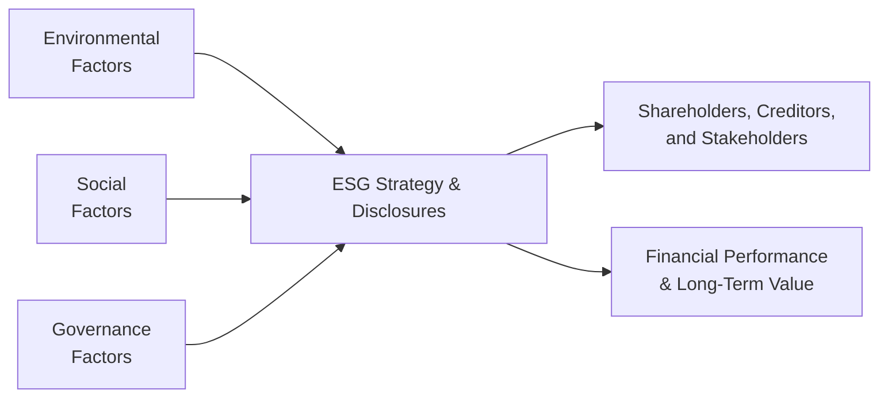

## The Evolving Role of ESG in Corporate Finance

Environmental, Social, and Governance (ESG) topics used to be considered “nice to have” but not central to corporate finance—sort of like an afterthought, right? Well, not anymore. As global stakeholders demand transparency, corporate accountability, and responsible resource management, ESG factors have grown from a side conversation into a key driver of risk management and value creation. Honestly, it's become impossible to talk about long-term corporate sustainability without addressing ESG in some capacity.

Below, we’ll explore why ESG matters, how to distinguish its components, and how firms can measure, benchmark, and incorporate these factors into strategic decisions. Along the way, we’ll discuss how you, as a future CFA charterholder, could face ESG-based questions in a typical item set—and we’ll share some personal insights that (I hope) make this topic a bit more accessible and even fun to learn.

## Traditional Financial Metrics vs. ESG Factors

When analysts evaluate a company, they usually begin with standard metrics such as revenue, net income, and cash flow. These metrics tell us about a firm’s historic performance and, to some degree, its future prospects under “business as usual.” However, “business as usual” can be misleading if it neglects, say, the company’s carbon footprint or labor relations controversies. One might look at a firm’s cost of goods sold or operating margin and totally miss the fact that poor environmental practices are threatening its brand reputation.

ESG factors, therefore, complement traditional financial analysis. They help us see how a company interacts with the world—whether it’s polluting local water supplies, exploiting labor, or backdating stock options for executives. Incorporating this kind of insight can significantly alter a company’s perceived value, either by uncovering hidden risks or shining a light on potential new opportunities.

## Breaking Down ESG

### Environmental Considerations
The “E” captures how a company interacts with the natural environment. Let’s say a friend of mine once invested in a quick-service restaurant chain known for its high carbon emissions—it stored far more inventory under refrigeration than industry peers, and its packaging was notoriously wasteful. Initially, everything seemed fine: short-term margins looked solid. But eventually, negative press about the company’s environmental impact caught up, leading to brand damage, consumer boycotts, and even new regulatory fines. Boom—stock price took a hit. 

Environmental factors include:  
• Greenhouse gas emissions and carbon footprint  
• Waste and pollution management  
• Energy use and efficiency measures  
• Resource conservation and recycling efforts  
• Water usage and the impact on local ecosystems  

### Social Factors
The “S” in ESG is sometimes the hardest to quantify, yet it’s always top-of-mind when controversies erupt. For instance, imagine a tech firm underpaying overseas factory workers. Once that story breaks out publicly, the backlash can shake customer loyalty, hamper hiring, and cause disruptions.  

Social dimensions often revolve around:  
• Employee relations, diversity, and inclusion  
• Data protection and privacy (particularly relevant for tech)  
• Local community engagement and philanthropy  
• Product safety and supply chain standards  
• Human rights compliance  

The payoff for strong social practices is often intangible at first—like better employee morale or a glowing public image. But many studies suggest that socially responsible companies enjoy higher customer loyalty and even better financial resilience over time.

### Governance Factors
Governance is the “G” that holds everything together. It refers to the structures, policies, and practices that steer a company’s strategic direction and accountability. You might see it in how the board exercises oversight, how executives are compensated, or how clearly a company reports performance.  

Key governance elements typically include:  
• Board composition and independence  
• Executive compensation structure  
• Shareholder rights and engagement practices  
• Internal controls, audit committees, and risk management policies  
• Anti-corruption measures and ethical guidelines  

Governance issues can sink a company practically overnight if internal fraud is uncovered. Simply put, “G” sets the tone for how a firm manages both its “E” and “S” components.

## Why ESG Is Gaining Traction

You might ask: “So, what’s driving the shift toward ESG integration?” Well, there’s the social consciousness factor—investors, consumers, and employees who simply want to do the right thing. But it’s also an economic reality. Regulatory pressure is growing worldwide. Asset managers see how climate risks or labor controversies can translate into major financial losses. And a company can’t effectively plan its long-term strategy if it’s ignoring climate change regulations or stakeholder demands for fair labor practices.

Moreover, large institutional investors (like pension funds) increasingly consider ESG aspects when allocating capital. If your company lacks an ESG strategy, you might literally miss out on billions in funding from managers who use ESG filters to screen potential portfolio holdings.

## Measuring and Monitoring ESG Performance

One of the challenges is that ESG data isn’t as standardized as financial statements. You might see two rating agencies produce wildly different ESG scores for the same firm, which can feel quite frustrating. Still, a few global frameworks help bring some consistency:

- **Global Reporting Initiative (GRI)**: A widely adopted framework for sustainability reporting, focusing on developing standardized metrics.  
- **Sustainability Accounting Standards Board (SASB)**: Provides industry-specific standards for reporting financially material sustainability data.  
- **Task Force on Climate-Related Financial Disclosures (TCFD)**: Offers guidance on reporting climate-related risks and opportunities, including scenario analysis and stress testing.

Companies often publish annual or semi-annual ESG reports reflecting their initiatives, targets, and progress. Third-party rating agencies (like MSCI, Sustainalytics, or Bloomberg) use these disclosures—plus interviews, site visits, and external sources—to assign an ESG score or rating. In a typical CFA exam context, you may see a vignette describing a firm’s rating from multiple agencies, and you’ll have to interpret which rating is more relevant or how the firm can improve its score to enhance investor perceptions.

Below is a simplified conceptual diagram showing how ESG factors flow into strategy, reporting, and stakeholders’ decisions:

In practice, each factor can significantly influence corporate policies and the firm’s financial outcomes. For instance, stronger environmental practices (reducing emissions) often reduce regulatory risks, while stronger social practices can limit reputational damage and lower turnover costs. Good governance fosters decision-making transparency that’s more likely to keep all stakeholders satisfied.

## ESG: Risks and Opportunities

### Potential Risks
• Reputational Damage: Negative media coverage about poor ESG practices can severely hurt brand value.  
• Regulatory Fines: Stricter environmental or labor regulations may impose fines for noncompliance.  
• Legal Liabilities: Discrimination or poor governance might lead to lawsuits or sanctions.  
• Capital Access: Weak ESG profiles can increase financing costs or lock firms out of certain funding opportunities.

### Potential Opportunities
• Attracting Investors: A robust ESG profile could unlock new capital from ESG-focused funds.  
• Innovation and Efficiency: Environmental initiatives often spur cost-saving innovations in packaging, energy use, etc.  
• Brand Loyalty: Ethical and sustainable practices can boost consumer trust.  
• Long-Term Growth: Engaging local communities and employees can lead to more stable, sustainable operations.

## Short-Term vs. Long-Term Impact

Companies sometimes balk at ESG spending because those initiatives might be expensive up front. For instance, installing a solar power system or offering robust employee benefits could dent near-term profitability. However, from a long-term perspective, such ESG investments can lower volatility, reduce risks, and potentially create new revenue streams. 

In the CFA exam context, you may be asked to evaluate trade-offs—like how a proposed sustainability project impacts cost of equity or how social controversies might affect a discounted cash flow (DCF) estimation. Keep in mind that ESG integration isn’t just about feel-good narratives; it’s also about balancing short-term margins with the firm’s long-term resilience.

## The Future of ESG Integration

ESG is making its way into fundamental analysis, credit risk assessments, scenario planning, and day-to-day corporate operations. For many professionals, understanding ESG is now as vital as understanding basic accounting. If a CFO fails to account for carbon taxes in scenario analysis, that CFO might be blindsided by future regulatory costs. Likewise, a board that overlooks cultural diversity might suffer from groupthink, diminishing the company’s innovative potential.

In exam scenarios, you might encounter a question that references greenhouse gas regulations in a hypothetical country flare-up or a social media–fueled boycott. The test will often incorporate ESG angles to see if you can spot the relevant ESG issues, apply sound corporate finance logic, and recommend appropriate actions. 

## Best Practices and Common Pitfalls

• **Start With Materiality**: Focus on ESG factors that truly matter to the firm’s core operations. A software company, for instance, might focus more on data privacy than on water usage.  
• **Set Clear Targets and Disclose Progress**: Investors appreciate goals that are measurable (e.g., reducing carbon emissions by 20% in five years).  
• **Avoid Greenwashing**: Merely talking about ESG without substance can backfire if stakeholders realize the claims are superficial.  
• **Monitor Regulatory Changes**: ESG regulation is expanding quickly. Companies that anticipate changes stand to avoid fines and gain first-mover advantage.  
• **Encourage Independent Oversight**: Strong governance often means independent board members and robust internal controls.  

## Exam-Day Tips for ESG Analysis

• Scan the vignette carefully for ESG clues—like mentions of environmental fines or social disputes.  
• Assess whether these ESG issues present a material risk or a new strategic opportunity.  
• Consider how the short-term and long-term repercussions might differ, particularly in a valuation question.  
• Link ESG outcomes to cost of capital changes. For instance, poor ESG might increase the equity risk premium or lead to higher financing costs.  
• If you see references to a third-party ESG rating, pay attention to the specific areas where the firm was rated poorly or strongly. That might be your key to recommending improvements on the exam.  

## Glossary

• **ESG (Environmental, Social, Governance)**: A framework that looks beyond financial metrics to evaluate sustainability, societal impact, and corporate oversight.  
• **GRI (Global Reporting Initiative)**: International standards developer that guides sustainability reporting on key metrics.  
• **SASB (Sustainability Accounting Standards Board)**: Issues standards to help businesses disclose financially material sustainability information.  
• **TCFD (Task Force on Climate-Related Financial Disclosures)**: Provides recommendations for transparent reporting of climate-related risks.  
• **Rating Systems (ESG Scores)**: Third-party evaluations (e.g., MSCI, Sustainalytics) that measure corporate ESG performance relative to peers.  
• **Materiality**: The degree to which a topic or risk can influence a firm’s financial results or operational stability.  
• **Sustainability**: Balancing present needs without jeopardizing future resources or stakeholder welfare.  
• **Impact Investing**: Investments made with the intention of generating a positive social or environmental impact alongside financial returns.

## References & Further Reading

• CFA Institute, “ESG Investing and Analysis” in the CFA Program Curriculum.  
• Global Reporting Initiative (GRI): https://www.globalreporting.org/  
• Sustainability Accounting Standards Board (SASB): https://www.sasb.org/  
• Task Force on Climate-Related Financial Disclosures (TCFD): https://www.fsb-tcfd.org/  

## ESG Knowledge Check: Sample Exam Questions



### Which of the following best describes the relationship between ESG factors and traditional financial metrics?

- [ ] ESG factors are never material to a company’s financial performance.  
- [ ] ESG factors only impact long-term financial performance, not short-term results.  
- [x] ESG factors can complement traditional metrics by identifying additional risks and opportunities.  
- [ ] ESG factors are only relevant for companies in heavily regulated industries.  

> **Explanation:** ESG factors can uncover risks or enhance value beyond what’s shown in traditional financial statements. They’re increasingly considered relevant across various industries.

---

### Which of the following most accurately characterizes governance (“G”) in ESG?

- [ ] Policies that only affect environmental and labor practices.  
- [ ] The company’s overall commitment to philanthropy.  
- [x] The structures, policies, and controls guiding corporate decision-making.  
- [ ] A mechanism for improving social justice issues in the local community.  

> **Explanation:** Governance focuses on oversight and accountability, including board practices, executive compensation, and transparency. It underpins how the firm is managed at the highest level.

---

### A tech hardware company faces potential legal action due to inhumane working conditions at a supplier’s factory. Which ESG category is most directly implicated?

- [ ] Environmental  
- [x] Social  
- [ ] Governance  
- [ ] Tax policy  

> **Explanation:** Employee conditions at a supplier’s location fall under social factors, as they involve labor rights, worker safety, and ethical sourcing.

---

### A firm’s ESG rating slipped due to numerous cybersecurity breaches and data protection issues. Under which ESG factor would these issues most likely be classified?

- [ ] Environmental, because they relate to resource usage.  
- [x] Social, due to data privacy and stakeholder trust considerations.  
- [ ] Governance, because it deals with leadership and audits.  
- [ ] None of the above.  

> **Explanation:** Data privacy and security primarily relate to social factors, reflecting the relationship between the company and its stakeholders, especially customers.

---

### In a potential exam vignette, a firm invests heavily in clean energy to reduce emissions by 30% over five years. Which statement best captures the short-term vs. long-term ESG tradeoff?

- [ ] The investment automatically hurts short-term profits but guarantees higher short-term share price.  
- [x] The project may depress short-term margins but could lower regulatory and reputational risks in the long run.  
- [ ] This investment has no impact on long-term operating expenses.  
- [ ] ESG investments do not affect overall capital budgeting decisions.  

> **Explanation:** Clean energy projects might increase upfront expenses, negatively affecting short-term earnings, but they can pay off by reducing future risks and improving brand image in the long run.

---

### The Task Force on Climate-Related Financial Disclosures (TCFD) primarily provides:

- [ ] Guidance on anti-corruption efforts within corporate boards.  
- [ ] Methods to assess supply chain labor practices.  
- [x] A framework for reporting climate-related risks and opportunities.  
- [ ] A marketing platform to advertise carbon offsets.  

> **Explanation:** TCFD focuses on climate issues and how companies should disclose their exposure, risk management, and future climate-related strategies.

---

### Which of the following is a common pitfall when companies implement ESG policies?

- [x] Greenwashing, or overstating the positive impact of their environmental initiatives.  
- [ ] Setting strict timelines and transparent reporting metrics.  
- [ ] Holding management accountable through strict governance measures.  
- [ ] Adopting globally recognized reporting standards such as GRI or SASB.  

> **Explanation:** Greenwashing is a major pitfall, as it involves misleading claims about sustainability efforts that aren’t backed by real changes or data.

---

### ESG factors can influence the cost of capital by:

- [x] Reducing perceived risk if the firm has strong ESG performance.  
- [ ] Increasing risk premiums for high-scoring ESG companies.  
- [ ] Eliminating the need to use debt financing altogether.  
- [ ] Irreversibly raising WACC for all companies.  

> **Explanation:** Firms with strong ESG performance often benefit from lower perceived risk, which can translate into a lower cost of equity or borrowing. Conversely, weak ESG can push up financing costs.

---

### Which statement below correctly explains the materiality concept in ESG?

- [ ] All ESG factors are material to all companies.  
- [ ] Materiality refers to the guaranteed short-term impact on stock price.  
- [ ] Materiality only applies to philanthropic donations.  
- [x] Material ESG issues are those that could significantly influence a firm’s financial or operational performance.  

> **Explanation:** The concept of materiality ties ESG issues to potential real-world impacts on a firm’s value or operations, making certain factors more relevant than others depending on industry and strategy.

---

### True or False: Companies with strong ESG profiles always have higher stock valuations than those with weaker ESG profiles.

- [x] True  
- [ ] False  

> **Explanation:** While “always” might be too strong a word in everyday conversation, in exam contexts and many empirical studies, companies demonstrating strong ESG generally enjoy higher valuations or at least reduced downside risk over the long term. Of course, real-world market behavior can vary, but the CFA curriculum often presents this as a recognized trend.


