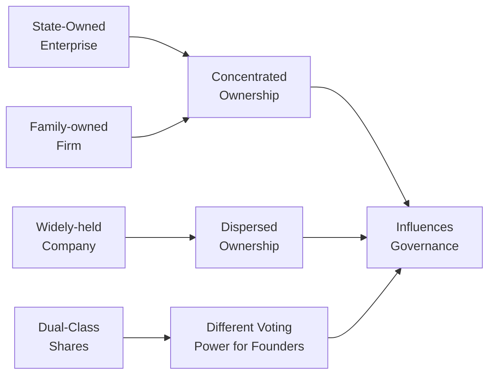

## Introduction
Have you ever been in a meeting where someone casually says, “Well, our biggest shareholder wants X, so that's that”? I remember having coffee with a friend who worked at a large family-controlled firm—she kept complaining that whenever the patriarch made a decision, the rest of the board pretty much just saluted and carried on. It’s fascinating how ownership structures can make or break the entire dynamic of corporate governance.

In the context of ESG (Environmental, Social, and Governance) strategies, these ownership nuances become even more pronounced. A company’s ownership structure influences everything from how boards are formed, to the speed and agility of strategic decisions, to how minority shareholders are treated. Around the world, we see an incredible array of ownership models: state-owned enterprises, tight-knit family businesses, dispersed shareholding in public markets, and even dual-class structures where some shareholders wield more voting weight than others. Let’s dive into how these different setups shape governance practices, cultural norms, and global regulations. 

## Ownership Structures Across the Globe

### State-Owned Enterprises
State-owned enterprises (SOEs) are partly or wholly controlled by governments. You might see these in strategic sectors like energy, infrastructure, or defense. SOEs often have objectives that go beyond profit-making. For instance, they might need to support public policy goals such as employment or regional development.

From a governance standpoint, SOEs typically have boards that include government representatives or politically appointed directors. In many cases, this can mean decisions are influenced by political pressures rather than pure shareholder returns. On the ESG front, SOEs sometimes lead the way on environmental or social initiatives (especially if the government wants to showcase modernization), but they can also suffer from bureaucracy, conflicts of interest, or limited oversight if the state wields overwhelming influence.

### Family-Controlled Firms
In many markets—particularly in Asia, Latin America, the Middle East, and parts of Europe—family-controlled businesses remain the backbone of corporate activity. Often, the founding family holds a large equity stake, appoints family members to senior management, and retains significant authority over strategic decisions.

This setup can be advantageous when the family has a long-term vision and invests heavily in the business. The sense of legacy can incentivize good stewardship. But it can also create governance challenges if nepotism, lack of external oversight, or conflicts among family members occur. Investors often worry about the protection of minority shareholders in family-run firms, especially where transparency may be less robust.

### Widely Held Companies
In widely held firms, ownership is dispersed among many individual and institutional shareholders. No single shareholder or small group typically holds enough voting power to dominate company decisions. This is quite common in the United States and the United Kingdom, although institutional investors (like pension funds and asset managers) may collectively hold significant stakes.

Widely held structures usually promote stronger checks and balances: a robust board, clear shareholder voting rights, and a relatively transparent governance framework. However, with such dispersed ownership, shareholders might not have strong incentives to actively monitor management (the classic “free-rider” problem). That’s why external governance codes and regulations (like Sarbanes–Oxley in the United States) become critical in keeping everyone honest.

### Dual-Class Structures
Dual-class structures allow certain share classes to carry more voting rights. Founders or controlling parties often use these structures to retain control even after selling economic stake to public investors. Major tech companies—like Google (Alphabet) or Facebook (Meta)—used dual-class share structures to ensure founders keep decision-making authority. 

For ESG-minded investors, dual-class structures can make it tough to influence corporate policies, even if the controlling shareholders’ strategy clashes with minority shareholders’ preferences. WeWork’s failed IPO is a cautionary tale: Adam Neumann’s supervoting shares essentially locked in his control, and concerns about governance were a big reason the IPO was pulled. While dual-class setups can allow visionary executives to invest in long-term goals without short-term market pressure, they also pose substantial risks when accountability mechanisms are weak.

## Influence on Corporate Governance and Strategic Decisions
Ownership structures shape management decisions, investor protections, and even day-to-day operations. Let’s consider a few practical ways:

• Concentrated Ownership → Swift Decision-Making: Family or state ownership can enable quick action on major initiatives. But it also risks ignoring minority voices.  
• Dispersed Ownership → Stronger Checks: With bigger institutional investor presence, boards might face more pressure to disclose ESG metrics or adopt robust practices. But inertia can arise if shareholders don’t coordinate.  
• Dual-Class → Founder Control: Visionary leadership can drive innovation, yet investor protections may suffer if the controlling shareholder’s interests diverge from the broader shareholder base.  

## Key Stakeholder Groups and Oversight
Different ownership models often highlight particular stakeholder groups:

• Government Entities: In an SOE or partly state-owned firm, government bodies may push a societal or political agenda, which can either bolster or hinder ESG progress.  
• Controlling Families: They usually look at the business as a legacy asset, which can encourage long-term stewardship but may also hamper transparency if they resist public scrutiny.  
• Institutional Investors: Pension funds, mutual funds, sovereign wealth funds, etc., hold large stakes in widely traded companies. Activist investors in particular can pressure boards to adopt certain ESG or governance reforms.  
• Minority Shareholders: Without strong investor protections (through law or governance codes), these shareholders risk being sidelined.  

When exam questions address these groups, keep in mind how each stakeholder’s incentives differ. For instance, government stakeholders might prioritize employment or social benefits over immediate profits, while controlling families might care about preserving legacy or brand reputation. Minority shareholders typically seek fair treatment, dividends, and clarity on strategic plans.

## Governance Policies Around the World
A good way to understand how countries approach ownership and governance is to take a quick spin through some cornerstone regulations and codes. Here’s a handy snapshot:

| Regulation / Code         | Region     | Key Focus Areas                                                 | Impact on Governance                 |
|---------------------------|------------|-----------------------------------------------------------------|--------------------------------------|
| Sarbanes–Oxley Act (SOX) | US         | Stricter financial disclosures, CEO/CFO certifications, internal controls | Enhanced board oversight, reduced fraud risk |
| UK Corporate Governance Code | UK     | “Comply or explain” approach; board leadership, effectiveness, accountability, relations with shareholders | Flexible but strong emphasis on accountability and transparency |
| Japan’s Stewardship Code  | Japan     | Encourages institutional investors to be proactive stewards, engage with companies on governance issues | More active investor involvement in corporate direction |

The United States has historically placed more focus on codified rules, especially after corporate scandals like Enron (leading to Sarbanes–Oxley). The UK approach is often described as “comply or explain,” offering flexibility while still expecting high standards. Japan’s Stewardship Code aims to transform the traditional approach of cross-shareholdings and passive investors into a more engaged, responsible ownership culture.

## Cultural Norms, Board Composition, and Disclosure
Aside from formal regulations, local customs and legal traditions can significantly influence governance. In some countries, board seats might be allocated based on relationships (for instance, keiretsu structures in Japan or chaebol groups in Korea). In Germany, there’s a tradition of co-determination, where employee representatives share board seats with shareholder-appointed directors.

Similarly, cultural attitudes toward disclosure can differ. Some regions value privacy or keeping strategic plans close to the vest, while others promote broad transparency. Understanding these nuances is crucial for evaluating ESG risks. If a family firm or an SOE in a certain country has minimal tradition of sharing environmental data, investors might need to push harder for robust reporting.

## The Role of Controlling Shareholders in ESG
When a single group or family dominates ownership, they can largely shape the company’s ESG trajectory. Ideally, a controlling shareholder could push the firm toward responsible practices—especially if they want to preserve family reputation for future generations. However, if short-run profits dominate their thinking, they might deprioritize ESG initiatives that appear costly up front. Minority shareholders can push back, but their influence often depends on strong governance regulations, independent directors, and transparent disclosures.

In dual-class structures, controlling shareholders might have disproportionate voting rights relative to their economic stake. This leads to unique ESG challenges: even if a majority of shareholders want to adopt certain environmental standards, the controlling party can override that vote.

## Importance of Transparency, Accountability, and Board Independence
Across all ownership models, certain principles remain fundamental to good governance:

• Transparency: Regular, honest disclosures of financial and non-financial information.  
• Accountability: Clear lines of responsibility for directors and executives, with consequences for misconduct.  
• Board Independence: Independent directors who aren’t swayed by major shareholders or personal relationships.  

These elements safeguard minority shareholders, ensure balanced decision-making, and bolster stakeholder confidence. Weak governance can lead to disastrous results: consider the Volkswagen diesel emissions scandal. Despite partial government ownership and the strong presence of the Porsche-Piëch family, the board failed to detect (or prevent) unethical pursuit of “defeat devices” for emissions tests. The fallout was immense—billions in fines, reputational damage, and a lasting dent in consumer trust.

## Common Pitfalls and Final Thoughts
It’s easy to romanticize family ownership if you see stable leadership over decades, just as it’s simple to assume widely held companies are always more democratic. But in practice, each ownership model has trade-offs. For exam scenarios, be ready to spot factors such as:

• Potential entrenchment of controlling shareholders at the expense of minority shareholders.  
• Inadequate board independence leading to rubber-stamping questionable strategies.  
• Conflicts between socioeconomic policy goals and purely commercial priorities in SOEs.  
• Dual-class shares used to perpetuate control, even when founders’ vision or ethical standing is in doubt.  

When you see a vignette describing corporate ownership patterns, always ask yourself: Who truly calls the shots? How might that shape governance, financial disclosure, and ESG? Try to remain objective. Also, watch for cultural elements or local legal nuances that might influence how issues get resolved.

Governance is the “G” in ESG, but it’s arguably the foundation that supports E (environmental) and S (social) initiatives. With robust governance, a firm can effectively help reduce carbon emissions or promote workforce diversity, because the board and executives remain accountable to stakeholders. If governance is weak, even well-intentioned environmental or social policies might languish.

## Glossary
• Dual-Class Shares: Equity structure granting superior voting rights to certain shareholders (often founders).  
• Controlling Shareholder: An investor/group holding enough shares to significantly influence or dictate major decisions.  
• Board Independence: The degree to which directors can provide unbiased oversight, free from conflicts of interest.  
• Stewardship Code: Principles guiding institutional investors on how they engage and monitor investee companies.  
• Minority Shareholders: Those owning a small percentage of shares and lacking significant influence.  
• Proxy Voting: Mechanism allowing shareholders to vote on corporate matters without attending the annual general meeting.  
• Cross-Listing: When a firm’s equity is listed on multiple stock exchanges, often to attract foreign capital.  
• Corporate Charter: A legal document that formally establishes a corporation and defines its structure and objectives.

## References & Further Reading
• OECD Principles of Corporate Governance:  
  http://www.oecd.org/corporate/  
• US Securities and Exchange Commission (SEC) Guidance on Shareholder Rights:  
  https://www.sec.gov/  
• UK Corporate Governance Code:  
  https://www.frc.org.uk/  

## Test Your Knowledge: Ownership Structures and Governance Quiz



### In a state-owned enterprise, government influence typically:
- [x] Can drive strategic decisions that align with public goals rather than pure profit maximization.
- [ ] Protects minority shareholders’ interests more effectively than any other ownership model. 
- [ ] Poses no conflicts of interest because the board is strictly independent.
- [ ] Eliminates the need for a conventional board structure.

> **Explanation:** Governments may use SOEs to advance socioeconomic policies. While this can bring public benefits, it might also create conflicts between political objectives and minority shareholder returns.

### One of the main risks in a family-controlled firm is:
- [x] Potential for nepotism and insufficient checks on senior management.
- [ ] Too many shareholder voices in strategic decisions.
- [ ] Excessive transparency that hinders quick action.
- [ ] Complete reliance on government regulations for oversight.

> **Explanation:** Family-controlled firms often have leadership drawn from family members, which can raise concerns over conflicts of interest and lack of external oversight. 

### Widely held companies often suffer from the “free-rider” problem because:
- [ ] The board is too powerful and micromanages.
- [x] Dispersed shareholders may not have strong incentives to individually monitor management.
- [ ] Minority shareholders typically outnumber institutional investors.
- [ ] Proxy voting is restricted by law in most jurisdictions.

> **Explanation:** With ownership dispersed across many investors, no single party feels strongly responsible for active monitoring, potentially leading to less oversight of management.

### Dual-class share structures:
- [ ] Ensure that all shareholders have equal voting rights.
- [ ] Primarily exist to protect minority shareholders.
- [x] Give certain shareholders (often founders) disproportionate voting power.
- [ ] Never appear in technology companies.

> **Explanation:** In a dual-class framework, founders or select groups enjoy supervoting rights, allowing them to retain control regardless of their economic stake.

### Under the “comply or explain” approach of the UK Corporate Governance Code, a company:
- [x] Can deviate from the code’s provisions if it provides adequate justification.
- [ ] Must always comply, no exceptions allowed.
- [ ] Cannot appoint independent directors unless mandated.
- [ ] Must adopt the Sarbanes–Oxley Act’s rules verbatim.

> **Explanation:** The UK’s code offers flexibility. A firm can deviate if it transparently explains why. This approach aims to fit a wide range of corporate contexts while ensuring accountability.

### A controlling shareholder’s influence on ESG policies is often:
- [x] Crucial, as they can dictate resource allocation and corporate priorities.
- [ ] Irrelevant, because the board overrides major shareholder decisions.
- [ ] Minimal, due to government regulations preventing shareholder influence.
- [ ] Always aligned with minority shareholders’ interests.

> **Explanation:** Controlling shareholders have significant sway over the firm’s strategic direction, including ESG initiatives, whether for better or for worse.

### “Board independence” refers to:
- [x] The presence of directors who can offer unbiased oversight and are free of major conflicts.
- [x] Directors having zero financial stake in the company’s performance.
- [ ] The board being composed solely of family members.
- [ ] A full-time compliance officer present at board meetings.

> **Explanation:** Independent directors are crucial for checks and balances, ensuring objective evaluation. However, having equity holdings does not automatically negate independence; that factor must be assessed alongside other relationships.

### Which of the following is a real concern for minority shareholders in tightly held firms?
- [x] Exclusion from key decisions and limited ability to influence governance.
- [ ] Excessive freedom to override the founders’ votes.
- [ ] Guaranteed board seats regardless of shareholding size.
- [ ] Shared control rights with government officials.

> **Explanation:** With a dominant shareholder or family, minority investors can be sidelined. Ensuring fair treatment often depends on strong legal protections and independent boards.

### Cultural norms can shape governance in ways such as:
- [x] Encouraging or discouraging employee representation on boards.
- [ ] Standardizing governance policies worldwide, creating uniform codes.
- [x] Influencing attitudes toward disclosure and conflict resolution.
- [ ] Eliminating the need for stewardship codes or shareholder engagement.

> **Explanation:** In some regions, cultural emphasis on hierarchy or privacy may reduce transparency or hinder open debate. In others, employee co-determination or proactive shareholder engagement is entrenched in local tradition.

### True or False: A stewardship code typically outlines how institutional investors should engage with companies they invest in.
- [x] True
- [ ] False

> **Explanation:** Stewardship codes aim to guide institutional investors on active ownership practices: voting, engagement with company boards, and ensuring long-term value creation.


