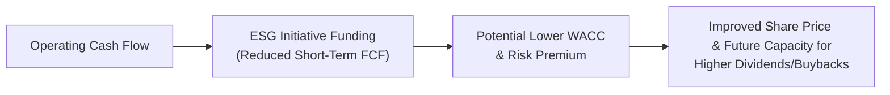

## Introduction

One moment, let’s pause and imagine a scenario: you’re serving on the board of a midsize company that, after years of stable performance, finally has some surplus cash burning a hole in its pocket. The CFO is jazzed about the idea of returning capital to shareholders, either through dividends or by repurchasing shares, and your shareholders are no less excited. But now someone—maybe even you—chimes in with, “Wait, have we considered our new ESG goals? How does that fit in with large payouts?” All of a sudden, there’s an entirely new dimension to the conversation.

The consideration of Environmental, Social, and Governance (ESG) factors has become crucial to corporate decision-making, particularly when it comes to what a firm does with its hard-earned or newly raised cash. Should the money be used for philanthropic capital? Sustainable building retrofits? Or is it better to engage in more traditional measures like distributing dividends or initiating share buybacks? This section explores that delicate balance, offering insights into how companies integrate ESG priorities into their payout decisions, sometimes deferring immediate returns in favor of long-term sustainability and stakeholder engagement. After all, in the corporate world, it’s often a trade-off between pleasing shareholders right now and ensuring that the planet—and the firm—thrives for future generations.

## Balancing ESG Investments and Cash Returns

Companies face the important task of balancing investments in ESG-related projects against returning free cash flow to equity holders. Historically, corporate dividend policy or share repurchase decisions were fairly straightforward: if the firm had free cash flow—after capital expenditures and other reinvestment plans—it might opt for distribution strategies to enhance shareholder value. Today, though, “value” can no longer be defined solely by short-term gains. ESG integration means looking at how capital distribution affects a broader community of stakeholders, from employees and suppliers to local communities and the environment.

### Trade-Offs: ESG Initiatives vs. Shareholder Payouts

ESG integration means recognizing that some capital might be better employed in projects that promote sustainability, brand reputation, and societal well-being—even if these projects have a longer payback horizon. Here are some common ESG expenditures that might compete with shareholder payouts:

• Green Building Retrofitting  
• Philanthropic Capital for community initiatives  
• Research and development for clean technology  
• Programs enabling reduced carbon footprints  

While these expenditures can lower the free cash flow directly available for dividends or share repurchases in the short run, they may enhance the firm’s brand value, reduce regulatory risks, and create future cost savings.

### Signaling ESG Priorities Through Dividends and Buybacks

In earlier chapters (particularly Chapter 2 and Chapter 3), we highlighted how management can send signals via dividend or buyback decisions. For instance, a sudden dividend increase or major share repurchase can signal confidence in the company’s near-term profit outlook. Now, with ESG front-and-center, a firm might also signal that it is responsibly diverting financial resources toward long-term sustainability targets rather than returning them immediately. A smaller buyback or a stable dividend (rather than a large increase) could reflect top management’s intention to devote more resources to ESG improvements. Conversely, a large distribution might raise eyebrows if the firm still faces substantial environmental or social liabilities that appear neglected.

Often, management’s willingness to invest in ESG sends a positive signal to the market—investors see a commitment to risk reduction and brand enhancement. But let’s be real: there might be friction with shareholders focused on near-term returns. Some might be disappointed if dividend increases or share repurchases are constrained by sustainability-focused investments. Hence, strong communication is key. Firms that effectively convey the strategic importance of ESG spending help shareholders understand how these longer-term investments can mitigate future risk and possibly boost firm value.

## Impact of ESG Initiatives on Free Cash Flow

Free Cash Flow (FCF) is a critical measure for any discussion about payouts. FCF represents the cash flow remaining after the company has funded its routine operations (including working capital needs) and essential capital expenditures. This pool of free cash supports dividends, buybacks, or other distributions. Let’s see how ESG-related items might affect that pool.

### ESG-Related Projects and Their Effects on FCF

• Capital Expenditures (CapEx): Energy-efficient upgrades and sustainability-focused retrofits can represent large up-front costs. They might temporarily reduce FCF but also result in long-term energy savings or more favorable financing terms if lenders reward ESG improvements.  
• Operational Expenditures (OpEx): Some ESG initiatives appear as operating expenses—think staff training on new CSR (Corporate Social Responsibility) programs or purchasing more eco-friendly (and sometimes costlier) raw materials. That might lower operating cash flow in the short term. However, it could produce intangible benefits like higher customer loyalty or a stronger brand in the long run.  
• Regulatory Impacts and Tax Benefits: Certain ESG initiatives may yield tax breaks or credits—for example, renewable energy installations. These can offset part of the capital outlay, freeing up more cash for distribution. Additionally, well-planned ESG programs can minimize regulatory fines or lawsuits, effectively reducing the uncertainties that eat into FCF.  

## ESG Responsibilities and Deferred Payouts

Sometimes, a firm’s ESG responsibilities or sustainability targets require a “patient capital” approach—one that prioritizes investing for the future. This approach might mean that a company reduces its dividend payout ratio or suspends share buybacks temporarily to channel funds into new sustainability projects. This is especially relevant in industries with a high carbon footprint, where major capital investments are necessary to reduce emissions.

### Case Example: Energy-Efficient Upgrades

A real anecdote: a manufacturing client of mine—years ago—was deciding whether to repurchase a decent chunk of its stock (the CFO was super enthusiastic about boosting earnings per share). But the firm’s board recognized that the factories were energy hogs. Management eventually redirected that surplus capital to retrofit outdated production lines with more efficient, lower-carbon equipment. Sure, the shareholders didn’t get the short-term boost in share price from a buyback, but over a few years, electricity and maintenance costs dropped significantly. The eventual net effect on the share price was positive, as the company improved its profitability and brand image, ultimately benefiting shareholders.

This scenario underscores that short-term deferral of shareholder payouts, if backed by robust ESG initiatives, can lead to both higher long-term valuations and improved stakeholder relationships.

## ESG Crises and Their Impact on Payout Policies

It’s not all upside. Negative ESG events—like environmental spills or legal actions involving employee discrimination—can severely knock a firm’s free cash flow. Beyond the substantial legal settlements or fines, the reputational backlash can scare off investors, reduce sales, and tighten credit access.

When a firm is embroiled in ESG controversies, management might adjust capital distribution practices to preserve liquidity. Dividends and share buybacks could be scaled back or suspended to pay for crisis management, legal defense, or the necessary remediation. Plus, the entire notion of distributing capital to shareholders while ignoring social or ecological harm can spark a major public relations nightmare. So it’s often prudent to channel resources toward rectifying the ESG wrongdoing first.

## Scenario Analysis: Stakeholder Engagement vs. Short-Term Returns

Balancing stakeholder engagement costs with returning capital to equity holders is, in many ways, a structural challenge. Let’s frame it as a scenario-based approach, which is also essential in a Level II item set:

Scenario 1 – “Aggressive Payout”: The firm prioritizes short-term shareholder returns, raising its dividend payout ratio and conducting regular share repurchases. ESG expenditures remain minimal.  
• Result: Higher immediate share price, but potential risk build-up. If the firm later faces stakeholder pushback or punishing regulations, future payouts might be jeopardized.  

Scenario 2 – “Moderate ESG Investment”: The firm invests in key ESG improvements that reduce environmental risks while maintaining a modest dividend policy. Slightly fewer buybacks to ensure enough funds for sustainability.  
• Result: Balanced approach with moderate share price appreciation, lower ESG risk, stable relationships with stakeholder groups.

Scenario 3 – “ESG-First Strategy”: The firm invests heavily in stakeholder engagement programs, philanthropic capital, and green building retrofitting. Dividends remain static (or even suspended) for some years, with no buybacks.  
• Result: Potentially lower short-term valuations, but with a strategic view of achieving more robust risk management and possibly improved brand equity. Over time, cost of capital may decline if the market recognizes the firm’s lower ESG risk profile.

Using scenario analysis helps CFOs and boards weigh the financial trade-offs clearly. After all, decisions on capital distributions are rarely black-and-white, especially when ESG goals enter the mix.

## Shared Value Creation: The Argument for “Patient” Payout Approaches

Harvard Business Review’s concept of “Creating Shared Value” (Porter and Kramer) emphasizes that corporations can do well financially precisely because they address social and environmental needs, rather than seeing them as distractions. By being “patient” with dividends and buybacks, a firm can deploy capital more effectively:

• Strengthening brand loyalty by demonstrating tangible ESG commitments.  
• Attracting new ESG-minded investors.  
• Maintaining or improving credit ratings, as rating agencies now incorporate ESG considerations.  
• Proactively managing environmental or social risks, saving the firm from potentially crippling future liabilities.

These factors might ultimately boost the company’s valuation—and ironically, the eventual shareholder returns as well.

## Modeling the Impact of ESG on Cost of Capital and Share Price

For those who prefer a more analytical angle, let’s consider how an ESG investment might influence a company’s weighted average cost of capital (WACC). Generally, a robust ESG profile can result in:

• Lower Equity Risk Premium: Investors might perceive ESG-oriented firms as less risky or more resilient, potentially reducing required returns on equity.  
• Lower Cost of Debt: Lenders and bondholders may be more comfortable lending at lower rates, especially if the firm actively reduces the environmental risks that could impair future cash flows.  
• Enhanced Market Valuation: Over time, these cost-of-capital benefits can translate into higher share prices and a more stable capital structure.

Hence, “patient capital” deployed toward ESG improvements is not always a cost; it can be a long-term investment that lowers WACC and bolsters share value. A brief schematic can help visualize these relationships:

In practice, these relationships are dynamic. Not every ESG project yields an immediate or guaranteed payoff, so strong due diligence and thorough risk assessment are crucial.

## Best Practices and Pitfalls

• Communicate the Strategy: Be transparent with investors and stakeholders if ESG spending temporarily reduces dividends or buybacks. Communicating the long-term rationale prevents misunderstandings and negative sentiment.  
• Align with Firm Strategy: Ensure ESG projects are aligned with the firm’s core competencies and overarching strategic goals. A random philanthropic effort that does not connect to the business’s mission or brand can be misunderstood as “greenwashing.”  
• Avoid Underinvestment in ESG: Neglecting ESG investment can lead to bigger crises or lost opportunities later on. One short-lived payout boost might be overshadowed by the damage of an unaddressed environmental hazard.  
• Don’t Overspend: Overextending on ESG can deplete resources for necessary capital reinvestment or hamper the firm’s liquidity. Striking the right balance is essential.

## Conclusion

There’s little doubt that ESG considerations are reshaping the dividend and share repurchase conversation. Companies now face a more complex payout matrix, balancing attention to environmental impacts, societal needs, and governance improvements with placing cash in shareholders’ pockets. And while it might cause short-term tension, many argue—and the data increasingly show—that patient, sustainability-minded capital management can actually enhance long-term shareholder value. 

Anyway, this is all part of the evolving corporate finance landscape: the push-and-pull between short-term returns and the broader, deeper benefits of responsible business behavior. In the final analysis, these decisions require synergy between finance, operations, and top-level strategy to ensure that every dollar is used to advance the firm’s ESG goals without undermining rightful shareholder claims.

### References and Further Reading

• CFA Institute, “Dividend Policy and ESG Considerations.”  
• Harvard Business Review, “Creating Shared Value” by Porter and Kramer: https://hbr.org  
• UN Global Compact Resources: https://www.unglobalcompact.org/  

---

## ESG Dividend & Buyback Dynamics Quiz



### 1. A firm invests heavily in energy-efficient upgrades, leading to reduced free cash flow. Which is a likely immediate effect on the firm’s dividend policy?
- [x] Reduced or deferred dividend payments.
- [ ] Dramatic dividend increase.
- [ ] Dividends remain at the same level automatically.
- [ ] No change in dividend policy until next fiscal year.

> **Explanation:** Significant ESG investments can temporarily lower free cash flow, forcing management to reduce or delay dividends.

### 2. Which of the following scenarios best describes “patient capital” in ESG integration?
- [x] Lower short-term payouts to fund long-term ESG projects that enhance stakeholder value.
- [ ] Issuing more shares to finance immediate ESG investments.
- [ ] Borrowing short-term debt at high interest rates to avoid adjusting dividends.
- [ ] Halting all ESG spending until after dividends are paid out.

> **Explanation:** “Patient capital” implies prioritizing long-term sustainability, accepting lower or deferred shareholder distributions in the near term.

### 3. In times of a major ESG crisis (e.g., environmental litigation), a company will often modify its dividend policy by:
- [x] Reducing or suspending dividends to preserve cash for legal and remediation expenses.
- [ ] Increasing dividends to distract investors from negative news.
- [ ] Initiating a special dividend to share legal risk with shareholders.
- [ ] Maintaining dividends unchanged regardless of liquidity pressures.

> **Explanation:** Firms typically cut or suspend dividends when large cash outflows are required for crisis management and legal fees.

### 4. Which statement accurately links ESG and a firm’s cost of capital?
- [x] Firms with stronger ESG practices may enjoy a lower equity risk premium.
- [ ] Higher ESG quality leads to increased volatility and thus a higher cost of capital.
- [ ] ESG considerations have no effect on either cost of debt or equity.
- [ ] Negative ESG events always reduce the firm’s tax benefits.

> **Explanation:** Investors perceive strong ESG profiles as contributing to risk mitigation, lowering the firm’s required return on equity and possibly debt.

### 5. A company seeking to enhance its brand value through philanthropic capital might:
- [x] Temporarily reduce its buyback program to fund targeted charitable initiatives.
- [ ] Increase dividends while cutting philanthropic spending.
- [x] Reinvest all free cash flow into philanthropic projects, ignoring shareholder returns permanently.
- [ ] Issue debt to fund philanthropic efforts while also boosting share repurchases.

> **Explanation:** Redirecting capital from buybacks or dividends toward philanthropy can improve ESG standing, even though it may reduce immediate payouts to shareholders.

### 6. What is a benefit of ESG-driven “green building retrofitting” on a company’s operations?
- [x] Lower long-term operating costs through energy savings.
- [ ] Permanently decreasing stock price because of reallocated capital.
- [ ] Elimination of the need for dividend distributions.
- [ ] Guaranteed short-term surge in profitability.

> **Explanation:** Energy-efficient investments usually reduce ongoing expenses (e.g., utilities), improving profitability over time.

### 7. If a firm consistently prioritizes ESG expenditure over dividend growth, which of the following is a potential advantage?
- [x] Improved stakeholder relationships that may lead to enhanced brand loyalty.
- [ ] Investors may disregard the firm’s sustainability approach when valuing it.
- [x] Lower capital expenditures overall.
- [ ] Decline in market share if ESG fails to deliver immediate ROI.

> **Explanation:** Focusing on ESG can strengthen stakeholder ties, though short-term profit can be lower. Over time, it can yield brand advantages and future payout potential.

### 8. Which of the following best illustrates a sustainable dividend policy?
- [x] A payout approach that balances consistent shareholder returns with necessary ESG reinvestment.
- [ ] A policy that never changes the dividend, regardless of corporate performance.
- [ ] Paying all excess cash to shareholders without considering future strategic projects.
- [ ] Suspending dividends indefinitely in favor of all ESG initiatives.

> **Explanation:** A sustainable dividend policy ensures the company can maintain stable dividends while also allocating funds to ESG and strategic growth.

### 9. Why might a firm reduce share repurchases upon adopting ambitious stakeholder engagement initiatives?
- [x] Funding engagement programs means less free cash flow is available to buy back shares.
- [ ] The firm no longer needs to worry about financial leverage or stock price.
- [ ] Share repurchases are irrelevant to company value once ESG is implemented.
- [ ] Most shareholders demand reduced buybacks in ESG-focused firms.

> **Explanation:** Stakeholder engagement programs can require material financial resources, reducing cash available for repurchases.

### 10. True or False: A firm’s ESG strategy can influence its dividend and share repurchase decisions by altering both its free cash flow and its perceived risk profile.
- [x] True
- [ ] False

> **Explanation:** ESG initiatives can shift available cash flow and affect the firm’s risk as perceived by investors, possibly impacting both the level and timing of payouts.


