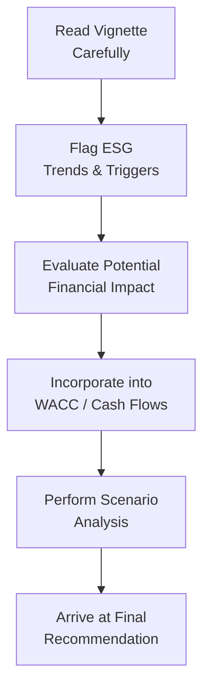

## Introduction and Core Themes

Imagine this scenario: you’re sitting in the exam hall, turning a page to reveal a six-paragraph vignette about a large manufacturing giant facing potential environmental sanctions due to wastewater disposal issues. The firm’s board composition is under scrutiny, and there’s a looming risk that local communities might protest unless significant philanthropic contributions are made. You’ve got to figure out how all this impacts the firm’s cost of capital, capital allocation, and shareholder returns—while also keeping an eye on the big picture of environmental, social, and governance (ESG) standards.

Here’s the thing: ESG factors aren’t just about checking a box for ethical brownie points. They can reshape a company’s WACC, its future cash flows, and even intangibles like brand equity. For Level II candidates, ESG is now woven deeply into corporate finance item sets. So, let’s walk through how to handle these vignettes in a calm, methodical way (and maybe with a few “ums” and “wells” along the journey, because, well, we’re only human). 

## Reading the Vignette with ESG in Mind

### Knowing Common ESG Triggers

Before diving into calculations, you’ll want to identify ESG triggers—clues in the vignette that raise potential red or green flags for the company’s approach to sustainability and governance. These triggers might be:

• A significant health-and-safety incident (Social factor).  
• A whistleblower controversy about board oversight (Governance factor).  
• An environmental fine for air pollution (Environmental factor).  
• Shifts in brand equity due to community backlash (Social & intangible factor).  
• Evolving regulatory constraints on carbon emissions (Environmental factor).  

Spotting these early helps you map out how they might sneak into your cost-of-equity calculations (via an ESG risk premium) or shift your estimates for the firm’s cash flows (via fines, lawsuits, or brand damage).

### Quick Anecdote: The Board-Composition Surprise

I once chatted with a friend who’d worked on an M&A project. They thought the deal was a slam dunk—until an investor activist group called out board misalignment with modern sustainability standards. Overnight, that “slam dunk” turned into a major negotiation meltdown. Moral of the story: ignoring governance is risky, and that risk can escalate quickly.

## Linking ESG to Financial Metrics

### The Cost of Capital Angle

Many vignettes will prompt you to adjust the firm’s WACC due to ESG concerns. Perhaps you’ll see mention that investors are demanding a higher return to compensate for reputational risk. This is sometimes referred to as the ESG risk premium. Umbrella concept: potential environmental liabilities, uncertain legal outcomes, or even major lawsuits raise the perceived riskiness of a project or the firm overall.

One approach is to increase the equity risk premium in your CAPM-based cost of equity to reflect the additional risk. For instance:

KaTeX:  

\text{Cost of Equity} = R_f + \beta (R_{\text{m}} - R_f) + \text{ESG Risk Premium}


If the vignette suggests, say, a 0.50% (or 50 basis points) extra risk premium because of ongoing regulatory investigations, you’d tack that onto your final cost-of-equity estimate. Subtle details—like how the company manages these issues—can reduce or amplify that premium.

### ROE, Cash Flows, and Payout Changes

ESG spending (e.g., installing cleaner technology, investing in staff training, or supporting local communities) can lower short-term net income or free cash flow. In the item set, you might see the CFO discussing how philanthropic contributions or environmentally friendly upgrades affect the payout ratio. Watch out for new lines in the financial statements, such as “Environmental Remediation Expense,” or references to brand equity improvements over the long haul.

- Example: If a company invests \$5 million in a water-purification system, the immediate effect might be a decline in free cash flow. However, from a double bottom line perspective, this cost might help avoid a \$20 million fine in the future, or keep brand equity from eroding.  
- Ultimately, that changes your dividend capacity or share buyback feasibility. You might have to re-evaluate the firm’s working capital needs and decide how best to maintain or adjust its payout policy.

## Material Risks, Regulatory Challenges, and Impact Costing

### Identifying and Quantifying Risks

In a question set, you may see references to potential fines: “Company X faces a \$10 million penalty if it doesn’t meet new environmental standards.” Or “Local communities threaten boycotts that could reduce annual revenues by 5%.” These are the seeds for scenario analysis.

• If the cost is certain (like a known fine), consider it a cash outflow.  
• If it’s uncertain, you might factor it into sensitivity or scenario testing.  

**Scenario Testing** forces you to ask: “In a best-case scenario, no fines are imposed. In a worst-case scenario, full fine plus brand damage.” This approach ensures you weigh varying outcomes—often there might be a question prompting “Which scenario best describes the firm’s EPS sensitivity to ESG fines?”

### The Role of Externalities (Impact Costing)

Impact costing tracks the broader environmental or social costs, not always on the immediate financial statements, but they can creep onto the statements if the firm is forced to internalize them. For instance, if a chemical spill leads to an environmental lawsuit, the externality (the spill’s damage) becomes a direct cost. Keep an eye out for item-set clues about externalities lurking just off the balance sheet.

## Analyzing a Typical ESG Vignette: Flow Process

It’s sometimes helpful to visualize how you might navigate the problem. Here’s a Mermaid flowchart to illustrate a possible approach:

1. Read the item set carefully. Then highlight the references to environmental risks or governance weaknesses.  
2. Evaluate the potential cost or benefit. Are we looking at a brand equity boost or penalty?  
3. Adjust the discount rate, risk premium, or project cash flows.  
4. Run best- and worst-case scenarios.  
5. Conclude with the recommended valuation or cost of capital.

## ESG Considerations in Capital Budgeting and Payout

### ESG-Driven Adjustments to Capital Budgeting

Capital projects sometimes revolve around new sustainability initiatives—like energy-efficient equipment or a shift to recyclable packaging. To factor this in:

• Check if the project’s IRR is still above the adjusted cost of capital when including ESG risk premiums.  
• Incorporate intangible benefits like brand loyalty or synergy with other sustainable lines of business.  

Look out for “trick” info in the vignette: a footnote might say “Expected brand loyalty improvements reduce marketing costs by \$2 million annually.” That’s a direct cash flow effect you should integrate into your net present value (NPV) calculation.

### Balancing Short-Term Payouts with ESG Investments

A common pitfall is forgetting that ESG programs require capital that might have gone to dividends or buybacks. A good rule of thumb: confirm that the firm’s coverage ratios (e.g., interest coverage), liquidity, and future growth do not suffer because of ESG spending. Some boards prefer to keep a stable or moderately increasing dividend while earmarking a portion of free cash flow for ESG improvements. The exam might ask about the rationale behind reducing the payout ratio to fund these initiatives—or vice versa.

## Cross-Functional Decision-Making

ESG topics rarely live in a silo. The finance department might want to do more share repurchases, while the sustainability or legal teams push for a portion of funds to go into compliance or staff training. A well-crafted ESG item set might reference the legal department’s concerns or the marketing department’s brand-building angle, nudging you to see how each function’s perspective influences capital allocation (and your ultimate analysis).

If the CFO is ignoring the sustainability team’s input on future carbon taxes, that’s a major “gotcha” you want to note. Expect the question to reference how the board eventually forces integration of these views—shifting the entire cost structure or even the project’s feasibility.

## Practical Example: Forestry Company Vignette

Let’s try a simplified example. Suppose you read the following:

“The Redwood Timber Corporation is evaluating a \$30 million pulp processing plant upgrade to meet new environmental standards. If they don’t proceed, a \$5 million fine is likely, and their brand image might suffer, possibly reducing annual revenues by \$3 million from lost eco-conscious customers. However, the upgrade also requires a \$1 million annual maintenance cost. Redwood’s CFO is considering an extra 0.50% ESG risk premium on top of their usual 9.00% cost of equity to reflect potential brand risk. At the same time, Redwood wants to maintain its dividend payout ratio of 40%, which could delay other expansions.”

You might see a series of questions:

1. Should Redwood proceed with the upgrade?  
2. How does the additional ESG premium affect cost of capital?  
3. What is the net effect on Redwood’s future earnings and payout capacity?  

You’d walk through an NPV or IRR calculation factoring in cost of equity at 9.50% and estimate the cost of not upgrading (the fine plus revenue drop). The question might also prompt a sensitivity analysis: “What if the brand damage is even worse than expected?” or “What if the board decides to cut the dividend to 35% to free up more funds for upgrades?”  

## Exam Day Tactics and Pitfalls

### Scan for the Subtle Hints

• Are there references to community relations that might hint at brand equity issues?  
• Does the board composition mention independence, diversity, or relevant sustainability expertise?  
• Are there side comments about “pending legislation” that could expand the firm’s compliance requirements in the future?

Any of these can influence the final answer, so highlight them as soon as they appear.

### Keep Calm and Prioritize

One widespread exam pitfall is time management. ESG item sets can feel long-winded because they often incorporate narratives about employees, local communities, or philanthropic endeavors. Keep the essential data points front and center. Annotate the text as you go: “Potential Fine: \$5 million,” “Possible brand revenue drop: \$3 million,” “ESG premium: +0.50%,” etc.

### The “Double Bottom Line” Mindset

Remember, ESG-friendly strategies often aim to deliver both financial returns and social/environmental benefits. The exam might ask you to consider intangible payoffs (like improved brand loyalty) that pay off big in the future. Don’t be fooled by an immediate drop in free cash flow—if the scenario hints that it paves the way for stable or enhanced revenues later, that’s part of your analysis.

## Best Practices and Final Notes

• Always identify the relevant metrics: Adjusted WACC, revised cash flows, or potential one-time charges.  
• Incorporate scenario testing: Look for the range of potential outcomes, not just one static scenario.  
• Evaluate brand equity: This intangible can be crucial. A big scandal or major philanthropic success can shift demand.  
• Keep track of compliance deadlines: Fines or legally mandated changes often have a time dimension.  
• Reference the governance structure: Board independence and accountability are frequently tested.  

## References and Further Exploration

• CFA Level II Program Curriculum, “Ethics, ESG, and Corporate Finance: Integrated Item Sets.”  
• Sample Past Examinations (CFA Institute website): [https://www.cfainstitute.org/](https://www.cfainstitute.org/)  
• The International Corporate Governance Network (ICGN): [https://www.icgn.org/](https://www.icgn.org/)  
• For broader frameworks on ESG risk, see the Global Reporting Initiative (GRI) Standards and the Sustainability Accounting Standards Board (SASB) guidelines.

--------------------------------------------------------------------------------

## Test Your Knowledge: ESG Item Set Mastery Quiz



### Which factor most commonly adds an additional risk premium to a firm’s cost of equity in ESG analyses?

- [ ] Brand loyalty.
- [ ] Market share gains.
- [x] Regulatory or reputational risk.
- [ ] Board diversity alone.

> **Explanation:** While brand loyalty and board diversity can indirectly influence the cost of equity, regulatory and reputational risk typically drives an explicitly added ESG risk premium. Uncertainty over fines, bans, or reputational fallout can prompt investors to demand higher returns.

### A vignette describes a company investing heavily in local community infrastructure. The CFO fears a short-term drop in free cash flow. Which outcome is a likely long-term benefit?

- [ ] Permanently lowered ROE.
- [x] Enhanced brand equity and possible demand growth.
- [ ] Inability to align with best practices.
- [ ] Decreased investor confidence.

> **Explanation:** While such investments can hamper short-term free cash flow, a boost to brand equity often improves the firm’s competitive positioning and long-term sales. Over time, this can yield growth in annual revenues and stable cost structures.

### A firm’s board is deciding between issuing a special dividend and funding a green project mandated by upcoming regulations. The item set references potential noncompliance fines. What is the best approach?

- [ ] Pay the special dividend, since investor returns are paramount short-term.
- [x] Weigh the potential fines and brand damage carefully before finalizing the payout strategy.
- [ ] Ignore brand damage as it is intangible.
- [ ] Delay the green project to keep dividends steady.

> **Explanation:** The correct approach involves recognizing the risk of regulatory fines and brand damage. While maximizing shareholder returns is critical, ignoring mandated projects could lead to more cash outflow and reputational harm down the road.

### What is the main role of scenario testing in ESG-related vignettes?

- [ ] Doubling the cost of debt arbitrarily.
- [ ] Spreading out dividends over a longer period.
- [ ] Focusing only on best-case financial outcomes for the firm.
- [x] Exploring different possible states of ESG compliance and financial impact.

> **Explanation:** Scenario testing evaluates how multiple outcomes (best-case, worst-case, mid-case) might affect the company if different ESG risks or events occur. It’s essential for understanding a firm’s resilience to ESG challenges.

### According to the double bottom line concept, a company should focus on:

- [ ] Only maximizing accounting profits.
- [x] Achieving financial returns alongside social and environmental good.
- [ ] Private equity fundraising.
- [ ] Eliminating philanthropy to increase net earnings.

> **Explanation:** The double bottom line means balancing traditional financial metrics with positive social/environmental impacts. It is a holistic approach to value creation.

### A finance team includes an additional ESG risk premium when calculating the CAPM cost of equity. Which key variable changes in that formula?

- [ ] The company’s beta is fully removed.
- [x] The required return on equity is increased by the ESG premium.
- [ ] The market risk premium is reduced.
- [ ] The risk-free rate is multiplied by an ESG factor.

> **Explanation:** In a CAPM approach, the risk premium is typically added to the final cost-of-equity formula. So if the risk premium is 0.5%, the calculated cost of equity is boosted by 0.5 percentage points.

### Which of the following is least likely an example of impact costing in ESG analysis?

- [x] The firm’s monthly telephone bill.
- [ ] Environmental cleanup expense.
- [ ] Social program costs supporting the community.
- [ ] Remediation costs associated with a toxic spill.

> **Explanation:** Impact costing usually refers to capturing environmental or social externalities in financial statements—things like cleanup expenses or community investments. A monthly phone bill is a standard operating cost not tied to ESG externalities.

### A question prompt highlights that a manufacturing firm’s revenues could drop by 8% if the community boycotts its products over harmful emissions. This scenario is best represented as:

- [ ] A certain cost that must be recognized immediately.
- [ ] A risk that only affects the firm’s balance sheet intangible assets.
- [x] A potential brand-damage scenario requiring scenario analysis.
- [ ] An irrelevant factor, since boycotts rarely occur.

> **Explanation:** Community boycott risk is a classic brand damage scenario, and its financial impact should be tested with scenario or sensitivity analysis rather than being treated as a guaranteed expense.

### Why might a company’s board composition be a pivotal ESG trigger in a vignette?

- [x] Poor board oversight can heighten governance risk, affecting both financial performance and investor confidence.
- [ ] Board composition never affects equity valuations.
- [ ] Board composition is irrelevant to social or community outcomes.
- [ ] It only matters if the firm is in an emerging market.

> **Explanation:** Governance risk is a critical ESG pillar. A weak board lacking independence or expertise can fail to address environmental and social issues effectively, thus raising overall business risk.

### True or False: Failing to address looming environmental regulations could lead to a lower WACC in the long term, as the company might be perceived as more efficient.

- [ ] True
- [x] False

> **Explanation:** Generally, ignoring or delaying compliance with environmental regulations can raise a firm’s perceived riskiness, driving up its cost of capital (not lowering it). If the market sees the firm as high-risk or potentially subject to large fines, the WACC increases.



--------------------------------------------------------------------------------

Feel free to revisit these item set strategies whenever you see an ESG-heavy vignette. The key is balancing immediate financial trade-offs (like whether to pay dividends or expand share buybacks) against the firm’s long-term sustainability and risk mitigation. Remember, you don’t just want to parse the numbers; you want to interpret the underlying ESG themes that might elevate a company’s cost of capital or diminish its cash flows. Keep practicing these analyses, and you’ll be well-equipped to spot, dissect, and master ESG-related questions in the Level II exam. Good luck!
