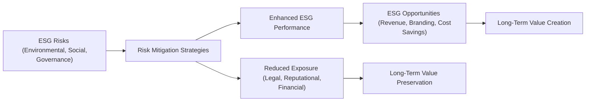

## Understanding ESG Risk Categories
Sometimes, I remember grappling with the question, “How exactly can I measure all those intangible risks that revolve around environmental sustainability, social practices, and corporate governance?” I admit, at first, it felt a bit like gazing into a crystal ball. And yet, from a corporate finance perspective, especially at the CFA Level II vantage point, ESG is not just important—it’s practically unavoidable. Firms big and small are judged by their ESG performance, not just by regulators and activist groups, but by mainstream investors, lenders, rating agencies, and even their local communities.

ESG (Environmental, Social, and Governance) risk exposures refer to the vulnerabilities and uncertainties a company faces in these three domains. By addressing them, firms can reduce downside risk, protect (or expand) market share, and even increase profitability over the long haul. Equally important: ignoring them can lead to damaged reputations, costly regulations, lawsuits, or even disinvestment by major institutional investors.

In this section, we will:  
• Break down the main categories of environmental, social, and governance risks.  
• Discuss how you might measure and manage each category.  
• Highlight potential ESG opportunities.  
• Explore ways to integrate ESG data into financial models and scenario analyses.

Let’s get underway by looking at the unique nature of each risk category.

## Environmental Risks
Environmental risks are often where people’s minds go first when they hear “ESG.” This might include everything from climate change impacts, greenhouse gas emissions, and resource scarcity, to pollution and natural disasters.

### Common Environmental Risk Factors
• Climate Change and Extreme Weather: Shifts in weather patterns—like more frequent hurricanes or droughts—can disrupt supply chains, increase insurance costs, and damage infrastructure.  
• Carbon Pricing and Regulatory Compliance: As governments set carbon taxes or impose cap-and-trade systems, companies with high emissions might face punitive costs or fees, which reduce their margins and competitiveness.  
• Water and Natural Resource Scarcity: If your business depends on abundant raw materials or water (hello, beverage manufacturers), scarcity can drive input prices sky high or even make certain operations infeasible.  

### Measuring Environmental Exposure
Think about a company’s specific footprint: the total greenhouse gases (GHGs), water usage, hazardous waste, land use, and so on. Firms often report these metrics in sustainability or integrated reports. You and your team might evaluate:  
• Emissions Intensity (e.g., tons of CO₂ per unit of revenue).  
• Resource Efficiency (e.g., water usage per product unit, energy consumption per square foot).  
• Compliance Costs (fines, capital expenditures required to meet new environmental regs).

### Environmental Opportunities
On the bright side, there’s a silver lining to environmental challenges. Sometimes these hardships motivate innovation and cost savings:  
• Energy Efficiency: Upgrading manufacturing lines or installing solar panels reduces long-term energy costs.  
• Green Product Lines: Developing eco-friendly designs can open up new market segments.  
• Partnership Opportunities: Collaborating with local communities on conservation projects could bolster brand goodwill and create new revenue streams.

## Social Risks
As I learned advising a mid-size consumer goods manufacturer, social risks can sneak up on you—often through labor disputes or negative social media. While “social” may sound fuzzy, it deals with tangible financial impacts as well.

### Types of Social Exposures
• Labor Relations and Workforce Health: Strikes, high turnover, and inadequate employee health and safety can cripple productivity and tarnish a company’s image.  
• Human Rights and Supply Chain Issues: If a supplier is found guilty of child labor or unsafe conditions, the public outcry can punish the buyer as well.  
• Product Liability and Consumer Protection: Defective products can lead to recalls, lawsuits, and brand damage.  
• Community Impact: A weak “social license to operate” might trigger protests or activism, especially if the local population feels exploited or harmed by corporate activities.

### Gauging Social Risk
Analyzing social risk typically involves looking at workforce statistics, customer satisfaction metrics, engagement with local stakeholders, and supplier audits. Social audits can identify, for example, whether a company’s suppliers follow labor laws or environmental standards.

### Socially-Driven Opportunities
Companies that prioritize strong social performance often reap intangible benefits that translate into financial gains. For instance:  
• Enhanced Reputation: Consumers are increasingly favoring socially responsible brands.  
• High-Performing Workforce: Engaged employees tend to be more productive, driving competitiveness.  
• Community Goodwill: Supporting local development can expand market opportunities and reduce operational disruption.  

## Governance Risks
Governance issues often lurk in the boardroom—think about structures, policies, and processes ensuring that corporate actions align with stakeholder interests. When governance fails, the consequences can be disastrous.

### Main Governance Pitfalls
• Board Composition and Oversight: Boards lacking independence or expertise can overlook critical risks.  
• Conflicts of Interest: Executives placing personal gain over stakeholder interests can lead to financial manipulations or questionable acquisitions.  
• Bribery and Corruption: This is a global concern and can result in severe legal and reputational damages.  
• Weak Risk Management Framework: Without robust checks and a risk-oriented culture, a company can face blind spots in ESG and beyond.

### Evaluating Governance Effectiveness
Key aspects to consider:  
• Board Independence: The proportion of external vs. internal directors.  
• Executive Compensation Structure: Does it align with long-term performance metrics, or does it encourage short-term risk-taking?  
• Internal Controls and Audit Processes: Are these processes robust and transparent enough to detect wrongdoing early?

### Governance-Driven Opportunities
In practice, good governance fosters trust among investors, regulators, clients, and employees. It often translates to:  
• Better Credit Terms: Lenders reward stability and transparency with lower interest rates.  
• Growth in Equity Valuation: Investors place a premium on well-governed companies, given reduced risk of scandals.  
• Proactive Ownership Engagement: Shareholder activism, when channeled positively, can push the company to adopt better governance, fueling sustainable growth.

## Tying ESG to Opportunities
In our day-to-day practice, it’s easy to get wrapped up in all the warnings about ESG. But it’s not all about avoiding damage—there’s major upside potential, too. A firm that invests in stronger ESG processes might enjoy:

• Cost Savings: For instance, adopting energy-efficient technology to lower operating costs.  
• Revenue Growth: Launching new sustainable or socially mindful product lines can attract ethically conscious consumers.  
• Portfolio Diversification: Expanding into green markets (e.g., electric vehicles, green real estate) can help mitigate certain market risks.  
• Talent Attraction and Retention: Younger generations value purpose-driven workplaces—super important when building a high-quality, loyal workforce.

## Stakeholder Perspectives on ESG Risk
Different stakeholders look at ESG risk from angles unique to their priorities:

• Investors: They increasingly incorporate ESG metrics in portfolio selection, believing that well-managed ESG risk leads to stable long-term returns.  
• Lenders: Banks and bondholders track ESG signals to gauge a borrower’s risk of default. For example, a carbon-heavy enterprise in a climate-targeting jurisdiction might be flagged as more risky.
• Regulators: Governments are ramping up environmental laws, consumer protection, and governance mandates. Non-compliance can be brutal.  
• NGOs and Media: Watchdog organizations scrutinize corporate practices and can quickly amplify negative headlines that harm brand perception.

## Modeling ESG Risks with Scenario and Stress Testing
One practical aspect of your job as a CFA candidate and future analyst is to quantify or at least qualitatively assess ESG risk in valuation models and strategic forecasts. Let’s talk about how we do that.

### Scenario Analysis
Scenario analysis explores multiple possible future states, especially useful when dealing with uncertain and dynamic variables such as climate policies or changing consumer preferences. Analysts will often:
1. Identify Key Drivers: E.g., carbon price per ton, future labor regulations, water scarcity levels.  
2. Define Scenarios: Best-case, base-case, worst-case.  
3. Model Financial Outcomes: Evaluate the impact on revenue, cost, or capital expenditures.  

### Stress Testing
Stress testing focuses on extreme conditions—such as a sudden carbon tax hike or a major labor strike. For instance:
• A company might analyze how a 50% drop in water availability affects production volumes and margins.  
• Or they might test the financial effect of losing a key supplier overnight, due to a major compliance scandal.

By incorporating these results into the firm’s strategic planning, executives get a more realistic picture of how ESG factors could affect their bottom line.

## Diagram: ESG Risk and Opportunity Overview
Below is a simplified Mermaid diagram illustrating the interplay between ESG risks, mitigations, and opportunities.

In a nutshell, ESG risks threaten company value—yet with mitigation and an improved ESG profile, firms can unlock potential opportunities and strengthen long-run performance.

## Ongoing Monitoring and Regulation
ESG factors evolve quickly with regulatory shifts and changing public expectations. Let’s say new climate legislation is introduced. A once-minor cost could become a significant line item overnight. Or, as we’ve seen, social media can quickly propel a local issue into a worldwide scandal. That’s why dynamic ESG risk monitoring is essential.

• Monitor Evolving Regulations: Keep an eye on carbon tax expansions, labor law changes, mandatory disclosures, etc.  
• Engage Stakeholders: Maintain regular dialogue with employees, investors, NGOs, and community groups.  
• Review ESG Metrics Periodically: Because new technologies or best practices can reshape your competitive position.  
• Adjust Risk Frameworks: Integrate updated ESG data into your operational risk registers and strategic planning guidance.

## Glossary
• Risk Mitigation: Strategies/techniques to reduce the likelihood or impact of negative events.  
• Carbon Pricing: Monetary cost applied to greenhouse gas emissions via taxes or cap-and-trade.  
• Social License to Operate: Ongoing acceptance or approval by local communities and stakeholders.  
• Responsible Sourcing: Procurement policies ensuring supplier compliance with environmental and social standards.  
• Reputational Risk: Potential for negative publicity or perceptions to damage a company’s brand value.  
• Stakeholder Engagement: Process of involving those who can affect or be affected by the company’s activities.  
• Scenario Analysis: Approach to modeling various future states of the world and their potential financial impacts.  
• Stress Testing: Evaluating how a firm performs under severely adverse conditions.

## Conclusion
Evaluating ESG-related risk exposures and opportunities is not just a regulatory box to tick—it’s an essential aspect of long-term corporate strategy. Savvy analysts see ESG for what it is: a critical lens to spot pitfalls and possibilities. After all, ignoring these risks can be financially devastating, while handling them intelligently often brings both resilience and competitive advantage. And I’m sure you’ve noticed: more often than not, markets are rewarding companies that take ESG seriously.

If you keep these frameworks in mind—environmental, social, and governance—and apply them in dynamic, data-driven ways (like scenario planning and stress testing), you’ll be better equipped to help organizations mitigate risk, seize value-adding opportunities, and develop a robust, future-proof capital strategy.

## References
• “Climate Change and Corporate Governance” – CFA Institute (online publication)  
• UNEP FI – “Principles for Responsible Banking” and “Principles for Sustainable Insurance”: https://www.unepfi.org  
• ISO 26000 Guidance on Social Responsibility: https://www.iso.org/iso-26000-social-responsibility.html  

--------------------------------------------------------------------------------

## Test Your Knowledge: ESG Risks and Opportunities Quiz



### 1. Which of the following environmental exposures is most likely to affect a beverage company’s operational efficiency?

- [ ] Rising minimum wage 
- [x] Water scarcity 
- [ ] Board composition 
- [ ] Employee turnover 

> **Explanation:** For a beverage producer, water scarcity directly impacts production volumes and operational costs, possibly reducing output if water resources are limited.

### 2. In scenario analysis for ESG, analysts typically:

- [ ] Only consider a single economic outcome.  
- [ ] Focus solely on short-term weather changes.  
- [x] Explore multiple, plausible future states and their impacts on financial performance.  
- [ ] Avoid any sensitivity testing.  

> **Explanation:** Scenario analysis involves modeling different future states (e.g., best-case, base-case, worst-case) to understand how ESG factors, such as a spike in carbon prices or new regulations, can affect a firm.

### 3. A key governance risk for a corporation with multiple subsidiaries might include:

- [ ] Excess water usage.  
- [x] Weak oversight and fragmented internal controls.  
- [ ] Carbon tax liability.  
- [ ] Overly generous employee benefits.  

> **Explanation:** When a corporation has many subsidiaries, ensuring robust governance can be difficult. Weak oversight can lead to inconsistent policies, undetected corrupt practices, and conflicting strategies across the group.

### 4. Responsible sourcing primarily ensures:

- [x] Suppliers comply with environmental and social standards.  
- [ ] The company avoids paying taxes on raw materials.  
- [ ] High corporate leverage.  
- [ ] Immediate reduction in board compensation.  

> **Explanation:** Responsible sourcing focuses on vetting suppliers for sustainable, ethical practices, reducing the risk that supply chain actions will damage the buyer’s reputation or legal standing.

### 5. One direct advantage of a proactive ESG strategy is:

- [x] Potential for cost savings via energy-efficient operations.  
- [ ] Guaranteed exemption from environmental regulations.  
- [x] Potential for brand enhancement through sustainability marketing.  
- [ ] Automatic zero-financing costs.  

> **Explanation:** Cost savings may come from using more efficient technologies, and a strengthened brand reputation can be achieved by marketing sustainability initiatives. ESG compliance alone doesn’t negate regulation, nor does it guarantee zero financing costs.

### 6. Bribery and corruption risks fall under:

- [x] Governance risks.  
- [ ] Employee turnover issues.  
- [ ] Natural disasters.  
- [ ] Product liability.  

> **Explanation:** Bribery and corruption are governance-related issues that can lead to legal penalties, loss of investor confidence, and reputational harm.

### 7. Which stakeholder is most likely to evaluate ESG risk in terms of default probability?

- [x] Lenders and bondholders.  
- [ ] Consumers only.  
- [x] Rating agencies.  
- [ ] Employees.  

> **Explanation:** Lenders, bondholders, and rating agencies are particularly focused on a company’s ability to service its debt obligations, which can be affected by ESG-driven costs or liabilities.

### 8. Stress testing for ESG risk typically involves:

- [x] Modeling severe or unexpected “worst-case” conditions.  
- [ ] Ignoring potential compliance costs.  
- [ ] Eliminating socially responsible investments.  
- [ ] Evaluating only best-case outcomes.  

> **Explanation:** Stress testing is about evaluating how a firm’s finances hold up under extreme, often worst-case conditions—like a sudden carbon tax spike or a labor strike—so that resilience can be assessed.

### 9. A common pitfall of ESG risk assessment is:

- [x] Focusing solely on environmental hazards while ignoring social and governance factors.  
- [ ] Overestimating all potential risks in every scenario.  
- [ ] Applying quantitative models.  
- [ ] Engaging with regulators and stakeholders early in the process.  

> **Explanation:** Many organizations focus on a single pillar (often environment) and overlook the damage that social or governance failings can bring.

### 10. True or False: A robust ESG program can help a firm mitigate reputational risks that might otherwise lead to lost revenue.

- [x] True  
- [ ] False  

> **Explanation:** Strong ESG practices often bolster a firm’s image, mitigating reputational risks and potentially supporting better sales, especially among consumers who value sustainability.


