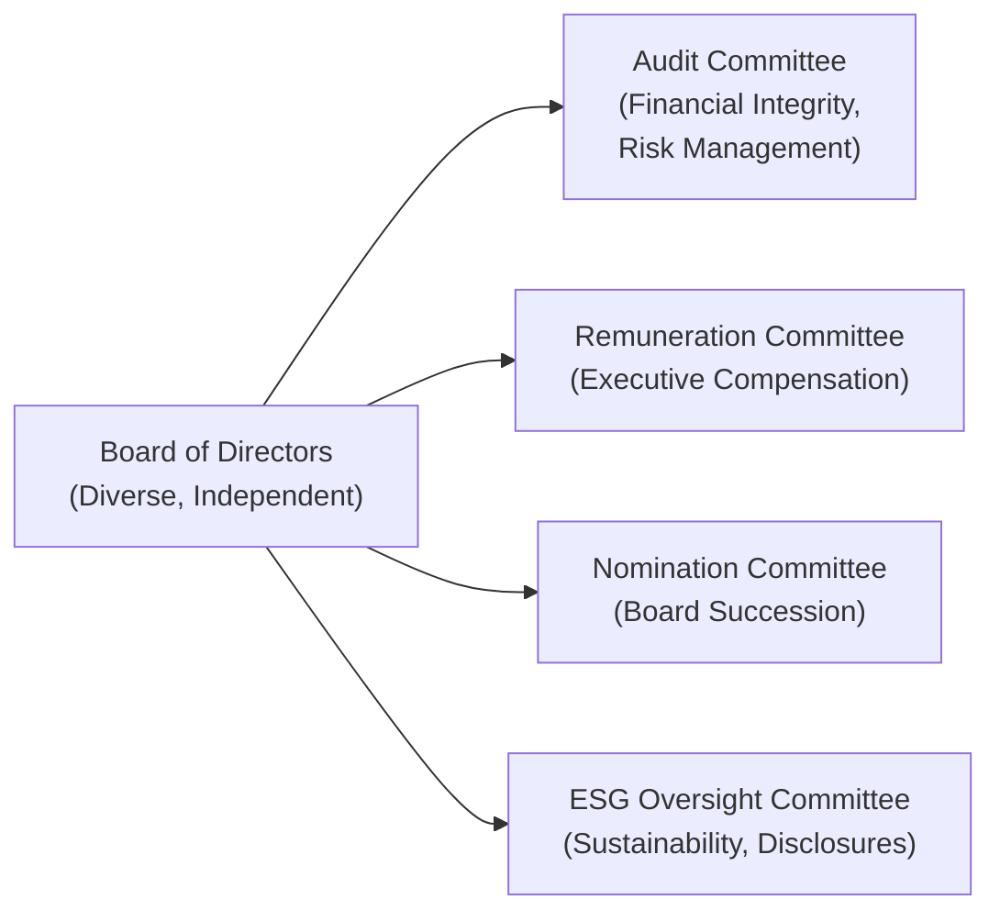

## Introduction

Let’s be honest—when I first heard about “corporate governance,” I pictured a group of folks in business suits droning through quarterly reports and ticking compliance boxes. But as I’ve spent more time examining how board composition and stakeholder management really influence a company, I’ve come to appreciate just how critical it is in guiding a firm’s direction—especially when it comes to ESG (Environmental, Social, and Governance) considerations. In many respects, it’s a company’s governance system that shapes long-term strategy, fosters a healthy corporate culture, and aligns everyone’s interests for sustainable success.

Below, we dive into the nitty-gritty of corporate governance, focusing on board composition, stakeholder management, and the role boards play in overseeing sustainability, ethical conduct, and risk management. We’ll then link these insights to cost of capital, valuation, and global governance standards, providing a complete overview that should help you tackle CFA® Level II–style item sets and hone your real-world corporate finance expertise.

## Corporate Board Structure and Composition

Corporate boards are like the central nervous system of an organization—they sense, respond, and coordinate critical strategic decisions. A robust board structure can encourage better oversight, minimize conflicts of interest, and lead to more informed decisions.

### Board Diversity
Diversity spans gender, background, ethnicity, professional experience, and even age. It’s not just about checking off boxes. In practice, a diverse board promotes fresh perspectives and fosters creativity in problem-solving and strategic planning. For instance, a board that includes directors with varied skill sets—such as technology gurus, sustainability experts, or marketing specialists—tends to see challenges through multiple lenses.

Research has shown that having women and minorities on boards can improve market trust, enhance public image, and, in certain circumstances, boost financial performance. Diversity is also incredibly relevant for ESG goals, as it reduces the risk of “groupthink” and ensures better accountability.

### Board Independence
Independence is huge. Independent, non-executive directors are free from the conflicts of interest that can affect insiders. They’re more likely to challenge management and demand explanations—particularly when it comes to tough calls on acquisitions, pay policies, or ESG-related initiatives.

Board independence is often measured by the proportion of non-executive directors with no material ties to the company. Investors like to see this because they believe it signals robust checks and balances. The logic is straightforward: you want someone at the table whose first priority is the company’s and shareholders’ best interests, rather than maintaining cozy relationships with management.

### Relevant Expertise
A board is often tasked with handling everything from setting the overall strategic vision to ensuring compliance with national and international regulations. Bringing on board members with the right expertise—be it in finance, ESG, technology, or operations—can dramatically reduce knowledge gaps. For instance, including directors who have in-depth experience in environmental sustainability can help refine the firm’s approach to resource use or carbon emissions.

## Role of the Board in Overseeing Management and Strategy

Boards typically oversee all aspects of a company’s operations—starting with appointing (and possibly firing) the CEO and other senior executives. They also set strategic priorities. In some jurisdictions, boards are legally bound by fiduciary duties, requiring them to act in the best interest of shareholders (and increasingly, stakeholders) or face potential legal consequences.

### Performance Monitoring
The board’s main job is to ensure that management is hitting performance targets. This involves setting key performance indicators (KPIs), evaluating executive performance, and recommending next steps. These metrics might include revenue growth, margin targets, or product innovation milestones. Today, environmental and social metrics (e.g., carbon reduction, diversity and inclusion goals) are included in this performance evaluation.

### Strategic Direction
Boards collaborate with the executive suite to define the company’s vision and mission, then break these down into practical objectives. Let’s say your company wants to expand into new international markets or pivot to a new product line. The board will ask questions such as: “How will this expansion impact stakeholder relationships? Are we structured to manage operational risks effectively?” and “Do we have the right management and board expertise for these challenges?”

### ESG-Related Risks and Opportunities
It’s not only about compliance or window dressing with “green” marketing. The board is increasingly expected to analyze ESG-related risks—like climate change, diversity shortfalls, community impacts—and integrate them into the company’s strategy. This might mean pivoting investments to renewable energy, setting stricter supply chain standards, or establishing a community outreach program that resonates with local stakeholders.

## Board Committees and Governance Controls

Boards typically operate through committees, each with a specialized function aimed at ensuring that no single group—especially management—has unchallenged decision-making power. Here’s a quick look at key committees:

### Audit Committee
The Audit Committee oversees the integrity of financial statements and internal controls. They collaborate with internal and external auditors to ensure that disclosures are accurate and that the company’s risk management procedures function effectively. This oversight extends to checking on ESG disclosures in some companies and verifying that environmental and social data aren’t exaggerated.

### Remuneration (Compensation) Committee
This committee sets executive pay, ensuring that compensation aligns with shareholder (and sometimes broader stakeholder) interests. A well-structured pay package often includes performance-based bonuses tied to financial and ESG targets. For instance, a CEO might earn a bonus if the firm achieves certain emission reduction targets or diversity milestones.

### Nomination Committee
The Nomination Committee handles the selection and evaluation of board members, ensuring they possess relevant skills and meet independence requirements. They also facilitate board succession planning, so there’s always a pipeline of capable professionals ready to step in.

### ESG Oversight Committee
Some companies have introduced a specialized ESG or Sustainability Committee. They oversee sustainability initiatives and related disclosures, ensuring that the company sets credible ESG goals and invests in proper risk mitigation. Expect to see them tackling issues like climate resilience, employee well-being, supply chain fairness, and philanthropic outreach.

Below is a simple mermaid diagram that illustrates how these various committees interconnect under the broader board umbrella:

## Shareholder Rights, Proxy Voting, and Minority Protections

Shareholders hold the ultimate ownership in a public corporation, so they have voting rights to elect board members and approve major changes. They typically exercise these rights either in person at shareholder meetings or by proxy voting—authorizing someone else (like management or an institutional investor) to cast votes on their behalf.

- Proxy Voting: This mechanism is crucial if you can’t make the annual general meeting in person. It’s also an effective way for large institutional investors to push for ESG improvements.
- Minority Shareholder Rights: These protect smaller shareholders from being overshadowed or squeezed out by controlling shareholders, ensuring checks and balances on major decisions like mergers, acquisitions, or dividend policy changes. Many jurisdictions enforce rules that require supermajority approval (e.g., two-thirds) for significant corporate changes, thus giving minority investors a chance to influence outcomes.

## Stakeholder Management

Modern corporate governance frameworks emphasize not only shareholder interests but also those of a broader stakeholder base: employees, customers, suppliers, communities, and sometimes even the environment itself. Stakeholder management isn’t just a warm-and-fuzzy concept—it ties directly to operational risks, reputational capital, and long-term profitability.

### Integrating Stakeholder Interests
Effective boards recognize that neglecting one set of stakeholders might jeopardize the firm’s broader objectives. For example, ignoring community concerns (like pollution or local hiring practices) can trigger protests, lawsuits, or reputational damage. On the flip side, robust relationships with communities, employees, and suppliers can lead to brand loyalty, smoother operations, and a more resilient supply chain.

### ESG Alignment
When a board factors stakeholder interests into its ESG initiatives, it strengthens the connection between corporate objectives and broader social and environmental expectations. Companies that do this well can attract more patient capital (long-term investors), reduce legal risks, and even command premium valuations.

## Impact of Executive Compensation on ESG Incentives

Many boards are tying executive pay to non-financial metrics. It’s no longer unusual to see a portion of a CEO’s bonus dependent on carbon footprint reduction or supply chain ethics. Linking compensation to ESG performance helps align the personal incentives of top executives with the company’s long-term strategy, rather than short-term profitability alone.

In an exam context, you might see a vignette describing how the Remuneration Committee has recommended a new bonus structure contingent on achieving greenhouse gas emission targets. You’d then be asked to evaluate whether the targets are appropriate, or how this might affect the company’s risk profile or cost of capital.

## Monitoring Corporate Culture, Ethics, and Compliance

A company’s culture largely determines how employees behave when no one is watching. Boards that are serious about governance will attempt to measure “soft indicators,” such as employee satisfaction, ethics trainings, whistleblower policies, and overall morale. A healthy culture often contributes to greater productivity, reduced turnover, fewer PR scandals, and more robust compliance with regulations.

Failing to maintain an ethical culture increases the risk of fraud or misconduct. If an executive is cutting corners to meet overly ambitious targets, the board might uncover questionable accounting or severe labor violations. As you might guess, these issues can erode investor confidence and damage the firm’s valuation.

## Robust Governance and Firm Valuation

If you needed a single reason to care about governance, it lies in its impact on the bottom line and overall valuation. Investors usually reward companies with highly regarded governance practices by lowering their required rates of return (the cost of equity). Why? Because strong boards and oversight committees reduce uncertainty, align management with shareholder interests, and minimize reputational or operational risks. From a corporate finance standpoint, a lower cost of capital generally translates into higher net present values (NPVs) for future cash flows—thus boosting share prices.

## Comparing Governance Practices Worldwide

You’ll find that governance structures vary widely by region. For example, some European countries emphasize a two-tier board system (Management Board and Supervisory Board), while many U.S. firms adopt a single-tier structure. Japanese corporations often have internal committees but are increasingly integrating independent directors. Cultural factors can also influence levels of activism, attitudes toward minority shareholders, and management’s acceptance of outside viewpoints.

Regardless of the model, global trends point toward increasing emphasis on board independence, diversity, and ESG. And while specific legal requirements differ, the underlying philosophy remains recognizing that well-structured oversight fosters resilience and value creation.

## Small Personal Anecdote

I remember chatting with a mentor who served as an independent director for a manufacturing company that was transitioning to more sustainable materials. He told me he regularly found himself pushing back on senior executives who wanted to cut corners to boost short-term profits. Over time, the board’s stance on ESG not only improved the firm’s brand reputation but also attracted a wave of new clients—clearly demonstrating that sometimes thoughtful governance can pay off in multiple ways.

## Conclusion and Exam Tips

• Carefully read item set vignettes to identify the type of board structure, the independence level, and any possible conflicts of interest.  
• Look for clues about how committees function—especially if the question revolves around oversight of financial statements, executive compensation, or sustainability reports.  
• Evaluate how a company’s governance setup might affect cost of capital or strategic outcomes.  
• Keep the big picture in mind: a board’s actions and composition, combined with robust stakeholder engagement, can drive or undermine a firm’s ESG performance.  

When confronted with multiple-choice questions about corporate governance, remember to connect the dots between board composition, stakeholder management, and the firm’s ability to navigate ESG challenges.

## Glossary

• Board Independence: The degree to which a board is free from conflicts of interest, typically ensured by having non-executive directors with no material ties to the company.  
• Proxy Voting: A mechanism that lets shareholders vote on corporate matters without attending general meetings in person.  
• Controlling Shareholder: An entity/person who holds a substantial equity stake, effectively influencing major corporate decisions.  
• Minority Shareholder Rights: Protections for shareholders with smaller stakes that help them influence critical issues and prevent unfair squeeze-outs.  
• Remuneration Committee: The board committee responsible for determining executive pay and ensuring that it’s aligned with performance and shareholders’ interests.  
• ESG Oversight Committee: A specialized committee focusing on sustainability strategy and disclosures, ensuring the firm adheres to relevant ESG practices.  
• Corporate Culture: A collection of shared norms, values, and unwritten rules impacting how employees conduct business.  
• Fiduciary Duty: A board member’s obligation to act in the best interests of the company and its shareholders, standard in most legal frameworks governing corporate boards.

## References

• CFA Institute’s “Corporate Governance for Listed Companies – A Guide to Best Practices” (online content)  
• OECD Corporate Governance Factbook: https://www.oecd.org/corporate/ca/corporategovernanceprinciples/  
• World Economic Forum’s “Toward Common Metrics and Consistent Reporting of Sustainable Value Creation”

--------------------------------------------------------------------------------

## Test Your Knowledge: Corporate Governance, Board Composition, and Stakeholder Management



### A board that lacks diversity is most likely to experience which potential downside?

- [ ] Greater stakeholder collaboration
- [ ] Reduced operational efficiency
- [x] Groupthink and narrower perspectives
- [ ] Lower levels of resource availability

> **Explanation:** When board members lack diversity in backgrounds and perspectives, there is a higher risk of groupthink, which can result in poorer decision-making over the long term.

### Which board committee is primarily responsible for ensuring executive pay aligns with both financial and ESG targets?

- [ ] Audit Committee
- [x] Remuneration Committee
- [ ] Nominations Committee
- [ ] ESG Oversight Committee

> **Explanation:** The Remuneration Committee manages executive compensation structures, including linking pay to performance on financial and ESG-related goals.

### What is a key benefit of having independent directors on a corporate board?

- [x] Reduced conflicts of interest and stronger oversight of management
- [ ] Improved day-to-day management functions
- [ ] Higher guaranteed returns for shareholders
- [ ] Elimination of compliance requirements

> **Explanation:** Independent directors are free from significant conflicts of interest, giving them capacity to challenge management, monitor performance objectively, and protect the interests of all shareholders.

### A board that sets clear, measurable ESG objectives and ties them to executive compensation is most likely to achieve:

- [ ] Short-term stock price spikes but no long-term gains  
- [ ] Improved internal audit outcomes but little external effect  
- [ ] Lower accountability across the organization  
- [x] Enhanced alignment of management goals with sustainability

> **Explanation:** By linking compensation to ESG performance, management incentives shift toward implementing sustainable and socially responsible strategies.

### When minority shareholder protections are weak, which outcome is most probable?

- [x] Controlling shareholders can pass decisions favoring their interests
- [ ] Board committees gain more autonomy
- [ ] It’s easier for management to negotiate with labor unions
- [ ] External auditors hold less influence over financial statements

> **Explanation:** Without strong protections, controlling shareholders can dominate key decisions, potentially disadvantaging minority shareholders and their interests.

### In a typical corporate governance framework, the Audit Committee is least likely to:

- [ ] Oversee internal controls
- [ ] Evaluate accuracy of financial reporting
- [ ] Coordinate communication with external auditors
- [x] Determine executive compensation levels

> **Explanation:** Executive compensation is typically handled by the Remuneration (Compensation) Committee, not the Audit Committee.

### Which of the following best describes stakeholder management within corporate governance?

- [ ] Strict focus on maximizing shareholder value with no attention to other parties
- [ ] An occasional CSR effort that rarely influences business strategy
- [x] Ongoing integration of employees, communities, and other parties into strategic decisions
- [ ] A compliance checklist mandated only in select global jurisdictions

> **Explanation:** Stakeholder management involves consistently factoring in the interests of employees, communities, suppliers, customers, and others, reflecting a broader view of corporate responsibilities.

### A board’s fiduciary duty means:

- [x] Board members must act in the best interests of the firm and its shareholders
- [ ] Directors only need to ensure the firm meets minimal regulatory obligations
- [ ] Complete loyalty to the executive team
- [ ] Establishing personal stock positions to align with management

> **Explanation:** Fiduciary duty requires directors to prioritize the wellbeing of the corporation and its shareholders above personal relationships or gains.

### Why might a multinational firm form a separate ESG Oversight Committee?

- [ ] To merge the function of the Audit and Nomination committees
- [x] To ensure sustainability practices and disclosures are appropriately governed
- [ ] To handle all capital budgeting decisions
- [ ] To increase short-term profitability at the expense of regulations

> **Explanation:** Creating an ESG Oversight Committee showcases a structured approach focusing on sustainability, risk management, and transparent reporting of ESG practices.

### True or False: A well-governed firm often enjoys a lower cost of capital because investors generally perceive lower risk.

- [x] True
- [ ] False

> **Explanation:** Strong corporate governance frameworks, including diverse and independent boards, reduce reputational and operational risk, thereby lowering investor uncertainty and the firm’s cost of equity (and debt).


