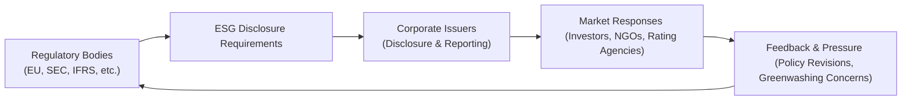

## Introduction

Ever had that moment when you’re scanning a company’s sustainability report, and you’re like, “Ok, but is this for real?” Well, you’re not alone. Regulators, investors, and even local communities are all asking the same question—pushing companies to share more, share better, and share honestly about their Environmental, Social, and Governance (ESG) performance. ESG disclosures are no longer just a “trend.” They’re practically a requirement for firms that want to stay afloat in this fast-evolving marketplace. In this section, we’re going to explore the wide range of forces—regulatory and market-driven—that shape how companies report on ESG issues. From the European Union’s Corporate Sustainability Reporting Directive (CSRD) all the way to investor coalitions like Climate Action 100+, there’s a lot on the table. Let’s see how it all fits together.

## Evolving Regulatory Landscape

Regulations around ESG disclosures have ramped up worldwide, and if you’re a corporate issuer, you can’t afford to be indifferent. These regulations define the “rules of engagement” for how companies must capture and share data on environmental impact, human capital, governance structures, and more.

### The European Union’s CSRD

The Corporate Sustainability Reporting Directive (CSRD) is set to replace and expand upon the existing Non-Financial Reporting Directive in the European Union. It compels companies (above certain size thresholds) to provide comprehensive sustainability reports:

• Broader Scope: Includes both large public-interest entities and smaller firms (over time).  
• Disclosure Requirements: ESG strategy, policies, targets, risks, outcomes, and forward-looking data must all be integrated.  
• Assurance: Companies must seek independent assurance on these reports, similar to standard financial audits.  

The CSRD aims to ensure a high degree of transparency and comparability across EU markets. It’s going to be a massive shift, and it’s not optional. For multinational companies operating in Europe, the CSRD you can say is that unstoppable wave of compliance heading your way.

### Securities Regulators and ESG

On the other side of the Atlantic, the U.S. Securities and Exchange Commission (SEC) has historically been cautious about mandating ESG disclosures. But times are changing. Now, the SEC has proposed or is considering rules that would require disclosures on climate-related risks (like greenhouse gas emissions and financial impacts of climate change) and human capital metrics. If such rules go into effect, companies would have to break down the potential financial implications of climate events (e.g., severe storms) as well as their plan for mitigating these risks.

And in other parts of the world—like the UK, Canada, and Australia—it’s similar. Regulators are either implementing or exploring frameworks that demand more granular ESG data. Don’t be surprised if you see announcements from your local securities commission soon.

### Emerging Global Frameworks: ISSB

A major development in standardized reporting is the introduction of the International Sustainability Standards Board (ISSB). The ISSB was formed by the IFRS Foundation to develop a global baseline for sustainability disclosures. The long-term dream: to have a consistent structure (akin to IFRS accounting standards) that all companies worldwide can follow for ESG disclosures.

If you’re thinking, “This is starting to look like a puzzle of overlapping frameworks,” you’re not wrong! But the ISSB wants to unify them. Many believe the ISSB will coordinate with existing standards (like the Task Force on Climate-Related Financial Disclosures—TCFD, the Global Reporting Initiative—GRI, and others) so that eventually we’ll have a single, globally accepted set of ESG reporting rules. That would be a huge load off compliance teams who currently juggle multiple frameworks at once.

## Investor Coalitions & NGO Campaigns

Beyond formal regulations, we’ve got these organized investor groups and NGO-led campaigns. They’re not government agencies, but they can wield tremendous influence.

### Climate Action 100+

Climate Action 100+ is a coalition of more than 700 investors, collectively managing around—well, a mind-boggling amount of assets under management. Their mission is to pressure the world’s largest corporate greenhouse gas emitters to slash emissions, enhance climate disclosures, and strengthen governance of climate risks. A big chunk of their success is the ability to coordinate large institutional investors to vote in favor of pressing climate resolutions or to engage with management directly.

When a group like Climate Action 100+ targets a company, the company’s leadership takes notice. Clashing with a major investor bloc isn’t good for share price stability or reputation. So even outside of mandatory regulations, these coalitions can spur meaningful changes in ESG reporting.

### Other Notable NGO Initiatives

Some NGOs (like the Carbon Disclosure Project, CDP) work with firms to publicly disclose greenhouse gas emissions and water usage. Others, like the Fair Labor Association, focus more on labor practices. Firms often participate because it aligns with stakeholder values and, let’s be honest, no one wants to be publicly shamed for inaction or opacity in their supply chain.

## Comply-or-Explain Approaches

In many jurisdictions, you’ll find a “comply-or-explain” model in place, which basically says: “Meet these ESG guidelines, or give a darn good reason why you can’t.” The logic is that not every single guideline will be relevant to every company, so a little flexibility is allowed. However, the freedom is often overshadowed by reputational risk. If a firm chooses not to comply, it better have a well-articulated explanation—otherwise, investors, rating agencies, and even consumers might see them as lagging behind industry norms.

## ESG Rating Agencies and Index Providers

Once upon a time, credit rating agencies were all about plain-vanilla financial metrics. Now, rating agencies and index providers incorporate multifaceted ESG metrics into their scoring. Take MSCI or FTSE Russell as prime examples. Their indices often exclude companies with poor ESG performance, which can cause those firms to lose access to certain investor segments (like sustainability-focused mutual funds and ETFs).

• Weighted Criteria: An ESG rating might weigh environmental practices at 40%, social at 30%, governance at 30%—or any ratio the agency decides.  
• Sector-Specific Factors: A utility company’s environmental score might weigh carbon intensity more heavily than, say, a tech firm.  

For a corporate issuer, a bad ESG rating can mean a higher cost of capital if large institutions shy away from your bonds and shares. And a good ESG rating can help secure lower financing rates or broader investor interest. So, yes, it absolutely affects a firm’s bottom line.

## Consumer Activism and Social Media

Sometimes it’s not the big regulators or institutional investors who apply the greatest pressure—but everyday consumers watching a brand’s every move. Ever seen a viral Tweet or Instagram post calling out a company’s questionable labor practices? That calls the public’s attention to problems that might otherwise be buried in annual reports. Fear of social-media backlash (and all the brand damage that can result) has incentivized companies to preemptively strengthen their ESG practices and communications.

I once saw a mid-sized apparel company’s entire marketing campaign unravel after a consumer on social media discovered a labor violation in one of the factories the company contracted with. Suddenly, the brand had no choice but to respond publicly, promising more transparent supply chain reporting. It was a hard lesson, but an effective one.

## Peer Benchmarking Pressures

Peer benchmarking is when a company tracks not just its own ESG metrics but also compares them to competitors or industry best practices. You might see headlines like “82% of large-cap banks now disclose carbon footprint data.” If you’re one of the 18% not doing so, that’s not a great look. This is more than just a vanity metric—failing to keep pace with industry norms can jeopardize relationships with certain institutional investors, or even hamper recruitment efforts when prospective employees want to work at a “sustainability leader.”

## The Risk of Greenwashing

Greenwashing is a term you might hear a lot these days. It’s when a company overstates or flat-out misrepresents how environmentally friendly or socially responsible it is. While companies often do it to jazz up their brand image, the consequences can be severe. Regulatory fines, class-action lawsuits, and investor outrage loom large. Sizable institutional investors have little appetite for reputational blowback, so once greenwashing allegations hit the news, you risk losing major backers. And let’s be honest: reputations can be difficult to restore.

## Putting It All Together

Today’s ESG reporting landscape is shaped by a blend of centralized regulations (like the EU’s CSRD), watchdog agencies (SEC), multinational frameworks (ISSB), investor-led activism (Climate Action 100+), consumer scrutiny, and competitive benchmarking. Below is a high-level flowchart illustrating some of these interactions:

The cycle is ongoing: regulators oversee and adapt rules, companies comply (or explain), and the market reacts. This feedback loop fuels continual improvements—at least in theory!  

## Exam Guidance and Pitfalls

For the CFA exam, expect scenario-based questions testing your understanding of how these regulatory and market pressures can influence a firm’s capital structure decisions, cost of capital, or even dividend policies (remember cross-topic integration from Chapter 11). Common pitfalls include:

• Overlooking Reputational Risk: Don’t forget that negative PR can affect stock price just as much as regulatory penalties.  
• Assuming Rules Don’t Overlap: In reality, a company might comply with EU rules and simultaneously meet IFRS/ISSB guidelines. Overlapping frameworks can create confusion.  
• Underestimating Comply-or-Explain: Some folks read “comply-or-explain” and assume the “explain” part is an easy way out. It’s not—beware of consequences.  

Also, keep in mind how ESG rating agencies can directly influence share prices and bond yields. They’re quite influential, so if you see a question on cost of capital or capital structure, think about how a strong ESG rating (or a weak one) factors into the analysis.

## References

• European Commission, “The new EU rules on sustainability reporting”:  
  https://ec.europa.eu/info/business-economy-euro/company-reporting-and-auditing  

• Sustainability Disclosure Requirements (SDR) initiatives in various jurisdictions (e.g., UK, Japan)  

• IFRS Foundation – ISSB updates: https://www.ifrs.org/issued-standards/issb-standards  

• Climate Action 100+: https://www.climateaction100.org  

• MSCI ESG Ratings: https://www.msci.com/our-solutions/esg-investing  

• FTSE Russell ESG Ratings: https://www.ftserussell.com/products/indices/esg  

• TCFD (Task Force on Climate-Related Financial Disclosures): https://www.fsb-tcfd.org  

## Test Your Knowledge: Regulatory and Market Pressures on ESG Disclosures



### Which statement best describes the aim of the Corporate Sustainability Reporting Directive (CSRD) in the EU?

- [ ] To provide optional sustainability guidelines for companies with fewer than 250 employees.
- [x] To impose more comprehensive sustainability reporting requirements on large EU companies.
- [ ] To eliminate independent assurance processes from sustainability reporting.
- [ ] To provide investor coalitions with legal authority over corporate ESG disclosures.

> **Explanation:** Under the CSRD, large EU companies (and eventually smaller ones too) must produce detailed sustainability reports, including assurance. It’s intended to make sustainability disclosures more robust and standardized.

### What is the main objective of the International Sustainability Standards Board (ISSB)?

- [ ] To replace all national auditing standards worldwide.
- [ ] To function primarily as a climate-change research organization.
- [ ] To grant ESG certification to companies that meet certain criteria.
- [x] To create global sustainability disclosure standards for consistent ESG reporting.

> **Explanation:** The ISSB intends to introduce a global baseline for ESG disclosures, building on existing frameworks and striving for a unified reporting approach.

### How do investor coalitions like Climate Action 100+ primarily influence corporate ESG disclosure?

- [x] They coordinate investors to engage with and pressure large emitters to improve transparency and reduce emissions.
- [ ] They serve as a government intermediary to audit corporate ESG reports.
- [ ] They function as index providers deciding which companies to include in ESG benchmarks.
- [ ] They keep ESG disclosures confidential to avoid market volatility.

> **Explanation:** Climate Action 100+ is a coalition that leverages the collective muscle of large institutional investors, encouraging or pressuring major companies to take specific steps toward proactive climate action and disclosure.

### In a “comply-or-explain” regulatory approach for ESG disclosures, what risk do companies face if they choose the “explain” route?

- [ ] They are automatically categorized as non-compliant and penalized monetarily.
- [ ] They must apply for an official exemption from regulatory bodies.
- [x] They must provide a solid justification for non-compliance, or face reputational damage and investor skepticism.
- [ ] They will be delisted from major stock exchanges.

> **Explanation:** The “explain” option is intended to allow flexibility, but it’s not a free pass. A weak or unjustified explanation can harm a company’s reputation and highlight potential ESG risks or deficiencies.

### Why do ESG rating agencies assign different weighting models to environmental, social, and governance factors?

- [x] Each sector or industry faces distinct ESG risks, so weighting is adjusted accordingly.
- [ ] Rating agencies are required by law to use varying weightings for each factor every year.
- [x] It helps refine industry-specific assessments, capturing nuances in corporate practices.
- [ ] The different weighting models are purely random to maintain market unpredictability.

> **Explanation:** The weighting approach is designed to account for varying materiality of ESG factors across industries. For instance, a manufacturing firm’s environmental impact might be more critical than that of a software startup.

### Which of the following best illustrates “greenwashing”?

- [x] A company promotes its product as carbon-neutral but fails to disclose significant emissions in its supply chain.
- [ ] A company invests in new technology to reduce greenhouse gas emissions.
- [ ] A company sets public climate targets and publishes regular progress updates.
- [ ] A company discloses negative environmental impacts in an annual ESG report.

> **Explanation:** Greenwashing is the act of misrepresenting or exaggerating sustainability efforts. Claiming carbon neutrality while ignoring large parts of the carbon footprint fits that description.

### What is a key effect of ESG performance on a firm’s access to capital?

- [x] High ESG ratings can attract a broader investor base and potentially lower financing costs.
- [ ] Strong ESG performance typically increases volatility and unpredictability in share prices.
- [x] Low ESG ratings deter institutional investors, increasing the firm’s cost of capital.
- [ ] ESG performance has no measurable impact on a firm’s cost of capital or investor base.

> **Explanation:** ESG scores factor into credit rating and investor sentiment. Firms with higher ESG ratings often experience better credit terms; those with poor ESG scores could face higher funding costs.

### How can social media activism push companies toward better ESG disclosure?

- [x] Rapid, widespread sharing of information can harm brand reputation, pressuring companies to provide more transparent ESG data.
- [ ] Social media activism only influences private equity firms, not public corporations.
- [ ] Companies can easily ignore online criticisms due to the lack of formal regulation.
- [ ] Only regulators, not social media campaigns, can impose mandatory ESG disclosures.

> **Explanation:** Consumer-driven outcry on social platforms can tarnish a brand’s reputation quickly, prompting corporate leaders to strengthen ESG policies and disclosure to regain public trust.

### What does “peer benchmarking” imply in the context of ESG?

- [x] Companies compare their ESG performance to industry peers or best practices to gauge their standing.
- [ ] Companies keep their ESG data strictly confidential to prevent competitive disadvantage.
- [ ] Companies use short-term market fluctuations to assess governance structures.
- [ ] It refers to bridging the ESG disclosure gap between private and public firms.

> **Explanation:** Peer benchmarking involves assessing oneself against competitors or “best-in-class” benchmarks to drive improvements in ESG practices. Firms that lag behind risk negative market perception.

### True or False: Regulators and investor coalitions often work together to enforce legal penalties for greenwashing.

- [x] True
- [ ] False

> **Explanation:** While regulators have the authority for legal penalties, investor coalitions can pressure regulators or companies. In practice, they can coordinate to expose and call out greenwashing, leading to formal investigations or penalties.


