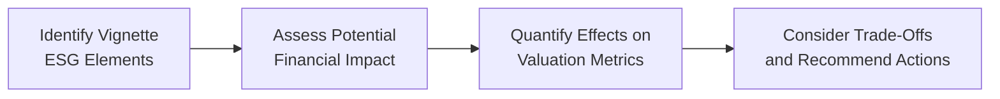
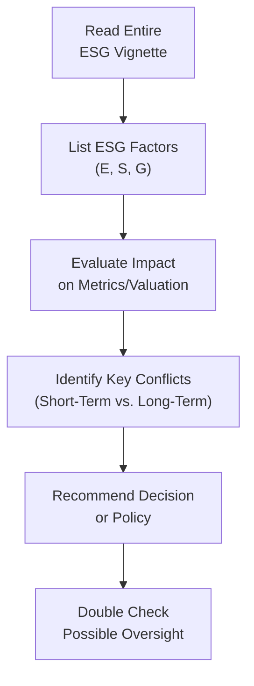

## Introduction

Complex ESG considerations can sometimes feel a bit overwhelming, right? You know—when you’re juggling carbon regulations, under-the-radar labor issues, and board-level conflicts, all while trying to keep your spreadsheets balanced. It’s a lot. And in the CFA® Level II exam setting, these very tricky dilemmas can show up as well-crafted vignette scenarios. I remember the first time I encountered a multi-layered ESG question in a practice exam. I just stared at it, thinking, “Where do I even begin?” The good news is that once you learn a structured approach, it becomes easier—dare I say enjoyable—to dissect these complicated item sets.

In this section, we’ll walk through advanced ESG analyses. We’ll consider how environmental, social, and governance factors weave themselves into corporate finance decisions and show you how to handle them under exam conditions. Through practical examples, hypothetical case data, and step-by-step solutions, you’ll see how to evaluate risk exposures, weigh trade-offs, and propose strong recommendations. Our goal is to build your confidence in linking ESG performance with key financial metrics like WACC, ROE, or EPS so that you can create balanced, well-supported answers.

## Why Complex ESG Analysis Matters

Exam item sets at the Level II stage often expect more than just definitions. They test how well you can interpret data, reconcile conflicting goals (like sustainability vs. profitability), and, ultimately, make a recommendation. ESG risks and opportunities are no longer boutique discussions: they are mainstream considerations in capital allocation, enterprise risk management, and long-term corporate strategy. Candidates who can effectively blend ESG insights into valuation and analysis stand out—both on the exam and in the real world.

Moreover, short-termism vs. long-term value creation is a common theme throughout these discussions. You’ll see companies grappling with whether to allocate capital to greener technologies (which might reduce short-term returns) or keep rolling with existing, more polluting processes to maintain current EPS. As we’ll see, the decision isn’t always black and white.

## Key ESG Risk Factors You Might See

Before diving into our big vignettes, let’s briefly recap some ESG risk factors that often show up in item-set style questions:

• Environmental (E): Carbon emissions, water usage, pollution liability, climate change adaptation, and natural resource depletion.  
• Social (S): Labor disputes and strikes, occupational safety, community development, diversity and inclusion measures, supply-chain ethics.  
• Governance (G): Board composition and conflicts of interest, executive compensation, shareholder rights, disclosure quality, or corruption and bribery risk.

It’s important to realize that these categories can overlap. A single scenario might mention a board conflict that arises from a local community’s environmental concerns. Understanding the interplay between these factors and financial metrics is crucial.

## Integrating ESG Data with Finance

In Chapter 6 so far, we’ve explored how to identify, measure, and report ESG factors and how to evaluate their risk exposures. The next step is bridging ESG outcomes with core corporate finance decisions. We typically ask questions like:

• How do new environmental regulations alter a firm’s CAPEX strategy?  
• Does a social conflict, like a labor strike, reduce a firm’s near-term bottom line or hamper its brand equity?  
• Will poor governance (e.g., an entrenched board of directors) increase the firm’s cost of capital?  

This integration demands that you be comfortable toggling back and forth between the “softer” parts of ethics, stakeholder relations, or social dynamics, and the “hard” financial data such as discount rates, equity cost, debt covenants, or payback periods.

A practical method is to incorporate an ESG “score” or rating into your investment analysis and see how it affects your discount rates and the expected cash flow from a project. The core logic: higher ESG risks can lead to higher required returns, increased volatility of future cash flows, and potential legal or compliance costs.

Below is a simple flowchart that outlines one approach to analyzing ESG in a corporate finance vignette:

The above sequence helps you structure your thought process under exam pressure and ensures you don’t accidentally skip an ESG detail.

## Case Illustration: Energy Company with New Carbon Regulations

Imagine a fictional energy firm, Embertron, operating several coal-burning power plants. In a vignette, you discover the local government has enacted stricter carbon emission regulations. Embertron’s management is evaluating a shift to more sustainable power sources. However, wind and solar require higher up-front CAPEX and have longer payback periods. The prompt might present multiple exhibits featuring:

• Embertron’s current P/E and EV/EBITDA multiples,  
• Projected CAPEX for switching to renewables,  
• Historical carbon tax data,  
• Lenders’ rumored push for stricter debt covenants,  
• Board member quotes on governance tensions (e.g., a faction of the board resistant to big capital changes).

### Fact Pattern and ESG Issues

• Environmental Risk: Embertron faces a significant carbon tax hike if it stays with coal. The vignette might hint at future restrictions or penalties.  
• Social Perspective: Local communities complain about air quality, raising potential for negative PR, protest, or possible employee dissatisfaction.  
• Governance Conflict: A subset of board members pushes for immediate change (to mitigate long-term carbon risks), while others prioritize short-term shareholder returns.

### Financial Data

• Current Return on Equity (ROE): 15%  
• Hypothetical Weighted Average Cost of Capital (WACC): 10%  
• Future CAPEX for Renewables: $500 million over five years  
• Potential Carbon Tax Penalty: $40 million annually if coal usage persists

You might see a question like: “Given the firm’s WACC and the net present value (NPV) of the renewable transition, would you recommend the project to proceed, and how should management address the social and board governance implications?”

### Potential Approach

You’d begin by quantifying how that $40 million annual penalty erodes Embertron’s free cash flow if it continues with coal. You’d also consider intangible (but eventually real) impacts such as brand damage, employee turnover, or lawsuits from community groups. Then you’d weigh the payback period and NPV of the renewable CAPEX. If Embertron invests in wind or solar, the short-term hit to cash flow might be high, but the long-term outcome could be net-positive—especially if it lowers WACC by projecting a greener future to lenders.

## Case Illustration: Tech Company and Data Privacy Dispute

Let’s pivot to a consumer technology company, SmartzApp. Suppose the vignette centers on a scandal: the firm’s user data was mishandled, raising a social and governance red flag. Regulators threaten fines and increased oversight, and some board members are questioned about their compliance oversight. The scenario might include:

• Social Angle: Public outcry about data breaches and call for better customer privacy safeguards.  
• Governance Angle: Investigations into whether the board was complicit in ignoring repeated internal security warnings.  
• Financial Angle: Potential fines in the ballpark of $50 million, plus intangible brand harm.

### Financial Metrics

• Historical EPS Growth: 12%  
• Projected Cost to Enhance Data Security: $25 million in the next year  
• Board Restructuring Costs (if forced turnover occurs): $5 million  
• Possible Additional Legal Liabilities: Unknown, but estimates provided in the vignette

### Analysis

Even though $25 million for better data security might nip some near-term earnings, avoiding a $50 million regulatory fine and intangible reputational damage could be a massive net benefit. You’d factor that into your EPS projections—maybe EPS dips in the next year but recovers significantly once user trust returns. The governance dimension might also affect cost of equity if investors see a more credible board in place after the scandal.

## Step-by-Step Problem Solving in Complex ESG Vignettes

When you tackle an ESG item set, it’s helpful to move systematically:

• Read the entire vignette first. Highlight or note each mention of an ESG factor—this ensures you don’t overlook crucial data.  
• Identify the relevant financial metrics. Remember to consider how ESG factors might alter WACC, cost of debt, ROE, or net income.  
• Look for short-term vs. long-term trade-offs. This often shows up as tension between immediate EPS and sustainable practices.  
• Estimate intangible benefits or losses. Although intangible, these can be very real in the mid-to-long term.  
• Provide a comprehensive recommendation. You might suggest that management adopt scenario analysis or propose incremental changes if the board is too resistant.  

Below is a more detailed flow for approaching ESG in an exam scenario:

By including “Double Check,” we remind ourselves to go back and ensure we haven’t missed any subtle ESG angle, such as the interplay of board dynamics or potential new regulations teased in the scenario.

## Model Solutions and Best Practices

Your exam response should marry qualitative judgment with quantitative rationale. While solutions can vary, the best approaches:

• Reference known frameworks. Perhaps mention how the firm’s improved governance may lead to better alignment with the local governance code, thereby reducing risk premiums.  
• Demonstrate sensitivity analysis. If possible, show you understand how results shift if, say, carbon taxes are higher or brand damage is worse than management predicts.  
• Highlight stakeholder communication. Sometimes the best solution includes improved disclosures or stakeholder engagement to calm investor or community fears.  
• Provide a balanced answer. You’ll rarely say “Go all-in on sustainability no matter the cost,” but you don’t want to appear ignorant of the intangible risks. Recognize the trade-offs and try to propose measured, well-reasoned steps.

## Common Pitfalls

• Ignoring intangible factors: Watch out for the temptation to only focus on near-term net income. ESG issues can have ripple effects.  
• Overlooking governance conflicts: It’s easy to skip board-level tension, but exam vignettes frequently hint at how composition or incentive structures might hamper the best ESG decision.  
• Underestimating regulatory risk: Costs of fines, shutdowns, or lawsuits can be massive.  
• Failing to mention financial ratios. ESG analysis does not replace, but rather complements, the usual corporate finance metrics.

## Conclusion

Complex ESG vignettes are your chance to shine by showcasing a holistic financial perspective. At a glance, they mix environmental regulations with workforce or community tension and pepper in subtle hints about executive accountability. Your job is to merge ESG insights with tried-and-true financial analysis—NPV, WACC, EPS, or free-cash-flow forecasting. The best solutions acknowledge short- and long-term trade-offs, propose balanced actions, and reference critical data in the vignette.

I often tell candidates: “Work methodically and keep your eyes open for the hidden angles.” Data on issues like carbon taxes or board disputes can be subtle. Spot them, weigh them, and incorporate them into your final decision. By doing so, you’ll craft well-rounded, exam-ready answers that also echo real-world corporate finance best practices.

## References for Further Exploration

• CFA Institute’s Global ESG Disclosure Standards for Investment Products – best source for advanced methodology and up-to-date global ESG considerations.  
• Case Studies in Sustainability and Corporate Finance on SSRN – many free research papers provide real data on how ESG concerns were addressed in actual corporate scenarios.  
• Major consulting firm ESG libraries (e.g., McKinsey, PwC, EY) – short reads on how top companies balance growth and sustainability.  

---------------------------------

## Practice Questions on Complex ESG Scenarios



### Complex ESG Interactions: Boardroom Dynamics

- [ ] Emphasize only quantitative returns during board debates and ignore board dissent as immaterial.
- [ ] Recommend halting all ESG investments until a full cost-benefit analysis is performed, ignoring intangible benefits.
- [x] Incorporate both quantitative and qualitative ESG considerations, especially areas where board members disagree, to evaluate potential risks and benefits.
- [ ] Present only the potential upside from ESG projects while avoiding mention of compliance costs.

> **Explanation:** Strong recommendations assess any governance conflicts or board-level tension and highlight intangible factors like brand equity, regulatory risk, and stakeholder perceptions.

### Identifying Material ESG Factors

- [x] Carbon taxes, water usage, worker safety, and board conflicts can all be considered material ESG factors.
- [ ] Material ESG factors only relate to environmental metrics, such as carbon emissions and waste disposal.
- [ ] Social considerations like worker safety are never considered material unless there’s a strike.
- [ ] Governance conflicts rarely affect valuation metrics.

> **Explanation:** Material ESG issues are those that could reasonably affect the firm’s financial performance, valuation, or reputation. All E, S, and G factors can be material, depending on the scenario.

### Deliberating Short-Term vs. Long-Term Trade-Offs

- [ ] Always prioritize short-term earnings to satisfy quarterly reporting expectations.
- [ ] Completely ignore short-term earnings in favor of potential long-term ESG gains.
- [x] Balance immediate profitability with future ESG-related benefits, evaluating how decisions impact both near- and long-term firm value.
- [ ] Always allocate 50% of net income to ESG projects, regardless of circumstances.

> **Explanation:** The best practice is to consider both sides, weighing immediate impacts on earnings and potential future benefits or reduced costs from improved ESG standing.

### Quantifying ESG Impact on Valuation

- [ ] ESG factors have no place in traditional valuation metrics.
- [x] ESG factors can change both a firm’s cost of capital and expected cash flows, influencing valuation.
- [ ] Only governance issues affect a firm’s valuation.
- [ ] Environmental concerns are always offset by social benefits.

> **Explanation:** ESG factors often influence risk perceptions (cost of capital) and potential future cash flows (through penalties, brand impact, or operational efficiencies), which in turn affect firm valuation.

### Scenario: A New Regulation

- [ ] Assume new regulations impose zero-cost compliance.
- [x] Consider incremental compliance costs in your cash flow projections, along with any potential drop or rise in output or sales.
- [ ] Delay any mention of regulations until after the final financial analysis is complete.
- [ ] Regard new regulations as automatically beneficial to the firm’s share price.

> **Explanation:** New regulations can impose direct costs or alter demand for a firm’s products. Include them in your forecasts, as ignoring this data can lead to inaccurate valuations.

### ESG and the Board’s Role

- [x] A board that fails to address ESG risks might increase the company’s overall risk profile, leading to higher WACC.
- [ ] Board discussions about ESG risk have no direct impact on financing decisions.
- [ ] Board conflicts never spill over to investor perceptions.
- [ ] Governance is irrelevant when analyzing a firm’s cost of equity.

> **Explanation:** Poor governance or ESG oversight can lead investors to demand a higher return, raising WACC and potentially hindering the firm’s growth investments.

### Weighing Regulatory Penalties

- [ ] Regulatory fines are typically too small to matter in valuations.
- [x] Large-scale ESG violations can lead to penalties that significantly impact free cash flow and risk perceptions.
- [ ] Only recurring penalties affect net income, not one-time fines.
- [ ] Fines rarely show up in item-set vignettes.

> **Explanation:** One-time or recurring penalties can erode the bottom line and signal further risk, contributing to higher financing costs or reputational damage.

### Social Issues in Vignettes

- [ ] Social issues are immaterial unless they directly impact a firm’s short-term net income.
- [x] Worker safety or community disputes can create brand damage, lawsuits, or operational delays that harm financial performance.
- [ ] Social issues can always be solved with an increased marketing budget.
- [ ] Social matters never intersect with environmental or governance concerns.

> **Explanation:** Social factors, such as employee safety or labor disputes, can lead to strikes, brand issues, or legal battles, creating headwinds for earnings and growth.

### Governance Conflicts and Disclosure

- [ ] Minimizing disclosures to investors is always best to keep competitive information hidden.
- [ ] Strict corporate disclosure on ESG matters invites unnecessary scrutiny.
- [x] Enhanced disclosure can reduce uncertainty among investors, often lowering the firm’s perceived risk profile.
- [ ] Disclosures only matter when speculation about wrongdoing hits the media.

> **Explanation:** Transparent ESG disclosure can build trust among investors and stakeholders, potentially reducing required returns and stabilizing access to capital.

### True or False: ESG Integration in Valuation

- [x] True
- [ ] False

> **Explanation:** True. ESG integration is increasingly recognized as crucial in modern corporate finance decisions. Analysts who incorporate material ESG factors are better able to identify potential risks and opportunities and more accurately estimate a firm’s fair value.


