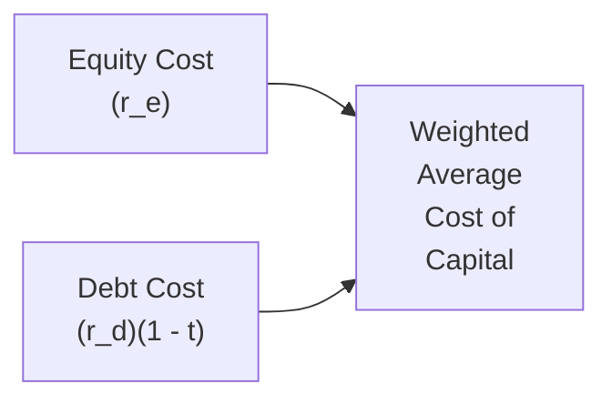

## Introduction

So, let’s talk about Weighted Average Cost of Capital (WACC). If you’ve ever worked on a capital budgeting project and wondered which discount rate to use when you forecast and discount those future cash flows, well—chances are WACC was front and center. It’s that ubiquitous measure of a firm’s overall cost of raising money, encompassing both equity and debt. It might sound intimidating at first, but trust me, once you see how it’s pieced together, it’s actually pretty straightforward.

Back when I was first trying to wrap my head around WACC, I kept mixing up the after-tax cost of debt with the pre-tax cost. Whoops. That little oversight can create big errors in project valuation and can lead you astray when deciding on important corporate investments. Let’s ensure we don’t make that mistake again. This section is all about refreshing your existing knowledge of WACC and layering on some new insights, so you’re fully equipped for the item set questions you might see on your Level II exam—and for real-world corporate finance decisions.

## The Purpose of WACC

Weighted Average Cost of Capital (WACC) is essentially the firm’s blended cost of financing its operations and growth, reflecting both debt and equity. At a high level, think about a company financing itself partly through borrowing money (issuing bonds or taking on loans) and partly by selling ownership stakes (i.e., equity shares). Each source of financing demands a return, and WACC shows you the overall, or “average,” cost of maintaining that capital structure.

But why do we use it? Because it’s an excellent proxy for the minimum rate of return a company needs to earn on its projects in order to keep investors (both equity holders and creditors) happy. If the firm’s investment returns exceed WACC, the firm grows value. If returns keep falling short of WACC, well, that’s a sign of trouble.

## WACC in Decision-Making

Companies typically don’t want to invest in projects that earn below their cost of capital (as measured by WACC). Accepting a project that yields less than WACC is like knowingly taking on a negative net present value (NPV). You’re destroying value instead of creating it. So we often call WACC the “hurdle rate”: that target of “you must be at least this tall to ride the ride.”  

Here’s a quick example:  
• Suppose a firm’s WACC is 8%.  
• You have a project expected to yield a 10% return.  
• Great news: 10% > 8%. You accept that project.  

If the project only yields 6% (less than WACC), it implies the project’s net present value is probably negative (assuming everything else is consistent). Rejecting that project would generally be wise.

## Historical vs. Forward-Looking Data

One major pitfall in practice is mixing up the difference between backward-looking and forward-looking data. Historical cost of capital is derived from past interest rates, prior capital structures, and old betas. But WACC should ideally reflect the firm’s future. Because we want to discount prospective cash flows, we have to match them with a prospective cost of capital. So, be sure to incorporate:  
• Current market risk premiums, rather than last year’s.  
• Up-to-date interest rates.  
• A current capital structure or your target capital structure.  

If you only rely on historical data, you might be basing decisions on conditions that no longer apply. Markets shift, interest rates wiggle up and down, and firm-specific risk can evolve quickly.

## The Importance of the Tax Shield

Now the cost of debt is typically lower than the cost of equity, partially because of the tax shield on interest. Interest is generally tax-deductible in many jurisdictions, meaning if a firm pays $100 in interest at a 30% corporate tax rate, it effectively reduces its taxable income by $100, saving $30 in taxes. Well, that effectively reduces the cost of borrowing to the firm. In WACC terms, we incorporate this by multiplying the cost of debt by (1 – t).  

Mathematically, you might have seen the standard WACC formula:


\text{WACC} = w_e \cdot r_e + w_d \cdot r_d \cdot (1 - t)


where:  
• \\( w_e \\) = weight of equity in the firm’s capital structure (in market value terms)  
• \\( w_d \\) = weight of debt in the firm’s capital structure (in market value terms)  
• \\( r_e \\) = cost of equity  
• \\( r_d \\) = cost of debt (pre-tax)  
• \\( t \\) = marginal tax rate  

It’s a simple formula, but loaded with nuance. Don’t forget the (1 – t) adjustment—failing to do so can inflate your WACC and cause you to reject good projects.

## Market Value Weights and Target Capital Structure

So, maybe you’re asking, “Where do these weights \\( w_d \\) and \\( w_e \\) come from?” You want to avoid using book values—like the ones from the balance sheet—unless you have no market data at all. Market-based weights are more reflective of what it actually costs the firm to raise new capital right now. So, it’s typical (and recommended by the CFA curriculum) to use:  
• Market capitalization for equity.  
• Market value (or fair value) for debt.  

Additionally, many firms have long-term goals about how much debt versus equity they want in their capital stack—this is sometimes called the target capital structure. If the firm is always trending toward some ratio, you might rely on that target ratio to estimate your WACC rather than today’s possibly transitory capital structure.

## Key Limitations of WACC

Although WACC is widely used and taught, it isn’t perfect. Here are some caveats:

• Stable Capital Structure Assumption: WACC typically presumes the firm’s proportion of debt to equity remains constant over the life of the project. That might not be realistic if the firm is actively changing its leverage.

• Uniform Project Risk: It also assumes any new project is “average risk” for the firm. If you have one project in a stable consumer goods division and another in a high-tech, emerging field, the differences in risk profiles are huge. You can’t just apply the same WACC across the board.

• Estimation Challenges: We’re dealing with the cost of equity (which can be derived from CAPM, Dividend Discount Models, or an expanded CAPM with premium adjustments), the cost of debt (from current yields or credit spreads), and tax rates (which can change). A small change in any input can move your WACC significantly, especially for growth firms or those with high leverage.

## Adjusting WACC for Project Risk

Let’s say your company’s main line of business is real estate development, but you’re venturing into some high-tech solar power project that’s riskier. If you go ahead and use the same WACC you use for standard real estate deals, you might be underestimating the required rate of return. This is where project-specific WACCs—or risk-adjusted discount rates—come into play.

One approach is to use a “pure play” method, in which you look at other publicly traded firms specializing in that new line of business, estimate their betas, and then re-lever that beta to match your project’s target debt-to-equity ratio. Another approach is to add a risk premium on top of your standard cost of equity if the project’s volatility is higher. The key is to ensure you’re not applying a blanket cost of capital to projects with fundamentally different risk profiles.

## Challenge Your Assumptions

Even if you set your WACC once a quarter (or year), it’s wise to keep an eye on the interest rate environment, the firm’s credit spreads, shifts in capital structure, and equity market dynamics:

• Risk-Free Rate Changes: Everyone’s cost of equity can get nudged by movements in the risk-free rate.  
• Market Risk Premium: If the market meltdown last quarter caused risk premiums to surge, your cost of equity might be higher than you thought.  
• Beta Adjustments: Has your firm’s beta changed due to new lines of business or a strategic shift in your product mix?  
• Tax Rates: If corporate tax laws shift, that can drastically change your after-tax cost of debt.  

In other words, WACC is not a “set it and forget it” metric.

## A Quick Example Calculation

Let’s run a simplified example to illustrate how WACC might work in practice:

Suppose EagleOne Inc. has the following capital structure and costs:  
• Equity: Market cap of $500 million. Cost of equity (r_e) = 10%.  
• Debt: Market value of $300 million. Pre-tax cost of debt (r_d) = 6%.  
• Corporate tax rate (t) = 25%.  

Step by step:  
1. Calculate total market value of capital: \\( 500 + 300 = 800 \\) million.  
2. Equity weight: \\( w_e = 500 / 800 = 0.625 \\) or 62.5%.  
3. Debt weight: \\( w_d = 300 / 800 = 0.375 \\) or 37.5%.  
4. After-tax cost of debt: \\( 6\% \times (1 - 0.25) = 4.5\% \\).  
5. Finally, WACC:  
   
   \text{WACC} = (0.625 \times 10\%) + (0.375 \times 4.5\%) 
   = 6.25\% + 1.69\% 
   = 7.94\%.
     

In a real scenario, you might have separate classes of debt with different coupon rates or a more nuanced approach to costs of equity. But this is the gist: we weigh the costs of each slice of the pie according to their market values.

## Visual Representation

Here’s a quick flowchart that shows how WACC blends the costs of equity and debt:

The final WACC node combines these streams using market-value-based weights.

## Best Practices and Common Pitfalls

• Use forward-looking estimates for each component cost.  
• Revisit your target capital structure—especially if you’re analyzing a project expected to change your debt/equity mix.  
• Don’t ignore the tax benefit on interest.  
• Pay attention to big swings in interest rates or credit spreads.  
• If you’re evaluating a project outside your firm’s normal business risk, consider adjusting WACC.  
• Double-check that you’re using the appropriate risk-free rate and beta for your cost of equity.  

I remember messing up a WACC estimate when interest rates spiked in the middle of a project evaluation. We stuck with an outdated cost of debt figure from months ago, which severely underestimated the firm’s cost of capital. Not fun explaining that one—trust me.

## Exam Tips: WACC in CFA Level II Vignettes

On your CFA exam, you’ll see item sets (vignettes) that often include a firm’s capital structure data, maybe a snippet about recent changes in interest rates, or a mention that the firm is targeting a new ratio. Read carefully. Look out for:  
• Clues pointing to outdated or historical data.  
• Hints at new risk levels (like expansions into new markets).  
• The presence of multiple debt instruments.  
• Potential changes in the marginal tax rate or a difference between statutory and effective tax rates.  

They might even throw in a question about how to handle project-specific WACC or mention an expected change in the firm’s capital structure. Keep your eyes peeled and practice applying the formula systematically.

## Glossary

Weighted Average Cost of Capital (WACC)  
• The firm’s overall required rate of return, reflecting the weighted cost of both equity and debt financing.

Market Value Weights  
• Using market capitalization for equity and fair value for debt when determining proportional weights for WACC calculations.

Tax Shield  
• The effective reduction in a firm’s tax liability because interest payments on debt are often tax-deductible.

Capital Budgeting  
• The process where firms decide which long-term projects add value—and which don’t—usually by comparing their expected returns to WACC.

Opportunity Cost of Capital  
• The return forgone by investing in a project, rather than in an investment of similar risk elsewhere in the market.

Risk-Adjusted Discount Rate (or Project WACC)  
• A discount rate that incorporates additional risk premiums—used when a project is riskier (or less risky) than the company’s usual ventures.

Target Capital Structure  
• The proportional mix of debt and equity financing a firm aims to hold in the long run.

Marginal Cost of Capital (MCC)  
• The cost of the next dollar raised, which can be higher than the WACC if you move into more expensive financing options.

## Conclusion and Key Takeaways

WACC is the bedrock of corporate finance when it comes to valuation and project selection. But you need to remember: it’s only as good as the assumptions behind it. Use market values for weighting, always account for the tax impact on debt, adapt for project-specific risk when appropriate, and frequently update your inputs to reflect current market conditions. Doing so will help ensure you don’t inadvertently scorch your capital budgeting process with inaccurate discount rates.

Keep practicing item set questions that involve calculating or interpreting WACC under various scenarios—like changes in interest rates or a shift in beta. The exam vignettes will often test not just your calculation capability but also your judgment in deciding whether the given input data is appropriate.

## References

- CFA® Program Curriculum, Level II, Corporate Finance Readings  
- Ross, Westerfield, and Jaffe, “Corporate Finance,” McGraw-Hill  
- Damodaran, A., “Investment Valuation,” Wiley  
- McKinsey & Company, “Valuation: Measuring and Managing the Value of Companies”  

## Test Your Knowledge: WACC Concepts and Applications



### A project’s hurdle rate is typically set equal to

- [ ] the risk-free rate.  
- [x] the firm’s WACC.  
- [ ] the firm’s pre-tax cost of debt.  
- [ ] the firm’s marginal tax rate.  

> **Explanation:** The hurdle rate for most capital budgeting decisions is generally the WACC, although project risk may require adjustments.

### Which of the following statements best characterizes the treatment of debt in the WACC formula?

- [ ] Debt is combined with equity before the tax shield is applied.  
- [x] The cost of debt is multiplied by (1 – t) to capture the tax shield.  
- [ ] The cost of debt includes a tax premium added to its nominal yield.  
- [ ] The cost of debt is typically higher than the cost of equity for all firms.  

> **Explanation:** Because interest is tax-deductible in most jurisdictions, we adjust the cost of debt for the tax shield by multiplying by (1 – t).

### Using the pure play method implies

- [x] finding comparable firms specialized in the risky project’s field and deriving a proxy beta.  
- [ ] applying the firm’s unleveraged beta to all future projects.  
- [ ] adopting an arbitrary premium to the existing WACC to account for risk.  
- [ ] ignoring the cost of equity and focusing solely on the cost of debt.  

> **Explanation:** The pure play approach identifies firms already operating in the same line of business to estimate a relevant beta for the project.

### A major limitation of using a constant WACC across all projects is that

- [ ] WACC never changes once set.  
- [ ] it is impossible to estimate cost of debt once the capital structure changes.  
- [x] projects have varying risk profiles that may not match the overall firm’s risk.  
- [ ] no tax shield exists for high-risk projects.  

> **Explanation:** Using the same WACC for different types of projects ignores potentially large differences in project-specific risk.

### If a firm’s target capital structure is 60% equity and 40% debt, which weights should be used for WACC calculations if the firm expects to maintain this structure over time?

- [ ] Today’s market values of equity and debt.  
- [ ] Book values of equity and debt.  
- [x] 60% equity and 40% debt.  
- [ ] Whichever ratio the firm’s CFO prefers on that day.  

> **Explanation:** When a firm has a clearly defined target capital structure and intends to maintain it, those target weights should guide the WACC.

### Which of the following inputs would NOT typically change WACC from one year to the next?

- [ ] A change in the market risk premium.  
- [ ] A change in the firm’s beta.  
- [ ] A change in the tax rate.  
- [x] The firm’s final dividend payment date.  

> **Explanation:** Dividend payments are unlikely to affect WACC directly unless they indicate a change in capital structure or market views about the firm’s risk.

### The marginal cost of capital (MCC) refers to

- [ ] the weighted average of all existing debt and equity.  
- [x] the cost of raising the next incremental amount of financing.  
- [ ] the cost of preferred equity only.  
- [ ] the cost of debt times (1 – t).  

> **Explanation:** MCC focuses on the additional cost for the next dollar of financing, which may differ from the firm’s established average cost.

### Which scenario would most likely require separate calculation of a project-specific WACC?

- [ ] A project with the same risk as the firm’s core business and a stable financing mix.  
- [x] A significantly riskier project in a brand-new business segment.  
- [ ] A project slightly lower in scale but similar to existing ones.  
- [ ] A project that invests in short-term Treasury securities.  

> **Explanation:** Projects that deviate substantially from the firm’s traditional risk profile usually merit their own discount rate.

### If a firm is entirely equity-financed, its WACC is effectively

- [x] its cost of equity.  
- [ ] risk-free rate plus the risk premium.  
- [ ] zero since there is no debt.  
- [ ] equal to (1 – t) times its cost of equity.  

> **Explanation:** Without debt, the firm’s capital structure consists only of equity, so the WACC is simply its cost of equity.

### The statement “A project should generate a return higher than its WACC to add value to the firm” is:

- [x] True  
- [ ] False  

> **Explanation:** Earning a return above WACC implies positive economic profit, thereby increasing shareholder wealth.


