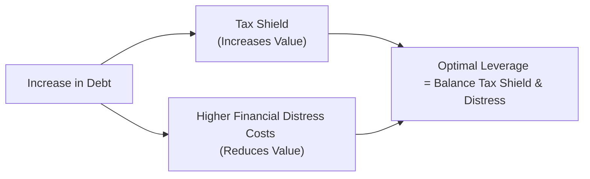

## Introduction
Capital structure, in essence, is all about how a firm chooses to finance its operations—whether that be through debt, equity, or some mix in between. Do you ever wonder why a company might prefer to issue bonds instead of shares? Or why sometimes managers get jittery about adding more debt even if it might boost return on equity? Well, the answer goes right back to the risks and rewards associated with leveraging—also known as using other people’s money.

In this discussion, we’ll delve into key theories (the Trade-Off Theory and the Pecking Order Theory) that explain how managers make decisions about capital structure. We’ll highlight how leverage can supercharge earnings per share (EPS)—but also amplify the downside if things go wrong. And we’ll examine how watchful eyes from lenders (debt covenants) can rein in certain risky decisions, for better or worse. Our goal is to build a comprehensive framework that helps you see exactly how real-world managers weigh the pros and cons of additional debt, and how these decisions shape everything from risk parameters to investor perceptions.

## The Trade-Off Theory Approach
The Trade-Off Theory reminds us that using debt isn’t purely good or purely bad. On one hand, debt creates a handy tax shield: interest expense is tax-deductible, reducing a firm’s taxable income. On the other hand, high debt raises the specter of financial distress and potential bankruptcy, along with associated direct (legal fees) and indirect (reputation damage) costs. The firm’s value can be viewed as:

(1) The value of an all-equity firm  
(2) Plus the present value of tax shields on debt  
(3) Minus the present value of potential financial distress costs  

### Balancing the Pros and Cons
Imagine debt as rocket fuel. It gets you places faster, but if something goes off track, well, you get the picture. A certain level of leverage can enhance shareholder returns, especially when interest rates are low—yet too much leverage can stress cash flows and bring you uncomfortably close to default.

Let’s visualize it:

At lower debt levels, incremental borrowing provides significant tax advantages that outweigh distress costs. But beyond some threshold, those expected distress costs accelerate, overshadowing the tax shield benefits.

### WACC, the Star of the Show
Sprinkled throughout any capital structure conversation is the weighted average cost of capital (WACC). In brief, WACC is the blended rate a firm must pay all its security holders (both debt and equity):


WACC = w_d \times r_d \times (1 - t) + w_e \times r_e


• wᵈ is the proportion of debt in total financing,  
• wᵉ is the proportion of equity,  
• rᵈ is the cost of debt,  
• rᵉ is the cost of equity,  
• t is the corporate tax rate.

By increasing debt (often cheaper than equity, especially with the tax shield), the firm can reduce this overall cost of capital—up to a point. Once the risk of bankruptcy starts looming large, rᵉ and rᵈ both rise because investors demand higher returns for bearing extra risk. That’s why we talk about an “optimal” capital structure, the sweet spot that keeps WACC as low as possible.

## The Pecking Order in Practice
Enter the Pecking Order Theory, which is—you guessed it—another way of explaining how firms determine their financing preferences. If you asked management: “Where do you get the money for your next big project?” The short answer under the Pecking Order Theory is: “We use what’s cheapest and easiest first.” Typically, that means:

1. Internal financing (retained earnings)  
2. Debt (when internal funds aren’t sufficient)  
3. Equity (as a last resort)  

### Why Not Issue Equity Anyway?
Managers often think, “Eh, if we issue new equity, the market might assume the stock is overpriced. That can drive our share price down.” Add to that the friction of underwriting costs and shareholders’ potential worry about dilution. So, management often prefers to dip into retained earnings or rely on cheaper debt rather than face the potential negative signals from an equity issuance. This dynamic can be especially pronounced in industries that rely on intangible assets, as intangible-heavy firms often can’t back large debt loads with tangible collateral, pushing them further into equity territory if they absolutely need external funds. But you can see how the general preference emerges: internal cash → issue debt → issue equity if all else fails.

## The Impact of Leverage on EPS
Leverage can be a powerful force for driving up EPS. Let’s do a quick hypothetical. Suppose a company needs to finance a $1 million project expected to generate an operating income (EBIT) of $200,000 annually. Two scenarios:

• All-Equity: The firm pays no interest expense but must distribute all net income among a larger equity base.  
• Partly Debt-Funded: The firm adds interest expense but can spread net income among fewer total equity shares if it uses some of that borrowed cash to buy back shares or avoid issuing new shares.

Below is a simplified illustration:

| Scenario             | All-Equity          | Moderate Leverage        |
|----------------------|---------------------|--------------------------|
| Total Financing      | $1,000,000 Equity  | $600,000 Equity + $400,000 Debt |
| Interest Rate on Debt| N/A                | 5%                       |
| EBIT                 | $200,000           | $200,000                 |
| Interest Expense     | $0                 | $400,000 × 5% = $20,000  |
| EBT                  | $200,000           | $180,000                 |
| Taxes (30%)          | $60,000            | $54,000                  |
| Net Income           | $140,000           | $126,000                 |
| Equity in Scenario   | $1,000,000         | $600,000                 |
| Return on Equity     | 14%                | 21%                      |

In this simple example, the leveraged scenario yields a higher ROE. But note the bigger risk: If EBIT falls below interest expense, the leveraged scenario can quickly become a nightmare. So, although leverage enhances EPS when times are good, it can crush returns in downturns.

## Agency Costs and Managerial Behavior
Now, let’s talk about the subtle art of aligning managerial decisions with shareholder interests. Debt can—and often does—serve as a disciplining mechanism. Think of it this way: if managers have a lot of free cash flow with no strings attached, they might be tempted to invest in pet projects or take on fancy corporate perks that may not maximize shareholder value. By introducing debt payments and mandatory interest, managers have less leeway for questionable ventures or lavish spending.

But! Debt also introduces potential conflicts between debt holders and equity holders. For instance, if the firm issues a bunch of new debt, existing bondholders face higher risk. Or if managers, acting on behalf of equity owners, shift into riskier business strategies after debt issuance (a phenomenon sometimes referred to as “asset substitution”), bondholders could lose out if things go poorly.

## Debt Covenants: A Mixed Blessing
Debt covenants are often placed in loan agreements and bond indentures to limit such risk-taking behaviors. These can take many forms:

• Maintaining certain financial ratios (e.g., a maximum debt-to-EBITDA ratio)  
• Restrictions on dividends or share repurchases  
• Limits on new debt issuance  

On one hand, covenants help ensure that the firm stays prudent; on the other, they can be restrictive. If a juicy investment opportunity appears but the company is hampered by covenant restrictions, the firm may miss out. Meanwhile, slamming into a covenant violation can lead to higher interest rates, mandatory debt repayments, or even default if the violation isn’t remedied. That’s why a savvy management team weighs not just the amount of debt but also its associated terms.

## Scenario Analysis for Capital Structure
Optimal capital structure isn’t a one-size-fits-all solution. The best approach is often to run scenario analyses:

1. **Best Case**: Demand is high, interest rates remain stable, and the firm’s operating margins remain strong.  
2. **Base Case**: Growth is moderate, interest rates slightly fluctuate, and the firm’s margins are steady.  
3. **Worst Case**: Recession hits, revenue plummets, or the firm faces unforeseen cost overruns.

By modeling net income, WACC, and key financial metrics (e.g., interest coverage ratio, leverage ratio) under these scenarios, management gains a clearer picture of just how much extra borrowing is safe before the risk of distress overshadows the benefits. So, if you’re rethinking your capital structure, it pays to stress test that puppy from multiple angles.

## Lived Experiences and Real-World Illustrations
In my early days, I remember chatting with a CFO who insisted on keeping the firm’s debt load minimal, apparently traumatized by an earlier brush with near-bankruptcy when interest rates spiked. He joked that he “still had nightmares about bankers knocking at the door.” That firm’s culture ended up being extremely conservative, maybe even missing out on profitable expansions. Meanwhile, some “hot shot” tech companies load up on venture debt at times, confident in future payoffs. They want to scale quickly. When it works, it’s brilliant. When it doesn’t—well, you read about it in the news.

These anecdotes help show that capital structure isn’t just about the math. It’s also about risk tolerance, corporate culture, and even personal experiences that shape how management teams think about debt versus equity.

## Implementation Strategies
When a firm decides to adjust its capital structure, it typically has these avenues:

• **Share Repurchases** (for overshadowed equity or spare cash flows)  
• **Debt Issuances** (bonds, term loans, syndicated loans)  
• **Equity Issuances** (common or preferred shares)  

The decision is rarely made in a vacuum. Management must explain its rationale to shareholders, regulators, rating agencies, and bankers. Maybe they point to a strategic acquisition that’s going to double sales or a strong commitment to keep the firm’s investment-grade rating. Implementation also ties in with the firm’s long-term strategy: do they want to remain nimble and have borrowing capacity in reserve, or do they see bigger growth opportunities if they lever up now?

### Levered Beta Considerations
From a valuation standpoint, you’ll often see levered betas in your discounted cash flow (DCF) or capital asset pricing model (CAPM) equations:


\beta_{\text{Levered}} = \beta_{\text{Unlevered}} \left[1 + \left(1 - t\right)\frac{D}{E}\right]


The greater the debt ratio (D/E), the higher the equity risk—and thus the higher rᵉ. This formula is helpful in scenario planning to see how a jump in debt can boost the cost of equity (not to mention the fear factor among shareholders).

## Conclusion and Key Takeaways
Finding the right mix of debt and equity is both an art and a science. The Trade-Off Theory gives a neat framework for balancing tax benefits against distress costs, while the Pecking Order Theory suggests managers prefer funding sources that minimize cost and negative signals to investors. Add in a dash of manager-shareholder-debtholder conflict, plus real-world constraints like debt covenants and uncertain market conditions, and you’ve got a recipe that calls for context-specific finesse.

For exam purposes, remember to:

• Distinguish between the implications of the Trade-Off and Pecking Order Theories.  
• Understand how leverage affects EPS (and, by extension, equity risk).  
• Know how to apply levered beta formulas to measure increased equity risk.  
• Recognize the role of debt covenants and how they can alter managerial flexibility.  
• Perform scenario analyses to gauge the impact of changing economic conditions on capital structure choices.  

In practice, no single “magic ratio” of debt to equity works for all firms. Instead, managers calibrate these decisions based on taxes, business risk, market conditions, asset tangibility, corporate culture, and the intangible but real specter of financial distress.

---

## Test Your Knowledge: Capital Structure & Leverage Decisions Quiz



### Which best describes the primary advantage of debt financing under the Trade-Off Theory?
- [x] The tax shield provided by interest deductibility reduces overall cost of capital.
- [ ] Preferred creditors cannot seize assets in the event of default.
- [ ] Debt always lowers a firm’s required return on equity (rᵉ) in all scenarios.
- [ ] Debt covenants eliminate operating risk for shareholders.

> **Explanation:** The Trade-Off Theory highlights the tax shield (interest expensing) of debt as a key benefit that reduces the firm's overall cost of capital, offset by potential distress costs.

### Under Pecking Order Theory, what is a firm’s preferred source of capital after internal financing is depleted?
- [ ] An immediate equity issue.
- [x] Borrowing through debt instruments.
- [ ] Issuing convertible securities.
- [ ] Acquiring smaller firms to pay for the project.

> **Explanation:** Pecking Order Theory suggests managers turn to debt once internal funds (retained earnings) are used up. Equity is considered last because of potential negative signaling and other costs.

### Which statement most accurately explains why higher financial leverage increases EPS volatility?
- [x] Fixed interest charges magnify the impact of changes in operating income.
- [ ] Bondholders vote on corporate policy, which directly alters EPS distribution.
- [ ] Fewer equity shares always mean higher earnings per share regardless of operating performance.
- [ ] Decreasing the interest coverage ratio raises gross margin.

> **Explanation:** When a company has fixed interest obligations, any shift in EBIT is amplified at the net income level. During good times, EPS can jump higher; in bad times, EPS can get severely hit.

### A firm has a high debt-to-equity ratio and is close to violating its debt covenants. Which of the following is a likely outcome?
- [x] The firm’s ability to pursue new investments could be constrained.
- [ ] The firm automatically qualifies for investment-grade status.
- [ ] The interest rate on current debt will be lowered.
- [ ] Managers can pursue more risk without consequences.

> **Explanation:** As the firm nears its covenant thresholds, it risks triggering penalties or default, limiting future growth strategies or forcing the firm into more conservative operations.

### According to the Trade-Off Theory, an optimal capital structure is primarily determined by:
- [x] A balance between the tax benefits of debt and the costs of financial distress.
- [ ] Increasing the share price by any means necessary.
- [x] Incorporating leverage only if the interest rate is zero.
- [ ] Issuing preferred stock to all new investors.

> **Explanation:** Firms try to balance the incremental tax shield afforded by debt against rising distress costs that accompany higher leverage.

### Which of the following is NOT typically a factor driving managers to avoid issuing new equity?
- [ ] Fear of negative market signals.
- [ ] Concern over ownership dilution.
- [x] Lower effective interest rates on equity dividends.
- [ ] Underwriting fees and other issuance costs.

> **Explanation:** Equity dividends aren’t typically considered “interest,” and managers do not view dividends as equivalent to interest expenses. Concerns about dilution, signals, and costs usually dominate.

### How might higher financial leverage mitigate agency costs of free cash flow?
- [x] Mandatory interest payments reduce discretionary funds available to managers.
- [ ] Excess debt automatically raises a firm’s stock price.
- [x] Restrictive covenants lead managers to pursue riskier projects.
- [ ] It has no effect on agency conflicts between managers and bondholders.

> **Explanation:** With higher leverage, managers must allocate a portion of cash to servicing debt, leaving less free cash for unproductive spending, thus potentially reducing agency costs.

### When modeling levered beta, which of the following is the correct adjustment under the CAPM framework?
- [x] βₗ = βᵤ [1 + (1 − t)(D/E)]
- [ ] βₗ = βᵤ [1 − t(D/E)]
- [ ] βₗ = βᵤ (D/E)       
- [ ] βₗ = βᵤ (E/D)

> **Explanation:** The levered beta formula adjusts the unlevered beta for the firm’s debt load, factoring in the tax shield via (1 − t).

### Which statement accurately reflects how restrictive covenants might affect corporate decisions?
- [x] They can limit the firm’s ability to pay dividends or purchase assets.
- [ ] They ensure the firm’s equity beta decreases regardless of leverage.
- [ ] They only apply to highly profitable firms.
- [ ] They mitigate any increase in the cost of equity due to default risk.

> **Explanation:** Restrictive covenants commonly place constraints such as limits on dividend payout or further investments, safeguarding debt holders but potentially limiting the firm’s strategic flexibility.

### A firm’s WACC is minimized where:
- [x] The incremental cost of taking on additional debt is exactly balanced by the tax benefits.
- [ ] Return on equity is zero.
- [ ] Return on invested capital is always equal to the beta of the firm.
- [ ] Earnings per share are at their lowest.

> **Explanation:** According to Trade-Off Theory, the firm optimizes financing by balancing the incremental tax benefit of additional debt against rising distress costs, minimizing the total cost of capital at a certain “optimal” leverage level.



---

**References and Further Reading**  
• CFA® Program Curriculum, Level II, Corporate Finance Readings  
• Modigliani, F., and Miller, M., “The Cost of Capital, Corporation Finance and the Theory of Investment,” American Economic Review  
• Brigham, E. F., and Ehrhardt, M. C., “Financial Management: Theory & Practice,” Cengage  
• Graham, J., and Harvey, C., “The Theory and Practice of Corporate Finance: Evidence from the Field”  

Feel free to explore these (and related resources) more deeply. Each offers unique insights into the interplay of capital structure decisions, risk, and value—a combination that lies at the heart of corporate finance.
