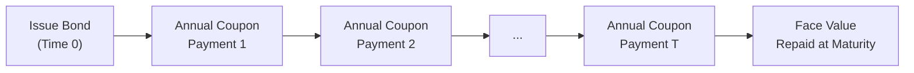

## Introduction

So, you’ve already gotten comfortable with the basics of capital structure and how cost of capital feeds into a firm’s overall valuation (see earlier discussions in this volume about Weighted Average Cost of Capital, or WACC). Now, let’s zoom in on one of the most critical aspects of that calculation: the cost of debt. After all, companies rarely rely on just one flavor of debt. They use a slew of instruments—bank loans, bonds with varying covenants, convertible debt, mezzanine financing, and more. And each has its own risk profile, embedded options, and quirks that can trick you if you’re not fully prepared.

In my own early days of corporate finance work, I remember being so excited (and then slightly disheartened) when handed a convertible bond to value. It wasn’t just about plugging numbers into a yield-to-maturity formula. I had to dissect an embedded equity option, measure the interest portion, and then figure out how that bond’s features made the “true” cost of debt swirl around like a moving target as conditions changed. Great times, let me tell you!

Anyway, the goal here is to systematically piece together all these puzzle parts: from straightforward yield to maturity, to credit spreads, to embedded features like calls and puts, and to the hybrid side of financing instruments. By the end of this reading, you should be able to estimate the cost of debt across a host of situations—and do so with confidence.

## Foundational Concepts: Yield to Maturity

Yield to maturity (YTM) is typically the first stop in a quest to figure out how much it costs a firm to raise debt capital in the bond market. YTM basically estimates the bond’s internal rate of return (IRR)—the rate of discount that equates the present value of all future coupon payments and the final principal repayment with the bond’s current price.

If a firm’s bonds are liquidly traded and you can readily observe their market prices, you simply solve for the discount rate that sets:

Present Value of Future Cash Flows = Current Market Price of the Bond.

Mathematically:


\text{Bond Price} = \sum_{t=1}^{T} \frac{C}{(1 + \text{YTM})^t} + \frac{\text{Face Value}}{(1 + \text{YTM})^T},


where:
• C is the coupon payment per period,  
• T is the total number of periods to maturity,  
• Face Value is the bond’s par or principal amount, and  
• YTM is the yield to maturity (the discount rate).

Tricky part: Real-world bond prices don’t always reflect a perfect marketplace. Liquidity, transaction costs, or even short-term supply-demand imbalances can warp observed bond yields. Still, YTM for publicly traded debt is the standard starting point for cost-of-debt calculations.

### Diagramming YTM Components

Below is a simple Mermaid diagram illustrating the major cash flows for a plain-vanilla coupon bond, highlighting how we derive YTM from them:

Each of these cash flows is discounted at the required yield (i.e., YTM). Summing them up equals the bond’s market price. For cost of debt, we usually focus on the current yield environment. If the firm issues new debt as of today, it pays market rates consistent with its perceived default risk.

## Credit Spreads and Economic Conditions

Cost of debt moves well beyond the risk-free rate (often approximated by government bonds). The extra yield demanded by investors for risky corporate debt is reflected in the credit spread. Now, this spread is not some constant you can memorize. It moves like a rollercoaster with swings in:
• Economic conditions (e.g., recessionary periods often mean wider credit spreads).  
• Sector or industry trends (a battered sector might see narrower investor interest and face costlier debt).  
• Company-specific factors (leverage ratios, historical profitability, coverage ratios, etc.).

When performing an estimate, you typically start with a base risk-free rate for the desired maturity, then add a credit spread that aligns with your company’s default risk. Practitioners often glean this spread from observable market data on comparable firms’ bonds or from standardized rating-based yield curves.

### Case Example: Widening Spreads in a Downturn

Imagine a mid-sized manufacturer of consumer electronics with a BBB rating. Last year, it could raise debt at about 4% when 10-year Treasuries hovered at 2%. The 2% difference—its credit spread—reflected modest default risk. Then a global economic slowdown hit, consumer demand sagged, and the rating agency signaled a possible downgrade. Treasuries dipped to 1.5% (flight to quality in tough times), but the firm’s required yield soared to 4.2%. The credit spread jumped to 2.7% because investors were more worried about default risk. Even though risk-free rates went down, the issuer’s total cost of debt actually went up.

## After-Tax Cost of Debt

So let’s talk about a detail we absolutely can’t ignore: taxes. Most jurisdictions allow companies to deduct interest expense before paying corporate taxes. That tax shield effectively lowers the real cost of debt. The standard formula:


\text{After-Tax Cost of Debt} = \text{Pre-Tax Cost of Debt} \times (1 - \text{Tax Rate}).


If a firm’s marginal corporate tax rate is 30% and the yield required by its lenders is 5%, then we get:


\text{After-Tax Cost of Debt} = 5\% \times (1 - 0.30) = 3.5\%.


This difference is precisely why many CFOs see debt as a cheaper form of capital than equity, partly because dividends on equity are not tax-deductible. Of course, piling on too much debt leads to other issues (a heavier interest burden, increased risk of default, and so forth). That balance is the ongoing puzzle of capital structure management.

## Covenant Risk and Liquidity: The Fine Print

We often want to factor in how restrictive a bond’s covenants are. For instance, a bond might have:
• Constraints on additional borrowings.  
• Limits on dividend payments.  
• Requirements to maintain certain coverage or leverage ratios.

Investors tend to charge lower yields if strict covenants reduce the probability of default or if they enhance a company’s stability. So ironically, from the issuer’s point of view, adding protective covenants may help reduce cost of debt. But from a corporate governance angle, these covenants can limit management’s strategic flexibility: no big acquisitions or share buybacks without the blessing of bondholders, for example.

Meanwhile, liquidity can also matter. If you’re a small issuer or your bond trades only sporadically, prospective investors might insist on an extra yield premium—like a “liquidity” spread—simply because it’s harder for them to exit the position quickly. So even if the credit risk is moderate, a thinly traded bond (especially in a smaller industry segment) might see an elevated yield.

## Hybrid Instruments: Where Debt Meets Equity

Now, let’s talk about those instruments that don’t sit cleanly in the “this is pure debt” category. Think of convertible bonds, preference shares, perpetually callable bonds, or mezzanine financing. These guys come with unique traits:

• Convertible Bonds: Embody an equity call option for investors. Their coupon rate is often lower than that of a plain-vanilla bond since bondholders get the upside of conversion if the issuer’s stock performs well. But from the issuer’s perspective, you might treat that portion of the bond as equity, especially when it’s probable that holders will convert.  
• Preferred Shares: Often seen as equity from a legal viewpoint but can pay fixed dividends akin to bond coupons, so they’re sometimes slotted in the cost-of-capital equation similarly to debt. However, preference dividends usually are not tax-deductible, which changes the equation.  
• Mezzanine Financing: Tacked on top of senior secured debt, mezz debt has a higher coupon rate due to its subordinated position. It may also come with equity warrants or convertible features. The all-in cost can be quite high, but it also can fill a niche for companies that can’t raise more traditional forms of financing or want to avoid immediate equity dilution.

### Splitting the Debt and Equity Components

A neat trick is “bifurcation.” You might carve out the theoretical cost of the bond portion (the debt side) from the cost of the embedded option (the equity side). Then you can approximate the overall cost by weighting these components. It sounds more complicated than it often is, although it can definitely get messy if the instrument has multiple embedded features or if the underlying equity is highly volatile.

## Embedded Bond Features: Calls and Puts

What if your bond is callable? Or putable? Those embedded options influence yield, sometimes significantly.

• Callable Bonds: Issuers can pay off the bond before maturity. That option benefits the issuer, so bondholders typically demand a higher yield. If interest rates drop, the issuer can refinance at a cheaper rate and exercise the call. The cost of debt, ironically enough, can go up from the get-go.  
• Putable Bonds: Investors can “put” the bond back to the issuer under specified conditions (for instance, if market interest rates spike or credit quality deteriorates). This feature benefits investors. As a result, putable bonds usually offer lower yields (and so a lower cost of debt to the issuer).

From a cost-of-debt standpoint, you want to evaluate the likelihood that these options will be exercised and how that translates into the effective yield that an investor demands. Options pricing models—like the binomial model or Black-Derman-Toy (BDT) for interest rate trees—can help you estimate the “option cost” portion.

## Estimating Non-Public Debt

Many firms don’t issue publicly traded bonds. They rely on private bank loans, syndicated credit lines, or other forms of non-public borrowing. How do we get a cost of debt if there’s no traded instrument to price?

A practical approach is to reference a rating-based system or look at credit spreads on similarly rated debt. For instance:
1. Estimate the firm’s implied credit rating (based on financial ratios, coverage, or other rating agency guidelines).  
2. Identify the corresponding yield spread for that rating in the market.  
3. Add the spread to the appropriate risk-free rate or reference yield.  
4. Arrive at an approximate cost of debt.

Sometimes, you just talk to your friendly neighborhood banker to see what the current lending rates are for companies with similar profiles and deal structures. You can further refine the estimate by adjusting for any unique aspects of the loan: extra collateral, special covenants, or shorter/longer maturities relative to the baseline.

## Periodic Re-Estimation: Because Risks Change

People sometimes treat the cost of debt as a “set it and forget it” figure in discount rate exercises. But reality is more fluid. A firm’s risk profile changes over time—maybe it takes on more leverage to fund an acquisition, or its profit margins shrink due to new competition. Meanwhile, macro factors shift daily, with interest rates edging up or down and credit spreads reacting to market sentiment.

Hence, a best practice is to re-estimate cost of debt regularly. This is especially critical for long-range valuation or if you’re doing a sum-of-the-parts breakdown of business segments each quarter. Don’t forget to keep an eye on rating agency updates, either. These can shift a firm’s cost of debt upward or downward much more suddenly than you’d think.

## Practical Numerical Example

Let’s see how it all comes together with a hypothetical scenario. Suppose we have:

• A mid-level manufacturing firm with an implied single-A credit rating.  
• A risk-free rate for 10-year government bonds at 3.0%.  
• A typical credit spread for single-A industrial issuers at about 1.2% (120 basis points).  
• The firm’s new 10-year bullet bond would carry YTM of 4.2% (3.0% + 1.2%).  
• Marginal tax rate is 25%.  

So, the pre-tax cost of debt is 4.2%, and the after-tax cost of debt is:


4.2\% \times (1 - 0.25) = 3.15\%.


That’s the near-term cost a CFO would likely pencil into her WACC calculation for the next issuance. Of course, if the firm includes a call feature, maybe you tack on another 15–20 basis points, depending on the approximate cost of that call option. If the bond is putable by investors, you might reduce the yield by 10–15 basis points, reflecting the investor-friendly feature.

## Putting It All Together

Estimating the cost of debt is not rocket science, but it’s also not as straightforward as copying the coupon rate from a firm’s existing bond. You need to consider:

• The market yield environment (and any relevant changes).  
• The credit quality of the issuer (and potential rating migrations).  
• The presence of restrictive or protective covenants.  
• Liquidity and how the bond trades in the secondary market.  
• Potential embedded options (calls, puts, convertibility).  
• Tax deductibility of interest.

When you extend this logic to hybrid financing—like a convertible bond or preferred stock—the analysis becomes more nuanced. But the overarching principle is the same: isolate the pure debt-like yield, isolate the equity or option-like piece, and combine them carefully.

At the end of the day, the cost of debt is dynamic. It continuously adjusts to reflect new information about the firm’s risk and changes in the global credit environment. If you incorporate these factors diligently, you’ll be well on your way to forming a more accurate (and more defensible) WACC and, ultimately, a superior valuation of the firm.

## Best Practices and Pitfalls

• Regular Monitoring: Costs can change faster than you think, especially in volatile markets.  
• Data Quality: Ensure that the yields you use are based on sufficient market liquidity. Illiquid bonds can distort your estimate.  
• Embedded Options: Don’t forget the “option premium.” If you ignore calls, puts, or convertibility, you might be off by a considerable margin.  
• Tax Rates: Always confirm the correct marginal tax rate. A mismatch can skew your after-tax cost of debt by a lot.  
• Comparables vs. Ratings: If your firm’s credit rating is borderline or in flux, using straightforward rating-based spreads can be misleading. Adjust accordingly.  
• Hybrid Instruments: Carefully parse out the debt versus equity portion to avoid double counting or ignoring embedded equity value.

## References for Further Study

• CFA® Program Curriculum, Level II, “Cost of Capital” Readings  
• Damodaran, A., “Damodaran on Valuation: Security Analysis for Investment and Corporate Finance,” Wiley  
• Fabozzi, F. J., “Bond Markets, Analysis, and Strategies,” Pearson  
• Tirole, J., “The Theory of Corporate Finance,” Princeton University Press  

For a deeper dive into modeling embedded options, you might also check out specialized texts on fixed-income derivatives, particularly those covering binomial tree or Monte Carlo methods for callable and putable bonds. It’s a rabbit hole, but once you grasp it, your cost-of-debt estimations will get way more precise.

---

## Estimating the Cost of Debt and Hybrid Financing: Sample Questions



### Which of the following best describes yield to maturity (YTM) for publicly traded debt?

- [ ] It is simply the coupon rate paid by the bond.
- [x] It is the internal rate of return equating future cash flows to the bond’s price.
- [ ] It is equivalent to the bond’s stated par value.
- [ ] It excludes the face value repayment at maturity.

> **Explanation:** YTM is the discount rate that equalizes the present value of all coupon payments plus principal repayment at maturity to the current market price of the bond.

### A BBB-rated corporate bond offers a yield of 5.2% while comparable-risk government bonds of the same maturity yield 2.7%. Which of the following is most accurate?

- [ ] This bond’s credit spread is 2.5%.
- [ ] This bond’s credit spread is 7.9%.
- [x] This bond’s credit spread is 2.5 percentage points.
- [ ] This bond has no credit spread.

> **Explanation:** The credit spread is the difference between 5.2% and 2.7%, which is 2.5%. Typically, we quote spreads in percentage points or basis points, not by adding the percentages themselves.

### Which aspect is most likely to reduce the cost of debt for a corporate issuer?

- [ ] Extremely loose covenants 
- [x] Strong, restrictive covenants 
- [ ] Low financial coverage ratios 
- [ ] High leverage

> **Explanation:** Restrictive covenants often protect bondholders’ interests, lowering their risk and thus resulting in a lower yield. Loose covenants, low coverage, or high leverage typically raise default risk, pushing yields up.

### An issuer’s after-tax cost of debt is generally calculated as:

- [ ] (Risk-free rate + equity risk premium) / (1 – tax rate).
- [ ] Coupon rate × (1 – tax rate).
- [ ] Price of bond ÷ (1 – tax rate).
- [x] Pre-tax cost of debt × (1 – tax rate).

> **Explanation:** The common approach is to multiply the pre-tax cost of debt by (1 – tax rate) to account for the tax-deductible nature of interest expense.

### When a firm uses a callable bond, how does this typically affect its cost of debt?

- [x] It increases the cost of debt, because the call provision benefits the issuer.
- [ ] It has no impact on cost of debt.
- [ ] It decreases the cost of debt, because bondholders benefit from it.
- [ ] It only affects the timing of interest payments.

> **Explanation:** A call option favors the issuer, allowing early redemption if interest rates decline. Bondholders demand higher yields for this disadvantage, increasing the issuer’s cost of debt.

### A putable bond is most likely to offer:

- [ ] Higher yields than an otherwise identical plain-vanilla bond. 
- [x] Lower yields than an otherwise identical plain-vanilla bond. 
- [ ] The same yield as a callable bond. 
- [ ] A randomly implied yield depending on rating.

> **Explanation:** Since a putable bond benefits investors (they can force early redemption if rates rise or credit risk increases), investors require less yield to hold it.

### Which statement is true about hybrid financing instruments (e.g., convertible bonds)?

- [ ] They are classified purely as debt for cost calculations.
- [x] They contain debt and equity components, requiring bifurcation to estimate overall cost.
- [ ] They force an immediate equity dilution for the issuer.
- [ ] They typically have the highest cost of capital among all instruments.

> **Explanation:** Convertible bonds combine aspects of both debt (interest payments, seniority) and equity (conversion option). Analysts often separate these elements to correctly assess the cost.

### A firm with illiquid, thinly traded bonds might see its yield:

- [x] Increase, reflecting a liquidity premium demanded by investors.
- [ ] Decrease, due to lower transaction costs. 
- [ ] Remain the same as if it had high bond liquidity. 
- [ ] Drop because lower liquidity means fewer bond buyers.

> **Explanation:** Illiquidity generally raises the required return, as investors want compensation for the difficulty of selling the bond.

### Mezzanine financing is best described as:

- [ ] A type of senior secured loan.
- [x] A layer of capital that typically offers both debt-like interest and equity-like upside.
- [ ] An instrument that is exclusively convertible to equity.
- [ ] Preferred equity that pays no dividend.

> **Explanation:** Mezzanine financing sits between senior secured debt and equity on the capital structure. It often has higher coupons and may include equity warrants or convertibility.

### True or False: A firm’s cost of debt should remain constant over long periods if the firm’s capital structure does not change.

- [x] True
- [ ] False

> **Explanation:** This can be a bit nuanced. If the firm’s overall credit risk profile and market rates stay the same, the cost of debt might remain relatively stable. However, in practice, credit spreads and market conditions fluctuate; so in reality, the cost of debt often changes. But under strictly unchanged conditions, it could remain constant.


