## Introduction

So, you’ve probably heard people talk about how the Capital Asset Pricing Model (CAPM) is used to calculate the required return on equity, but you might be wondering how it really ties into the bigger picture. A friend of mine used to get pretty anxious about this topic—“Wait a second, do I just memorize the formula and plug in numbers?”—but, truthfully, there’s more nuance needed when picking the right inputs. Checking that your assumptions are reasonable is just as important as understanding the equation itself. Anyway, let’s demystify how you go from a theoretical formula to an actual number you’d use to discount cash flows or compare investment projects. We’ll talk about beta, the equity risk premium, and the risk-free rate, plus we’ll look at expansions to the model for things like country risk and other factors. Let’s dive in.

## The Basic CAPM Framework

At its core, CAPM states:

(1)  
rₑ = r𝒻 + β × (E(Rₘ) – r𝒻)

• rₑ: The required return on equity (or cost of equity).  
• r𝒻: The risk-free rate.  
• β: A measure of how sensitive the investment’s returns are to the overall market.  
• (E(Rₘ) – r𝒻): The market risk premium (MRP), which is basically how much extra return the whole equity market is expected to generate over the risk-free rate.

The economic intuition behind the model is that investors want compensation for “waiting” (that’s the risk-free component) plus compensation for “worrying” (that’s the premium for market risk). The factor β captures how firm-specific returns move in relation to the overall market.

### Visualizing CAPM

Below is a simple Mermaid flowchart that highlights the CAPM flow:

```mermaid
flowchart LR
    A["Identify Risk-Free <br/>Rate (r𝒻)"] --> B["Estimate Market <br/>Risk Premium (MRP)"]
    B --> C["Calculate Beta (β)"]
    C --> D["Apply rₑ = r𝒻 + β * (MRP)"]
    D --> E["Cost of Equity (rₑ)"]
```



It might seem straightforward—just pick a few numbers and off you go—but in real life, each of these inputs (especially the risk-free rate, market risk premium, and beta) can be a can of worms.

## Risk-Free Rate (r𝒻)

Most folks use yields on government bonds—like a 10-year U.S. Treasury or a similar sovereign bond in stable developed markets. In theory, any bond free from default risk should do, but in reality, nothing is truly free of all risk. Still, government securities are typically the best proxy. Problems crop up if you’re dealing with shorter maturities or negative yields (like we’ve sometimes seen in certain developed markets). If you need a longer-term perspective, you might use a longer-tenor bond to align with the investment horizon.

Here’s a quick table on commonly used proxies for the risk-free rate across different regions:

| Region           | Proxy for r𝒻               |
|------------------|-----------------------------|
| United States    | 10-Year U.S. Treasury Note |
| Eurozone         | 10-Year German Bund        |
| United Kingdom   | 10-Year UK Gilt            |
| Japan            | 10-Year JGB                |
| Emerging Markets | 10-Year Local Govt. Bond   |

## Market Risk Premium (MRP)

E(Rₘ) – r𝒻 is the “extra” return that stocks are assumed to earn over the risk-free rate. Some folks just look at historical long-term averages (e.g., 5% or 6%). Others prefer forward-looking estimates or a “blended approach” that combines historical data with forecasts of earnings and dividend growth. For instance, the historical equity risk premium in the U.S. may hover around 5% to 6%, but you’ll see some analysts use forward-looking estimates like 4.5% or 5.5% based on new expected growth rates.

• Historical Method: Average realized market returns minus bond yield over a long period.  
• Survey Method: Collect consensus estimates from market participants.  
• Implied Method: Solve for the discount rate that equates current market prices to forecasted future cash flows (like dividends and growth).

The choice depends on how cyclical or stable the market is and how far out into the future you want to look. It’s also influenced by personal preference or firm guidelines.

## Beta (β) Estimation

Moving on, β is basically the slope of a stock’s returns against the market’s returns. If a stock tends to move a lot more than the market, you’ll get β > 1. If it hardly moves, you get β < 1. The formula, from regression analysis, is:

(2)  
β = Cov(Rₛ, Rₘ) / Var(Rₘ)

where Rₛ is the security’s return and Rₘ is the market’s return, Cov(...) is the covariance, and Var(...) is the variance of the market.

### Data Windows and Adjustments

• Time Window: The typical approach is to regress monthly returns over five years. But, you know, some might use weekly data or daily data, or a different time span. So you really have to weigh the pros and cons. Over a shorter window, results could vary widely, especially if the company had a giant structural shift or if there was a major market event like 2008 or 2020 messing up your dataset.  
• Outliers: You could have a few huge up or down days that skew the entire regression. So, watch for anomalies.  
• Capital Structure Changes: If the company changed its leverage drastically, its future β might differ from the historical measure. So an “unlevered” or industry-average approach is often used.  
• Industry Average Beta: Some folks prefer the so-called “Blume adjustment” or a peer-group average approach. If you think your stock will revert to the industry norm or you lack good data, it helps to incorporate an average across peers.

### Unlevering and Relevering Beta

“Levered β” refers to the beta that includes the impact of a company’s debt. The formula for unlevering (i.e., removing the effect of debt) is typically:

(3)  
βᵤ = βₗ / [1 + (1 – T)(D/E)]

• βᵤ: The unlevered (asset) beta.  
• βₗ: The levered beta.  
• T: The tax rate.  
• D/E: The debt-to-equity ratio.

We do that to figure out the company’s underlying business risk. If a company wants to compare itself to a peer group, it might first unlever the peer group’s betas and then relever them based on its own target D/E ratio:

(4)  
β↟(target) = βᵤ × [1 + (1 – T)(D/E)↟(target)]

That’s how you get a “custom-tailored” beta for your firm’s capital structure. If you’re modeling a scenario where the company’s debt ratio will be 30% in future, you might reflect that in your β assumptions.

## Expanded CAPM: Extra Risk Factors

Here’s a situation: you figure out a nice CAPM number, but something itches at you—maybe the firm is super small, it’s in an emerging market, or it has illiquid shares. That’s where an Expanded CAPM might be more appropriate. The basic formula looks like this:

(5)  
rₑ = r𝒻 + β × (MRP) + S + L + CRP + …

Where:  
• S = size premium (small-cap stocks can be riskier).  
• L = liquidity premium (not easy to buy/sell the stock).  
• CRP = country risk premium (for operations in a higher-risk locale).  
• … can include other ad hoc factors you deem relevant.

### Country Risk Premium

If you’re analyzing a company that has a plant in, say, a country with higher political risk, you might add a CRP to reflect the heightened uncertainty. A well-known approach from Prof. Damodaran is:

CRP = (Yield Spread of Sovereign Bond vs. U.S. Treasury) × (Volatility of Equity Market / Volatility of Sovereign Bond)

But guess what—there’s more than one way to do it. Another simpler method is:

CRP = The difference between a developed market’s risk-free rate and the yield on an emerging market’s government bond.

Pick whichever approach best fits your data availability and your firm’s policy. The key point is that you’re acknowledging that different geographies carry different levels of risk.

### Size Premium

Historically, small-cap stocks (think micro-cap or smaller than some threshold) have been observed to produce larger returns because of higher perceived risk. So, you might add, say, 1% to 3% for the size premium, if you believe the effect is relevant. This concept steers close to the Fama-French approach, which we’ll get to shortly.

### Liquidity Premium

If your stock trades infrequently or has a large bid-ask spread, you might add a bit extra to the cost of equity. Best to do so if the firm is relatively illiquid and that illiquidity is persistent.

## Considering Multi-Factor Models

Some folks prefer more advanced approaches like the Fama-French Three-Factor Model. That includes:  
(1) Excess market return (the same market risk premium from CAPM).  
(2) A size factor (SMB = Small minus Big).  
(3) A value factor (HML = High minus Low book-to-market).

More expansions can incorporate momentum factors, profitability, or investment style. Each factor is assigned its own “beta” or sensitivity. You sum them all up to get the total expected return. That can get complicated, but it might be warranted if you’re analyzing an equity for which size, value, or other style factors matter a lot.

## Example Walk-Through

Let’s do a little scenario. Suppose you’re evaluating a mid-sized industrial firm, “Acme Industrial,” with the following data:

• r𝒻 = 3.0% (10-year Gov. bond).  
• MRP = 5.5%.  
• β (levered) estimated at 1.2 (based on peer group, after unlevering and relevering).  
• Size premium (small-ish mid cap) = 1.0%.  
• Liquidity premium = 0.0% (very actively traded).  
• No country risk premium needed (all operations are in a stable developed market).

In the simple Expanded CAPM approach:

rₑ = 3.0% + 1.2 × (5.5%) + 1.0% + 0.0%  
rₑ = 3.0% + 6.6% + 1.0%  
rₑ = 10.6%

So, a cost of equity around 10.6%. If you only used the plain-vanilla CAPM without the size premium, you might have ended up with 9.6%. Whether 10.6% is “right” depends on your conviction in that 1% size premium. In real life, you’d compare that to returns from peer companies. If peers are all in the 9.5%-11% range, you’re probably okay.

## Adjustments for Emerging Markets

I once got stuck trying to value a firm based in a country with high inflation and political uncertainty. Using a standard 3% risk-free rate from the U.S. Treasury felt disjointed from the reality on the ground, so I ended up adding a chunk of CRP. A simplified approach might be:

rₑ = (r𝒻 + CRP) + β × (Developed MRP) + S

If the local government bond yield is 8% but you consider 3% from a stable government bond to be “pure” r𝒻, you might say CRP = 5%. Then proceed with your usual steps. Alternatively, you can incorporate local benchmarks for the risk-free rate entirely, but ensure that you’re consistent about inflation differences.

## Documenting Calculations Clearly

When you present your results—maybe in an investment committee memo or for an external valuation—spell out exactly:

• How you chose r𝒻 (and which bond you used).  
• How you estimated MRP, referencing historical or forward-looking data.  
• Where your β came from, whether regression-based or from an industry average.  
• Which premiums you’ve added (size, liquidity, country, etc.) and why.  

Being transparent helps avoid pushback or confusion, especially if your result differs from someone else’s. If your boss says, “Wait, why 10.6% instead of 9.5%?” you’ll have a ready answer.

## Cross-Checking Reasonableness

Always ask yourself: “Does my rₑ make sense relative to the risk of the firm and the returns on other assets?” If your final cost of equity is 15% but all the peers in a stable industry are around 8%, can you explain why? Maybe you concluded the stock is extremely risky or in a risky geographic area. Or maybe you made an assumption that’s out of line. Double-check your inputs. If necessary, run a scenario or sensitivity analysis:

| Assumption          | Low Estimate | Base Estimate | High Estimate |
|---------------------|-------------:|--------------:|--------------:|
| Risk-Free Rate (%)  |         2.5% |         3.0%  |         3.5%  |
| Market Risk Premium |        5.0%  |         5.5%  |         6.0%  |
| Beta                |         1.0  |          1.2  |          1.4  |
| Expanded Premiums   |       0.5%   |         1.0%  |         1.5%  |

You might find, for each combination, a range from around 8.5% up to 12.7%. This can help set comfortable boundaries for the final figure you’ll use in your model.

## Common Pitfalls

• Using the Wrong Proxy for r𝒻: If your valuation is in local currency, you should ideally use a risk-free rate of that currency.  
• Ignoring Capital Structure Changes: A big shift in debt can change a company’s β, so your historical calculation might be outdated.  
• Over-Refining the Inputs: Sometimes novices will grab a specific decimal—like a 5.73% MRP. Let’s keep it real: you rarely have that level of precision in the real world.  
• Failing to Adjust for Country Risk: If your firm is in a volatile market, ignoring it could lead to an underestimate of the true cost of equity.

## Best Practices

• Use multiple data points or sources to triangulate your MRP.  
• If significant capital structure changes are expected, do the unlevering and relevering approach.  
• In emerging markets, consider a robust approach to CRP.  
• Document your steps and assumptions meticulously—someone (maybe your future self) will thank you later!

## Small Python Snippet for CAPM

If you’re into Python, you could do something like:

```python
def capm_cost_of_equity(rf, market_premium, beta, size_prem=0.0, crp=0.0, liquidity_prem=0.0):
    """
    Calculates the cost of equity under an Expanded CAPM approach.
    rf: risk-free rate (decimal form)
    market_premium: equity risk premium (decimal form)
    beta: levered beta (decimal)
    size_prem: size premium (decimal)
    crp: country risk premium (decimal)
    liquidity_prem: liquidity premium (decimal)
    """
    return rf + beta * market_premium + size_prem + crp + liquidity_prem

rf = 0.03
market_prem = 0.055
beta = 1.2
size_prem = 0.01
crp = 0.0
print(capm_cost_of_equity(rf, market_prem, beta, size_prem, crp, 0.0))
```

Of course, a real model might let you alter capital structure assumptions, handle various scenarios, or even incorporate a multi-factor approach.

## References and Further Reading

• CFA® Program Curriculum, Level II, Equity and Corporate Finance Readings  
• Fama, E. F., and French, K. R. “Common Risk Factors in the Returns on Stocks and Bonds.” Journal of Financial Economics  
• Damodaran, A. “Equity Risk Premiums (ERP): Determinants, Estimation, and Implications.” Stern School of Business  
• Bodie, Z., Kane, A., and Marcus, A. “Investments,” McGraw-Hill  

If you’re curious about advanced modeling for betas or risk premiums, you might find Damodaran’s online resources super helpful.

## Check Your Knowledge: Required Returns on Equity Quiz



### Which of the following best describes the market risk premium in the CAPM?

- [ ] The nominal yield on 10-year government bonds.
- [ ] The real yield on short-term Treasury bills.
- [x] The expected excess return of the market over the risk-free rate.
- [ ] The variance of the market portfolio.

> **Explanation:** The market risk premium in CAPM is the expected excess of the market return over the risk-free rate, reflecting the compensation investors require for taking on the risk of equity markets rather than a risk-free asset.

### A common method to handle leverage changes when estimating beta is to:

- [ ] Use only the historical regression-based beta without adjustment.
- [ ] Change the time horizon for the regression from daily to weekly data.
- [x] Unlever the beta and then relever it based on the target debt-to-equity ratio.
- [ ] Use the average of the company’s historical betas.

> **Explanation:** To adjust beta for a firm’s anticipated changes in capital structure, you “unlever” the historical beta (remove the effects of current debt) and then “relever” it using the new target D/E ratio.

### A size premium is typically added to CAPM for firms that:

- [x] Have smaller market capitalizations and thus higher perceived risk.
- [ ] Are large, stable, and hence less risky than the market.
- [ ] Operate only in emerging markets.
- [ ] Pay higher dividends than average.

> **Explanation:** Empirical evidence suggests small-cap stocks have historically earned higher returns, warranting a size premium in their cost of equity calculations.

### Which of the following is true about the risk-free rate used in CAPM calculations?

- [ ] It should always be the U.S. 10-year Treasury yield, regardless of currency.
- [x] It should typically match the currency and maturity of the cash flows being discounted.
- [ ] Negative interest rates should be added to the market risk premium for adjustment.
- [ ] It is irrelevant if you include a country risk premium.

> **Explanation:** When using CAPM, match the risk-free rate to the currency and horizon of the forecasted cash flows. This ensures consistency in valuation.

### If a company operates in a country with high political instability, you might incorporate:

- [ ] A size premium only.
- [x] A country risk premium (CRP).
- [ ] A reduced market risk premium.
- [ ] No additional premiums because CAPM already accounts for all risk.

> **Explanation:** The expanded CAPM approach adds extra components like CRP to account for the additional macro and political risk not captured by the standard market risk premium.

### When performing a regression to estimate beta, which of the following is a key consideration?

- [ ] Ensuring the correlation is exactly zero.
- [x] Selecting an appropriate time window that captures the firm’s current risk profile.
- [ ] Matching the monthly returns to daily returns.
- [ ] Using only the largest outliers to reduce noise.

> **Explanation:** The time window for estimating beta should align with the firm’s current risk factors and capital structure. A window too short or too long can distort the beta estimate.

### Which of these is a major shortcoming of using strictly historical data to estimate the market risk premium?

- [x] It might not reflect forward-looking expectations accurately.
- [ ] It requires complicated liquidity adjustments.
- [ ] It only captures small-cap stocks.
- [ ] It excludes large-cap stocks from the series.

> **Explanation:** Historical data may not align with future market conditions or forward-looking investor sentiment, making purely historical estimates imperfect for current valuations.

### In the Expanded CAPM framework, a liquidity premium is typically added to reflect:

- [ ] Returns for large capitalization stocks.
- [x] The additional cost of holding less-liquid shares.
- [ ] Increases in economic growth.
- [ ] Zero-coupon bond yields under market stress.

> **Explanation:** If a stock or bond is thinly traded, investors demand higher returns for the difficulty of trading, thus justifying a liquidity premium.

### Fama-French adds which additional factors beyond the market risk premium?

- [x] Size (SMB) and Value (HML).
- [ ] Country risk and liquidity.
- [ ] Dividend yield and bond yields.
- [ ] None, it’s identical to CAPM.

> **Explanation:** Fama-French expands on the CAPM by incorporating the SMB (size) and HML (value) factors to capture additional systemic risk dimensions.

### The unlevered beta of a firm is generally lower than its levered beta because:

- [x] It excludes the amplifying effect of financial leverage.
- [ ] It includes the impact of new equity issuance.
- [ ] It measures only the company’s default risk.
- [ ] It embeds a size premium in the calculations.

> **Explanation:** Unlevered beta reflects only the business (asset) risk. Once you add debt financing, the overall equity risk is magnified, hence the levered beta is usually higher.


