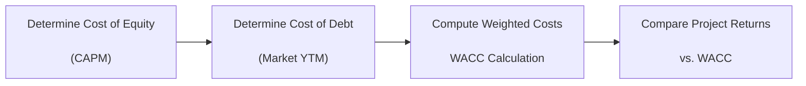

When we talk about the cost of capital, we’re essentially looking at how much it costs a company to finance its operations and new projects. If you’ve ever had that moment, maybe in a finance class or at your first internship, where someone said, “The WACC is 8%, so we’re good to move forward,” you might have silently wondered, “Where on earth does that number come from?” Well, in the next few sections, let’s walk through a sample vignette that’ll help us compute the Weighted Average Cost of Capital (WACC) step by step. We’ll incorporate cost of equity, cost of debt, any potential hybrid securities, and then explain how to weigh these components in a real-world scenario. We’ll also tack on a few personal experiences, some pitfalls I’ve seen folks make, and we’ll do a brief stress test so you can see how quickly the WACC can change if market conditions shift.

## The Vignette Setup

Imagine we have Redwood Manufacturing, a mid-sized producer of specialized electronic components for the automotive industry. Redwood has been around for 15 years, has a decent credit rating (BBB+), and is trying to decide whether to pursue a capital expansion program. You’re approached to pull the numbers together so the CEO can decide whether the expected returns on the project justify the risk.

Below, you’ll see Redwood’s relevant data:

• Capital Structure (Market Values):
  – Equity: $500 million  
  – Debt (long-term bonds): $300 million  
  – Hybrid Preferred Shares: $50 million  

• Company’s Beta: 1.2  
• Risk-Free Rate: 3.0%  
• Expected Market Return: 9.0%  
• Cost of Preferred Shares (annual dividend yield, based on market price): 6.0%  
• Company’s Current Bond Yield to Maturity: 5.5% (pre-tax)  
• Marginal Tax Rate: 25%  
• Projected IRR on Expansion Project: 8.2%

We’ll take these details and do each step. Then, we’ll check whether Redwood’s expected project return is higher or lower than the WACC. That’ll tell us whether Redwood should push forward or pass.

Before diving into the calculations, let’s look at a quick conceptual diagram to see how these components fit together:

This flow may remind you of earlier discussions in Chapter 7.1, where we introduced the concept of the Weighted Average Cost of Capital. Now, let’s grab each piece one at a time.

## Part 1: Cost of Equity

Most folks usually kick off with the cost of equity, particularly using the Capital Asset Pricing Model (CAPM). CAPM is the mainstay formula for cost of equity if you’re analyzing a typical publicly traded firm. It states:


r_e = R_f + \beta (R_m - R_f)


where:  
• \\( r_e \\) = cost of equity  
• \\( R_f \\) = risk-free rate  
• \\( \beta \\) = the company’s beta  
• \\( R_m \\) = the expected market return  

Plugging in Redwood’s numbers:

• Risk-free rate (\\(R_f\\)) = 3.0%  
• Beta (\\(\beta\\)) = 1.2  
• Expected market return (\\(R_m\\)) = 9.0%  

So,


r_e = 3.0\% + 1.2 \times (9.0\% - 3.0\%) 
= 3.0\% + 1.2 \times 6.0\% 
= 3.0\% + 7.2\% = 10.2\%


Hence Redwood’s cost of equity, using CAPM, is 10.2%.

Anecdotally, I recall a time in my early career fumbling because I forgot the right market risk premium—someone used 10% instead of 6%, doubling our cost of equity and making the entire project look like a no-go. Always be sure you’re using the correct and up-to-date estimate for the equity market premium.

## Part 2: Cost of Debt

Now let’s move on to debt. Redwood’s yield to maturity on its outstanding bonds is 5.5%. Because interest expense reduces taxable income, we typically adjust the cost of debt downward by multiplying by \\((1 - \text{tax rate})\\).

So Redwood’s after-tax cost of debt is:


r_d (1 - t) = 5.5\% \times (1 - 25\%)
= 5.5\% \times 0.75
= 4.125\%


Some might ask, “Should you use the coupon rate or the yield?” Typically, you use the yield to maturity (YTM) as your cost of debt, because it reflects the current market conditions. A coupon could be out of date if the bond was issued years ago at a different interest-rate environment.

## Part 3: Cost of Preferred Shares

In Redwood’s capital structure, there are $50 million in preferred shares outstanding, priced so that the effective annual dividend yield is 6.0%. Preferred shares don’t enjoy a tax benefit like debt does, so we typically take the cost as is:


r_{\text{pref}} = 6.0\%


## Part 4: Weighting the Components — WACC

Given Redwood has:

• Equity: $500 million  
• Debt: $300 million  
• Preferred: $50 million  

The total market value of the firm’s capital structure is $500 + $300 + $50 = $850 million. Let’s denote:

– \\( E = \$500 \text{ million} \\)  
– \\( D = \$300 \text{ million} \\)  
– \\( P = \$50 \text{ million} \\)  
– \\( V = E + D + P = \$850 \text{ million} \\)

We now weight each cost by its proportion in the firm’s capital structure. The standard WACC formula, extended for preferred, is:


\text{WACC} = \left(\frac{E}{V}\right) r_e + \left(\frac{D}{V}\right) r_d (1 - t) + \left(\frac{P}{V}\right) r_{\text{pref}}


Substitute the numbers:


\begin{aligned}
\text{WACC} &= \left(\frac{500}{850}\right) (10.2\%) 
            + \left(\frac{300}{850}\right) (5.5\%)(1 - 25\%) \\
            &\quad + \left(\frac{50}{850}\right) (6.0\%) \\
            &= (0.5882)(10.2\%) + (0.3529)(4.125\%) + (0.0588)(6.0\%) \\
\end{aligned}


Next, let’s do the math:

• Equity portion: \\(0.5882 \times 10.2\% = 6.0\%\\) (approx.)  
• Debt portion: \\(0.3529 \times 4.125\% = 1.46\%\\) (approx.)  
• Preferred portion: \\(0.0588 \times 6.0\% = 0.35\%\\) (approx.)  

Sum: \\( 6.0\% + 1.46\% + 0.35\% = 7.81\% \\)

So Redwood’s WACC is about 7.81%. This already gives you a sense of Redwood’s expected ongoing cost of capital if everything remains stable.

## Part 5: Is the Project Viable?

Now Redwood’s management is deciding whether to green-light an expansion project that’s expected to return 8.2% (IRR). The question: do we proceed?

Compare the project’s expected IRR to Redwood’s WACC:

• Project IRR = 8.2%  
• WACC = 7.81%

Because 8.2% > 7.81%, the project in principle seems to create more value than it would cost Redwood to finance. As a result, Redwood should consider moving forward. However, we know from real life that synergy assumptions, intangible project benefits, changes in macroeconomic conditions, or strategic considerations might shift your final decision. But from a purely numeric standpoint, Redwood’s IRR passing the WACC is a green flag.

## Part 6: Qualitative Factors & Governance Issues

Sometimes folks see that IRR > WACC and think, “Great! Let’s do it.” But hold on. Are there governance or risk factors that might change Redwood’s capital costs in the near term?

• If Redwood’s credit rating gets downgraded (say from BBB+ to BBB-), their cost of debt probably goes up. So that 5.5% pre-tax might jump to 6.0% or 6.5%.  
• If Redwood issues new equity to finance expansions, the increased supply of shares might push the share price down, or the firm’s beta might shift if the leverage ratio changes.  
• If Redwood experiences liquidity pressure or misses an interest payment, it could face a short-term jump in financing costs.

Board composition can also matter. If a new board is more risk-averse, Redwood might demand higher risk premiums on new projects, effectively raising its internal cost of capital. And if Redwood is incorporating advanced ESG considerations, there may be green bonds or other specialized financing that could slightly lower or raise financing costs. In short, governance and management decisions can move the needle on cost of capital, so it’s wise to keep an eye on those intangible factors.

## Part 7: Stress-Testing the WACC

Let’s see how Redwood’s WACC might change if:

1) Interest rates rise by 100 basis points across the board.  
2) Redwood’s beta changes because of new leverage.

### Scenario A: Rising Interest Rates

If Redwood’s bond yield increases from 5.5% to 6.5% pre-tax, the after-tax cost of debt is now \\(6.5\% \times (1 - 25\%) = 4.875\%\\). Recompute quickly:


\text{WACC}_{\text{new debt}} 
= (0.5882)(10.2\%) + (0.3529)(4.875\%) + (0.0588)(6.0\%)


• Equity portion remains ~6.0% (same as before).  
• Debt portion is now \\(0.3529 \times 4.875\% \approx 1.72\%\\).  
• Preferred portion is still ~0.35%.  

Sum: \\(6.0\% + 1.72\% + 0.35\% = 8.07\%\\) approx. Redwood’s WACC is up by about 26 basis points (from 7.81% to 8.07%). Suddenly, the expansion with an 8.2% IRR doesn’t look quite as impressive. It’s still above the new WACC, but that margin is narrower.

### Scenario B: Beta Rises from 1.2 to 1.5 Due to Increased Leverage

If Redwood decides to borrow more, or some recent event has made Redwood’s stock more sensitive to market swings, Redwood’s beta might jump to 1.5. Then, cost of equity changes to:


r_e = 3.0\% + 1.5 \times (9.0\% - 3.0\%) 
= 3.0\% + 1.5 \times 6.0\%
= 3.0\% + 9.0\% 
= 12.0\%


Hence, Redwood’s WACC (assuming debt cost reverts to the original 5.5% pre-tax) is:


\text{WACC}_{\text{beta rise}} 
= (0.5882)(12.0\%) + (0.3529)(4.125\%) + (0.0588)(6.0\%)


• Equity portion: \\(0.5882 \times 12.0\% = 7.06\%\\) approx.  
• Debt portion: \\(0.3529 \times 4.125\% = 1.46\%\\)  
• Preferred portion: \\(0.0588 \times 6.0\% = 0.35\%\\)  

Sum: \\(7.06\% + 1.46\% + 0.35\% = 8.87\%\\). Now if Redwood’s IRR remains at 8.2%, that once-profitable project no longer meets the new WACC. Redwood might need to re-evaluate or see if it can fund the project in a way that keeps beta lower. Alternatively, Redwood might shift the project’s capital mix or consider a strategic alliance to reduce total required investment.

## Common Exam Pitfalls

• Failing to use market values instead of book values. This is huge—your equity value might be drastically different on the balance sheet than in the stock market.  
• Forgetting the tax shield on debt. That can overestimate your after-tax cost of debt.  
• Mixing up the risk-free rate and the risk premium. Watch out for currency mismatches as well—a US risk-free rate for a US-based project, for instance.  
• Overlooking the cost of preferred shares. If your firm has a small portion of preferred, it can still affect WACC.  
• Using the coupon rate for cost of debt instead of the yield. This is one of the biggest slip-ups in a fast-paced exam environment.  
• Not clarifying assumptions. For instance, “We assume a stable capital structure” might not hold if Redwood is planning a big new debt issue or if the share price is highly volatile.

## Thickening the Plot: A Loan Covenant Twist

What if Redwood’s bonds have a covenant that triggers a higher coupon if Redwood’s debt-to-equity ratio surpasses a certain threshold? This sort of pinch could push Redwood’s bond yield up by an extra 50 bps if Redwood takes on more leverage. Suddenly your cost of debt changes more dramatically than the broad market would suggest. Redwood’s rating agencies might also take note. The next thing you know, the project’s NPV might go from positive to borderline. Hence, it pays to anticipate these triggers if you suspect Redwood’s capital ratios will shift significantly.

## Putting It All Together

Ultimately, Redwood’s WACC is about 7.81% right now. The 8.2% IRR expansion project likely passes Redwood’s hurdle rate, but the margin is fairly thin. Small changes in Redwood’s cost of equity or cost of debt can quickly eat into the project’s viability. So Redwood would want to keep an eye on interest rate movements, maintain a strong credit rating, and manage its financial structure so that it doesn’t become overly leveraged. Also, Redwood should keep an eye on intangible governance factors that might alter its cost of capital over time—like adopting more transparent communication with shareholders or aligning the board with strategic oversight that fosters consistent, lower-risk expansion.

If Redwood does proceed, it might want to do a more detailed scenario analysis (like a distribution of possible future outcomes) and see how robust that IRR is in both optimistic and pessimistic cases. And from a practical standpoint, Redwood would also want to confirm that, once the project is up and running, it can keep generating enough cash flow to service the additional obligations. As so many folks find out the hard way, inadequate stress-testing can spell trouble if the business environment heads south.

## Comprehensive Solution Walkthrough

Here’s a quick recap of the solution steps, just as you might see it in an item set scenario:

1) Identify and classify capital components: equity, debt, preferred shares.  
2) Gather market value weights.  
3) Compute cost of equity (CAPM or alternative models).  
4) Compute cost of debt (use YTM, then after-tax it).  
5) Compute cost of preferred if applicable.  
6) Plug costs and weights into the WACC formula.  
7) Compare project’s expected return with the WACC.  
8) Conduct scenario analysis to see how changes in markets or rating might affect WACC.  
9) Evaluate governance, covenant triggers, or other intangible factors.  
10) Make a recommendation—go or no-go—based on the results, along with a discussion on risk factors.

In an exam setting, watch out for “trick data,” especially outdated coupon rates, or a tax rate that differs from the statutory one you might be used to. Always read the vignette carefully, note your data, and keep your timeline straight. Also, if the scenario mentions that the firm is planning to shift to a different structure, you may need to recalculate weights or re-estimate cost of equity. Getting these details right can be the difference between a correct answer and a big sigh of regret.

## References for Further Study

• CFA® Program Curriculum, Level II, “Vignette-Style” Question Practice  
• Kaplan Schweser, “Practice Exams for the CFA® Exam, Level II”  
• Wiley, “CFA® Program Practice and Mock Exams, Level II”  
• AnalystForum (www.analystforum.com) for peer discussions and additional item-set practice  

Use these references to see more advanced scenarios, especially ones involving multi-currency issues or varying capital structures. Familiarize yourself with both hypothetical and real-life examples of WACC calculations, because no two corporate issuers are exactly alike.

--------

## Test Your Cost of Capital Computations Knowledge



### Redwood’s Cost of Equity
Redwood has a beta of 1.2, a risk-free rate of 3.0%, and an expected market return of 9.0%. Which of the following is the best estimate of Redwood’s cost of equity using CAPM?

- [ ] 8.2%
- [x] 10.2%
- [ ] 11.4%
- [ ] 12.0%

> **Explanation:** Using the CAPM formula (Rf + β(Rm – Rf)), we get 3.0% + 1.2(9.0% – 3.0%) = 10.2%.

### After-Tax Cost of Debt
If Redwood’s bonds are trading at a yield to maturity of 5.5% and Redwood’s marginal tax rate is 25%, what is Redwood’s after-tax cost of debt?

- [ ] 5.5%
- [ ] 5.25%
- [ ] 4.875%
- [x] 4.125%

> **Explanation:** The after-tax cost of debt is 5.5% × (1 – 0.25) = 4.125%.

### Incorporating Preferred Stock
Redwood has $50 million in preferred stock paying a 6% annual dividend, $300 million in debt (5.5% YTM), and $500 million in equity (10.2% cost). Assume a total capital of $850 million and a 25% tax rate. Which of the following is the correct portion of the WACC contributed by the preferred stock?

- [x] 0.0588 × 6.0% = 0.35%
- [ ] 0.0588 × 4.125% = 0.24%
- [ ] 0.0588 × 10.2% = 0.60%
- [ ] 0.0588 × 6.5% = 0.38%

> **Explanation:** The preferred stock weight is $50M / $850M = 0.0588. Multiplying by the preferred cost of 6% yields 0.35%.

### Full WACC Calculation
Based on the weights: Equity (58.82%), Debt (35.29%), Preferred Stock (5.88%), and respective costs of 10.2%, 4.125%, and 6.0%, which is the closest to Redwood’s WACC?

- [ ] 7.31%
- [x] 7.81%
- [ ] 8.25%
- [ ] 8.74%

> **Explanation:** WACC ≈ 0.5882×10.2% + 0.3529×4.125% + 0.0588×6.0% = ~7.81%.

### Project Decision
Redwood’s new expansion project has an IRR of 8.2%. Redwood’s current WACC is 7.81%. Which statement best describes the decision?

- [ ] The project is not viable because IRR < WACC.
- [ ] The expansion is always profitable at IRR = 8.2%.
- [x] The project exceeds Redwood’s WACC; likely a go, subject to qualitative considerations.
- [ ] The IRR is irrelevant compared to Redwood’s bond yield.

> **Explanation:** Because 8.2% > 7.81%, the basic financial criterion indicates “Accept,” although Redwood should also consider qualitative factors.

### Beta Sensitivity
If Redwood’s beta increases to 1.5, with the risk-free rate at 3% and market return at 9%, which value is the new cost of equity?

- [ ] 10.5%
- [ ] 11.0%
- [ ] 11.6%
- [x] 12.0%

> **Explanation:** CAPM = 3% + 1.5(9% – 3%) = 3% + 9% = 12%.

### Impact on WACC of Higher Beta
Following the previous question, Redwood’s equity portion is 58.82%, cost of debt after tax remains 4.125%, and preferred cost is 6.0%. If Redwood’s beta rises to 1.5, best estimate of WACC?

- [ ] 7.81%
- [ ] 8.07%
- [x] 8.87%
- [ ] 9.35%

> **Explanation:** With cost of equity at 12%, debt at 4.125%, preferred at 6%, weighting in at E 58.82%, D 35.29%, P 5.88%, the recalculated WACC is about 8.87%.

### Interest Rate Stress
If Redwood’s bond yield jumps from 5.5% to 6.5% pre-tax, and all else remains the same, which is the closest to the new WACC?

- [ ] 7.81%
- [x] 8.07%
- [ ] 8.33%
- [ ] 8.87%

> **Explanation:** With the new after-tax cost of debt at 6.5%×(1–25%)=4.875%, the WACC adjusts to ~8.07%.

### Tastiest Exam Trap
Which of the following is a common pitfall when calculating WACC in a CFA exam context?

- [ ] Using current market values for equity.
- [x] Using the coupon rate instead of yield to maturity for cost of debt.
- [ ] Including a tax shield for debt.
- [ ] Applying CAPM for cost of equity.

> **Explanation:** The most typical error is incorrectly using the coupon rate instead of the current YTM for the cost of debt.

### True or False: Governance Factors
Governance issues, such as board composition or activist investors, can affect a firm’s cost of capital.

- [x] True
- [ ] False

> **Explanation:** Governance policies can influence credit rating, risk tolerance, investor perception, and overall financing terms, so indeed they can affect cost of capital.


