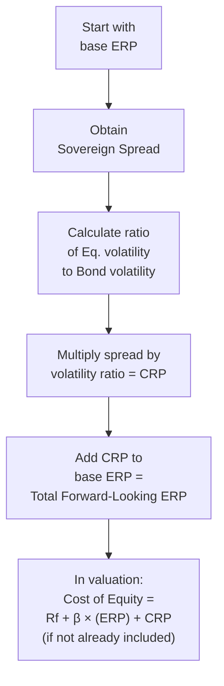

## Introduction
One of the most eye-opening moments in my own finance journey—well, it was basically the day I realized that relying solely on historical market returns can be, you know, a bit misleading—was the discovery of forward-looking approaches to the Equity Risk Premium (ERP). It felt kind of like a revelation. Suddenly, the concept of building a valuation on historical average returns, which may or may not repeat themselves, seemed simplistic. That’s where forward-looking ERP calculations come in. They allow us to incorporate present-day conditions, such as expected inflation, interest rate forecasts, and consensus analyst estimates for corporate earnings growth. They also let us factor in the political environment or sovereign risk unique to a specific country. 

This discussion aims to help you, the aspiring CFA Level II candidate, build a rock-solid framework for:
• Estimating a forward-looking ERP.  
• Accounting for country-specific risks through a Country Risk Premium (CRP).  
• Blending these concepts into the cost of equity to fine-tune your capital valuation and analysis of multinational or emerging-market investments.

## Why a Forward-Looking Equity Risk Premium?
Before we dive into the mechanics, let’s establish the rationale. Traditionally, many analysts pull historical market data—often from the past several decades—to estimate the ERP. This is basically the excess return that equities have delivered over risk-free investments. But here’s the catch: historical data might not reflect today’s macroeconomic conditions, nor do past returns guarantee future results.

A forward-looking ERP tries to address this limitation by incorporating:
• Expected inflation: Today’s inflation environment might differ significantly from 20 or 30 years ago.  
• Projected interest rates: Central bank policies and market forecasts can shift quickly, affecting investors’ required returns.  
• Consensus corporate earnings growth: Analysts and market participants publish projections of future earnings, dividends, or free cash flows, which can inform an implied market return.  
• Valuation multiples: Current market metrics like price-earnings (P/E) ratios, dividend yields, or the ratio of market capitalization to GDP can signal future equity returns.  

Think of it as taking a snapshot of the market’s collective outlook at a given point—an outlook that may change within months or even weeks. That’s why forward-looking estimates require periodic updates.

## Breaking Down the Forward-Looking ERP
While there are multiple approaches to deriving a forward-looking ERP, we often group them into three broad categories:

### 1. Dividend Discount or Implied Growth Models
In a simplified dividend discount model (DDM), the forward-looking ERP can be implied by rearranging the formula for the expected market return:


\text{Market Return} = \frac{\text{Div}_1}{P_0} + g


Where:
• \\(\text{Div}_1\\) is the expected dividend in one year.  
• \\(P_0\\) is the current market price (e.g., a broad equity index).  
• \\(g\\) is the expected long-term growth rate of dividends (or earnings).  

By subtracting the risk-free rate \\(R_f\\) from this expected market return, you get an implied ERP:


\text{ERP}_{\text{implied}} = \left( \frac{\text{Div}_1}{P_0} + g \right) - R_f


In reality, you might refine this approach further by incorporating share buybacks or adjusting for payout ratios, but this is the conceptual base. Analysts might rely on consensus forecasts or forward P/E ratios to estimate \\(\text{Div}_1\\) and \\(g\\).

### 2. Survey or Consensus-Based Methods
Another route is to gather estimates directly from market participants, such as portfolio managers, chief economists, or equity analysts. You might see something like: “According to a survey of analysts from major equity research firms, the U.S. ERP for the next five years is expected to be around 5.5%.” Sure, that sort of estimate is murky because it rests heavily on personal judgments, but it can offer insights into market sentiment—especially if these experts are pulling from a broad range of data.

### 3. Macroeconomic Modeling
Some practitioners build an econometric model that links market returns to macro indicators such as GDP growth, unemployment rates, interest rates, and inflation. They then project these variables forward under different scenarios—best case, base case, and worst case—and derive a range of potential ERPs. It can be quite complex, but it aims to capture systematic changes in the economy. 

## Introducing the Country Risk Premium
Nobody invests in a vacuum. When you’re evaluating an emerging-market stock, or even a developed-market company with huge exposure to a riskier country, you can’t just pretend that all markets behave identically. That’s why we tack on a Country Risk Premium (CRP). 

### Identifying the Need for Country Adjustments
Countries vary widely in terms of:
• Political stability  
• Economic resilience  
• Corporate governance standards  
• Monetary policy independence  
• Sovereign creditworthiness  

In many cases, you’ll look at the sovereign default spread—often represented by the yield difference between that country’s government bonds (denominated in a “safe” currency like USD) and a benchmark risk-free (or near risk-free) government bond in the U.S. or a stable European market.

### The Country Spread Model
One standard approach is to calculate:


\text{CRP} = \text{sovereign bond yield spread}


Then add it directly to your base ERP. If the domestic (or base) ERP is 5%, and you observe that the emerging-market sovereign bond yield spread to U.S. Treasuries is 2.2%, you might form:


\text{ERP}_{\text{emerging}} = 5\% + 2.2\% = 7.2\%


But hold on—some countries have more volatile equity markets relative to their government bonds. That 2.2% might actually underestimate equity volatility. That’s where an expanded Damodaran-like approach comes into play:


\text{CRP} = \text{Default Spread} \times \frac{\sigma_{\text{Equity}}}{\sigma_{\text{Sovereign Bond}}}


Here, \\(\sigma_{\text{Equity}}\\) is the standard deviation of the country’s equity market, and \\(\sigma_{\text{Sovereign Bond}}\\) is the standard deviation of its sovereign debt. If an equity market is say, 1.5 times as volatile as the sovereign bond market, the default spread is multiplied by 1.5 to reflect that additional risk. 

Once you’ve arrived at the CRP, the cost of equity in that market becomes:


\text{Cost of Equity}_{\text{EM}} = R_f + \beta \times \text{ERP}_{\text{base}} + \text{CRP}


If your base ERP is already reflective of the global (or developed market) environment, you tack on CRP for the incremental country risk. 

## Damodaran Approach: A Closer Look
Professor Aswath Damodaran’s name often pops up here, mostly because he’s spent decades gathering data, fine-tuning models, and sharing his spreadsheets. One method, broadly described, is:

1. Determine a base ERP from a mature market (e.g., the United States).  
2. Find a default spread for the target country—whether from credit default swaps (CDS) or sovereign credit ratings.  
3. Adjust that spread upwards by the ratio of equity-market volatility to bond-market volatility for the country in question.  
4. Combine your base ERP and your newly scaled spread.  

It’s flexible enough that you can even break out separate risk factors, such as political risk or currency convertibility, if you can find (or model) data that captures each dimension.

Example: Suppose you identify that the raw default spread for Country X is 2%. You also see that the equity market in Country X is about 1.3 times as volatile as its sovereign bond market. So your CRP becomes 2.6% (i.e., 2.0% × 1.3 = 2.6%). If your base ERP is 5.5%, the new total ERP for Country X is 5.5% + 2.6% = 8.1%. 

## Incorporating Forward-Looking and Country Risk in Practice
Let’s walk through a hypothetical scenario, somewhat reminiscent of common exam-style vignettes:

Imagine we have:
- A U.S. base risk-free rate, \\(R_f\\), of 3.0%.  
- A forward-looking U.S. ERP computed via a dividend discount approach of 5.0%.  
- A mid-tier emerging economy whose government USD bonds trade at a yield of 6.5%. Meanwhile, the U.S. Treasury yield (risk-free proxy) is 3.0%; hence the default spread is 3.5%.  
- The standard deviation of the emerging economy’s equity market is 25% (annualized), whereas the standard deviation of its sovereign bond is 15%.  
- A stock in that emerging market with a \\(\beta\\) of 1.2 relative to its local market index.  

1. Estimate the CRP using the volatility ratio:  
   
   \text{CRP} = 3.5\% \times \left(\frac{25\%}{15\%}\right) = 3.5\% \times 1.67 \approx 5.8\%
   

2. The total ERP for that emerging market is:
   
   5.0\% + 5.8\% = 10.8\%
   

3. Therefore, the cost of equity for our stock is:
   
   \text{Cost of Equity} = 3.0\% + 1.2 \times (10.8\%) = 3.0\% + 12.96\% = 15.96\%
   

Yes, almost 16% might seem high, but that’s the kind of risk premium you might require for a fairly volatile emerging market environment. 

## Mermaid Diagram: Estimating ERP and CRP
Below is a simple flow diagram illustrating the estimation steps. This is just a conceptual overview:



## Practical Example in Python
If you enjoy a bit of coding, you might set up a quick script to update your ERP estimates. For instance:

```python
import math

def calculate_crp(default_spread, equity_vol, bond_vol):
    return default_spread * (equity_vol / bond_vol)

def calculate_cost_of_equity(rf, beta, base_erp, crp=0):
    # If CRP is separate, we add it to the ERP or directly to the final result
    return rf + beta * (base_erp) + crp

rf = 0.03               # 3% risk-free rate
base_erp = 0.05         # 5% base forward-looking ERP
default_spread = 0.035  # 3.5%
equity_vol = 0.25       # 25%
bond_vol = 0.15         # 15%
beta = 1.2

computed_crp = calculate_crp(default_spread, equity_vol, bond_vol)
print("Calculated CRP:", computed_crp)

total_erp = base_erp + computed_crp
print("Total Emerging Market ERP:", total_erp)

cost_of_equity = calculate_cost_of_equity(rf, beta, base_erp, computed_crp)
print("Cost of Equity:", cost_of_equity)
```

This script calculates the CRP via the Damodaran approach (i.e., scaling by volatility). It then either adds that to your base ERP or lumps it into the final cost of equity. In a real-world application, you might plug in your own dynamic data sources and run these calculations daily, weekly, or monthly.

## Common Pitfalls and Reminders
1. Double Accounting: Be careful not to add the country spread twice. If your base market data already includes some measure of the country risk, tacking on a separate CRP can overstate the cost of capital.  
2. Out-of-Date Data: Forward-looking projections that haven’t been updated for major policy changes, inflation spikes, or rating downgrades can quickly become stale.  
3. Overreliance on Certainty: Forecasts, by their nature, are uncertain. Maintaining a “range” or “scenario-based” approach can mitigate reliance on point estimates.  
4. Using the Wrong Proxy for Risk-Free Rate: If you’re analyzing an emerging market and choose a local-currency government bond with questionable default risk as your “risk-free” rate, that’s a mismatch. Typically, analysts use a developed-market bond yield or swap rate in a stable currency.  
5. Confusing Business/Operational Risk with Sovereign Risk: A multinational company might have strong fundamentals yet still face serious macro-level risk if the host government changes regulations or imposes exchange controls. Make sure you break out these layers appropriately.

## Maintaining and Updating Forward-Looking Estimates
The biggest difference between a forward-looking approach and a historical one is the need for periodic recalibration. Factors like:
- Monetary policy shifts (rate hikes or cuts).  
- Major changes in fiscal policy or sovereign debt loads.  
- Tectonic shifts in commodity prices for resource-heavy countries.  
- Changes in global risk sentiment.  
- Geopolitical stress events.  

All can upset prior assumptions. In practice, if you’re in a corporate finance department or an equity research division, you might hold monthly or quarterly “cost of capital committee” meetings where you look at macro updates, revise your ERP estimate, and then adjust your internal valuation models accordingly.

## Real-World Applications
• Capital Project Evaluations: If you’re deciding whether to invest in a manufacturing facility in Country Y (which is riskier than your home base), a robust CRP helps ensure you set a realistic hurdle rate.  
• Mergers & Acquisitions: When performing cross-border acquisitions, blending in the CRP can provide a more accurate discount rate for those future cash flows.  
• Portfolio Diversification Decisions: Asset managers weigh the expected returns from emerging markets against the additional risk. The forward-looking ERP, plus CRP, can be decisive for allocation calls.  
• Transfer Pricing & Intercompany Financing: Multinationals often evaluate internal lending rates or required returns on capital. Incorporating different CRPs for different subsidiaries can help allocate capital more efficiently.

## Best Practices
• Use Multiple Data Sources: Compare results from implied DDM approaches, surveys, and macro models.  
• Document Assumptions: Keep a record of your inputs and the rationale for your forward-looking estimates.  
• Align Time Horizons: If your valuation period is 10 years, your chosen methodology for ERP should be conceptually consistent with 10-year forward views.  
• Continuously Test Reasonableness: Plug in your forward ERP into a few well-known valuation models. If results deviate drastically from market valuations, investigate the sources of discrepancy.  

## Conclusion
Forward-looking ERPs, combined with country adjustments, form the linchpin of any robust, globally-oriented cost of equity analysis. While it may feel a bit daunting to track shifting monetary policies, credit ratings, or economic growth rates, incorporating these factors ensures valuations are grounded in the here-and-now rather than solely on the past. Build a routine to revisit assumptions—since markets change, interest rates fluctuate, and political headlines can strike like lightning. By staying proactive and methodical, you’ll derive far more credible valuations and capital allocation decisions.

Lean on recognized frameworks like Damodaran’s methodology, but also tweak your model for the nuances of each market. In real life, it’s rarely an exact science—there may indeed be heated debates in the boardroom about which default spread to use or how to forecast inflation. Yet, as a Level II candidate, your job is to master these fundamentals so you can judge the assumptions in item sets, spot potential pitfalls, and deliver reasoned valuations that stand up under scrutiny. Stay flexible, stay informed, and keep learning.

## References and Additional Resources
• CFA Institute Level II Curriculum, Corporate Issuers (2025).  
• Damodaran, A. (n.d.). Equity Risk Premiums (ERP): Determinants, Estimation and Implications. Retrieved from:  
  http://pages.stern.nyu.edu/~adamodar/  
• Fernandez, P., Ortin, E., & Fernandez, A. (Research article). “Equity Premium: Historical, Expected, Required and Implied.”  
• “Estimating Risk Parameters,” by Aswath Damodaran.   
• “Country Risk: Determinants and Measures,” by CFA Institute.  

--------------------------------------------------------------------------------

## Test Your Knowledge: Forward-Looking ERP & Country Risk Premium



### James, a junior analyst, estimates the equity risk premium for a developed market using only historical average returns. Which of the following adjustments is most relevant if he wants a forward-looking ERP estimate?

- [ ] Adjust historical returns for realized volatility.
- [x] Incorporate expected inflation and earnings growth forecasts in valuation models.
- [ ] Increase the sample size of historical data.
- [ ] Subtract idiosyncratic stock-level risks from the historical average.

> **Explanation:** A forward-looking ERP should include macroeconomic projections such as expected inflation and corporate earnings growth, not just rely on historical averages.


### When calculating a country risk premium (CRP) using the Damodaran approach, which factor is multiplied by the sovereign default spread?

- [ ] The ratio of the risk-free rate to the default spread.
- [x] The ratio of the country’s equity volatility to its bond-market volatility.
- [ ] The ratio of the local market’s beta to the global market’s beta.
- [ ] The difference between historical and forward-looking ERPs.

> **Explanation:** Under the Damodaran approach, the default spread is scaled by the ratio of equity volatility to bond volatility to reflect the greater risk inherent in the equity market.


### Suppose the base ERP for a mature market is 5.0%. An emerging country’s sovereign bond yield spread over U.S. Treasuries is 3.0%. If the ratio of the emerging market’s equity volatility to sovereign bond volatility is 1.5, what is the total ERP for that emerging market?

- [ ] 5.0%
- [ ] 7.0%
- [x] 9.5%
- [ ] 10.0%

> **Explanation:** CRP = 3.0% × 1.5 = 4.5%. Adding this to the base ERP of 5.0% gives 9.5% as the total emerging market ERP.


### In a forward-looking equity risk premium model using a dividend discount approach, you typically subtract which of the following from the expected market return to obtain the ERP?

- [ ] The market risk premium.
- [ ] The equity volatility premium.
- [x] The risk-free rate.
- [ ] The expected inflation rate.

> **Explanation:** The ERP is the difference between the expected market return (from dividends plus growth) and the risk-free rate.


### An analyst obtains a credit default swap (CDS) spread for a particular country and wants to use it as a proxy for the country’s default spread in calculating CRP. Under which situation might this proxy be unreliable?

- [ ] When the country’s monetary policy is static.
- [ ] When the country has a high credit rating and stable political environment.
- [x] When the CDS market is highly illiquid or subject to speculative pressures.
- [ ] When bond yields and CDS spreads move in opposite directions.

> **Explanation:** If the CDS market for a country is thinly traded or heavily influenced by speculators, the quoted CDS spreads may not accurately reflect true sovereign risk.


### Which of the following best describes a pitfall of forward-looking ERP estimates?

- [ ] They are resistant to interest rate changes.
- [ ] They rely on historical average returns from multiple countries.
- [x] They must be periodically updated to reflect changing expectations.
- [ ] They are easily measured and rarely disputed.

> **Explanation:** Forward-looking estimates inevitably rely on assumptions about future economic conditions and must be updated as those conditions change.


### An analyst uses an emerging-market government bond yield in local currency as the “risk-free” rate for a valuation. Which criticism is most valid?

- [ ] The local-currency bond yield will accurately capture inflation expectations.
- [ ] The local-currency yield is conservative and may overstate risk.
- [x] The local-currency bond might have default risk, invalidating it as a “risk-free” proxy.
- [ ] The local-currency bond yield is usually too low for emerging markets.

> **Explanation:** Many emerging-market government bonds carry significant default risk. A truly risk-free proxy is generally a developed-market sovereign bond or a swap rate in a stable currency.


### In a theoretical framework, the sum of the risk-free rate, the beta times the base ERP, and the CRP is used to calculate:

- [ ] Weighted average cost of capital.
- [x] Cost of equity for an emerging-market security.
- [ ] Forward contract pricing.
- [ ] Required return on a government bond.

> **Explanation:** A basic formula for the cost of equity in an emerging market is Cost of Equity = Rf + β × ERP_base + CRP.


### If an analyst accidentally uses a historical ERP that already includes country risk premiums for multiple markets and then adds a CRP again during valuation, what is the potential outcome?

- [ ] No effect on the final cost of equity.
- [ ] Underestimation of the cost of equity.
- [ ] Correct compensation for emerging-market risk due to overlap.
- [x] Double-counting leading to an excessive cost of equity.

> **Explanation:** Using a historical ERP that already bundles in emerging-market risk, then adding a separate CRP, will lead to double-counting and inflate the cost of equity incorrectly.


### True or False: Forward-looking ERPs, once calculated, remain accurate for at least five years, given the relatively stable nature of macroeconomic factors.

- [x] True
- [ ] False

> **Explanation:** This is actually a trick question—many might answer “False” because forward-looking ERPs usually need frequent reassessment. However, if an exam specifically states a scenario where macro factors are assumed to remain stable with no major policy shifts, the model could be applied for a period of years. In real practice, we recalculate regularly.  


