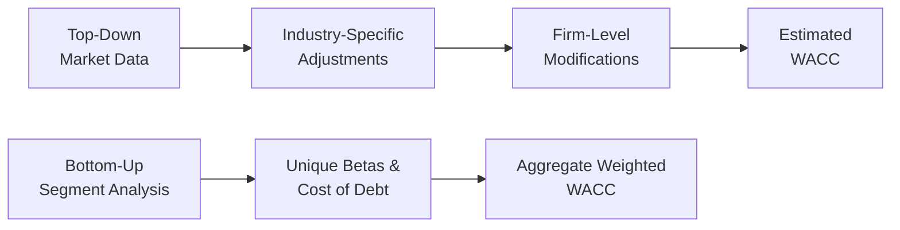

## Overview

Well, sometimes all of us want that single, magic number for the cost of capital—like you punch in a formula, out pops a perfect Weighted Average Cost of Capital (WACC), and you’re done. But as you’ve probably guessed, that’s rarely the case. Two main schools of thought stand out in the process of estimating a firm’s cost of capital: (1) the top-down approach, which starts with broad market or macro data and then moves downward toward the company or segment, and (2) the bottom-up approach, which builds the cost of capital from individual business units or segments up to a consolidated, firm-wide figure. These two methods each have their place, each has quirks, and each can yield some surprising—but often illuminating—results.

As a brief refresher, the cost of capital is usually expressed by the WACC, combining both the cost of equity (rₑ) and the cost of debt (r_d), adjusted for the tax benefit of interest. Commonly, we express this as:

$$
\text{WACC} = \left(\frac{E}{V}\right) \times r_{e} \; + \; \left(\frac{D}{V}\right) \times r_{d} \times (1 - t),
$$

where:  
• E is the market value of equity,  
• D is the market value of debt,  
• V = E + D,  
• rₑ is the cost of equity (such as via CAPM or another risk-based model),  
• r_d is the pre-tax cost of debt,  
• t is the marginal tax rate.

But that’s just the high-level formula. How we plug in the values for rₑ or r_d might vary considerably depending on whether we adopt a top-down or bottom-up perspective.

## Why Distinguish Between Top-Down and Bottom-Up?

Sometimes you can glean a pretty good cost of capital simply by looking at the broader equity and credit markets, finding an industry proxy (or index) that fits your company, and making a few adjustments. This sense of big-picture vantage is known as the top-down approach. On the other hand, if your business (or the one you’re analyzing) has multiple operating segments with different risk profiles—perhaps a stable consumer products division and a volatile biotech research arm—then a one-size-fits-all approach might be misleading. That’s when you might prefer a bottom-up approach, which essentially builds the cost of each segment or project, then weights them together.

It’s akin to cooking (if you’ll indulge a little metaphor). A top-down approach might taste the entire dish at once, whereas a bottom-up approach checks each ingredient’s flavor before mixing them, adjusting accordingly. Both methods can end up with a delicious final product—though each method has distinct pros and cons.

## The Top-Down Approach

### Main Idea of Top-Down

In top-down methods, you often start with a fairly “macro” perspective. For the cost of equity, for instance, you might look at a broad-market risk premium or an industry beta average. You’ll see references to well-known indexes—like the S&P 500 in the US, or broad-based equity indexes in other markets—and the published or estimated equity risk premiums from recognized sources (e.g., Damodaran data, analyst consensus, or certain well-regarded forecasting models).

The top-down cost of equity might look something like:

$$
r_{e,\text{top-down}} = R_f + \beta_\text{industry} \times \left[E(R_m) - R_f\right],
$$

where \\( \beta_\text{industry} \\) is an industry-level beta. Then you’d adjust that for company-specific factors, like slight variations in capital structure or firm operating risk. For the cost of debt, you might look at average credit spreads for the bond yields within that industry classification, or you might take the firm’s credit rating (if available) and use the average yield spreads from like-rated companies.

### Advantages

• Speed and Simplicity: It’s fairly quick, especially if you can locate reliable industry data.  
• Market-Reflective: Because you’re starting from broad indices, your estimate is grounded in current market sentiment.  
• Good for Broad Comparisons: When analyzing multiple companies in the same space, top-down can be a breeze for an apples-to-apples comparison.

### Potential Pitfalls

• Over-Generalization: Industries can be extremely broad. A technology “industry” might lump together stable, mature software companies with start-up biotech or hardware designers.  
• Unique Risk Factors Lost: If your firm has a special contractual arrangement, licensing advantage, or idiosyncratic risk exposure, that might get glossed over by a big, aggregated market beta.  
• Time Lags: Some published market risk premiums or industry betas can get stale quickly if they’re based on historical data. If the market environment changes drastically, your top-down approach might not reflect those shifts.

### Simple Illustration

Imagine you have a firm, TechPlay Inc., that produces consumer electronics. You suspect they belong to the “Electronics Manufacturing” category. You find an industry beta for “Electronics” of 1.3 from a reputable source. You also see a 10-year risk-free rate at 3%. The expected market return for the index you’re referencing is about 8%. So, top-down you might do:

$$
r_e = 3\% + 1.3 \times (8\% - 3\%) = 3\% + 1.3 \times 5\% = 3\% + 6.5\% = 9.5\%.
$$

Now, you suspect TechPlay is a bit more leveraged than the average electronics peer. So you tack on, let’s say, another 0.5% for added financial risk, giving you 10.0% for the final cost of equity. For the cost of debt, you note that the average yield for electronics manufacturing is around 5%, but TechPlay has a one-notch lower credit rating than the peer average, so maybe you go with 5.5%. Quick, straightforward—like a top-down vantage.

## The Bottom-Up Approach

### Main Idea of Bottom-Up

A bottom-up approach says: “Wait a second, it’s not enough to treat everything like the same pot of soup. Each segment might have its own risk profile and capital structure.” This approach can be especially relevant for a multi-business conglomerate or a company with distinct lines of business that deviate from the typical industry classification. In this method, you examine each segment’s beta (or cost of debt drivers) individually—either by finding a pure-play peer group for that segment or by re-levering betas to that segment’s capital structure.

You’d then weight these segment-level costs using each segment’s proportion of total corporate value. If you have partial ownership in a joint venture, or if you have a minority interest in some other entity, you factor in the proportionate share of the risk exposure. The real challenge is distinguishing the segments (like Consumer Goods vs. Luxury Apparel vs. Industrial Machinery), estimating each segment’s cost of equity and cost of debt, then rolling them all up to get a single WACC for the entire firm.

### Decomposing Segment Risk

If a firm, let’s call them MultiCorp, has three main segments:

1) Segment A: A stable utility business with a fairly low beta, high debt capacity, and a predictable stream of cash flows.  
2) Segment B: A cyclical automotive parts supplier, more leveraged to economic cycles, with moderate risk and moderate debt.  
3) Segment C: A software start-up or R&D lab, high growth potential but extremely high risk, heavily reliant on equity financing.

Well, a single “industry average” beta won’t cut it. Segment A might have a beta around 0.7 (low-risk utilities), Segment B might be around 1.2 (cyclical manufacturing), and Segment C might see 2.0 or higher because of the startup nature and intangible assets. The capital structure might also vary—for instance, Segment A can handle a higher proportion of debt safely. Segment B might rely on a moderate debt ratio, while Segment C might have trouble issuing debt at all, thus heavily leaning on equity.

### Calculating Bottom-Up WACC

You might do something like:

1) Identify the value (or approximate weighting) of each segment. For instance, Segment A is 40% of total firm value, B is 35%, C is 25%.  
2) Estimate a cost of equity (rₑ) for each segment using either pure-play betas or an unlever-relever approach.  
3) Estimate a cost of debt (r_d) for each segment.  
4) Weight them collectively to form an integrated WACC.

Hence, the total WACC is the sum of each segment’s proportion of the overall firm multiplied by that segment’s cost of capital (which is further broken down by equity vs. debt within that segment). Here’s a tiny Python snippet that might help conceptualize the weighting of segments:

```python

segments = [
    {'name': 'Utility Segment (A)', 'value': 4000, 'cost_of_equity': 0.08, 'cost_of_debt': 0.04, 'debt_ratio': 0.50},
    {'name': 'Auto Parts (B)',      'value': 3500, 'cost_of_equity': 0.11, 'cost_of_debt': 0.06, 'debt_ratio': 0.40},
    {'name': 'Software (C)',       'value': 2500, 'cost_of_equity': 0.15, 'cost_of_debt': 0.08, 'debt_ratio': 0.20},
]

def aggregate_segment_wacc(segments, tax_rate=0.25):
    total_value = sum(s['value'] for s in segments)
    wacc_sum = 0
    for s in segments:
        # Weighted portion of total firm
        eq_weight = (s['value'] / total_value) * (1 - s['debt_ratio'])
        debt_weight = (s['value'] / total_value) * s['debt_ratio']
        segment_wacc = (eq_weight * s['cost_of_equity']) + (debt_weight * s['cost_of_debt'] * (1 - tax_rate))
        wacc_sum += segment_wacc
    return wacc_sum

firm_wacc = aggregate_segment_wacc(segments)
print(f"Overall WACC: {firm_wacc:.2%}")
```

This code is obviously simplified, but it underscores how we sum up the pieces from each business line or project.

### Strengths of Bottom-Up

• Precision for Complex Firms: If your company is more like a portfolio of several businesses, bottom-up can capture each piece’s distinct risk.  
• Flexibility: You can incorporate partial ownership or joint ventures by taking only the relevant portion of those exposures.  
• Forward-Looking for Each Activity: If Segment A is maturing (with expected stable debt) while Segment C is ramping up (with new equity financing), you can incorporate these future capital structure changes.

### Bottom-Up Challenges

• Data Availability: You need betas or comparable peers for each involved business, which is sometimes easier said than done.  
• Complexity: The math can get tricky when summing multiple capital structures, especially if you have cross-segment synergies or shared overhead.  
• Potential Overkill: If your firm is basically a simple entity with consistent operations, going bottom-up might be an unnecessary headache.

## Visualizing Top-Down vs. Bottom-Up

Below is a simple Mermaid diagram illustrating these two frameworks:



In the top-down chain, you start broad (A), adjust for industry (B), refine for firm-level factors (C), and arrive at a WACC (D). Meanwhile, in bottom-up, each segment’s distinct risk (E, F) is consolidated into a single WACC (G).

## Handling Synergies, Partial Ownership, and Structural Changes

### Synergies

When two business segments create a synergy, the combined risk profile can differ from simply adding them. Think of a segment that is cyclical (risky in expansions but stable in recessions) combined with a segment that’s stable in expansions but riskier in recessions. Together, their cash flows might be more predictable than each individually. From a bottom-up perspective, you might incorporate correlation or co-variance factors between segments to gauge how risk is mitigated at the aggregate level. From a top-down vantage, you might see a lower overall beta or narrower credit spread if the synergy was recognized by the market.

### Partial Ownership and Joint Ventures

A firm may hold 60% of a joint venture that invests in wind farms, while the other 40% is owned by a strategic partner. You would then assume 60% of that venture’s capital structure or risk exposure in your cost of capital calculations (in bottom-up mode). A top-down approach might lump everything together, missing the subtlety. If that 60% chunk significantly differs in risk from the rest of the company, your final WACC might be skewed by ignoring or oversimplifying partial ownership issues.

### Anticipated Capital Structure Shifts

Maybe you know your firm is planning to significantly ramp up debt in a year or two. Relying strictly on historical industry average betas or the current financing mix might not capture that future leverage. Both top-down and bottom-up approaches can be adjusted to incorporate forward-looking gearing ratios, but a bottom-up approach typically includes an explicit step to evaluate how each segment’s financing might evolve.

## Benchmarking the Final Cost of Capital Estimate

No matter how carefully you craft your top-down or bottom-up approach, it’s always wise to step back and ask, “Does this number even look reasonable in my industry?” If peer firms, historically, have shown WACCs in the range of 8–10%, and you’ve come up with 15%, maybe something is off (or your firm is indeed taking on significantly higher risk). Benchmarking is a simple gut check. Indeed, the industry may have unique nuances, but at least you’ll know if your WACC alignment is logical.

## Common Pitfalls and How to Avoid Them

• Double Counting of Risk: In a bottom-up approach, watch out for layering on multiple risk premiums that inadvertently overlap.  
• Ignoring Shifts Over Time: The cost of capital is not static. Make sure you reevaluate if your firm’s leverage ratio or business mix changes.  
• Blindly Adopting Industry Beta: In top-down, using an industry beta that’s not truly representative of your specific operations can yield an off-base result.  
• Overcomplicating the Model: If your firm is quite homogenous, a simpler top-down approach might suffice. Conversely, if you have distinct segments, the bottom-up approach is the way to go, but don’t over-pursue precision if data simply doesn’t exist.

## Best Practices and Exam-Day Tips

• Identify Candidate Approach Quickly: In a time-pressured exam environment, know whether the question’s firm scenario calls for a top-down or bottom-up approach. If it’s a single-business or an industry-based question, top-down is typically relevant. If the vignette emphasizes multiple segments with different risks, you should suspect bottom-up.  
• Focus on the Weighted Averages in Bottom-Up: Watch carefully how the question describes segment valuations and capital structures. Decide if you should weight based on segment value, revenues, or something else (usually segment value).  
• Watch for Partial Ownership: If the question says the firm only owns 70% of a subsidiary, incorporate that carefully into the weighting.  
• Check the Time Horizon: Some questions might reveal that the firm expects to alter its capital structure in the near future. Factor that in.  
• Use Peer Comparisons: If the question provides peer WACC or cost of equity for a “comparable” firm, it might be a clue for validating or adjusting your final answer.  
• Don’t Overlook Qualitative Clues: The text in the vignette might mention management’s strategic initiatives or synergy potential. This is often a strong hint that bottom-up synergy analysis is needed.

## Putting It All Together

Choosing between top-down and bottom-up often depends on how many lines of business the company has and how different each is from the “average.” Many practitioners like to blend the two: they might use a top-down approach for a rough initial guess and then refine it with bottom-up detail where needed. That’s especially useful if, say, you only have one or two specialized segments—most of the firm might match the industry average, but that specialized segment might need a direct bottom-up adjustment.

In actual practice, it’s never purely one or the other; it’s more like a spectrum. The key is to remain consistent, to adjust for known anomalies, to incorporate synergy or partial ownership issues, and ultimately to cross-check your result. Make sure your final cost of capital aligns with rational market expectations.

-----

## References & Further Reading

• CFA Institute Level II Curriculum, Corporate Issuers (2025).  
• Koller, T., Goedhart, M., & Wessels, D. (2020). Valuation: Measuring and Managing the Value of Companies (7th ed.). Wiley.  
• Pinto, J. (Ed.). (2020). Equity Asset Valuation. CFA Institute Investment Series, Wiley.

-----

## Practice: Test Your Knowledge of Top-Down vs. Bottom-Up Cost of Capital



### Which method typically starts by examining broad macro or industry parameters and narrows them down to the firm level?

- [ ] Bottom-up approach
- [x] Top-down approach
- [ ] Synergy-based approach
- [ ] Peer comparison approach

> **Explanation:** The top-down approach uses aggregated market data or industry benchmarks, then refines for firm-specific traits.

### Which of the following is a key advantage of a bottom-up approach?

- [ ] It requires minimal data.
- [ ] It perfectly captures broad market sentiment.
- [x] It allows each business segment’s unique risk to be reflected.
- [ ] It always produces a lower WACC.

> **Explanation:** The primary strength of a bottom-up approach is the ability to isolate risk differences across different segments.

### A firm has three distinct segments, each with different operational risk and capital structure. Which approach would be most precise?

- [ ] Top-down approach with a single beta for the whole enterprise
- [x] Bottom-up approach with segment-level cost of capital
- [ ] A synergy-only approach
- [ ] Industry-average approach

> **Explanation:** When segments vary significantly, the bottom-up approach is more precise because it recognizes each segment’s unique risk.

### Which factor is most likely to be overlooked if you rely solely on a top-down approach?

- [x] Synergies across diverse segments
- [ ] Broad market risk premiums
- [ ] Current risk-free rates
- [ ] Historical industry beta data

> **Explanation:** A narrow top-down focus often glosses over synergies or variations among distinct business lines.

### In a bottom-up approach, how is the final overall WACC commonly obtained?

- [ ] By averaging each segment’s cost of equity
- [ ] By using the risk-free rate plus the average segment betas
- [x] By weighting each segment’s cost of capital by its proportion of total firm value
- [ ] By applying one cost of debt across the entire firm

> **Explanation:** Typically, each segment’s cost of capital is weighted by that segment’s share of total corporate value.

### A firm has an anticipated capital structure shift next year, dramatically increasing its debt ratio. Which of the following statements is correct?

- [ ] You can ignore the shift as an immaterial event.
- [ ] The top-down method automatically accounts for this.
- [ ] The bottom-up method cannot handle future estimates.
- [x] You should adjust either top-down or bottom-up for forward-looking capital structure changes.

> **Explanation:** Both approaches can incorporate anticipated leverage changes, though bottom-up often makes it more explicit.

### If a firm owns 60% of a foreign subsidiary, how is that subsidiary’s capital structure typically incorporated in bottom-up?

- [x] Include 60% of its value, proportionate to the parent’s share
- [ ] Exclude it entirely because of minority interest
- [ ] Treat it as a separate firm with 100% ownership
- [ ] Combine the entire subsidiary’s cost of capital

> **Explanation:** The parent firm’s capital structure and risk exposure are limited to the portion it actually owns.

### A top-down approach yields an 8% WACC, while a bottom-up approach yields 11%. What’s a reasonable next step?

- [ ] Immediately adopt 8% because it’s lower
- [ ] Immediately adopt 11% because it’s more conservative
- [x] Investigate reasons for the discrepancy and possibly refine both
- [ ] Use the midpoint of 9.5%

> **Explanation:** Large differences between top-down and bottom-up estimates should prompt further analysis rather than blind acceptance of one or the other.

### Which statement best describes the “synergies” concept in bottom-up estimation?

- [ ] It’s irrelevant because each segment stands alone.
- [x] Certain segments may offset each other’s risks, lowering overall volatility.
- [ ] It always raises the total cost of capital by a synergy premium.
- [ ] Synergies only apply to top-down approaches.

> **Explanation:** Synergies can reduce overall firm risk if segments fluctuate in complementary ways.

### True or False: Benchmarking your final WACC estimate against similar firms is a recommended practice?

- [x] True
- [ ] False

> **Explanation:** Comparing your WACC with industry peers is a simple but effective sanity check on your calculation.




