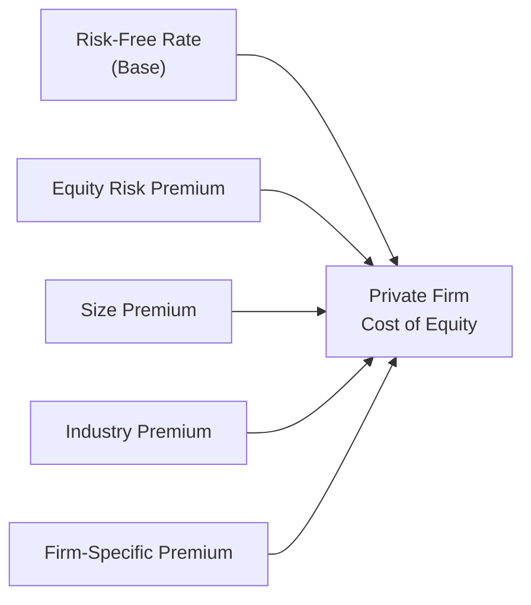

## Introduction
Valuing a private company often feels like you’re driving on a foggy night—you can still move forward, but you’ve got to rely on different signals to guide you. It’s not like a public company, where you can look up a convenient stock price or systematically compare betas against dozens of industry peers. Private firms lack easy access to public disclosures, and they don't trade on an exchange. That means you need alternative methods to gauge the elusive concept of cost of capital. And believe me, this can get tricky if you’re used to the standard CAPM approach taught in textbook finance.

This article focuses on key techniques and challenges in setting cost of capital for private companies and small enterprises. We’ll look at the build-up approach, the expanded Capital Asset Pricing Model (CAPM) with additional risk premiums, and special considerations like illiquidity discounts and key-person risk. We’ll also discuss how to carefully interpret private transaction data and mitigate data limitations. Let’s dive in.

## Why Private Companies Are Different
Public companies have stock market data, trading volume, and broad analyst coverage. Private firms? Not so much. Let’s consider a quick anecdote: I once worked on valuing a mid-sized engineering services firm led by two brilliant co-founders. The data we had were spotty financial statements compiled under local GAAP, with no standard audits or even consistent revenue recognition. It was clear that we couldn’t just pluck a beta from a Bloomberg terminal or rely on well-known datasets like S&P 500-based equity risk premiums. Instead, we had to piece together an estimate of their risk profile step by step.

Challenges often include:
• Nonstandard financials or limited disclosures.  
• No direct market-based beta.  
• Greater reliance on comparisons to peers or older private transactions.  
• Key-person or succession issues that can heavily influence risk.  
• Illiquidity because the equity interest cannot be readily sold.  

All these factors mean one thing: standard CAPM alone isn’t enough.

## The Build-Up Approach
One popular method of estimating the cost of equity for a private company is the build-up approach. As the name suggests, you “build up” the required rate of return by stacking various risk premiums on top of a baseline risk-free rate.

### Components of a Typical Build-Up
• Risk-Free Rate (Rf). Often a government bond yield, representing nominal “safe” returns.  
• Equity Risk Premium (ERP). The broad premium investors demand for taking on stock market risk.  
• Size Premium. Smaller firms often face higher risk (e.g., less access to capital, more volatile earnings), which typically adds a few percentage points.  
• Industry Premium. Some industries (biotech, for instance) are riskier than others (utilities), calling for an additional premium.  
• Firm-Specific Premium. This captures idiosyncratic or unique factors like lack of diversification, reliance on a handful of customers, or other non-systematic risks not captured elsewhere.

Mathematically, you might see:


\text{Cost of Equity} = R_f + \text{ERP} + \text{Size Premium} + \text{Industry Premium} + \text{Firm-Specific Premium}.


In exam scenarios, you’ll often be provided with numbers for each component in a vignette. It’s a matter of plugging them into the formula—but be on the lookout for any hidden or implied factor that creeps in (like key-person risk, which might be embedded under “firm-specific risk”).

Here’s a high-level visualization:

### Why the Build-Up Approach?
The rationale behind stacking increments is that each premium represents a distinct dimension of risk. In the public markets, many of these are partially captured by beta, but for private firms, that direct measure usually isn’t available. Think of it as layering on risk “toppings” to a base cost of capital “pizza.”

## Marketability (Illiquidity) Discounts
Let’s say you finally arrived at a total cost of equity using the build-up approach. That’s great, but are you done? Possibly not, because we haven’t yet considered how illiquid a private company’s shares can be. Unlike a public stock that you can sell at a moment’s notice, private shares typically take months (or even years) to convert into cash.

This is where the concept of a marketability discount (often called illiquidity discount) comes in. You might say, “Wait, how do I estimate such a discount?” Good question. Market evidence shows typical illiquidity discounts can range anywhere from 10% to 30%, depending on the size of the company, the current market environment, and the average time to exit. The deeper or more uncertain the potential exit, the larger the discount.  

For instance, I once evaluated a small family-owned bakery chain in a niche market. Because each location was heavily personalized—right down to the specialized family recipes—and the owners weren’t open to franchising, outside investors saw a high barrier to reselling that stake. Our final valuation had a 20% knockdown purely for marketability concerns.

## Expanded CAPM for Private Firms
Another route is to adapt the standard CAPM formula to better account for private company risk. The idea is to extend beyond just Beta × (ERP). If we consider typical CAPM:


\text{Cost of Equity} = R_f + \beta (\text{ERP}),


we might expand it by adding terms for size and other risk factors:


\text{Cost of Equity} = R_f + \beta (\text{ERP}) + \text{Size Premium} + \text{Industry Premium} + \text{Firm-Specific Premium}.


This expanded CAPM looks suspiciously like the build-up approach, right? Indeed, the difference is that in the expanded CAPM, you might attempt to measure a private firm’s implied beta using a “comparable companies” approach. You could observe a set of public companies that mirror your private firm’s industry or business model, unlever their betas, and then relever for your private firm’s capital structure. After obtaining that approximate beta, you add in the extra risk premiums. So it’s akin to combining the standard CAPM alpha/beta concept with the more granular risk increments used in the build-up method.

### Key Step: Estimating Beta
Without a public stock price history, you can’t just regress returns. Instead, you:
1. Select comparable public firms.  
2. Compute each firm’s beta based on its stock returns vs. a broad market index.  
3. Unlever the betas (remove the effect of financing structure).  
4. Compute the median or average unlevered beta.  
5. Relever that beta using your private firm’s debt-to-equity ratio.  

These steps can be found under the ubiquitous formula:


\beta_{\text{unlevered}} = \frac{\beta_{\text{levered}}}{1 + \Big[\frac{D}{E} \times (1 - T)\Big]},


and then:


\beta_{\text{private, levered}} = \beta_{\text{unlevered}} \times \Big(1 + \Big[\frac{D}{E} \times (1 - T)\Big]\Big).


Such an approach tries to capture the systematic risk in the private firm’s operations. Because private companies can have very different capital structures from typical public peers, you often see bigger or smaller betas than might be expected from a quick guess. Once that new beta is hammered out, you add other premiums as needed.

## Key-Person Risk
Private firms, especially those launched by visionary founders or that revolve around a specialized skill, often have significant key-person risk. You know that scenario: The CEO with indispensable technology expertise bolts, or the star salesperson controlling the entire customer network retires. The business might lose half its value overnight.

But wait, how do we translate that into a numeric premium? Typically, the firm-specific premium in the build-up approach is the catch-all for such intangible threats. You might label it “key-person premium” or lump it with “unsystematic risk premium,” but either way, it’s an incremental rate. If a firm’s success is dangerously tied to one or two individuals, you might incorporate, say, 2–4 percentage points (or more) to reflect that heightened vulnerability.

And let’s be real: private company vignettes on the CFA exam love to highlight a controlling founder or an executive who basically is the brand. Keep your eyes open for that detail. They might slip that in to see if you recall to add a key-person premium.

## Using Private Transaction Data
When available, real private-company transaction data can provide valuable clues about discount rates. Suppose you have a handful of deals in the same region and in a similar line of business. Observed multiples or implied discount rates from those deals might help calibrate your cost of capital or valuation approach. But a word of caution: small data samples can be misleading. One transaction might not reflect typical market conditions or might be impacted by strategic buyer motives.

### Tips for Using Private Data
• Confirm the transactions are genuinely comparable (similar growth prospects, margins, location, etc.).  
• Be mindful of the time gap. If the deals happened three years ago in a different economic climate, the discount rates might be outdated.  
• Investigate the buyer’s motives: If it was purely a strategic purchase with synergy potential, they may have been willing to overpay.  

## Common Pitfalls
It’s surprisingly easy to double count or omit certain premiums when dealing with private companies. Here are some pitfalls that might pop up in exam item sets:

• Double Counting Risk: For instance, building a huge firm-specific premium into the discount rate and then separately applying a big illiquidity discount to equity value might overstate the risk.  
• Overreliance on Market Comparables: If you base your entire approach on a single private transaction that had unique circumstances, you could be way off.  
• Missing Key-Person Factor: The item vignette might mention that the retiring founder has the only patent and half the major client relationships. If you skip that detail, you’ll understate the cost of capital or overvalue the business.  
• Inconsistent Beta Assumptions: If you’re using an expanded CAPM approach, watch out for hints in the vignette about capital structure or differences in risk that would require you to scale or unlever/relever beta.

## A Practical Illustration
Let’s try a simplified numerical example for a hypothetical private manufacturing company:

• Risk-Free Rate = 3%  
• Equity Risk Premium = 5%  
• Beta (estimated from comparable public firms) = 1.2  
• Size Premium = 2%  
• Industry Premium = 1.0%  
• Firm-Specific Premium (key-person + intangible dependencies) = 1.5%  

Using an expanded CAPM approach, we might do:


\text{Cost of Equity} = 3\% + (1.2 \times 5\%) + 2\% + 1\% + 1.5\% 


Breaking that out:
• Beta × ERP = 1.2 × 5% = 6%  
• Summation of other premiums: 2 + 1 + 1.5 = 4.5%  

Hence, total Cost of Equity = 3% + 6% + 4.5% = 13.5%.  

If we wanted to apply a marketability discount to the resulting equity value, we might reduce the valuation by, say, 15% to reflect illiquidity. That discount is usually applied at the equity valuation stage, not added to the discount rate itself.

## Exam-Focused Takeaways
1. Pay attention to each risk bucket: size, industry, firm-specific, and illiquidity.  
2. Look for keywords in the vignette indicating key-person risk or unusual ownership structures.  
3. Be sure to confirm that you’re not double counting.  
4. If the item set provides data for possible betas, confirm you appropriately unlever or relever them as needed.  
5. Disclose or note your assumptions. If the vignette references incomplete data, highlight that as a limitation.

## Practical Best Practices
• Be transparent: In real practice, you’d highlight each assumption clearly in your valuation report, so stakeholders understand the reasons behind each premium.  
• Use multiple approaches: Combine build-up with an expanded CAPM or references to private transactions to see if the results converge.  
• Rely on established databases (e.g., Duff & Phelps, Pratt’s Stats) for size premiums or historical transaction data.  
• Keep an eye on local regulations: IFRS or US GAAP differences may cause large variations in reported earnings or debt levels, which in turn affect your cost of capital inputs.

## References and Further Reading
- CFA Institute Level II Curriculum, Corporate Issuers (2025).  
- Trugman, G. (2016). Understanding Business Valuation: A Practical Guide to Valuing Small to Medium Sized Businesses (5th ed.). AICPA.  
- Hitchner, J.R. (2017). Financial Valuation: Applications and Models (4th ed.). Wiley.  
- Duff & Phelps. (Annual). Valuation Handbook—Guide to Cost of Capital.  
- Damodaran, A. (Regular updates). Data on market risk premiums, size premiums, and industry betas (available at http://pages.stern.nyu.edu/~adamodar/).  

-----------------------

## Test Your Knowledge: Private Company Valuation & Cost of Capital



### Which statement correctly describes a key difference between public and private company valuations regarding cost of capital? 
- [ ] Private firms typically observe betas directly from their stock price. 
- [x] Private firms generally have no direct public market beta, requiring alternative methods like the build-up approach. 
- [ ] Private firms frequently rely on a government-regulated method for cost of capital estimation. 
- [ ] Private firms do not require any additional risk premiums beyond the CAPM model.  

> **Explanation:** Because private companies are not traded on public exchanges, we cannot directly observe their beta. As a result, methods like the build-up approach or expanded CAPM with additional premiums are required.

### What is the primary reason for applying a marketability discount to private company valuations?  
- [ ] To account for higher dividends.  
- [ ] To compensate owners for unrelated diversification.  
- [x] To reflect the difficulty in buying or selling stakes in private enterprises.  
- [ ] To inflate the overall valuation and attract investors.  

> **Explanation:** Marketability (or illiquidity) discounts recognize that private shares cannot be readily sold in the same manner as publicly traded stocks, justifying a reduction in value.

### Which of the following is NOT commonly included in the build-up approach for estimating a private company’s cost of equity?  
- [ ] A size premium for smaller businesses.  
- [ ] An industry-specific premium.  
- [ ] A firm-specific premium covering unique risks.  
- [x] A systematic premium based on direct market beta.  

> **Explanation:** The build-up approach typically enumerates each risk premium separately rather than relying on a direct market beta expression.

### When using comparable public firms to estimate beta for a private company, an analyst typically un-levers beta in order to:  
- [x] Remove the effects of the comparable firm’s capital structure before reapplying the private firm’s structure.  
- [ ] Disregard systematic market risk entirely.  
- [ ] Eliminate the cost of debt.  
- [ ] Avoid adding any risk premiums.  

> **Explanation:** Unlevering beta strips out the debt effect in order to isolate the firm’s underlying business risk, after which the private firm’s debt-to-equity ratio can be used to relever it.

### Which element most directly captures the risk that a company’s founder could suddenly leave, taking valuable know-how?  
- [ ] Industry premium  
- [ ] Size premium  
- [x] Key-person (firm-specific) premium  
- [ ] Equity risk premium  

> **Explanation:** Key-person risk is a type of firm-specific or unsystematic risk, so analysts often add a premium beyond industry or size considerations.

### The expanded CAPM is best described as:  
- [ ] A modification of beta to remove the influence of market factors.  
- [x] Standard CAPM plus additional premiums for size, industry, or idiosyncratic factors.  
- [ ] A formula that removes the risk-free rate from the model.  
- [ ] A model that only applies to regulated industries.  

> **Explanation:** The expanded CAPM retains CAPM’s market-driven concept but adds extra premiums (for size, firm-specific risk, etc.) relevant for private companies or unique circumstances.

### Suppose an analyst calculates a company’s cost of equity using the build-up approach and obtains 15%. She then applies a 20% marketability discount to the final equity value. Which pitfall should she be mindful of?  
- [x] Double-counting risk if the illiquidity discount has already been partly included in the build-up.  
- [ ] Failing to include a risk-free rate in the analysis.  
- [ ] Mixing up equity and debt cost calculations.  
- [ ] Omitting the fundamental CAPM formula.  

> **Explanation:** Analysts must take care not to include an illiquidity premium in the discount rate if they also plan to discount the final equity value for illiquidity. Otherwise, the same risk is counted twice.

### Why should analysts be cautious about using only one or two private transaction data points?  
- [ ] It usually leads to the most accurate estimate.  
- [x] Small samples may not represent typical market conditions.  
- [ ] It fully addresses systematic risk.  
- [ ] Private transactions rarely involve synergy considerations.  

> **Explanation:** Private transaction data often involve unique circumstances. Relying solely on a small sample can lead to a distorted view of fair value or discount rates.

### When reading a CFA exam vignette about a founder-owned private business, which detail might be a strong indicator that an additional risk premium is warranted?  
- [ ] The company just had a successful IPO.  
- [x] The founder handles all major sales relationships personally.  
- [ ] The firm pays out significant dividends under a stable policy.  
- [ ] The firm uses IFRS for financial reporting.  

> **Explanation:** Heavily founder-centric businesses typically warrant a key-person premium or firm-specific premium.

### True or False: A private firm’s cost of equity always equals the sum of the risk-free rate, the equity risk premium, a size premium, an industry premium, and a firm-specific premium, with no other adjustments needed.  
- [x] False  
- [ ] True  

> **Explanation:** While those components often apply, analysts may need additional adjustments such as a marketability discount or incorporate an estimated beta for systematic risk. There’s no one-size-fits-all formula.


