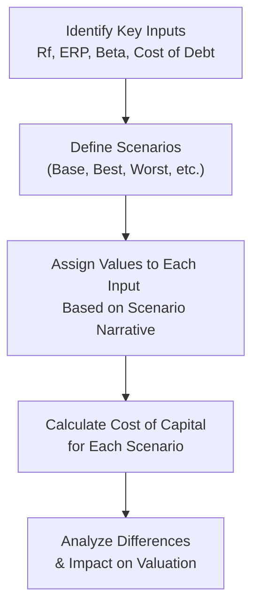

## Understanding the Role of Sensitivity and Scenario Analyses

Whenever we try to forecast a firm’s cost of capital, we’re working with a bunch of estimates: the risk-free rate, equity risk premium (ERP), beta, and the cost of debt. To keep it real, these estimates often shift due to sudden changes in macroeconomic conditions, financial markets, or firm-specific developments. So, the best approach is to investigate (and maybe even second-guess) our assumptions. That’s where sensitivity analysis, scenario analysis, and stress testing come in.

Sensitivity analysis typically varies one input at a time—like shifting the risk-free rate by 0.5% increments—while scenario analysis changes multiple variables in a coordinated manner (for instance, a recession scenario with higher default spreads and lower risk-free rates). Stress testing pushes assumptions to extremes (like imagining a sudden credit crunch or abrupt rate hikes) to check how resilient your valuation remains if worst comes to worst. If you combine all these methods, you’ll be well-equipped to present a WACC estimate that’s nuanced and robust.

## Key Concepts in Sensitivity and Scenario Analysis

### Sensitivity Analysis
Sensitivity analysis is about testing the effect of changing a single variable on the overall result. For example, if our base assumption for the risk-free rate is 4.0%, we might see what happens if it goes to 3.0%, 3.5%, or 4.5%. By doing this, we get a sense for which input has the biggest effect on the cost of capital.

### Scenario Analysis
Where sensitivity analysis looks at just one variable at a time, scenario analysis involves adjusting multiple inputs simultaneously under a consistent narrative. For instance, a “rapid growth” scenario might assume a low credit spread, a moderate rise in interest rates, and a stable beta. Meanwhile, in a “recession” scenario, you might see a spike in credit spreads, a flight to safety lowering the risk-free rate, and an uptick in beta due to higher market volatility.

### Stress Testing
Stress testing is an offshoot of scenario analysis that zeroes in on extreme but plausible events (think: a global pandemic, sudden geopolitical tensions, or a 300-basis-point rate hike). This exercise is particularly helpful for risk management and compliance, giving you a sense of how a firm’s cost of capital might explode or crater under unusual, stressful conditions. 

### Monte Carlo Simulation
A Monte Carlo simulation takes scenario analysis to an even more advanced level. It’s a computational technique that generates thousands (or even millions) of random scenarios for your key inputs—risk-free rate, ERP, beta, cost of debt, etc.—based on presumed distributions (like normal distributions with specified means and standard deviations). The result is a probability distribution of possible WACC or cost of equity outcomes. This can be super powerful if you need a robust sense of range for your final cost-of-capital estimate.

## Implementing Sensitivity Analysis

So, let’s say we have a baseline project evaluation with these assumptions:

- Risk-free rate (Rf): 4.0%  
- Equity risk premium (ERP): 6.0%  
- Beta (β): 1.2  
- Cost of debt (before tax): 5.5%  
- Corporate tax rate: 25%  
- Debt to total capital: 40%  
- Equity to total capital: 60%

Using the Capital Asset Pricing Model (CAPM) for equity:

Cost of Equity (Ke) = Rf + β × ERP  
= 4.0% + 1.2 × 6.0% = 4.0% + 7.2% = 11.2%

After-tax cost of debt (Kd) = 5.5% × (1 – 0.25) = 4.125%

Weighted Average Cost of Capital (WACC) = (E/V) × Ke + (D/V) × Kd  
= (0.60 × 11.2%) + (0.40 × 4.125%)  
= 6.72% + 1.65% = 8.37%

### Single-Factor Sensitivity
Now, assume you perform a sensitivity analysis on the risk-free rate. Let’s analyze the effect of moving the Rf from 3.5% to 4.5% in 0.5% increments, holding all other variables steady. You might produce a quick table for the cost of equity and final WACC:

| Rf   | Ke              | WACC           |
|------|-----------------|----------------|
| 3.5% | 3.5% + (1.2 × 6.0%) = 3.5% + 7.2% = 10.7% | (0.60 × 10.7%) + (0.40 × 4.125%) ≈ 8.02% |
| 4.0% | 4.0% + (1.2 × 6.0%) = 11.2%      | (0.60 × 11.2%) + (0.40 × 4.125%) ≈ 8.37% |
| 4.5% | 4.5% + (1.2 × 6.0%) = 4.5% + 7.2% = 11.7% | (0.60 × 11.7%) + (0.40 × 4.125%) ≈ 8.72% |

Nothing too fancy here—just a straightforward approach to see how the WACC changes with one modified input. 

## Scenario Analysis Under Different Macroeconomic Conditions

Things get more interesting if we tie changes in the risk-free rate, ERP, beta, and cost of debt into a coherent storyline. Below is a simplified example.

- Base Case (Most Likely Scenario)  
  - Rf = 4.0%  
  - ERP = 6.0%  
  - Beta = 1.2  
  - Pre-Tax Cost of Debt = 5.5%  

- Best-Case (Robust Economic Growth)  
  - Rf = 4.5% (due to central banks raising rates amid a thriving economy)  
  - ERP = 5.0% (investors confident, pushing equity risk premiums lower)  
  - Beta = 1.0 (lower systematic risk due to stable markets)  
  - Pre-Tax Cost of Debt = 5.0% (narrow credit spreads)

- Worst-Case (Recession)  
  - Rf = 3.0% (flight to safety reduces government bond yields)  
  - ERP = 7.0% (equity investors demand higher risk premiums)  
  - Beta = 1.3 (volatility spikes across market)  
  - Pre-Tax Cost of Debt = 7.0% (credit spreads widen significantly)

Under each scenario, re-calculate cost of equity, after-tax cost of debt, and WACC. This is the bread-and-butter approach for scenario analysis.

### Diagramming the Basic Process

Here’s a simple Mermaid diagram that lays out the steps for scenario analysis:



## Stress Testing for Extreme Events

Stress testing is just an intensified version of scenario analysis. Instead of small or moderate changes, you assume extreme but plausible moves:

- A sudden 3% jump in the risk-free rate due to unexpected central bank policy shifts.  
- A credit crunch that doubles the cost of debt overnight.  
- A geopolitical crisis that raises the ERP from 6% to 10%.  

The idea is to see if your project or firm can stay afloat under these “what if it all goes wrong?” scenarios. Although candidates at Level II might first connect stress testing to risk management or regulatory compliance, it’s increasingly relevant for corporate finance decisions—especially for big capital expenditures or expansions that hinge on stable financing conditions.

## Monte Carlo Simulation for Enhanced Insight

Sometimes, the interplay of macroeconomic and firm-specific factors gets really tangled. In those instances, a Monte Carlo simulation can help. Here’s how it might look:

1. Assume distributions for each input (risk-free rate, ERP, beta, cost of debt).  
2. Use a random number generator (in Python, Excel, or specialized risk software) to sample from those distributions thousands of times.  
3. Calculate the WACC each time.  
4. Compile a distribution of WACC outcomes.

Example pseudo-Python snippet:

```python
import random
import statistics

N = 10000
results = []

for _ in range(N):
    rf = random.gauss(0.04, 0.005)  # mean=4%, stdev=0.5%
    erp = random.gauss(0.06, 0.01)  # mean=6%, stdev=1%
    beta = random.gauss(1.2, 0.2)   # mean=1.2, stdev=0.2
    cost_debt_pre_tax = random.gauss(0.055, 0.01) # mean=5.5%, stdev=1%
    
    ke = rf + beta*erp
    kd_after_tax = cost_debt_pre_tax*(1 - 0.25)
    wacc = 0.60*ke + 0.40*kd_after_tax
    results.append(wacc)

mean_wacc = statistics.mean(results)
stdev_wacc = statistics.pstdev(results)
print(f"Mean WACC: {mean_wacc:.2%}, St Dev: {stdev_wacc:.2%}")
```

The output is a distribution of possible WACC outcomes, which you can then illustrate in a histogram. Your final step is to interpret the percentiles—“there’s a 5% chance our WACC exceeds 10.2%” or “we have a 90% confidence that it remains below 8.5%,” etc.

## Communicating the Range of WACC

Presenting a single “magic number” for WACC is handy, but it can underplay uncertainty. In reality, you would show a range—for instance, 7.5% to 9.0%—and explain how that depends on interest rates, betas, or the firm’s credit risk. When presenting your results to senior management or an investment committee, highlight:

- Best, Base, and Worst Cases in a scenario table.  
- Stress test results.  
- Probability distributions (if using Monte Carlo).  

This fosters a deeper understanding of risk and keeps decision-makers from getting lulled by a single point estimate.

## Strategic Implications of Changing Cost of Capital

A big part of all this analysis is strategy. If your sensitivity or scenario analysis suggests that WACC might jump to 10% in a severe market downturn, you might reconsider big-ticket capital investments or expansions that hinge on cheap debt financing. On the other hand, a stable or declining WACC could encourage more aggressive investment. 

Don’t forget the synergy with your capital structure (chapters on cost of capital, equity vs. debt financing) and your firm’s payout policy. If your cost of capital spikes, you might prefer to retain earnings over distributing them as dividends or buybacks so that you have more internal financing at your disposal.

## Personal Reflections on Cost of Capital Fluctuations

I recall evaluating a capital project when I was working in corporate treasury. We had just locked in our initial cost-of-debt assumption, then the markets unexpectedly turned due to an unforeseen geopolitical event. Our credit spread soared by over 200 basis points, shifting the entire WACC (which we had pegged around 7.5%) closer to 9%. The project barely eked out a positive net present value after that—only because we had planned for a “stress” scenario, so management already had a response plan in place. That experience taught me how vital it is to stay nimble and always be prepared for that “improbable” event.

## Common Pitfalls and Best Practices

- Overlooking Correlations: Multiple variables often move together—like the risk-free rate and ERP in certain macro environments.  
- Getting Overly Precise: Don’t fool yourself into spurious accuracy (model risk is real).  
- Forgetting Tax Effects: Shifts in corporate tax rates (or misunderstandings around them) can skew sensitivity results significantly.  
- Ignoring Round-Trip Effects: If a firm’s cost of capital changes, it might alter the cash flows themselves (say, higher interest rates lead to a slowdown in demand).  
- Lack of Communication: Resist the urge to bury complex analysis in jargon. Present your findings in a simpler range or scenario-based format that stakeholders can digest.

## Glossary

- Sensitivity Analysis: Evaluates how changes in one specific variable (e.g., beta) impact the overall result (e.g., WACC).  
- Scenario Analysis: Envisions how multiple factors shift together (e.g., risk-free rate, ERP, and cost of debt) under different economic narratives.  
- Stress Testing: Deliberately pushes assumptions to extremes (e.g., severe recession) to measure the resilience of the outcome.  
- Monte Carlo Simulation: Uses random sampling across assumed probability distributions for inputs to produce a distribution of potential outcomes.  
- Base-Case Scenario: The most probable or “expected” situation used for initial valuation analysis.  
- Resilience: The ability of a valuation or project to withstand adverse external shocks or market fluctuations.

## Final Thoughts for Exam Day

• Focus on conceptual understanding. The CFA exam loves to test how well you handle changes in assumptions.  
• Show the difference between single-factor sensitivity vs. multi-factor scenario analysis. If a question asks for a “downside scenario,” adjust each relevant metric accordingly and consistently.  
• For item sets, read carefully. They often embed subtle risk-free rate or beta changes.  
• Keep your approach systematic. A table is usually your friend, so you can clearly see where each assumption changes and how it impacts the WACC.  
• If the question opens the door to stress testing, illustrate the extremes. Don’t just re-label your base scenario as “worst case.”  

Use your time wisely, and if you see a scenario question on the exam with multiple variables shifting, practice carefully labeling each input. That methodical approach will help you avoid confusion when you get to the final WACC or cost-of-equity calculation.

---

## Mastering Sensitivity and Scenario Analysis: Practice Questions



### Which of the following best defines scenario analysis?

- [ ] Evaluating the effect of changing one capital input at a time.
- [ ] Using random simulations to find a probability distribution of outcomes.
- [x] Examining how multiple variables shift simultaneously under a coherent narrative.
- [ ] Stress-testing the most extreme outcomes in a single variable.

> **Explanation:** Scenario analysis typically involves shifting multiple inputs concurrently under plausible macro or firm-specific assumptions.

### In a single-factor sensitivity analysis, which input is most commonly varied first when calculating a firm’s cost of equity?

- [ ] Market risk premium
- [x] Risk-free rate
- [ ] Beta
- [ ] Leverage ratio

> **Explanation:** A quick and standard approach is to vary the risk-free rate first, although changes in beta or the ERP are also valid sensitivity factors.

### Which statement about stress testing is most accurate?

- [ ] Stress testing only applies to credit portfolios, not equity valuations.
- [ ] Stress testing is part of scenario analysis but focuses on best-case scenarios.
- [x] Stress testing is a form of scenario analysis using extreme but plausible assumptions.
- [ ] Stress testing ignores changes in the risk-free rate.

> **Explanation:** Stress testing is a specialized form of scenario analysis designed to gauge outcomes under severe conditions that might rarely, but possibly, occur.

### For a company with a 40% debt-to-total-capital ratio, how does an increase in the market risk premium generally affect the WACC?

- [ ] WACC decreases significantly.
- [ ] WACC remains unchanged.
- [x] WACC increases, but the magnitude depends on the firm’s equity beta.
- [ ] WACC increases only if the cost of debt rises simultaneously.

> **Explanation:** A higher ERP raises the cost of equity, thereby increasing WACC. The effect’s size depends on the firm’s reliance on equity financing and its beta.

### In performing a scenario analysis, which set of inputs is most appropriate for a “worst-case” recession scenario?

- [x] Lower risk-free rate, higher ERP, higher beta, higher pre-tax cost of debt
- [ ] Higher risk-free rate, lower ERP, lower beta, lower pre-tax cost of debt
- [x] Lower risk-free rate, higher ERP, higher beta, higher pre-tax cost of debt
- [ ] Higher risk-free rate, lower ERP, higher beta, lower pre-tax cost of debt

> **Explanation:** Recessionary environments typically see a flight to safety (lower Rf) and higher credit spreads (raising cost of debt). Additionally, investor anxiety inflates the equity risk premium and can raise corporate betas in a risk-off environment.

### What is the primary advantage of the Monte Carlo simulation approach?

- [ ] Generates a single admission point for cost of capital
- [x] Provides a probability distribution of potential outcomes
- [ ] Eliminates the impact of beta
- [ ] Guarantees higher valuation accuracy

> **Explanation:** Monte Carlo simulation yields a probability distribution of possible results, giving richer insight into the range and likelihood of outcomes.

### Which of the following is most likely a best-case scenario assumption?

- [x] Lower ERP
- [ ] Lower corporate cash flows
- [x] Lower ERP
- [ ] High market volatility

> **Explanation:** In a best-case scenario, markets are typically stable, and investors demand lower risk premiums, leading to a lower ERP.

### A sudden 200-basis-point hike in the firm’s pre-tax cost of debt is an example of what type of analysis?

- [ ] Monte Carlo simulation
- [ ] Beta decomposition
- [ ] Single-factor scenario analysis
- [x] Sensitivity analysis

> **Explanation:** Changing one variable (the cost of debt) in isolation is a classic single-factor sensitivity analysis.

### Which of the following is a key pitfall when conducting scenario analysis?

- [x] Ignoring correlations among inputs
- [ ] Including second-order effects on cash flows
- [ ] Presenting multiple inputs changing in tandem
- [ ] Presenting multiple scenario narratives

> **Explanation:** One of the most common pitfalls is forgetting that certain inputs (e.g., risk-free rate, ERP) might be correlated, leading to unrealistic scenario assumptions.

### True or False: Stress testing should always provide the firm’s single best estimate of WACC.

- [x] True
- [ ] False

> **Explanation:** Actually, this statement is a bit tricky. Stress testing is designed to explore extremes, not produce a single “best” estimate. If the question is read strictly, it might suggest we’re saying “No, you shouldn’t use it for the single best estimate.” But if we interpret “True or False: Stress testing should always provide the single best estimate of WACC,” the correct answer is “False.” The correct statement is that stress testing reveals extremes rather than best estimates. So the correct answer is “False.”  



---

**References and Further Reading**  
• CFA Institute Level II Curriculum, Corporate Issuers (2025).  
• Brigham, E. & Ehrhardt, M. (2019). Financial Management: Theory & Practice (16th ed.). Cengage.  
• Hull, J. (2018). Risk Management and Financial Institutions (5th ed.). Wiley.  
