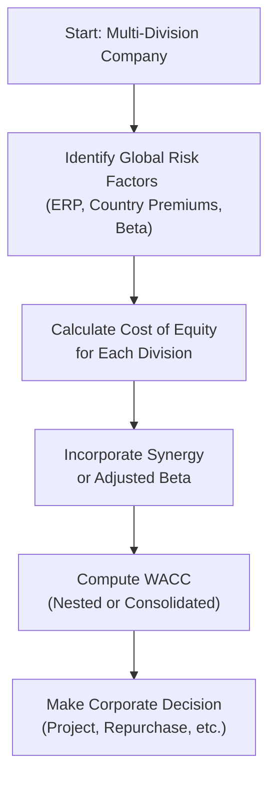

## Introduction and Overview

If you’ve ever found yourself thinking, “Well, calculating the cost of capital seemed straightforward at Level I; why are we complicating things now?”—believe me, you’re not alone. Many of us, myself included, got comfortable with the standard Weighted Average Cost of Capital (WACC) formula in the past. But the real world—and the Level II exam—often demand so much more. In this section, we’re delving into the deep end of cost of capital item sets, where real-life complexities such as global expansions, synergy assessments, forward-looking equity risk premiums (ERPs), and conflicting data can make your head spin if you’re not prepared.

We’re going to unpack how to handle integrated vignettes that throw multiple cost of capital calculations at you—each with unique adjustments for risk, taxes, and currency exposures. This is intended to help you face the exam with confidence, but also to equip you with a real-world mindset: big corporates rarely have “clean” or “standard” data sets; they have messy, evolving scenarios that challenge your assumptions. Let’s explore best practices for dealing with these intricacies, all while maintaining the quick, systematic approach you need under exam conditions.

## Expanding the Building Blocks of Cost of Capital

### Forward-Looking Equity Risk Premium

Chances are you remember building the Capital Asset Pricing Model (CAPM) with a historical equity risk premium. At Level II, you’re expected to handle forward-looking estimates too. Why forward-looking? Because reliance on historical data sometimes fails to capture tomorrow’s risk environment—particularly in dynamic or emerging markets.

A typical forward-looking ERP might be estimated by starting with a forecast for market returns and subtracting the risk-free rate:

  

\text{Forward-Looking ERP} = \text{Expected Future Market Return} - \text{Current Risk-Free Rate}


Estimates for “Expected Future Market Return” might come from analysts’ projections of earnings growth, macroeconomic indicators, or even consensus beliefs about long-term GDP expansion. You’d then use this forward-looking ERP in the CAPM for each division or project. In an exam question, you might see two or three different forecasts from distinct analysts—one might be bullish, one conservative, one moderate. Your job is to evaluate the reliability and pick the estimate that’s most consistent with the vignette’s “real story,” or you might be asked to recalculate cost of equity under each scenario.

### Country Risk Premium

Global expansions often entail distinct political, economic, and liquidity risks. A country risk premium helps capture these additional uncertainties in the cost of equity. A standard approach is:

  

\text{Cost of Equity for Foreign Investment} = R_{f} + \beta ( \text{Equity Risk Premium} ) + \text{Country Risk Premium}


The tricky part: not every vignette explicitly states the country risk premium. Sometimes it might appear as a “sovereign spread” in the narrative. Another time you might see references to a risk rating from a credit agency. You’ve got to identify that piece of info, figure out how to incorporate it (on top of your “traditional” CAPM approach), and ensure your final cost of equity figure is consistent with that risk environment. 

### Multiple Currencies and Cross-Border Financing

Cross-border transactions are no joke. If a parent corporation is HQ’d in, say, the U.S. (USD) and invests in Europe (EUR) and Brazil (BRL), you could be dealing with three separate discount rates. Each region might have different tax structures, interest rates, and inflation expectations. That means each division might have its own WACC or cost of equity. Then, as you consolidate, synergy effects or cost-of-funds differentials could come into play.

Try not to overcomplicate the process—but do stay organized:

1. Identify the local risk-free rate, typically in local currency.  
2. Adjust for local market risk premium and local beta if appropriate.  
3. Incorporate currency risk, especially if the project’s cash flows are forecast in a currency different from where the capital is sourced.  
4. Convert returns or discount rates into a single “home” currency if needed.  

Under exam conditions, the vignette will (hopefully) give you enough bread crumbs: maybe an exchange rate table, corporate borrowing rates in different locales, or references to local benchmarks. Your job is to piece them together like a detective, ignoring any distractors—like an outdated country risk rating that’s been superseded by new data mid-vignette.

### Synergy Effects in Cost of Capital Calculations

Let’s say a firm merges with another entity or invests in a strategic alliance. The synergy might lower overall risk if the revenue base is more diversified, or it might increase risk if the newly integrated business is more leveraged or more exposed to uncertain markets. For example:

• Synergies that reduce operating costs or broaden revenue streams across geographies might lower the overall beta.  
• Additional leverage from partial acquisitions might increase the debt ratio, thereby affecting WACC.  

On the exam, synergy discussions often appear as management’s commentary about reduced volatility or improved growth potential. Evaluate whether that synergy genuinely impacts the risk profile. You can’t just take the CFO’s word for it—look for data showing changes in risk. Conversely, synergy hype might be a distractor if the underlying financial statements point to diminishing returns or new complexities unaccounted for in management’s rosy outlook.

## Integrated Vignette Approach

### Step 1: Identify Relevant Data

In these “big” item sets, you typically see a swirl of numbers: historical betas, local government bond yields, credit spreads, partial year data, you name it. The first skill is to filter out truly relevant pieces:

• The updated risk-free rate.  
• The appropriate measure of beta (including any unlevering/relevering that might be required).  
• The forward-looking ERP you can justify from the text.  
• Country risk spread or sovereign yield differentials.  
• Corporate tax rate.  

Beware of distractors—like a footnote referencing an old interest rate from two quarters ago. The exam is testing how carefully you read and cross-check the latest info.

### Step 2: Determine Which Formula(s) Apply

The standard WACC formula typically goes like this:


\text{WACC} = \frac{E}{V} \cdot R_{e} + \frac{D}{V} \cdot R_{d} \cdot (1 - t) + \frac{P}{V} \cdot R_{p}


where  
• \\( E \\) is the market value of equity,  
• \\( D \\) is the market value of debt,  
• \\( P \\) is the market value of preferred,  
• \\( R_{e} \\) is the cost of equity,  
• \\( R_{d} \\) is the cost of debt,  
• \\( R_{p} \\) is the cost of preferred,  
• \\( t \\) is the corporate tax rate,  
• \\( V = E + D + P \\).

But if the vignette references additional premiums—like a synergy premium or a specialized venture requiring an “internal intangible synergy factor”—be prepared to handle a “build-up” approach for the cost of equity. That might look like:


\text{Cost of Equity} = R_{f} + \beta \cdot (\text{ERP}) + \text{Size Premium} + \text{Country Risk Premium} + \text{Project-Specific Risk Premium} 


You might never have used a project-specific risk premium in a simple WACC formula, but that’s exactly the twist these advanced vignettes love. So stay flexible.

### Step 3: Plug and Check—Then Revisit

Time pressure can be intense in the exam. My personal approach? Jot down your formula with placeholders for each piece of data. Then fill it in methodically. Once you get a final figure, sense-check it: does that cost of equity or WACC seem outrageously high or too low given the scenario? If so, you might’ve missed a detail like a tax rate difference or a misread currency basis. Going back to re-check your references quickly can save you from an “oops” moment.

### Quick Example: Integrated Vignette

Imagine a firm—call it DCP Corporation—headquartered in the U.S. with expansions in Mexico and China. The CFO says:

• “We use a forward-looking ERP of 5.5% for the U.S.”  
• “For Mexico, add a country risk premium of 2.0%. I see no country risk premium needed for China.” (But the footnote might say something else about new restrictions in China, so read carefully!)  
• “Our current risk-free rate is 3.0%. Over in Mexico, local Gov’t bonds yield 6.0%. It’s mostly inflation differential.”  
• “We’re raising some new debt in Mexico at 7.5% in local currency, while U.S. debt cost is 4.5%.”  
• “We’re about to sign an acquisition that includes synergy from integrated distribution, lowering overall volatility.”  

They might give you partial data on the capital structure. For instance:

• U.S. Equity: $500 million  
• Mexican Debt: $200 million  
• Weighted distribution of the synergy across the entire firm is questionable, so maybe the synergy effect primarily lowers the group’s beta.  

One question could ask: “Based on the CFO’s statements and the data, what is the appropriate cost of equity for the Mexican subsidiary in local currency?” Another might ask, “What’s the consolidated WACC in U.S. dollars if we treat synergy as a 0.1 reduction in the overall group’s beta?”

In these advanced vignettes, you’ll compute each piece carefully, confirm your steps, and watch for hidden contradictions. Maybe the CFO’s synergy claim is not well supported, or maybe the updated news from the footnotes suggests an additional 0.5% risk premium for China. The exam thrives on these little twists.

## Handling Distractors and Conflicting Statements

“Huh, the CFO said the synergy is massive, but the footnotes say it’s small.” This is typical. The best approach is to rely on the official or updated data that you can verify with the information provided. If the synergy is contradicted by a more reliable piece of data (like an external auditor’s note or the latest bond rating changes), the safe bet might be to use the updated data. The exam often tests your ability to discriminate real from questionable info.

Also note that sometimes you’ll see disclaimers about data that’s “for historical reference only.” Don’t anchor yourself to out-of-date interest rates or betas unless the question explicitly instructs you to use them. This is as much about reading comprehension as it is about finance.

## Merging Cost of Capital Results with Corporate Decisions

The real fun begins when the item set asks you to use your newly calculated WACC or required return to decide among corporate actions: “Should the firm do a share repurchase to lower cost of equity?” or “Should they invest in a new project with an 11% expected return if the WACC is 10%?” Possibly you’ll see multiple payback or IRR calculations that you have to discount with your newly minted cost of capital. The question might say: “Which project (A or B) do you recommend given an expected synergy effect on the discount rate in Year 3?”

Remain consistent about your final discount rate. If something changes mid-analysis (like a revised synergy estimate), carefully note the difference. Don’t revert to the old discount rate for the final project decision. Keep track of all those small updates—it’s easy to slip in the middle of a multi-part question.

## Best Practices for Referencing Computations

• Label your steps. For instance: “Step 1: Identify Beta. Step 2: Apply country risk premium. Step 3: ...”  
• If you realize you need to revise an assumption—a different tax rate or synergy factor—go back and change that piece consistently across the calculation.  
• Double-check units: Is your risk-free rate expressed in annual terms? Are you using nominal or real rates? Make sure the currency matches the discount rate.  

## Visualizing the Cost of Capital Components

To illustrate how these elements link together in a multi-division scenario, consider the following Mermaid diagram:

This flow helps remind you that synergy or region-specific risks must be baked into your cost-of-capital computations before you finalize any corporate decisions.

## Conclusion and Key Takeaways

Frankly, the complexity you’ll see in these item sets is part of what makes Level II so challenging—and so rewarding. After all, a CFO in real life often juggles multiple currencies, shifting macro data, and partial synergy claims from multiple sources. By practicing integrated vignettes, you’ll learn to:

• Quickly identify relevant risk premiums, discount rates, and data for each region or project.  
• Evaluate the reliability of management’s synergy claims and footnote data.  
• Incorporate forward-looking assumptions, from ERP to country risk, into your cost of equity.  
• Merge cost-of-capital calculations with practical corporate decisions, like raising debt in one country versus another or choosing between incremental projects.  

If you can do all that under time pressure—without being fooled by distractors—you’re well on your way to mastering advanced cost of capital in the real world and on the exam.

---

## Test Your Knowledge: Complex Cost of Capital Scenarios



### Which component is unique to the forward-looking approach to equity risk premiums compared to a standard historical approach?

- [ ] The beta coefficient of the investment.
- [x] Projections of future market returns.
- [ ] The risk-free rate of return.
- [ ] The corporate tax rate.

> **Explanation:** The forward-looking ERP incorporates estimated future market returns rather than historical returns. Beta, risk-free rates, and taxes are used in both the historical and forward-looking models.

### A firm is expanding into a country with a significantly higher political risk than the home country. Which factor would most likely be added to the standard CAPM to reflect this?

- [ ] Additional beta weighting.
- [x] A country risk premium. 
- [ ] Levered cost of debt.
- [ ] A synergy premium.

> **Explanation:** An extra country risk premium is used to capture the specific risks associated with investing or operating in a high-risk market, over and above the standard CAPM.

### Management claims that a manufacturing acquisition will “significantly reduce overall business volatility” due to diversification. How should you reflect this in the cost of capital?

- [x] Potentially lower the firm’s beta to reflect reduced systematic risk.
- [ ] Increase the cost of debt to reflect synergy.
- [ ] Ignore the synergy effect unless there is a rating agency report.
- [ ] Simply reduce the final WACC by several percentage points arbitrarily.

> **Explanation:** True synergy might reduce systematic risk; therefore, you could adjust beta downward if there is credible data. You cannot just reduce WACC arbitrarily. Debt cost might or might not be affected.

### When consolidating the cost of capital calculations for a U.S.-based firm that also operates in Emerging Asia, which of the following do you need to pay special attention to?

- [ ] Using the same risk-free rate across all divisions.
- [ ] Ensuring all data is converted to IFRS standards first.
- [ ] Applying a uniform tax rate for simplicity.
- [x] Potential currency translation and region-specific premiums.

> **Explanation:** For cross-border operations, currency translation (e.g., discount rates in local currency) and regional risk premiums are crucial. A single risk-free rate or uniform tax rate might not reflect reality.

### A hedge fund invests in a firm that sources half its debt at a local rate of 3% and the other half at a foreign rate of 6.5%. The overall cost of debt for that firm is:

- [ ] 3.25%.
- [ ] 6.5%.
- [x] 4.75%.
- [ ] 9.5%.

> **Explanation:** Weighted cost of debt = (0.5 × 3.0%) + (0.5 × 6.5%) = 1.5% + 3.25% = 4.75%.  

### You see a footnote referencing a “two-year-old sovereign risk rating” for a country in which a subsidiary operates. The item set also provides an updated local bond spread. Which is the most appropriate for calculating the current country risk premium?

- [ ] The older sovereign risk rating, for historical consistency.
- [ ] Both, averaged equally.
- [ ] Whichever is more conservative (higher premium).
- [x] The updated bond spread, as it reflects current market conditions.

> **Explanation:** Recent data is generally more relevant than outdated data, especially if the goal is to reflect today’s risk environment.

### A firm’s new CEO states that synergy from a planned merger “will definitely reduce WACC by 3%.” However, the CFO’s data shows only minimal reduction in the firm’s overall systematic risk. How should an analyst respond?

- [x] Recalculate WACC using the CFO’s data and note minimal synergy impact.
- [ ] Accept the CEO’s statement as official guidance.
- [ ] Add 3% synergy discount for equity, none for debt.
- [ ] Disregard synergy altogether.

> **Explanation:** When management claims contradict internal or more reliable quantitative data, the best approach is to rely on the CFO’s objective metrics. That might result in only a small WACC change.

### If a project’s cash flows are denominated in a different currency than the parent company’s functional currency, how should you apply discount rates?

- [ ] Convert the project’s cash flows into the parent’s currency after discounting in local terms.
- [x] Either discount the cash flows in local currency, then translate to the parent currency, or convert them to the parent currency first with an appropriate discount rate. Consistency is key.
- [ ] Always use the parent’s domestic discount rate without adjustments.
- [ ] Use inflation differentials in place of a discount rate.

> **Explanation:** The critical point is consistency. You can work in local currency with a local discount rate, then convert, or convert cash flows to parent currency first, then use the parent discount rate. But you must be consistent.

### In an item set describing multiple expansions, you suspect the synergy effect is overstated. The best strategy is to:

- [x] Evaluate synergy claims based on supporting data; adjust if data is weak.
- [ ] Accept synergy claims because they are from management.
- [ ] Add an extra synergy discount to be safe.
- [ ] Perform cost of capital calculations with and without synergy, then pick the average.

> **Explanation:** Synergy claims need validation. If the data suggests synergy is limited, reflect that in your cost-of-capital computations. Overestimates can lead to inaccurate valuations.

### True or False: The Weighted Average Cost of Capital (WACC) always remains constant throughout a project’s life.

- [ ] True 
- [x] False

> **Explanation:** WACC can change over time due to variations in capital structure, market conditions, and project-related risks.



---

## References and Further Reading

- CFA Institute. (2025). Level II Program Curriculum, Corporate Issuers, “Practice Problems.”  
- CFA Institute Learning Ecosystem: Mock Exams, Topic Tests for Cost of Capital.  
- Benninga, S. (2014). Financial Modeling (4th ed.). MIT Press.  

Explore these resources for deeper insights into advanced WACC calculations, synergy integration, and multi-currency valuation approaches. They offer case studies and further item set rehearsals to sharpen your ability to detect distractors and apply cost-of-capital theories seamlessly. Good luck practicing—and don’t forget to keep your sense of humor when synergy claims start flying left and right!
