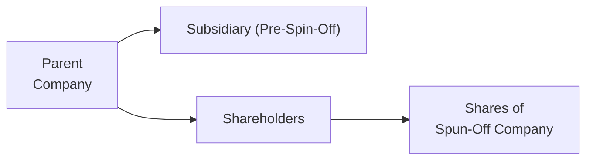
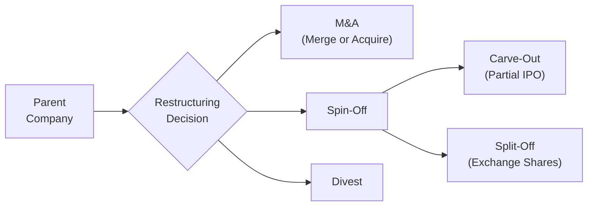

## Overview

You know that feeling when you rearrange your living room to free up space and suddenly everything just flows? Corporate restructuring is sort of the same idea—except instead of moving around a sofa, a firm might divest an entire division, spin off a subsidiary, or merge with a competitor. It’s all about creating a leaner, more strategically aligned organization.

Restructuring can serve countless purposes: maybe a business wants to enter a new market quickly, or it needs to shed a poorly performing unit to focus on core strengths. At the CFA Level II stage, you’ll find item set (vignette) questions exploring these transactions from every angle—strategy, valuation, accounting, and governance. So let’s roll up our sleeves and talk about these different forms of restructuring: mergers, acquisitions, spin-offs, and divestitures.

## Mergers vs. Acquisitions

Mergers and acquisitions (M&A) might appear interchangeable at first glance, but there are some nuances. In a merger, two companies combine to form a single new entity. In an acquisition, one company (the acquirer) purchases a controlling or full interest in another company (the target), which continues to exist—though the ownership changes hands.

• Mergers  
  – Key Legal Aspect: Two firms integrate into one legal entity.  
  – Operational Consequence: Management teams and boards often merge, though the target’s leadership might or might not remain.  
  – Strategic Motive: Mergers aim to create value through synergy—cost cuts, cross-selling, or improved market reach.  
  – Exam Tip: Look out for synergy estimates and how they factor into valuations. You might see an item set describing synergy in detail, where the question tests your ability to figure out the net benefit of the deal.

• Acquisitions  
  – Key Legal Aspect: One firm acquires the other, often measured by a controlling stake (more than 50%).  
  – Operational Consequence: The acquired company may become a subsidiary, with management decisions largely driven by the acquirer.  
  – Friendly vs. Hostile: In a hostile takeover, the acquirer bypasses target management and goes directly to shareholders (or uses a tender offer). Friendly deals typically have approval from both boards.  
  – Exam Tip: Acquisition scenarios frequently involve a comparison of purchase methods: cash vs. stock, potential post-deal integration issues, or the effect on consolidated financial statements.

### Financial Example: Synergy

Often in M&A, your items sets will demand synergy calculations. A common formula for synergy in a deal is:


\text{Synergy} = V_{\text{combined}} - \bigl(V_{\text{acquirer}} + V_{\text{target}}\bigr)


If “Combined Firm (A + T)” is worth \$500 million after the deal, while separately Acquirer (A) and Target (T) are worth \$300 million and \$150 million, respectively, then:


\text{Synergy} = 500 - (300 + 150) = 50\ \text{million}


The synergy might come from cost efficiencies, better tax positioning, or pricing power. An item set might test your knowledge of synergy assumptions, integration costs, or possible overpayment (the dreaded “winner’s curse” scenario).

## Spin-Offs

A spin-off is a transaction in which a parent company distributes shares of a subsidiary to its existing shareholders, effectively creating a new, standalone firm. Picture this: you have a large conglomerate with varied businesses, and one division just doesn’t fit with the rest. Management decides, “Hey, let’s spin it off.” The original owners keep their shares in the parent, plus they receive shares in the newly minted company.

### Why Spin Off?

• Strategic Focus: Parents often spin off non-core or underperforming segments to let management devote more attention to the main business.  
• Unlocking Hidden Value: The newly spun-off company can be valued on its own fundamentals, potentially increasing total shareholder value if the market perceives the business as undervalued within the conglomerate.  
• Regulatory or Antitrust: Sometimes spin-offs occur to comply with regulatory demands, ensuring the parent can streamline its operations or avoid conflicts of interest.  

### Example of a Spin-Off

Let’s say you have a technology giant that also owns a smaller but rapidly growing cybersecurity division. Management believes that as an independent firm, the cybersecurity segment could attract specialized investors and better tailor its strategic direction. The parent “distributes” shares of the cybersecurity business to existing shareholders, so each shareholder ends up holding shares in both the parent (the tech giant) and a brand-new cybersecurity company. The spin-off is legally separated and trades independently in the market.

Below is a small Mermaid diagram illustrating the process:

## Comparing Spin-Offs, Carve-Outs, and Split-Offs

It’s easy to mix these terms up. If you’re moving at warp speed on the exam, you might see “spin-off,” “carve-out,” and “split-off” and think, “Aren’t these basically the same?” They’re definitely cousins, but each has distinct features that might show up in an item set.

• Spin-Off: Creates an independent company by distributing subsidiary shares as a dividend to the parent’s existing shareholders.  
• Carve-Out: The subsidiary sells a portion of its shares in an initial public offering (IPO). The parent usually retains a controlling stake. The difference versus a spin-off is that in a carve-out, the subsidiary goes public, but the parent still holds part ownership.  
• Split-Off: Existing shareholders can exchange their parent company shares for shares in the new subsidiary. If they choose this exchange, they give up their parent shares. This transaction can reduce the parent’s share count.  

Exam item sets may weave these definitions into a scenario about improved focus or capital-raising strategies. They might ask which restructuring option best suits a firm’s capital needs or corporate strategy. For instance, a carve-out might be the right move if the parent wants partial liquidity from a high-growth subsidiary but still aims to maintain some oversight and potential control.

## Divestitures

Divestitures involve the sale or disposal of a portion of a company’s operations or assets—maybe a noncore business line or a brand that no longer fits. It’s like deciding one day to sell that old sports car you rarely drive and using the proceeds to maybe pay down debt or invest in a new house. Sometimes, by selling a subpar or unrelated piece of its business, a firm can redeploy that cash into more profitable ventures, reduce debt, or streamline the operating structure.

### Signs a Divestiture Might Help

• The unit is consistently destroying value (negative cash flow, large opportunity cost).  
• Management wants to refocus on core business areas.  
• Regulatory bodies demand a sale due to antitrust or competition concerns (often seen in large mergers).  
• Activist investors push for unlocking hidden value by urging the firm to “sell the parts that aren’t working.”

### Potential Pitfalls

Of course, a divestiture isn’t always a silver bullet. The parent must consider how the market might value the divested business, whether the timing is optimal, and if the deal structure (e.g., a direct sale vs. an auction) will maximize proceeds. On exam day, a vignette might detail negotiations with multiple buyers or mention brand licensing agreements that could complicate the transaction.

## Motivations and Strategic Outcomes

Any restructuring—be it a merger, acquisition, spin-off, or divestiture—should align with the company’s broader strategic goals. Here are some prime motivations:

• Growth: Mergers or acquisitions let a firm scale up quickly, gain market share, enhance product lines, or enter new geographies.  
• Focus: Divestitures or spin-offs help a firm shed noncore operations and reallocate capital to stronger segments.  
• Unlocking Value: A carve-out or split-off might reveal undervalued assets, generating immediate cash infusion or letting the market price the business separately.  
• Risk Management: By spinning off a high-risk division, the parent can shield its core operations from that segment’s volatility or unique liabilities.  
• Regulatory Requirements: Sometimes regulators require a firm to divest assets in order to approve a merger or to maintain a certain level of industry competition.

Often, the exam will present complexities like partial buyouts, brand licensing, or joint ventures, too. Don’t be surprised if you see a scenario where a firm merges with a target but must divest a certain unit of the combined entity to satisfy regulators. When analyzing such vignettes:

1. Identify the type of restructuring.  
2. Figure out the strategic rationale: Why are they doing it?  
3. Check for synergy or cost savings if it’s an M&A scenario.  
4. Evaluate cash flow implications and how the transaction improves or worsens the firm’s capital structure.  
5. Think about shareholder impacts, including any shifts in ownership distribution.

## Impact on Financial Statements and Valuation

From a valuation perspective, each restructuring type can shift a company’s projected cash flows, capital structure, and cost of capital:

• Mergers/Acquisitions: The combined entity’s capital structure could become more levered if financed with debt, affecting WACC and possibly risk perceptions.  
• Spin-Offs/Carve-Outs/Split-Offs: The parent’s financial statements shrink in scope, metrics like return on assets (ROA) might improve if the spun-off unit was underperforming, and new segments appear as separate public entities.  
• Divestitures: Proceeds from asset sales may be used to reduce debt or fund share buybacks, potentially impacting EPS, capital structure, and share price.  

It’s all connected to the big question: “Does this restructuring create or destroy value for shareholders?” Look for the synergy, cost savings, or capital reallocation story.

## Glossary (Key Restructuring Terms)

• Merger: The absorption of one organization into another, forming a single legal entity.  
• Acquisition (Takeover): The purchase of a controlling or full interest in another company; can be friendly or hostile.  
• Spin-Off: Creation of an independent company through distribution of new shares to existing shareholders.  
• Divestiture: Sale or disposal of a portion of a company’s operations or assets.  
• Carve-Out: Partial IPO of a subsidiary; parent typically retains a controlling stake.  
• Split-Off: A transaction where certain parent shareholders exchange their parent shares for shares in a subsidiary.  
• Non-Core Assets: Business segments or assets not essential to a firm’s primary operations or strategic goals.  
• Holding Company Structure: A structure with a parent company owning multiple subsidiaries, often seen in spin-offs and certain divestitures.

## A Quick Vignette-Style Case Study

Imagine you’re reading a vignette about “Odyssey Healthcare,” a large healthcare conglomerate. The item set reveals that Odyssey is acquiring a smaller biotech firm to add innovative vaccines to its product portfolio. Meanwhile, Odyssey also plans to spin off its underperforming medical device division, “MedX.” The CFO expects synergy from the biotech acquisition worth \$200 million in present value terms—though there’s an additional \$50 million in expected one-time integration costs.

Then the item set mentions regulatory concerns: if Odyssey merges with the biotech, they might be required to divest certain lab facilities to comply with competition laws. So the questions might read like this:  
1. Assess the net synergy from the biotech deal, factoring in integration costs.  
2. Identify the type of restructuring associated with spinning off “MedX.”  
3. Evaluate any changes to Odyssey’s capital structure after the spin-off.  

Your best approach is to carefully read the entire vignette, note each type of restructuring, the reasons behind them, and the net effect on the combined or parent entity. Summaries in tables or bullet points can help you, especially under time pressure.

## Diagram: Overall Restructuring Paths

Here’s a simple diagram to visualize the branching choices of restructuring:

## Best Practices and Exam Strategy

• Identify Motives: Always keep one eye on the strategic rationale. Does the firm want access to new technology, or is it discarding a troublesome unit?  
• Check the Deal Structure: Cash deals vs. stock deals can change leverage, cost of equity, and how synergy is split between target and acquirer shareholders.  
• Mind the Accounting: Merged financial statements, pro forma statements, or “discontinued operations” can pop up in item sets to test your knowledge of adjustments.  
• Watch for Red Flags: Evaluate whether an acquisition might be dilutive or if synergy assumptions are overly optimistic.  
• Time Management: In the exam, get used to quickly scanning and extracting relevant data. Vignettes can be wordy, so practice reading swiftly but effectively.

In short, corporate restructuring is a toolkit for shaping a company’s future. Each approach—M&A, spin-offs, divestitures—has unique pros and cons. Understanding those nuances is key to answering exam questions accurately, efficiently, and, well, confidently.

## References & Further Reading

• Gaughan, Patrick. Mergers, Acquisitions, and Corporate Restructurings (Wiley).  
• CFA Institute Level II Curriculum, Corporate Issuers section on M&A and Divestitures.  
• Damodaran, Aswath. “Mergers and Acquisitions: Valuation and Modeling.” http://pages.stern.nyu.edu/~adamodar/  

--------------------------------------------------------------------------------

## Practice Questions on Corporate Restructuring



### Assessing Types of Restructuring

- [ ] A spin-off involves issuing new shares of the subsidiary to public investors and retaining full control.
- [ ] A split-off involves adding the subsidiary’s share ownership to existing parent shares.
- [ ] A carve-out leads to a full legal separation of the subsidiary from the parent.
- [x] A merger combines two entities into a single legal entity.

> **Explanation:** A merger is the combination of two entities into a single legal entity. A spin-off distributes shares to existing shareholders (not to new public investors per se). A carve-out is typically a partial IPO, and a split-off involves exchanging parent shares for subsidiary shares.

### Identifying the Motive

- [x] A company that sells its noncore equipment division to free up capital for a profitable software line is using a divestiture.
- [ ] Hosting a share swap that forms a brand-new legal entity is a classic example of a targeted buyback.
- [ ] Distributing shares of a subsidiary to existing shareholders is known as a carve-out.
- [ ] Merging with a competitor to reduce industry competition is known as a spin-off.

> **Explanation:** Selling a noncore division to finance a core line is divestiture. A carve-out is a partial IPO, and a classic share swap with a new entity is more akin to a merger. Merging to reduce competition is typical of an M&A action.

### Recognizing Spin-Off vs. Carve-Out

- [ ] In a spin-off, the parent sells new shares of its subsidiary to the public, raising capital.
- [x] In a carve-out, the subsidiary sells shares via an IPO, and the parent typically retains partial ownership.
- [ ] In a spin-off, the parent exchanges shares with certain shareholders for the subsidiary interest.
- [ ] In a sub-IPO, both shareholders of the parent and the public equally split subsidiary shares.

> **Explanation:** In a carve-out, a subsidiary raises capital by issuing shares to the public, while the parent holds a controlling interest. A spin-off is a direct share distribution to existing shareholders, without an IPO.

### Spin-Off Features

- [ ] Releases 100% ownership of the new entity to the parent.
- [ ] Requires parent shareholders to surrender some of their parent shares.
- [x] Establishes a new, independent entity whose shares are distributed pro rata to parent shareholders.
- [ ] Always raises immediate cash for the parent.

> **Explanation:** Spin-offs create a standalone entity with shares distributed directly to existing shareholders; there’s no direct capital raise from the market, and shareholders do not relinquish parent shares.

### Merger Rationale

- [ ] Mergers cannot achieve synergies unless they are hostile.
- [ ] Mergers are usually undertaken for purely legal reasons.
- [x] Mergers often target cost savings, cross-selling opportunities, and market expansion.
- [ ] Mergers never involve exchange of shares.

> **Explanation:** Mergers are strategic transactions that can achieve many types of synergies (e.g., cost reduction, expanded market presence). They can involve share exchanges or cash, and being hostile or friendly doesn’t change whether synergy is sought.

### Divestitures and Corporate Focus

- [x] Some firms divest businesses to focus on their core strengths.
- [ ] Divestitures always result in an increase in the divesting company’s share price.
- [ ] Divestitures are illegal under most antitrust laws.
- [ ] Divestitures never involve regulatory approval.

> **Explanation:** Firms often use divestitures to sharpen strategic focus. While certain divestitures do boost share price, it is not guaranteed. Some require regulatory approval, especially if antitrust laws are involved.

### Carve-Out Capital Raising

- [x] The parent usually raises some capital because the subsidiary goes public.
- [ ] The parent never retains any stake in the subsidiary.
- [ ] The parent’s shareholders must surrender their shares to participate in the carve-out.
- [ ] Carve-outs do not change the consolidated financial statements.

> **Explanation:** Carve-outs involve a partial IPO of a subsidiary, enabling the parent to raise capital while typically retaining control. The new shares sold to the public appear as noncontrolling interest after the transaction.

### Split-Off Mechanism

- [ ] Split-offs always provide more cash to the parent than spin-offs.
- [x] Split-offs require some shareholders to exchange parent shares for subsidiary shares.
- [ ] Split-offs give the parent immediate access to public IPO proceeds.
- [ ] Split-offs are only used when a merger fails.

> **Explanation:** In a split-off, some parent shareholders opt to exchange their parent shares for newly formed subsidiary shares. It doesn’t necessarily raise cash like an IPO (that’s a carve-out), and it’s not tied to merger failures.

### Holding Company Structures

- [ ] A holding company owns no subsidiaries and focuses on internal product development.
- [ ] A holding company automatically leads to spin-offs.
- [x] Holding companies are often relevant when managing multiple subsidiaries that might be spun off or divested.
- [ ] A holding company is a short-term arrangement that dissolves after one year.

> **Explanation:** A holding company structure implies a parent entity owns multiple subsidiaries. Such structures allow for strategic spin-offs or divestitures if a subsidiary is deemed noncore.

### True or False: Spin-Off vs. Carve-Out

- [x] True
- [ ] False

> **Explanation:** It’s true that a spin-off distributes existing shares to shareholders, while a carve-out involves selling shares to the public in an IPO. They differ in both execution and effect on company ownership.


