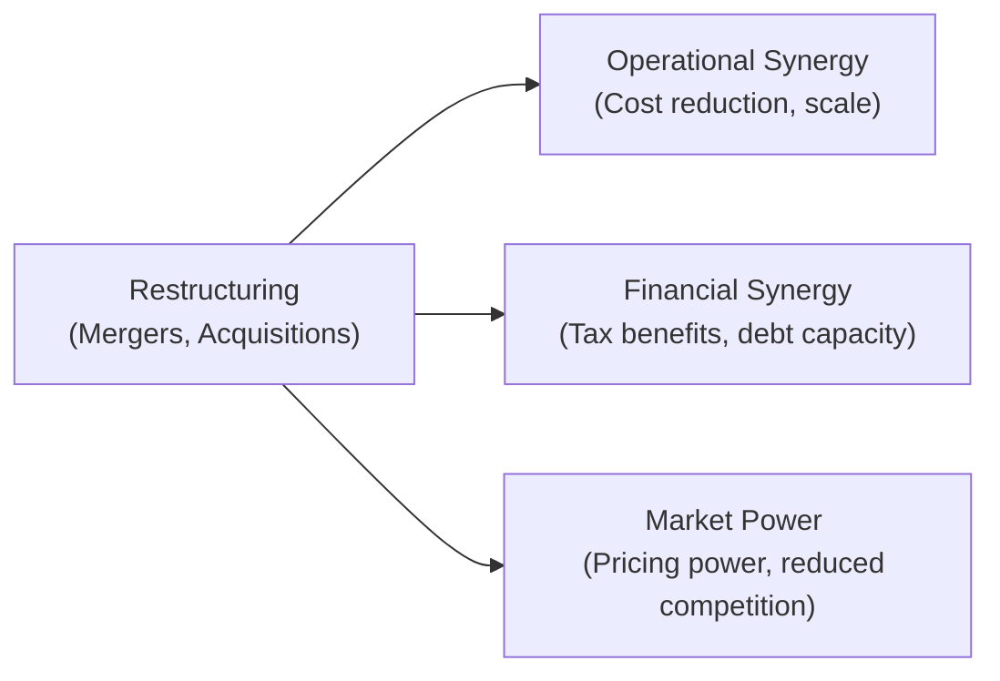

In many corporate restructurings—whether it’s a merger, acquisition, spin-off, or something else—there’s a single word that comes up time and time again: synergy. Executives love to talk about synergy (I can’t even count the times I’ve heard the phrase “we’ll be greater than the sum of our parts”). But what does synergy really mean in practice, and why do companies focus on it so heavily? Let’s peel back the layers of these strategic motives for restructuring, focusing on both the potential upsides and some of the pitfalls that catch even experienced dealmakers off guard.

## Understanding Synergies

At its core, synergy refers to the incremental value that results when two firms (or divisions) combine. In formal terms:

$$
\text{Synergy} = V_{A+B} - \bigl( V_A + V_B \bigr),
$$

where Vᴀ and Vᵦ are the standalone values of Firms A and B, respectively, and V₍A+B₎ is the combined value post-transaction. The idea is that, by joining forces, the firms can generate greater cash flows or reduce costs in ways they couldn’t achieve alone.

To visualize how restructuring can generate diverse forms of synergy, consider the following flowchart:

When evaluating a deal, you’re essentially testing the hypothesis that combining Company A and Company B will create more total value than they could separately. This simple formula, though, takes you right into the heart of synergy analysis: operational improvements, financial engineering, and bigger—sometimes bolder—market presence.

## Types of Synergies

### Operational Synergy

Operational synergy relates to the day-to-day running of the combined business. You might see:

• Economies of scale: Bulk purchasing can lower per-unit costs.  
• Economies of scope: Sharing distribution networks or complementary product lines.  
• Supply chain consolidation: Streamlined logistics, warehousing, or even shared R&D.  

For instance, imagine a consumer goods company acquiring a smaller competitor that uses a more efficient warehouse automation system. Incorporating that system across the acquiring company’s entire network could reduce overall handling costs and boost margins. But watch out: sometimes automation doesn’t scale as easily as planned, or the workforce resists changes, blunting synergy gains.

### Financial Synergy

Financial synergy often appears when two entities combine their financial structures or capitalize on new tax arrangements. Common pathways include:

• Enhanced debt capacity: A combined entity might boast stronger cash flows and collateral, thus borrowing at more favorable rates.  
• Tax benefits: If one firm has unused tax shields, the other might utilize those shields post-merger to reduce overall tax liability.  

Yet, over-optimistic assumptions can creep in here. A CFO might think, “We’ll merge, we’ll gain a higher credit rating, and suddenly our cost of debt will plummet.” Not so fast. Rating agencies look at your entire business risk profile after a restructuring. If your combined operations are too volatile or your integration plan seems risky, your actual cost of debt may go up, not down.

### Market Power

Sometimes, the motivation has little to do with streamlined processes or tax benefits and everything to do with commanding the market. For horizontal merging companies—say, two large players in the same industry—achieving greater market power can mean:

• Price influence: A bigger player can set or at least heavily influence pricing within its market.  
• High barriers to entry: Scaling up or combining capacity may discourage new entrants from challenging your space.  
• Greater bargaining power: Negotiating with suppliers or distributors from a position of strength.  

But regulators (like the U.S. Department of Justice or the European Commission) can clamp down hard if they think your new entity has too much pricing power. We’ve all seen deals blocked or drastically restructured under anti-trust legislation. So yes, market power is enticing, but it can also become your biggest headache.

Here’s a concise table summarizing the three main synergy categories:

| Synergy Type   | Examples                                             | Potential Risks                                       |
|----------------|------------------------------------------------------|-------------------------------------------------------|
| Operational    | Shared supply chain, combined R&D efforts            | Integration challenges, cultural misalignment         |
| Financial      | Consolidated tax benefits, improved access to capital| Overestimating tax synergies, higher overall leverage |
| Market Power   | Price leadership, negotiating strength with suppliers| Regulatory scrutiny, competitive backlash             |

## Overestimation Bias and Integration Risks

Let’s be honest: synergy projections are notorious for overestimation bias. There’s a lot of excitement in the M&A world. I once talked with an overly enthusiastic CFO who believed merging with a smaller competitor would revolutionize his company’s entire supply chain. “Just imagine the scale we’ll have!” he said. Well, it took them nearly two years just to integrate the purchasing systems, and the expected cost savings were never fully realized.

### Common Causes of Overestimation

• Underestimating integration time and costs  
• Ignoring cultural or managerial conflicts  
• Wishful thinking promoted by investment banks or internal deal champions  
• Insufficient due diligence into feasible revenue enhancements  

### Integration Risk Factors

• Cultural clash: Different corporate values, management philosophies, or employee incentive structures can derail synergy.  
• Systems incompatibility: Legacy IT systems can be expensive to harmonize, negating potential cost savings.  
• Regulatory environment: Anti-trust approvals can force asset divestitures, drastically altering synergy potential.  

Keeping a healthy skepticism helps. In real exam scenarios or real-life deals, watch for partial synergy realization or delayed synergy timetables. Candidates often see item sets that describe a timeline for synergy capturing—maybe only 50% in Year 1, 75% by Year 2, and so forth. Working through these partial synergy flows is crucial for accurate valuation.

## Evaluating Synergy Estimates

### Cost Overlaps

Start by asking: where can the two companies cut redundant costs without harming the business? For example, merging two finance departments might save on staff. But eliminating 30% of the workforce right away could also hamper internal controls or slow down day-to-day operations. A balanced approach is necessary.

### Revenue Enhancement

Sometimes synergy is more about revenue growth than saving money. If the target company has strong distribution channels in a region where your firm is weak, you can cross-sell your products using their channels. Or maybe they have a patented technology you can bundle into your existing offerings. That’s synergy. Yet, always verify that there’s genuine customer demand for these newly bundled products.

### Feasibility and Timelines

Prudent analysis involves sensitivity checks—best-case, base-case, and worst-case. If synergy takes twice as long to realize, or if some portion never materializes, how does that affect the overall value proposition? This step is incredibly important in exams: you’ll often see a question where synergy flows come in at 75% of the original forecast; you should know how to adjust valuations accordingly. 

## Market Power: Balancing Opportunity and Regulation

Market power is an especially interesting motive for restructuring. With greater size, the combined firm might be able to:

• Raise prices or at least stop competing on price.  
• Secure preferential deals from suppliers.  
• Reduce competition through consolidation.  

But remember, regulators don’t love a market dominated by one or two players who can dictate terms to customers. So big deals with large market shares might fail or require structural changes—like forced divestitures of overlapping segments—before you get the green light. In your exam, any mention of “potential monopoly” or “significant reduction in competition” is a signal to factor in regulatory risk and potential synergy haircut (reduced synergy benefits or forced asset sales).

## A Quick Example

Imagine Company X and Company Y, both mid-sized consumer electronics manufacturers. They decide to merge, hoping to:

• Combine manufacturing facilities → operational synergy.  
• Use Company X’s tax loss carryforwards and Company Y’s strong working capital → financial synergy.  
• Build a wide product portfolio to control a larger share of the market → market power synergy.  

Before finalizing the deal, each synergy must be valued and discounted to present value. Integration costs, new training expenses, and possible staff redundancies need factoring in. And, if they become the largest electronics player in the region, regulatory bodies might require them to divest certain product lines (reducing overall synergy). The final synergy is rarely all or nothing, so partial or delayed synergy outcomes are more realistic.

## Practical Insights for the Exam

• Whenever you see synergy estimates in an item set, look for disclaimers about integration risk or partial realization.  
• Be ready to incorporate synergy adjustments into conventional valuation models (e.g., discounted cash flow, net present value).  
• Keep an eye out for anti-trust references. If a vignette highlights potential anti-trust violations, synergy assumptions may be scaled back.  
• Watch for cultural or systems integration mentions. These details often foreshadow synergy shortfalls.  

It might feel obvious, but synergy can make or break a restructuring’s logic. In your analysis, a cool-headed approach—even a bit of healthy skepticism—goes a long way toward realistic valuation and a better exam answer.  

## References and Further Reading

• Dess, Gregory et al. Strategic Management: Creating Competitive Advantages (McGraw-Hill)  
• McKinsey on Finance: Achieving synergy targets post-merger:  
  https://www.mckinsey.com/business-functions/strategy-and-corporate-finance  

## Test Your Knowledge: Synergy and Market Power in Corporate Restructuring



### Which of the following best describes “financial synergy” in a merger?

- [ ] The potential for cost savings by consolidating production facilities.
- [x] The ability to lower the firm’s overall cost of capital and/or realize tax benefits.
- [ ] The firm’s capacity to raise prices due to reduced competition.
- [ ] The augmentation of distribution channels to increase revenues.

> **Explanation:** Financial synergy pertains to improvements in a firm’s capital structure, borrowing capacity, or tax position when two entities combine.

### A key reason why synergy estimates might be overstated is:

- [ ] Greater bargaining power against suppliers.
- [ ] Branding advantages in new markets.
- [x] Overoptimistic assumptions regarding integration speed or cost savings.
- [ ] Favorable foreign exchange rates during the consolidation process.

> **Explanation:** Companies frequently overestimate synergy advantages when they underestimate practical hurdles, such as integration complexity, cultural clash, or unanticipated costs.

### Market power as a motive for mergers primarily involves:

- [ ] Higher operating efficiency through technology upgrades.
- [ ] Consolidating R&D expenses to create new products.
- [ ] Improving capital structure by issuing new equity.
- [x] Increasing pricing influence and reducing competition in the market.

> **Explanation:** Market power refers to the ability of a merged entity to shape market conditions (prices, competition, etc.) by virtue of its larger market share or scale.

### When evaluating a merger, one of the initial steps in synergy analysis is to:

- [ ] Focus solely on corporate culture and ignore financial data. 
- [ ] Obtain anti-trust approval before conducting any synergy analysis. 
- [x] Conduct thorough due diligence to identify potential overlap in costs or capacities. 
- [ ] Assume full synergy realization by default.

> **Explanation:** Careful due diligence in areas of cost, revenue, and operational overlap is a critical first step in determining whether synergies are realistic.  

### In a CFA exam scenario, partial synergy realization typically means:

- [ ] The acquiring firm may collect synergy benefits before the merger is even announced.
- [ ] Synergy benefits are automatically increased in the first year after the merger.
- [x] A fraction of the projected synergy materializes per year, reflecting realistic integration timelines.
- [ ] Synergy gains are evenly allocated to shareholders via special dividends.

> **Explanation:** Partial synergy realization considers that not all synergy benefits appear immediately after the merger. Integration often proceeds in phases.

### Financial synergies might include an increased debt capacity primarily because:

- [x] The combined entity’s larger and more stable cash flows often justify more borrowing at lower rates.
- [ ] The combined entity can charge higher prices for its products.
- [ ] The acquiring firm always receives tax incentives from policy makers.
- [ ] The target firm’s shareholders prefer equity-based financing.

> **Explanation:** Many mergers enhance creditworthiness by diversifying revenue streams and making cash flows more predictable, increasing overall debt capacity.

### An example of operational synergy is:

- [x] Reducing redundant administrative functions between the two merged firms. 
- [ ] Raising product prices due to a lack of competition. 
- [x] Combining purchasing operations for bulk discounts on raw materials.
- [ ] Utilizing accumulated tax losses to offset future earnings.

> **Explanation:** Operational synergy focuses on tangible enhancements to day-to-day operations (cost savings, production efficiencies, etc.).  

### A cultural mismatch in an M&A deal:

- [x] Could delay or reduce the realization of promised synergies.
- [ ] Always invalidates the M&A deal, making it legally void.
- [ ] Is easy to fix by replacing entire departments.
- [ ] Has no impact on the firm’s financial performance.

> **Explanation:** Cultural integration is a common stumbling block. Misaligned corporate values or management styles can undermine cost savings and revenue growth objectives.

### Which factor would be most important in evaluating market power from a merger?

- [ ] The synergy formula used by the CFO.
- [x] The likelihood that regulators will view the combined entity as anti-competitive.
- [ ] The total employee headcount after the merger.
- [ ] The potential for cost overlaps in manufacturing plants.

> **Explanation:** Market power is fundamentally tied to how the combined entity influences competition and pricing. Regulatory scrutiny is critical when market share becomes too large.

### In the context of synergy calculations, “integration risk” implies:

- [x] True
- [ ] False

> **Explanation:** Integration risk refers to the potential difficulties of merging distinct corporate cultures, IT systems, or processes, which can delay or reduce the anticipated synergy benefits.


