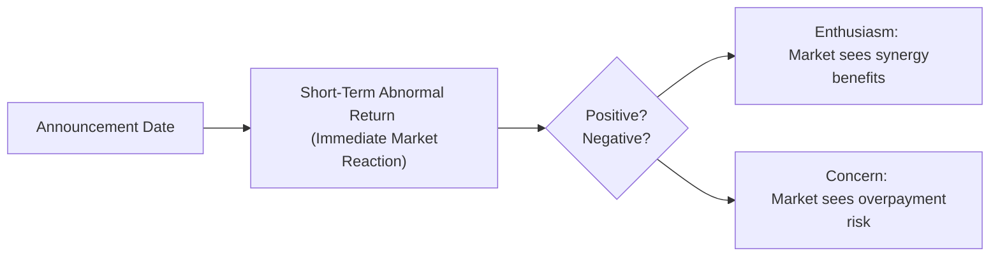

## Introduction and Key Concepts

Restructuring can be a dramatic moment in a company’s life. Whether it’s a merger, acquisition, spin-off, or major divestiture, announcements of restructuring often trigger swift and sometimes breathtaking changes in share price. You might have seen your favorite tech giant acquiring a drone-startup and wondered, “Wait, how does that move the market so much the next day?” Well, shareholders, analysts, and traders quickly update their perceptions about future cash flows, risk, and possible synergies—and the stock price can move accordingly.

But that’s really just part of the story. Over the long-term, these restructurings must deliver on their promises to add (or preserve) shareholder value. In this section, we dive deeper into the immediate market reactions, the post-deal follow-through, and how you can measure if value is truly created or, in some cases, unexpectedly destroyed.

## Immediate Market Reaction: Short-Term Effects

Market participants tend to be laser-focused on corporate announcements, especially deals that signal significant changes. When a company announces an acquisition, the stock’s immediate price shift—often observed over a day or two—can reveal a quick market consensus on whether the deal is good or not.

### Event Studies and Abnormal Returns

An event study is a classic technique to assess the immediate effect of a restructuring event on stock returns. We measure an “abnormal return,” which tells us how much the company’s stock price reaction differs from what we would have predicted given the overall market movement and the firm’s risk profile. If the abnormal return is positive, the market is presumably enthusiastic about the deal. If negative, investors might be thinking, “This merger doesn't look like a winner.”

Let’s illustrate this with a hypothetical:

• Company A announces it will acquire Company B on April 10th.  
• We pick an event window, say April 9th–April 11th, to capture any leak or immediate reaction.  
• Using a market model (like the CAPM or a multi-factor model), we estimate normal returns for Company A.  
• Any difference from that predicted normal return—after controlling for market movements—is the abnormal return.

The key takeaway: short-term abnormal returns can be a practical guide to understanding how the market feels about synergy potential, overpayment risk, or the acquiring firm’s strategic plan.



## Longer-Term Performance and Post-Merger Integration

### Beyond the Announcement

After the confetti has settled from the press release, the real test begins. Sometimes an announcement ignites short-lived excitement, but if synergy assumptions are unrealistic or an overpayment premium is too high, the next few quarters—or years—might disappoint. In other words, the short-term pop in share price can be overshadowed by post-deal performance.

• Management’s Track Record: A firm with a seasoned leadership team that has successfully integrated acquisitions before tends to command more trust.  
• Cultural Integration: If merging entities have incompatible corporate cultures, synergy realization can stall.  
• Strategic Fit: Are the operations complementary or just tangential? Do the acquired assets fit into the acquirer’s vision?

### Post-Deal Performance Gap

The difference between promised synergy and actually realized synergy is often referred to as the Post-Deal Performance Gap. If the deal looked great on an Excel sheet but the synergy never materializes, shareholders might punish the stock.

Consider a personal anecdote: I once worked at a consulting firm advising on a big automotive supplier’s acquisition. Everyone was so excited in the beginning—lots of talk about cross-selling, supply chain optimization, all that jazz. But a year later, operational alignment was a mess, managers from the acquired unit felt sidelined, synergy outcomes were half of what was promised, and the stock price basically sunk back to pre-announcement levels. Ouch.

## Measuring Value Creation

### Incremental Cash Flow Analysis

For many analysts, the gold standard for measuring value is to forecast incremental cash flows from the restructuring and discount them back at an appropriate cost of capital. In an acquisition scenario:

1. Estimate new revenue streams from cross-selling, expanded market share, or new product pipelines.  
2. Subtract incremental costs (e.g., integration expenses, added overhead).  
3. Project synergy net benefits across multiple years.  
4. Discount to present value using the combined firm’s weighted average cost of capital (WACC).

If the value of these incremental cash flows exceeds the price paid (plus integration costs), the transaction has the potential to create shareholder value—assuming, of course, that management can deliver.

### Valuation Multiples and Market Sentiment

Sometimes the market scoreboard is simpler. Analysts compare pre- and post-deal valuation multiples (like EV/EBITDA, P/E, or Price-to-Book) to see if the transaction has effectively boosted the company’s fundamental attractiveness. The idea is: if synergy translates into stronger cash generation, multiples might look more favorable—or at least align with management’s synergy claims.

### Using EVA and CFROI

• EVA (Economic Value Added) is a measure of economic profit. You compute it as:

  
  \text{EVA} = \text{NOPAT} - (\text{WACC} \times \text{Invested Capital})
  

  If EVA goes up after the restructuring, it can be a sign that the firm is surpassing its capital costs, thus creating genuine economic value.

• CFROI (Cash Flow Return on Investment) attempts to calculate the firm’s internal rate of return on invested capital. Higher post-deal CFROI relative to the cost of capital typically indicates that the restructuring is paying off.

### Python Example: Quick CFROI Calculation

Below is a short, simplified Python snippet that calculates a hypothetical CFROI for a combined firm, ignoring advanced complexities like inflation adjustments.

```python
invested_capital = 500_000_000  # in currency units
annual_cash_flow = 70_000_000   # expected each year for 5 years
cost_of_capital = 0.09          # 9%

import numpy as np

years = 5
cf = [annual_cash_flow] * years

possible_rates = [r/100 for r in range(5,20)]  # 5% to 19% range

def npv(rate, cash_flows, initial_inv):
    return sum([cf_i / ((1+rate)**(t+1)) for t, cf_i in enumerate(cash_flows)]) - initial_inv

best_rate = 0
for r in possible_rates:
    if npv(r, cf, invested_capital) > 0 and npv(r+0.01, cf, invested_capital) < 0:
        best_rate = r
        break

cfroi_estimate = best_rate
print(f"Estimated CFROI: {cfroi_estimate*100:.2f}%")

if cfroi_estimate > cost_of_capital:
    print("CFROI exceeds cost of capital—potential for value creation.")
else:
    print("CFROI is below cost of capital—may destroy value.")
```

In a real-world exam setting, you definitely won’t be coding in Python, but you might see a vignette that references or implicitly calculates CFROI. Understanding that CFROI can exceed or fall below the WACC, and the implications of each, is critical. 

## Market Perception and the Risk of Overpayment

### Overpayment Premiums

When buyers get caught up in “acquisition fever,” they might bid prices to sky-high levels—well above the fair market value of the target. In that case, any synergy advantage might be overshadowed by the inflated price tag. It’s like paying $1,000 for a plane ticket that you could’ve gotten for $600: your trip might still be fun, but your overall cost is higher and your net benefit is lower.

### Goodwill and Intangible Asset Revaluations

If an acquirer pays a hefty premium, the difference between the purchase price and the net fair value of the target’s assets becomes Goodwill on the balance sheet. Goodwill can be massive, and a future impairment (if the acquired business underperforms) might signal to investors that management initially overpaid.

In exam vignettes, pay special attention to footnotes describing intangible asset revaluations and synergy assumptions. If synergy fails, the company might record an impairment charge, eroding shareholder equity and possibly leading to negative abnormal returns down the road.

## Importance of Footnotes, Disclaimers, and Synergy Assumptions

Be on the lookout for disclaimers about how synergy estimates were derived. Vignette questions might sneak in lines such as “Assume synergy will take five years to materialize” or “Integration costs will be one-time only—but there are no details on cultural integration challenges.” Those are signals that synergy realization may be at risk, and that your final evaluation of whether shareholder value is created might be less optimistic than the glossy pitch deck suggests.

## Common Pitfalls

• Ignoring Integration Complexity: Fancy synergy estimates don’t automatically translate into real cash flow improvements.  
• Focusing Only on the Short-Term: A big stock price jump at announcement can fade if the restructuring isn’t executed properly.  
• Underestimating Overpayment Risk: Be mindful of how easily the premium can consume synergy gains.  
• Not Reading Footnotes: In the exam, a hidden disclaimer might indicate intangible revaluation or synergy that’s already partially captured in the target’s forecast, limiting incremental benefits.

## Practical Diagram: The Restructuring Value Roadmap

```mermaid
flowchart LR
    SP["Short-Term Stock Price Reaction"] --> EV["Event Study <br/> (Abnormal Return)"]
    EV --> MergedFirm["Merged/Restructured Firm"]
    MergedFirm --> Integration["Integration Framework: <br/> Cultural + Operational"]
    Integration --> Synergy["Synergies Realized or <br/> Missed Targets"]
    Synergy --> CF["Incremental Cash Flows"]
    CF --> EVA_CFROI["EVA / CFROI <br/> Performance Metrics"]
    EVA_CFROI --> SV["Shareholder Value <br/> (Sustained)"]
```



## Final Thoughts

Restructuring can be a game-changer for a firm’s outlook, but it carries plenty of risk. Analysts, therefore, must carefully evaluate short-term market reactions, synergy plausibility, cultural fit, and whether the transaction meets or exceeds the acquirer’s cost of capital. In the CFA exam context, be ready to see item sets that combine these hot topics: you might be analyzing short-term abnormal returns, synergy calculations, intangible asset footnotes, and intangible asset impairments all in one go.

Always circle back to the fundamental question: does the restructuring genuinely add value when you tally all the costs, the new opportunities, and the synergies? If yes, the shareholders stand to gain. If no, the stock price in the long term might tell a less rosy story.

## References and Further Insights

• CFA Institute Level II Curriculum – Corporate Issuers: Payout Policy and Restructuring Topics  
• Harvard Business Review articles on M&A integration success factors  
• Academic journal articles detailing event studies on mergers and spin-offs  
• Company Filings (10-K, Annual Statements) that show synergy assumptions post-acquisition  

## Test Your Knowledge: Mergers, Acquisitions, and Value Creation



### A corporate event study is primarily used to:
- [ ] Estimate changes in a company’s fundamental value through discounted cash flow.  
- [x] Observe abnormal returns around a specific event date to gauge market reaction.  
- [ ] Calculate goodwill from a recent acquisition.  
- [ ] Determine an acquirer’s WACC pre-deal.  

> **Explanation:** Event studies focus on short-term market reactions, measuring abnormal returns around a key date to see how the market perceives the event.

### Which of the following best explains why overpayment can destroy shareholder value?
- [ ] It reduces reported operating income but not net income.  
- [ ] It leaves the acquirer with intangible assets on the balance sheet that are never amortized.  
- [x] Paying above fair value means synergy benefits may not cover the premium, leading to lower net benefits.  
- [ ] It forces the acquirer to delist from major exchanges.  

> **Explanation:** Overpaying means the acquirer’s net gain after synergy might be insufficient to offset the premium, ultimately lowering the combined firm’s economic profitability.

### When measuring post-restructuring performance using EVA, a positive EVA means:
- [x] The restructured firm is generating profits above and beyond its cost of capital.  
- [ ] The firm’s stock price will always rise in the short term.  
- [ ] Goodwill impairment is likely in the near term.  
- [ ] The target firm increases synergy assumptions in footnotes.  

> **Explanation:** EVA is positive if net operating profit after tax (NOPAT) exceeds the cost of capital on invested funds, indicating real economic value creation.

### A Post-Deal Performance Gap occurs when:
- [ ] Synergy benefits exceed the premium paid to acquire the target.  
- [ ] Goodwill is reduced on the acquirer’s balance sheet for tax purposes.  
- [x] Announced synergies are not fully realized in actual performance outcomes.  
- [ ] Both the acquirer and target trade below book value immediately after the deal.  

> **Explanation:** This gap is the mismatch between what management promised (announced synergy) and the synergy actually realized post-integration.

### What might a negative abnormal return at merger announcement indicate?
- [ ] The market expects the acquirer’s synergy assumptions to be easily met.  
- [x] Investors believe the merger terms could be unfavorable (e.g., overpayment).  
- [ ] Management has a strong track record of integrating past deals.  
- [ ] The deal is purely funded by equity, so no risk is taken.  

> **Explanation:** A negative announcement reaction often signals investor concern over price, synergy feasibility, or overall deal rationale.

### CFROI is best described as:
- [ ] A method for auditing intangible assets held on the acquirer’s balance sheet.  
- [ ] A ratio comparing book value to market value.  
- [x] A measure of the firm’s internal rate of return on its invested capital based on cash flows.  
- [ ] A process for calculating synergy multiples.  

> **Explanation:** CFROI gauges how effectively the firm’s investments generate cash flows, comparing these returns to the firm’s cost of capital.

### In a short-term event window study, a positive cumulative abnormal return for the acquiring company often implies:
- [x] The market perceives potential synergies as feasible or sees a strategic advantage.  
- [ ] The target’s overpayment premium is negligible.  
- [x] Investors expect improved cash flow from the combined entity.  
- [ ] Market participants are unaware of integration costs.  

> **Explanation:** A positive abnormal return suggests investors see value in the deal—either through cost efficiencies, revenue enhancements, or a broader strategic fit.

### If the acquirer recognizes significant goodwill on its balance sheet:
- [ ] It means no premium was paid.  
- [x] The purchase price exceeded the fair value of the identifiable net assets.  
- [ ] The synergy is automatically realized.  
- [ ] The cost of capital calculation is immediately reduced.  

> **Explanation:** Goodwill represents the excess purchase price after allocating the acquisition cost to the target’s net assets, typically reflecting intangible benefits like brand equity or synergy potential.

### A key caution when analyzing synergy projections in exam vignettes is:
- [ ] They are typically understated to manage market expectations.  
- [ ] Synergy is never included in the final valuation.  
- [x] Management’s forecasts may be optimistic, and cultural or operational obstacles can erode potential gains.  
- [ ] Synergies always lead to a dividend discount model miscalculation.  

> **Explanation:** Realizing synergy can be challenging, so reading footnotes for disclaimers on integration complexity is essential.

### True or False: A successful restructuring guarantees sustained positive abnormal returns over the entire long term.
- [x] True  
- [ ] False  

> **Explanation:** Actually, this is somewhat nuanced. Even well-executed restructurings can experience market fluctuations. However, from an exam perspective, if synergy and operational integration succeed, the firm often enjoys improved cash flows and shareholder value, which may be reflected in sustained abnormal returns. Keep in mind real-world scenarios can vary.


