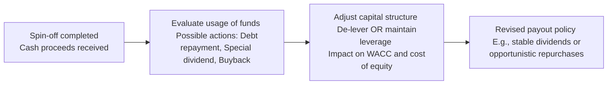

## Introduction and Overview

Restructuring transactions—whether they’re mergers, spin-offs, divestitures, or leveraged recapitalizations—don’t simply alter the shape of an organization. They also transform how that organization rewards its shareholders and manages its financing strategy. More specifically, changes in capital structure brought about by acquisitions, spin-offs, or debt recapitalizations can profoundly influence a firm’s ability (and willingness) to pay dividends or repurchase its shares. Because corporate payout policies often hinge on a delicate balance of cash flows, debt covenants, and strategic priorities, any shift in the underlying balance sheet can shake that equilibrium.

I once had a friend (he was knee-deep in M&A analysis) who was thrilled about an acquisition’s synergy potential—only to discover that the post-deal debt covenants practically locked down the company’s payout capacity. So trust me, it’s important to check the fine print in any newly issued debt agreements or revised capital structure table.

In this section, we’ll analyze the different facets of restructuring and see how they can impact a company’s dividends and share repurchases. We’ll also connect these changes to cost of equity, WACC, and the overall valuation implications. If you’re reading vignettes on the CFA exam, keep an eye out for subtle references to newly established debt or synergy savings. Those details can make or break your analysis of a firm’s post-restructuring payout approach.

## Funding an Acquisition and the Debt-to-Equity Mix

When a company pursues an acquisition (perhaps from Chapter 9.1, you’ve seen the variety of M&A strategies), it needs to fund that purchase. The funding choice—cash, stock, or a mix—directly influences capital structure. If management decides to fund most of the deal with debt, the result might be a significant jump in the leverage ratio (Debt-to-Equity, or D/E). This increased leverage can reduce future financial flexibility: higher interest payments means less free cash flow for dividends or share repurchases. That said, if the acquisition generates stable and robust cash flows (thanks, synergy!), management may still maintain its existing payout policy.

### How It Plays Out
• More debt financing → higher debt service obligations → less near-term free cash flow for shareholder distributions.  
• Possible changes in debt covenants → constraints on the magnitude or consistency of dividends and buybacks.  
• Shift in shareholders’ expectations about risk → higher cost of equity, potentially shrinking the scope for future payouts.

Keep in mind that if a firm’s credit rating is negatively affected by higher leverage, its overall cost of capital might also rise. Higher financing costs could squeeze the dividend budget further. On the flipside, if synergies from the acquisition prove real (cost savings, cross-selling opportunities, etc.), the additional cash flows might later counterbalance some of the higher debt burden.

## Post-Deal Capital Structure Changes

After the dust of a merger or acquisition settles, the newly combined entity often refinances its existing debt or issues fresh debt under a consolidated balance sheet. Lenders will require updated, sometimes more restrictive, covenants. Even if the net leverage ratio remains moderate, these new covenants might shape the payout policy for years.

### Debt Covenants and Shareholder Distributions
Debt covenants are legal clauses designed to protect lenders from excessive risk-taking or cash outflows by the borrowing firm. Typical examples include:
• Limiting dividends to a certain portion of net income or retained earnings.  
• Restrictive stipulations on share buybacks (e.g., total buybacks cannot exceed a specific threshold or ratio).  
• Maintenance of certain leverage or coverage ratios.  

Violating these covenants can result in hefty penalties or even debt acceleration, so companies are generally prudent about distributing too much cash back to shareholders if it means approaching a covenant breach. As a result, managers may switch from steady dividend policies to more flexible tools such as open-market share repurchases—so they can dial back, or accelerate, payouts depending on available cash and covenant headroom.

### Example: Acquisition Followed by Refinancing
Imagine CandyCo, a candy manufacturer, acquires SweetTreats, a smaller competitor. CandyCo funds the deal with a large bank loan. Post-merger, CandyCo refinances the combined debt at a higher interest rate because of the bigger total borrowing. The new debt agreement has a debt-to-EBITDA cap that triggers restrictions on share repurchases if CandyCo’s ratio breaches a certain threshold. This means CandyCo’s prior plan for a large open-market buyback might get shelved—at least until they’ve paid down enough principal to keep the ratio comfortably below the cap. Alternatively, CandyCo might tweak its payout mix and pay a token dividend to maintain investor goodwill without violating its covenants.

## Spin-Offs, Divestitures, and the Cash Bump

While acquisitions often increase leverage, spin-offs or divestitures can do the opposite. Selling off a division typically frees up cash, and if that division was a drag on profitability, the remaining business might also become more efficient. Management might choose to:

• Pay a special dividend: A one-time, large sum to shareholders.  
• Initiate or expand a share buyback program.  
• Repay existing debt to reduce leverage.  
• Reinvest in new projects or acquisitions.

### Impact on Capital Structure
Divestitures can lighten a company’s asset base, potentially lowering the scale of its operations. If the firm formerly carried debt that was sized to the old business, it may choose to repay or refinance it. By using proceeds to de-lever, the company can improve its interest coverage, possibly upgrading its credit rating and lowering future borrowing costs.

### Example: Spin-Off with Proceeds for Debt and Dividends
Let’s say GadgetCorp decides to spin off its underperforming Home Appliance unit to focus on its popular smartphone business. The spin-off transaction nets GadgetCorp $500 million. Management earmarks $200 million to repay outstanding bonds, $100 million for a strategic R&D push, and $200 million for a special dividend. Shareholders get an immediate payout, the bondholders appreciate the partial debt repayment, and the smartphone strategy receives new capital to drive growth. Not a bad trifecta.

It’s crucial to remember that in exam scenarios, spin-offs can also lead to a re-rating of the parent company’s equity. If the spin-off results in a stronger core, the market may reward the parent with an improved valuation multiple, further affecting the company’s cost of equity.

## Shifts Between Dividends and Share Repurchases

Some restructurings put pressure on a company to move away from a “stable dividend” approach. For instance, if management anticipates near-term volatility in free cash flow or wants to avoid an embarrassing dividend cut, they might adopt more flexible payout vehicles such as stock buybacks. Conversely, if synergy savings are large and fairly predictable, the company might confidently boost its dividend distribution.

### Dividend Stability vs. Opportunistic Buybacks
• Stable Dividends: Signal confidence and promise consistent returns. But they can also backfire if the firm fails to fund them long-term.  
• Opportunistic Repurchases: Provide flexibility; management can time repurchases based on market conditions, or throttle them back if cash gets tight.  

In many past exam vignettes, an under-the-radar sign of a corporate restructuring might be a subtle mention of “board approval for an expanded buyback authorization.” Candidates often need to parse whether that plan is truly sustainable, or if new debt covenants will hamper it.

### Synergy Savings and Potential Payout Increases
Let’s not forget synergy—arguably the “holy grail” in many M&A deals. Synergy savings come from cost efficiencies (like consolidated operations) or revenue enhancements (like cross-selling). These extra cash flows can simultaneously fund higher payouts and growth investments. In certain deals, synergy estimates are overly optimistic. So, if synergy is uncertain, management may wait to see actual benefits before raising the dividend or launching a pricey buyback.

## Linking Leverage, Cost of Equity, and WACC

Once restructuring changes a firm’s debt level, it also alters the firm’s cost of debt and potentially the cost of equity. From a simplified perspective:

KaTeX formula for Weighted Average Cost of Capital (WACC):


\text{WACC} = \left(\frac{D}{D+E}\right)r_d(1 - T) + \left(\frac{E}{D+E}\right)r_e


Where:  
• D = market value of debt  
• E = market value of equity  
• \\( r_d \\) = cost of debt  
• \\( r_e \\) = cost of equity  
• T = marginal tax rate  

### Greater Leverage, Higher Risk
A big jump in debt (D) can make the equity portion (E) riskier, thus pushing \\( r_e \\) (cost of equity) upward. The net effect on WACC depends on how large the debt portion becomes and whether the after-tax cost of debt is sufficiently low to offset the higher cost of equity. In some moderate-leverage scenarios, WACC can decrease. In more extreme leverage scenarios, overall risk escalates so significantly that the higher cost of equity and possible jump in \\( r_d \\) overshadow any tax benefits.

### Impact on Valuation and Payout
If the revised capital structure results in an overall higher WACC, it often negatively impacts the discounted value of future cash flows. As valuations grow more sensitive to small changes in WACC, management may adopt a conservative stance on payouts to keep enough cushion for any market gyrations. Conversely, if synergy gains are large enough to overpower the higher cost of capital, the net effect might still be an upward shift in valuation (and possibly bigger payouts).

## Announcements, Updated Capital Strategies, and Market Reaction

When a restructuring plan is announced, companies often combine the news with an outline of how they’ll manage future capital. Perhaps they’ll emphasize that synergy or asset-sale proceeds will fund a substantial buyback or special dividend. The stock market’s reaction can be swift and telling. If investors believe the payout changes are well-founded, the stock might get a nice pop. If they suspect the synergy assumptions or capital structure is shaky, the stock could sink.

### Practical Tips for Exam Vignettes
1. Look for language about new or modified debt covenants.  
2. Check references to synergy forecasts; see if the synergy timeline or reliability is questioned in the text.  
3. Pay attention to ratio changes (e.g., interest coverage or debt-to-EBITDA).  
4. See if board approvals for dividends or repurchases are overshadowed by the restructuring’s constraints.  
5. Evaluate the effect on WACC or discount rate if leverage changes significantly.  
6. Confirm whether the firm’s new payout policy is stable or simply a one-off courtesy to appease shareholders.

## Visualizing Restructuring Cash Flows

Below is a simple Mermaid flowchart illustrating how a spin-off might redirect funds:

In many real-world scenarios, these decisions happen concurrently and involve multiple stakeholder concerns. But from the CFA exam’s perspective, remember that each arrow potentially changes the firm’s capital structure and its future distribution capacity.

## Glossary (Key Terms)

• Leveraged Recapitalization: A strategy of significantly increasing debt to modify the capital structure—often done to finance share buybacks or issue a large special dividend to existing shareholders.  
• Debt Covenant Constraints: Legal restrictions in a debt contract that can limit dividend payouts or buybacks, ensuring lenders get priority on cash flows.  
• Pro Forma Capital Structure: The projected capital structure after a merger, spin-off, or other transaction, often used in modeling to estimate future leverage ratios and coverage metrics.  
• Cost of Equity: The return that shareholders require, influenced by business and financial risk. Post-restructuring leverage changes can raise or lower it.  
• Payout Capacity: The total resources a firm can safely allocate to dividends and buybacks without jeopardizing liquidity or violating covenants.  
• Financial Flexibility: A measure of how easily a company can adjust its capital or access new financing. Large debt obligations and covenants reduce flexibility.  
• Special Dividend: A one-time, non-recurring distribution, typically to share proceeds from a significant asset sale or spin-off.  
• Buyback Authorization: Board approval to repurchase shares, often used instead of, or in addition to, dividends. Can be a flexible tool for distributing cash.

## Concluding Thoughts

Restructuring is about more than just reorganizing assets and operations; it involves recalibrating how the firm rewards its shareholders. A post-deal capital structure might open the door to bigger payouts—or slam it shut with restrictive covenants and sizable debt obligations. Either way, a company’s cost of equity and WACC are tied up in the leverage choices made during restructuring, making the synergy question all the more urgent. When synergy flows are robust and stable, management can maintain or even increase dividends; if synergy payments are uncertain, the firm may rely on share repurchases or short-term special dividends to balance shareholder expectations with financial prudence.

On the CFA exam, keep your eyes peeled for the capital structure storyline. You might see a scenario describing how an M&A financing arrangement changes the entire payout picture or how spin-off proceeds open the door to a big share buyback. Remember the golden rule: capital structure shapes payout policy, and synergy (or the lack thereof) drives how comfortably a firm can distribute cash back to shareholders.

## Final Exam Tips

• Always verify whether post-deal leverage will hamper ongoing payout capacity.  
• Watch for newly introduced or relaxed debt covenants; they can drastically change dividend and buyback plans.  
• Check synergy assumptions—if synergy is shaky, the firm may prefer flexible repurchases.  
• Develop a quick mental or written calculation of the new WACC to see if the cost of capital might hamper future distributions.  
• Practice reading the footnotes: that’s where hidden references to covenant triggers or special dividends sometimes lurk.

## References and Further Reading

• Corporate Finance: A Valuation Approach, Benninga & Czaczkes (McGraw-Hill).  
• CFA Institute Level II Curriculum: Corporate Issuers, sections covering capital structure adjustments and payout decisions.  
• The Handbook of Mergers and Acquisitions, edited by David Faulkner et al. (Oxford University Press).  

## Test Your Knowledge: Restructuring’s Impact on Payout and Capital Structure



### Which of the following accurately describes how a leveraged acquisition can affect a firm’s dividend policy?

- [x] The added debt service payments often reduce available cash for dividends. 
- [ ] The dividend payments typically increase immediately after the transaction. 
- [ ] Dividends remain unaffected because acquisitions are usually financed solely through retained earnings. 
- [ ] Dividend payments are suspended indefinitely at the time of a leveraged deal.

> **Explanation:** When a company collects substantial debt to fund an acquisition, it faces higher interest payments and potentially restrictive covenants, leaving less free cash to distribute as dividends.

### What is the primary reason a firm might shift from a stable dividend policy to an opportunistic share repurchase program post-restructuring?

- [x] Share repurchases allow more flexibility to adjust payouts when cash flows are unpredictable. 
- [ ] Long-term shareholders prefer stable dividends over repurchases. 
- [ ] Share repurchases are always cheaper than paying dividends. 
- [ ] Debt covenants frequently mandate opportunistic share repurchases.

> **Explanation:** Opportunistic share repurchases can be dialed up or down without sending negative signals to investors, whereas reducing a long-standing dividend can alarm the market.

### How do debt covenants typically influence a company’s share buyback decisions?

- [ ] They usually encourage unlimited share buybacks to maintain share price. 
- [x] They often restrict the maximum amount or frequency of buybacks to preserve lender protections. 
- [ ] They have no influence on share buybacks. 
- [ ] They only apply to dividend policy, not buybacks.

> **Explanation:** Covenants exist to protect lenders by ensuring sufficient cash flow is retained by the company. They often restrict share repurchases, especially if leverage or coverage ratios exceed set limits.

### A spin-off generates a large lump sum of cash. Which of the following is a potential effect of using most of the proceeds to fund a special dividend?

- [x] Reduced future cash available for debt repayment or reinvestment. 
- [ ] Immediate reduction in leverage. 
- [ ] A guaranteed credit rating upgrade. 
- [ ] Elimination of all outstanding debt covenants.

> **Explanation:** Using proceeds to pay a large special dividend boosts immediate shareholder returns but also depletes cash that could have paid down debt or funded investment, leaving the capital structure unchanged or potentially weaker.

### In a post-merger scenario with significant cost synergies, how might this synergy most likely influence dividend payments?

- [x] If synergy benefits are predictable, management may increase dividends confidently. 
- [ ] Firms will typically discontinue dividends to focus on synergy reinvestment. 
- [ ] Firms will always divert synergy savings to share buybacks, not dividends. 
- [ ] Cost synergies rarely impact dividend policy.

> **Explanation:** Reliable synergy savings translate into higher free cash flow, which can support or increase dividend distributions.

### A “pro forma capital structure” is best described as:

- [x] A projected balance sheet showing how the firm’s debts and equity will look after a planned transaction. 
- [ ] A historical record of how the firm’s capital structure has evolved. 
- [ ] An agreement with bondholders about dividend increases. 
- [ ] A schedule of shareholders who qualify for upcoming dividend payments.

> **Explanation:** Pro forma capital structures reflect the firm’s anticipated leverage ratios, shareholder equity, etc., after the completion of a restructuring event.

### Why might a high post-restructuring debt-to-equity ratio increase the cost of equity?

- [x] Greater financial risk leads equity holders to demand higher returns. 
- [ ] The cost of equity is always fixed regardless of leverage. 
- [ ] Firms with high debt automatically have a lower cost of capital. 
- [ ] Dividend yield decreases in high-debt scenarios, so cost of equity is unaffected.

> **Explanation:** More leverage means higher financial risk, so equity investors expect greater returns to compensate for the increased volatility and default risk.

### When might a firm decide to issue a “special dividend” rather than adopt a permanently higher regular dividend?

- [x] When the cash influx is non-recurring, such as from a divestiture. 
- [ ] When the firm wants to signal a permanent shift in payout policy. 
- [ ] When the firm is attempting to reduce its shareholder base. 
- [ ] When debt covenants specifically require a large ongoing dividend.

> **Explanation:** Special dividends are generally one-off events prompted by a sudden, non-recurring increase in cash flow (like a large spin-off sale), so they’re not incorporated into a permanent dividend policy.

### Which component of the WACC formula might decline if newly combined operations after a merger lead to more stable overall cash flows?

- [ ] (D / (D+E)) 
- [x] r_d (cost of debt) 
- [ ] (E / (D+E)) 
- [ ] T (marginal tax rate)

> **Explanation:** Greater stability and lower perceived risk can reduce the firm’s cost of debt because lenders may be willing to offer more favorable interest rates.

### True or False: A firm with high synergy savings and low leverage is likely to have minimal restrictions on paying dividends or repurchasing shares.

- [x] True
- [ ] False

> **Explanation:** High synergy savings increase free cash flow, while low leverage (and thus fewer restrictive debt covenants) reduces the risk associated with sending cash to shareholders, leaving more freedom in payout decisions.


