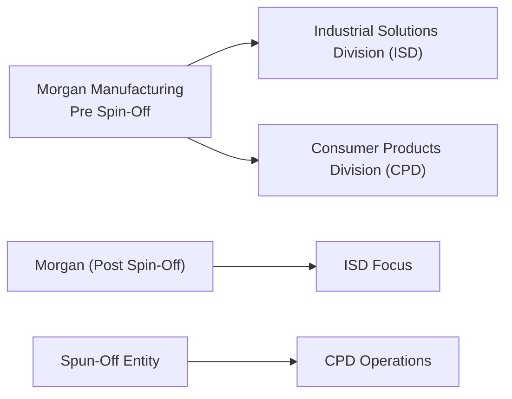

## Introduction and Context

So, let's say you’re sitting in your favorite coffee shop (I know I always like to grab a latte while reviewing finance problems) and you come across a spin-off scenario in a CFA vignette. You might think: “Um, how hard can it be? A company is just peeling off a division, right?” But then you start seeing terms like synergy overestimation, footnoted separation costs, abnormal returns, and partial synergy assumptions. Before you know it, you’re knee-deep in a swirl of potential pitfalls.

In this section, we’ll walk through a representative spin-off scenario step by step. Our aim: help you practice reading between the lines, catching the subtle hints about synergy claims, capital structure changes, and hidden costs. We’ll also put these details into the context of shareholder value and post-spin-off capital structure. By the end, you should be able to dissect these kinds of item sets with diligence. 

## Short Vignette: Morgan Manufacturing Spin-Off

Below is a simplified scenario that mirrors the structure of a typical spin-off vignette you might see in the CFA® exam. Let’s meet Morgan Manufacturing, a medium-sized industrial company with a historically profitable Consumer Products division (CPD), plus a core Industrial Solutions division (ISD). Management believes the CPD is diverting resources away from their more lucrative industrial portfolio. 

• The company announces plans to spin off the CPD into a standalone public entity.  
• Management estimates that, by separating from low-margin consumer goods, Morgan Manufacturing’s industrial business could focus on high-growth B2B clients, claiming “efficiency and stronger synergy” (approximately US$40 million over the next two years).  
• The footnotes hint that about half of these synergy gains are not guaranteed due to uncertain realignment costs, new marketing expenses, and the possibility of losing some shared services.  
• Morgan’s CFO also suggests that some debt will be transferred to the spun-off entity, potentially improving Morgan’s overall debt-to-equity ratio but leaving the CPD with a slightly higher leverage profile than it had pre-transaction.

### Financial Data Highlights

• Current share price for Morgan Manufacturing (pre-announcement): US$48.00.  
• The board expects that the spin-off might raise the combined (Morgan + new CPD shares) “implied equity value” by ~ US$4.00 per share if 100% of the synergy is realized.  
• Selling, general, and administrative (SG&A) synergy is forecast at US$40 million in total, but CFO footnotes reveal that only US$20 million is considered “likely achievable” in the first 12 months.  
• One-time spin-off transaction costs are estimated at US$15 million, with an additional US$5 million in facility relocation and rebranding costs for the CPD. These costs will primarily be borne by the new consumer products entity post-spin-off.  
• The event date for the spin-off announcement is June 1.  
• Analysts project an abnormal return of +6% on the event date if the synergy amounts are deemed credible by the market.  
• Post-spin-off capital structure plan: Morgan’s total debt set to decrease from US$400 million to US$300 million, while the new CPD entity will carry US$100 million of that original debt load.  

Now, let’s visualize the pre- and post-spin-off structure:

Management is optimistic but acknowledges that if synergy estimates fall short, the short-term share price boost may be muted. There’s also a fleeting mention of anti-trust concerns since the ISD deals with commercial clients, but the CFO says, “We foresee minimal issues.” Still, that detail can signal added risk or at least potential regulatory scrutiny overhead.

## Spin-Off Restructuring Analysis

### Identifying the Restructuring Type

Whenever you see language about “carving out” a division and creating a separate publicly traded entity, it’s typically a spin-off. Key phrases might be “standalone,” “new shares distributed to existing shareholders,” or “divestiture of operating segment.”

### Shareholder Value Computation

One of the main tasks in restructuring vignettes is to figure out whether the move adds or subtracts immediate shareholder value. The synergy estimate is often your big clue. If synergy is overstated, you might see more modest share gains—sometimes even an overall price decline if the market doubts management’s projections.

A typical approach to gauge immediate share price changes:

1. If 100% synergy were realized, management claims an added value of US$4.00 per share.  
2. Footnotes reveal only half is credible in the near term. So the “realistic” synergy might be ~ US$2.00 per share.  
3. Subtract any direct spin-off costs or new capital expenditures. Some of those costs can reduce net synergy.  
4. Pay attention to intangible impacts like brand recognition or lost cross-selling.  

### Capital Structure After the Spin-Off

With part of the debt being saddled onto the spun-off entity, Morgan’s interest coverage ratio might improve, though the CPD’s coverage could worsen. If the CPD was the biggest generator of stable consumer-brand cash flow, that might add risk to both sides:

• Morgan’s new cost of capital might edge down due to improved focus and, presumably, better growth prospects, but watch out for lost revenues from the CPD.  
• The spun-off CPD might need to raise fresh capital if it doesn’t have the stable financial metrics to go it alone, or it might face a higher interest rate on any future debt.

### Synergy Claims vs. Feasibility

If you see references to “realignment synergy” or “cost-savings synergy,” make sure to verify if footnotes mention partial achievements or intangible costs:

• Overestimation Red Flags: synergy numbers that are vague or not validated by historical integration efforts.  
• Integration or Separation Costs: “implicit costs” or “transition fees” can eat into synergy gains, especially in year one.  
• Special Dividends: If Morgan decides to pay a special dividend using spin-off proceeds, it can affect the capital structure or future free cash flows.  

### Capital Budgeting & Free Cash Flow Implications

After a spin-off, both entities might re-evaluate their capital budgeting. If projected free cash flow in the CPD was historically used to support the entire company’s capital expenditure, the spin-off could force the newly separate businesses to adjust expansions, trim R&D, or reconsider big projects. Don’t forget that partial synergy might reduce overall operating costs, enabling more robust CAPEX in the industrial entity or the CPD—but only if the synergy is real.

### Abnormal Return Analysis

Event studies measure abnormal returns by comparing actual returns to expected returns (e.g., using CAPM or a market model). If you see that the stock jumped 6% on the morning of the spin-off announcement, and the expected return was 1%, then the abnormal return is +5%. This jump might reflect the market’s confidence in synergy claims or optimism about the newly “unlocked” value.

## Potential Pitfalls and Overestimation Warnings

• **Management Over-Optimism**: CFOs and CEOs might highlight the best-case synergy scenario.  
• **Regulatory or Anti-Trust Hurdles**: Even small mentions in the footnotes about anti-competitive issues, especially if the business is going from a diversified to a more concentrated structure.  
• **Undisclosed Liabilities**: Sometimes pension obligations or environmental cleanup costs get pinned on one entity.  
• **Leverage Surprises**: If the spun-off division is more leveraged than expected, it can hamper near-term cash flows and reduce the combined share value.  

## Key Terms and Concepts (Glossary)

Spin-Off Scenario  
: A corporate restructuring in which a parent company distributes shares of a subsidiary to its existing shareholders, forming a brand-new publicly traded company.

Value Drivers  
: Factors that significantly impact a firm’s or project’s valuation. In spin-offs, synergy realization and cost reduction are common drivers.

Abnormal Return Computation  
: The difference between the actual return of a security and its expected return (often from a market model). Used to gauge unexpected price reactions during events like spin-offs or M&A.

Liquidity Impact  
: The effect on a company’s ability to meet its short-term obligations post-restructuring. Transferred debt or reduced free cash flow can influence liquidity.

Corporate Note Disclosure  
: Footnotes or appended statements that provide crucial details about synergy assumptions, transaction fees, or transitional service costs.

Implicit Costs  
: Costs not explicitly billed or highlighted. In corporate breakups, these could include lost scale benefits, brand synergy, or intangible strategic resources.

Practicing Vignette Reading  
: The skill of quickly scanning scenario details for synergy assumptions, capital structure changes, and potential hidden costs.

MCQ Strategy  
: The approach of matching question prompts with the relevant data in the vignette. Identify exactly which data points are required to solve each question, avoiding irrelevant information.

## References and Further Exercises

• Official CFA Institute Curriculum and Sample Item Sets on M&A and Corporate Restructurings  
• Rosenbaum & Pearl (Wiley), “Investment Banking: Valuation, Leveraged Buyouts, and Mergers & Acquisitions”  
• Online exam-style question banks featuring M&A/spin-off scenarios  
• Company filings of real-world spin-off cases (e.g., IRC filings, SEC 10-K spin-off footnotes) for advanced insights  

Practice often involves reading footnotes carefully—like, more carefully than you might read your favorite blog—since the exam will hide little disclaimers and disclaim synergy illusions in them.

## Practice Questions: Introductory Restructuring Vignette Quiz

Below are 10 multiple-choice questions based on the spin-off scenario above. Each question is designed to mirror a typical CFA® Level II item set approach—read closely, refer back to the scenario details, and select the best answer. Good luck!

## Test Your Knowledge: Spin-Off Restructuring Essentials



### 1. Which of the following restructuring strategies most accurately describes Morgan Manufacturing’s plan for its Consumer Products Division?

- [ ] Carve-out  
- [ ] Equity carve-out IPO  
- [x] Spin-off  
- [ ] Management buyout  

> **Explanation:** By distributing the shares of the CPD to existing Morgan shareholders, the company is pursuing a spin-off. No new capital is raised, differentiating it from an IPO or carve-out.

### 2. According to the vignette, how is Morgan Manufacturing’s debt expected to change post-spin-off?

- [ ] Debt remains the same, as the CPD takes on no new obligations.  
- [x] Morgan’s debt decreases from US$400 million to US$300 million, while CPD inherits the remaining US$100 million.  
- [ ] CPD takes 100% of debt, freeing Morgan of all obligations.  
- [ ] Morgan’s total debt rises to US$500 million due to synergy costs.  

> **Explanation:** The vignette explicitly states that Morgan’s debt is reduced to US$300 million, and US$100 million is transferred to the spun-off CPD.

### 3. If management claims an added value of US$4.00 per share based on full synergy realization, but only half of that synergy is deemed likely, what is the more realistic immediate value addition?

- [ ] US$6.00 per share  
- [ ] US$16.00 per share  
- [x] US$2.00 per share  
- [ ] US$4.50 per share  

> **Explanation:** Half of the stated synergy (US$4.00 / 2) gives an immediate value estimate of US$2.00 per share in realistic terms.

### 4. The footnotes indicate that US$15 million is allocated to direct transaction costs and another US$5 million to relocation expenses. How might these costs affect the synergy calculations?

- [ ] They increase the likelihood of over 100% synergy realization.  
- [x] They reduce the net synergy since these costs diminish the overall benefit.  
- [ ] They have no impact on synergy if accounted for in cost of goods sold.  
- [ ] They will be fully capitalized as intangible assets.  

> **Explanation:** One-time and relocation costs must be subtracted from the gross synergy benefits, reducing the net synergy value.

### 5. From a capital budgeting perspective, which of the following statements is most accurate regarding the spin-off’s effect?

- [ ] The spin-off has no impact on either entity’s free cash flow.  
- [x] Each entity must reevaluate capital projects, as the CPD’s cash flows and synergy assumptions may change standalone CAPEX plans.  
- [ ] Capital budgeting decisions become easier because synergy is always guaranteed.  
- [ ] Morgan’s industrial division will be prohibited from undertaking any new projects post-spin-off.  

> **Explanation:** The CPD’s standalone status likely alters its free cash flow forecast, impacting both the CPD’s and Morgan’s capital budgeting. Synergy and cost structure changes will affect investment decisions.

### 6. If the market expected Morgan’s share price to rise by 1% on the announcement date, but it actually rose by 6%, what is the abnormal return based on typical event study methodology?

- [ ] 1%  
- [ ] 5.5%  
- [ ] 7%  
- [x] 5%  

> **Explanation:** Abnormal return equals actual return (6%) minus expected return (1%), resulting in 5%.

### 7. Management states that the synergy forecast could reach US$40 million, yet only US$20 million is “likely achievable.” Which scenario might best describe a synergy overestimation risk?

- [x] The CPD struggles to reduce overhead or rebrand, slowing cost savings.  
- [ ] Management invests more in each entity, fueling synergy beyond US$40 million.  
- [x] Additional unmentioned marketing expenses overshadow synergy gains.  
- [ ] Synergy benefits are instant and exceed predictions.  

> **Explanation:** Overestimation risk arises when actual savings or revenue boosts fail to materialize due to overlooked costs, integration complexities, or marketing spend.

### 8. Suppose the spin-off leads to anti-trust scrutiny due to the industrial division’s increased market share in commercial sales. What should analysts watch for?

- [ ] A guaranteed immediate termination of the spin-off deal.  
- [x] Potential regulatory delays or mandated divestitures that cut synergy.  
- [ ] A drop to zero share price for both companies.  
- [ ] Irrelevant risks, as anti-trust is never a concern in spin-offs.  

> **Explanation:** Even if minimal, mention of anti-trust suggests possible regulatory intervention, which can reduce or delay the perceived benefits.

### 9. After the spin-off, Morgan is expected to focus on B2B solutions with improved leverage metrics. What would be the likely impact on Morgan’s cost of equity?

- [x] Potentially lower, as a more focused and less leveraged firm can be seen as less risky.  
- [ ] Substantially higher, because synergy always increases cost of equity.  
- [ ] Unchanged, as spin-offs do not influence required returns.  
- [ ] Infinite, since consumer activities no longer exist.  

> **Explanation:** By removing a lower-margin division and reducing total debt, Morgan’s perceived risk may fall, resulting in a lower cost of equity.

### 10. True or False: Special dividends are frequently issued immediately following a spin-off if the parent company receives large cash proceeds from the separation.

- [x] True  
- [ ] False  

> **Explanation:** It is not uncommon for parent firms to use spin-off proceeds to reward shareholders via special dividends, though it depends on the deal structure and capital requirements.



Feel free to revisit both the scenario details and the glossary. Notice how each question directs you to specific data points: synergy amounts, transaction costs, abnormal returns, and so on. The best strategy is always to match each question with the relevant facts in the vignette—don’t chase distracting details.

Remember that spin-offs can be simultaneously straightforward and tricky. You want to read with a sharper eye than usual, especially for synergy disclaimers or mention of intangible costs that can show up in footnotes. Good luck with your practice, and keep an eye on those synergy illusions!

---

**Disclaimer:** The figures and questions provided here are illustrative examples designed for exam-style practice. They do not represent any specific real-world company restructuring.
