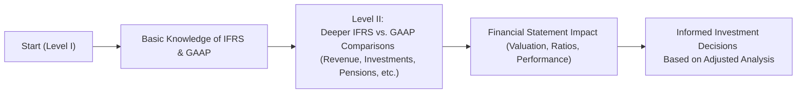

## The Big Picture: From Simple Observation to In-Depth Analysis

So, you’ve conquered Level I, and you’re feeling reasonably comfy with the basics of reading a financial statement—like how to classify expenses, read the balance sheet, or identify revenue streams. But here’s the thing: Level II FSA wants you to take that foundation and do a whole lot more with it. Instead of asking, “Which line item is cost of goods sold?” it’ll be, “How do we interpret variations in that line item under different accounting frameworks, and how does it affect a firm’s valuation?” You know, the kind of question that draws you deeper into the nuance and helps you see why financial statements are more than just static documents.

This emphasis on deeper interpretation means you’ll be poring over footnotes, reading about complex transactions, and comparing how IFRS vs. US GAAP reporting can produce different numbers—even for the same economic event. For instance, the way that intangible assets or development costs get recognized can vary widely between these standards, ultimately impacting valuation multiples or performance ratios. So, you’re not just memorizing. You’re learning to evaluate the quality of reported data and understanding how these details can tilt an analyst’s perspective on a company.

## Advanced Concepts: Beyond the Basics

Remember all those interesting but straightforward concepts you learned in Level I—like depreciation methods and basic ratios? Level II flips those on their head and pushes you into advanced territory:

• Intercorporate investments: You’ll need to know the differences between investing in financial assets, associates, and subsidiaries. More importantly, how each classification changes the recognition and measurement of earnings, assets, and liabilities.  
• Pension accounting: Be ready to dissect defined benefit plans, net pension liabilities, and service costs. Trust me, the interplay of these on the balance sheet and income statement can get tricky, especially once you layer in IFRS vs. US GAAP differences.  
• Share-based compensation: Stock options, restricted stock units (RSUs), performance shares—you have to figure out how each one is recognized as an expense, how they affect diluted EPS, and how they show up in equity.  
• Multinational operations: Now you’re cooking with currencies—foreign exchange translation methods like the current rate method and temporal method, hyperinflation scenarios, and whether a company’s functional currency is the same as its reporting currency.

That’s a lot, right? Well, yeah. But it’s also an incredible window into how a set of financial statements can shift depending on which accounting approaches are used. One quick personal story: When I was prepping for Level II, I remember looking at two large multinational firms—one reporting under IFRS and another under US GAAP—and thinking, “These look like apples and oranges.” Understanding how to unify them so I could compare valuations was eye-opening. That’s the kind of real-world skill you’ll be honing.

## IFRS vs. US GAAP: Closing the Gap

If you look at the Table of Contents in this volume, you’ll see entire chapters dedicated to IFRS and US GAAP differences. That’s a hint at how important it is. International Financial Reporting Standards (IFRS) aim to be more principle-based, while US GAAP is often described as more rule-based. Or at least, that’s the simplified explanation.

But in practice, you might see something like intangible asset development costs capitalized under IFRS while they’re expensed under US GAAP, leading to different profit or loss figures. For a financial analyst, that difference can affect your forward-looking multiples, your return on equity (ROE) analysis, and your forecasted cash flows.

Here’s a quick visual representation of just a snippet of the IFRS vs. US GAAP interplay in your Level II explorations:



This chart might look a little too simplified, but it captures the essence of your journey. You’ll dig deeper into each standard, observe how they diverge, practice adjusting financial statements to a common basis, and ultimately use that analysis to make better decisions (or pass a tricky item-set question!).

## Analytical Methods: Ratios, Trends, and Forecasts

You know those classic ratios like current ratio, quick ratio, debt-to-equity, and interest coverage? Get ready to apply them in more challenging contexts. Level II FSA wants you to see how changes in accounting policy, or how a standard’s flexibility might alter those ratios. For example:

• Two companies in the same industry might report drastically different leverage ratios if one is using an operating lease approach while the other capitalizes the same lease arrangement.  
• The intangible assets that get recognized differently under IFRS and US GAAP can inflate or deflate equity, which in turn alters your ROE calculations.  

You’ll also tackle trend analysis—looking at how certain items evolve over multiple reporting periods. Did the company’s profit margin spike this year? Or is it part of a multi-year shift? And which footnote disclosures highlight potential hidden red flags (such as big changes in revenue recognition or the classification of certain expenses)?

Forecasting is another biggie. You’ll integrate your knowledge of advanced concepts to build pro forma financial statements. Imagine having to create a future balance sheet that properly accounts for a new share-based compensation plan or a multinational acquisition with partial goodwill recognized. That’s the kind of heavy lifting you’ll practice, which also sets the stage for more advanced valuation methods (like discounted cash flow, residual income, etc.) in your other curriculum areas.

## Spotting the Pitfalls: Earnings Manipulation and Aggressive Choices

We all know that companies sometimes engage in “creative” accounting—pushing the edges of what’s permissible to meet quarterly targets. At Level II, you’ll develop a heightened awareness of these tactics:

• Aggressive vs. conservative accounting: If a firm chooses to capitalize development costs when it’s allowed as an option, that’s typically more aggressive, boosting earnings now but possibly inflating asset values.  
• Channel stuffing and weird revenue recognition: Did the firm record a big chunk of revenue right before year-end that might not actually be realized?  
• Pension shenanigans: Changing actuarial assumptions to lower pension expense or show a more favorable funded status.  

In short, you learn to read between the lines. A huge focus is that you’re not just taking the numbers at face value but also thinking, “Could these be manipulated, and does that matter significantly for my valuation or credit analysis perspective?”

## Mastering the Exam Approach: Leaping into Item-Set Vignettes

Level II uses item sets (or vignettes) with multiple-choice questions. These scenarios typically revolve around:

• A detailed narrative about a company’s financials, potential IFRS vs. GAAP differences, and a unique transaction (like an acquisition or a pension plan change).  
• Data extracts from the financial statements and disclosures in footnotes.  
• Questions that ask you to do both numeric calculations (like adjusting reported net income to remove unusual gains) and interpret final results (e.g., “What is the effect on the debt-to-equity ratio if the lease is capitalized?”).

It’s essential to practice reading these vignettes efficiently. My advice? Highlight or note the key items: date references (sometimes they’ll mention a standard changes mid-year), specific percentages, or the presence of nonrecurring items. The quicker you can identify which details matter, the easier it is to answer the questions without confusion.

## Linking to the Broader Curriculum

I can’t overstate how integrated the curriculum can be. Your knowledge from equity analysis helps you apply the FSA findings to valuations—like adjusting P/E or EV/EBITDA for IFRS vs. GAAP differences. Corporate finance knowledge might come into play if you’re analyzing synergy assumptions for an intercorporate investment. Ethics continuously weaves throughout, reminding you to stay alert for any manipulative or misleading accounting treatments.

If you see references to cost of capital or discount rates, that might hint you need to recall your corporate finance or fixed-income expertise. If the question touches on performance evaluations or partnership structures, you may need your knowledge from partner mix in private equity or controlling interest from your intercorprate investments studies. That’s the beauty (and challenge!) of Level II—everything’s interconnected.

## Real-World Relevance: Bridging Textbook and Practice

Anyway, you might wonder, “Where does this show up in the real world?” In financial analysis roles at banks, asset management firms, or corporate finance teams, you’ll keep stumbling upon unique items in the footnotes that can drastically change your perspective. Suppose you’re analyzing a tech giant: how it recognizes revenue on subscription-based services, or intangible asset R&D, can shift your entire investment thesis. Or if you’re evaluating a large multinational bank, you’ll want to grasp how consolidation of structured entities (like Variable Interest Entities) modifies the bank’s risk profile.

Having a solid grasp of IFRS vs. US GAAP, an ability to interpret pension obligations, or a keen eye for share-based compensation disclosures? That’s gold. It’s precisely what sets a top-tier analyst apart from everyone else who’s stuck at the superficial level.

## Mini Example: The Impact of Capitalization vs. Expensing

Let’s do a tiny, simplified demonstration. Say you have a company that invests $1 million in R&D:

• If it expenses that amount immediately, net income is lower this year by $1 million.  
• If it capitalizes (and let’s say it amortizes over 5 years), net income might only drop by $200k each year for the next five years.  

For some standards, IFRS might allow partial capitalization of development costs if specific criteria are met. US GAAP, however, might require more consistent expensing for certain R&D categories. This difference trickles through your ratio analysis (profit margin, asset turnover) and might even shift your forecasted free cash flows.

In KaTeX form:

$$
\text{Net Income (Expensed)} = \text{Revenue} - (\text{All Operating Expenses} + 1,000,000)
$$

$$
\text{Net Income (Capitalized, Year 1)} = \text{Revenue} - (\text{All Operating Expenses} + 200,000)
$$

It’s basically a timing difference that can significantly affect your perception of the company’s performance, especially if you’re dealing with high-growth tech or pharma sectors where R&D is huge. Over a multi-year horizon, you’ll see how this accumulates and influences equity, assets, and so on.

## A Quick Python Snippet for Ratio Calculation

If you like to tinker around with Python to speed up your ratio checks (purely as a learning exercise, though—exam day is all about your financial calculator!), here’s a tiny snippet:

```python

def interest_coverage(ebit, interest_expense):
    return ebit / interest_expense

ebit_value = 1_000_000
interest_expense_value = 200_000

coverage_ratio = interest_coverage(ebit_value, interest_expense_value)
print(f"Interest Coverage Ratio: {coverage_ratio:.2f}")
```

Run something like this in a Python shell, and you’ll find the coverage ratio is 5.00. The point is: you can see quickly how changes to EBIT due to any accounting adjustments will feed through important coverage metrics. If your personal coverage ratio from a few hours of study is also 5.00, well, maybe you need more coffee, haha.

## Glossary

• FSA (Financial Statement Analysis): The process of reviewing and analyzing a company’s financial statements to make better economic decisions.  
• IFRS (International Financial Reporting Standards): A set of accounting standards developed by the International Accounting Standards Board (IASB).  
• US GAAP (Generally Accepted Accounting Principles): Accounting standards recognized by the Financial Accounting Standards Board (FASB) in the United States.  
• Aggressive Accounting: Techniques to inflate earnings or assets by using discretion in accounting estimates or assumptions.  
• Conservative Accounting: Techniques that tend to understate earnings or assets to manage expectations and reduce the chance of overstating performance.  
• Earnings Manipulation: Any intentional action taken to alter financial results, possibly stretching or violating accounting standards to present a desired outcome.  
• Valuation Metrics: Ratios and indicators (e.g., P/E ratio, EV/EBITDA) used by analysts to value a firm’s equity or debt.

## References & Further Reading

• CFA Institute official website:  
  (https://www.cfainstitute.org/)  

• IASB official site for IFRS details:  
  (https://www.ifrs.org/)  

• FASB Accounting Standards Codification:  
  (https://www.fasb.org/)  

• Kieso, D.E., Weygandt, J.J., & Warfield, T.D. (Intermediate Accounting):  
  Excellent resource for diving deeper into the technical details of various accounting treatments, especially with IFRS vs. GAAP comparisons.

• Chapters 2 and 3 in this Volume:  
  These tackle IFRS vs. GAAP high-level differences and Intercorporate Investments Foundations, tying closely to the advanced content discussed here.

  
## Test Your Knowledge: Level II FSA In-Depth Focus



### Under Level II FSA, which statement best describes the approach toward accounting policies?

- [ ] Focus is primarily on identifying whether expenses are classified correctly.
- [x] Emphasis is on critically evaluating the impact of different policies on valuation and performance.
- [ ] Exam is limited to a theoretical overview, with few numerical examples.
- [ ] Only IFRS policies require deep understanding, whereas US GAAP is elective.

> **Explanation:** Level II FSA demands not just recognizing whether something is expensed or capitalized but also understanding how that approach alters ratio analysis, valuation, and the broader interpretation of financial performance.


### Which of the following is a key difference typically highlighted between IFRS and US GAAP?

- [ ] Both sets of standards completely prohibit capitalization of internally generated intangible assets.
- [ ] US GAAP always allows more flexibility in revenue recognition.
- [x] IFRS often permits capitalization of certain development costs, while US GAAP commonly requires expensing.
- [ ] There are no notable differences in how intercorporate investments are treated.

> **Explanation:** IFRS permits capitalization of development costs under specific criteria, whereas US GAAP generally mandates that most development costs be expensed when incurred. This divergence can affect a company’s reported net income and asset base.


### In analyzing pension accounting under IFRS and US GAAP at Level II, candidates should be prepared to:

- [ ] Rely only on the net pension asset or liability in the balance sheet for all insights.
- [x] Compare the companies’ assumptions and methods that affect reported pension expense and funded status.
- [ ] Ignore the distinction between defined benefit and defined contribution plans.
- [ ] Assume pension obligations are immaterial in advanced financial analysis.

> **Explanation:** Pension accounting requires an understanding of underlying assumptions (e.g., discount rates, expected returns, mortality rates) and how those differences can impact the reported expense and obligation. IFRS and US GAAP each have nuanced rules for recognizing actuarial gains/losses, service costs, and interest costs.


### Why is it crucial to evaluate share-based compensation at Level II?

- [ ] Because share-based compensation never affects the income statement.
- [x] It can dilute the ownership of existing shareholders and affect both earnings and equity.
- [ ] These plans are purely cosmetic and don’t change financial ratios.
- [ ] Most companies do not disclose details of share-based plans.

> **Explanation:** Share-based compensation influences the income statement (through compensation expense) and also dilutes equity when share options are exercised. You need to know how these factors alter EPS and potentially the perceived profitability of the firm.


### Which method is most frequently used under IFRS to translate foreign subsidiaries’ financial statements when the subsidiary’s functional currency differs from the parent’s functional currency?

- [ ] The direct method.
- [x] The current rate method.
- [ ] The cash basis method.
- [ ] The temporal method without exceptions.

> **Explanation:** IFRS typically uses the current rate method for translating the financial statements of foreign subsidiaries whose functional currency differs from the reporting entity’s. This method translates most assets and liabilities using the closing rate, impacting the cumulative translation adjustment (CTA).


### When analyzing the impact of an unusual revenue recognition policy, a Level II candidate should:

- [ ] Only compare it to industry peers under US GAAP.
- [ ] Avoid questioning management’s intent unless there is an ethical violation.
- [x] Investigate the footnotes, look for potential deferrals or accelerations of revenue, and adjust the valuation if necessary.
- [ ] Conclude that all recognized revenue is legitimate if the auditor signed off on it.

> **Explanation:** Item-set questions often involve dissecting the footnotes to figure out if revenue was recognized prematurely or in an unusual manner. A thorough analyst accountant will adjust financials accordingly to arrive at a more accurate valuation.


### Which of the following is an example of aggressive accounting?

- [x] Capitalizing expenditures that arguably should be expensed, leading to higher net income in the short term.
- [ ] Fully expensing all R&D as incurred.
- [ ] Writing down assets frequently to reflect potential losses early.
- [ ] Disclosing contingent liabilities in a transparent manner.

> **Explanation:** Capitalizing expenditures that might not meet capitalization criteria inflates assets and reduces expenses in the current period, thus boosting earnings—an example of aggressive accounting.


### When confronted with significant differences between IFRS and US GAAP in an item set, the best approach is:

- [ ] Assume the IFRS figures are always more accurate.
- [ ] Disregard the differences and focus on the parent company’s reporting.
- [x] Evaluate how these differences affect key ratios, and adjust or normalize data for a comparable analysis.
- [ ] Immediately choose the US GAAP–grounded answer, as it’s the default standard on the exam.

> **Explanation:** You must recognize how different standards affect financial statements. Making adjustments to render them comparable is typically the best practice for thorough analysis.


### Which statement about IFRS vs. US GAAP in Level II is correct?

- [ ] They will only differ in how they treat intangible assets; everything else is uniform.
- [x] They can differ in revenue recognition, intercorporate investments, pension accounting, and more—requiring the analyst to reconcile financial results.
- [ ] The exam does not require explicit references to either standard.
- [ ] IFRS is a direct copy of US GAAP, with only minor wording changes.

> **Explanation:** There can be multiple notable divergences between IFRS and US GAAP across various topics. Level II expects you to identify those discrepancies and their repercussions on the analysis.


### Under the current rate method for foreign currency translation, is it true or false that all assets and liabilities (except equity) are translated at the closing rate?

- [x] True
- [ ] False

> **Explanation:** In the current rate method, the balance sheet’s assets and liabilities are typically translated at the exchange rate prevailing on the balance sheet date. Equity is translated using historical rates.


