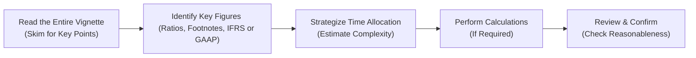

## Understanding the Vignette Format

So, you’ve made it through Level I, and now you’re facing those infamous “vignette” or “item-set” questions at Level II. Let’s face it, reading condensed, story-like text full of footnotes and then juggling several short questions can feel intimidating at first. Each vignette typically presents a scenario—maybe a financial statement, a set of footnotes with IFRS vs. US GAAP differences, or some tricky pension assumptions—and then asks a handful of multiple-choice questions based on that scenario.

These item-sets will test your ability to:  
• Interpret numbers in context (like adjusting an investment’s carrying value).  
• Spot the relevant footnotes (like changes in depreciation policies).  
• Quickly do the math to update ratios, recast statements, or catch undisclosed liabilities.  

Don’t worry: the key is to build a consistent approach. You’ll want to scan, read carefully, highlight, and note down salient data so you don’t get lost in the details. In other words, you have to become a detective of sorts—efficiently sifting through clues and ignoring fluff.

## Mastering Time Management

Time management in the Level II exam feels like trying to juggle while riding a unicycle. You have a strict exam window, and each vignette can easily absorb more of your time than you intended.

• Read the prompt carefully: Take a minute or two to skim the entire item-set. (Yes, that includes footnotes—please don’t skip those!)  
• Estimate the tricky parts: If the question involves advanced topics like share-based compensation (Chapter 9) plus foreign currency translations (Chapters 11–13), you might need extra time.  
• Triage straightforward calculations first: For instance, if one sub-question simply asks you to identify the correct ratio, tackle that quickly before diving deeper into more complicated tasks.  

A personal tip from my own experience: I used to read the first question before finishing the entire vignette. That gave me a clue about what data to focus on. For instance, if I saw “compute the effect of reclassifying a bond investment on equity,” I’d pay special attention to how the investment was classified in the footnotes.

Striking the right time balance often involves a little internal negotiation. You might catch yourself wanting to reread every single footnote in excruciating detail. Instead, read once thoroughly and take notes. Then, if you need to verify a smaller detail, you can jump back quickly rather than reading it all over again.

## Data Extraction Tactics

Extracting (and not drowning in) the relevant data is literally half the battle with Level II FSA. Here’s a quick breakdown:

1. Footnotes Are Gold: Let’s say you’re analyzing a consolidated income statement, and you notice a footnote about a change in inventory valuation from FIFO to weighted average cost. That footnote could drastically change your margin calculations. Jot it down.

2. Look for IFRS vs. US GAAP Differences: If the vignette mentions a policy that’s distinct between the two standards—maybe revaluation of property (allowed under IFRS, not under US GAAP)—consciously log that difference in your notes. You’ll likely be asked how it impacts net income or equity.

3. Summaries Over Details: Keep your notes succinct. If you see that the company restated prior year statements, note that (restatement => watch for changes in retained earnings). Don’t rewrite entire paragraphs—just pick the numbers that matter, like the net effect on operating income or new assumptions for discount rates.

One thing that tripped me up back in the day was getting too bogged down in the “story.” I remember a company’s footnotes detailing a complicated acquisition, but only one small bullet about a new intangible asset that would change the goodwill calculation. I almost missed that intangible bullet. So yeah, keep your eyes open for subtle references.

## Considering the Question’s Angle

Each vignette question might test something slightly different. Maybe one question focuses on recognition and measurement (like how you classify intercorporate investments under IFRS for an equity method scenario). Another might focus on the effect on ratios (like how net profit margin changes if you add back an impairment under a different accounting standard).

It helps to anticipate these angles:  
• Measurement Focus: Are they testing if you know whether a financial asset should be measured at fair value through profit or loss, or at amortized cost?  
• Policy Choice Impact: Maybe they want to see if you realize that capitalizing vs. expensing certain costs changes your net income.  
• Ratios and Analysis: Very common: “By how much would the debt-to-equity ratio change if you reclassify an operating lease as a finance lease?”  

If you suspect the question’s aiming at IFRS vs. US GAAP differences, for instance, recall that IFRS often allows certain revaluations or certain intangible asset treatments that US GAAP forbids. The exam loves these subtle differences. Checking references to our Chapter 2 (IFRS and US GAAP—High-Level Differences) before exam day can prevent nasty surprises.

## Effective Note-Taking

Sometimes, I cringe at the memory of my old scribbled exam notes. About 20 lines of random numbers and half-circles around a single IFRS footnote. But hey, note-taking is an art, and it’s personal. Here are some quick suggestions:

• Margin or scratch space: Most of us do best by writing quickly in the exam book margins or on the designated scratch pages. Mark the footnotes with a symbol or highlight a key number that might tie to a question.  
• Summaries or bullet points: Jot down “Dep. method changed to straight-line in Year 2 => $\uparrow$ net income?” or “Goodwill impairment => IFRS uses one-step approach (Chapter 5).” Then when you see a question about goodwill, you know exactly where to look.  
• Keep track of “Key Figures” for each question: If it’s a pension question (Chapters 7–8), note the discount rate, expected return on plan assets, and the total service cost in one place.

Just keep it neat enough that you can read it back in a hurry. If you scribble to the point where it’s unreadable, that’s going to frustrate you. A balanced approach is essential.

## Practice with Integrated Problems

The real exam items don’t just say, “Compute goodwill impairment.” They might simultaneously mention the foreign currency conversion of that goodwill or how it impacts noncontrolling interests (Chapters 4–5 for M&A complexities, and Chapters 11–13 for the FX side). Some vignettes weave in a question about share-based compensation (Chapter 9) right next to one about capital structure. The moral of the story is that real-world financial analysis rarely exists in tidy boxes, and neither does the CFA exam.

When you practice, try combining topics:  
• Pension plus foreign currency adjustments.  
• Share-based compensation plus big changes in IFRS vs. US GAAP policies.  
• A newly consolidated subsidiary that triggers partial goodwill treatment.  

After each practice set, reflect on your approach: Did you manage your time well? Did you note all relevant accounting standard differences? Did you get stumped because you forgot a small detail about intangible assets? You’ll find these integrated drills speed up your exam-day recognition skills.

## Avoid Overcomplication

It’s super easy to get stuck in the weeds. Maybe you’re reading an item-set about an insurer (Chapters 16–17) with extensive liabilities, or a bank with complex off-balance-sheet items (Chapters 14–15). You see three pages of disclosures on derivatives, reinsurance, special purpose vehicles—you name it. Resist the urge to dissect every single line unless it’s relevant to the questions asked.

Sometimes, the exam intentionally includes extraneous details to see if you know how to filter out the noise. The best approach is:  
• Read the actual question again: “Which of the following best describes the effect on net interest income?” If it’s net interest income, you can probably skip the section about intangible assets or share-based compensation.  
• Stick to the big picture: If they want a numeric effect on net interest margin, focus on how the notes tie to that margin, not on everything else.

## Post-Practice Reflection

After you finish an item-set, whether in a practice test or in your daily study, don’t just check your score and move on. Reflect:

• Did you fall into any time traps?  
• Did you skip an important footnote that cost you a question?  
• Did you conflate IFRS with US GAAP for a specific measurement rule?  
• Did you make a ratio calculation error because you used the wrong year’s data?

Weirdly enough, I learned almost as much from my mistakes as from the correct answers. I found patterns—like a consistent error in ignoring how IFRS handles development costs (capitalizable under certain conditions) versus US GAAP (generally expensed). Spotting repeated mistakes is a powerful way to identify knowledge gaps.

## Sample Flow for Tackling a Vignette

Below is a simple flowchart illustrating a recommended approach to reading and answering a vignette:

This flow keeps you on track: you read once, pick your data, plan how you’ll spend your precious minutes, do the necessary computations, and (importantly) review your final answers.  

## A Quick Example: IFRS vs. US GAAP Footnote

Imagine you see a footnote stating: “Beginning in 20X2, the company elects the IFRS revaluation model for property, plant, and equipment.” Meanwhile, you read that last year they accounted for the same assets at historical cost, consistent with US GAAP. A question might ask: “If the company’s revaluation leads to a $200,000 increase in PPE value, how will net income and equity be most likely affected?”  

Under IFRS, upward revaluation goes to other comprehensive income (OCI), not directly to net income. Meanwhile, under US GAAP, revaluation is not permitted at all—so the question is likely testing your knowledge of how IFRS handles revaluation increments. The correct answer might mention the effect on equity (it increases) without affecting net income. If you identify that nuance quickly, you’ll lock in a correct response and save time for other, more computationally heavy questions.

## Key Formulas and Ratios

Sometimes, the hardest part is not the concept but the math under pressure. You might recall from your formula sheets:

$$
ROE = \frac{\text{Net Income}}{\text{Shareholders' Equity}}
$$

Now, if a vignette changes how net income is recognized (e.g., by capitalizing R&D under IFRS that’s expensed under US GAAP), or if the equity changes due to revaluation surpluses, your calculation for ROE might shift. Write the formula down quickly if you’re drawing a blank, or keep it in mind to see how footnote changes might affect each numerator or denominator.

## Glossary

• Item-Set (Vignette-Style) Question: A multi-part question referencing a shared scenario, often including financial statements, footnotes, and multiple sub-questions.  
• Footnotes: Detailed notes in financial statements that highlight accounting methods or clarifications.  
• Disclosure: Regulatory requirement to provide all significant info about transactions or policies.  
• Computational Adjustments: Tweaks to reported figures to align with consistent standards or assumptions.  
• Time Management: Quickly allocating exam minutes to reading, analyzing, and answering.  

## References & Further Reading

• CFA Level II Curriculum—Practice Item-Set Examples.  
• Schweser, Wiley, or AnalystNotes: For additional mock exams with integrated vignettes.  
• “Reading Financial Reports For Dummies” by Lita Epstein: A simpler overview to footnotes and statement data extraction.  

--------------------------

## Test Your Vignette Mastery: 10 Sample Questions



### Q1: Identifying Relevant Data in a Pension Vignette 
- [x] Skimming for main figures (service cost, interest cost, return on plan assets) first can save time.  
- [ ] Reading each footnote in complete detail before looking at questions is always the best time strategy.  
- [ ] Ignoring changes in discount rates might be acceptable in short item-sets.  
- [ ] Focusing on non-pension data first is usually the correct approach.  

> **Explanation:** In a pension-related vignette (Chapters 7–8), service cost, interest cost, and expected return on plan assets are typically the main factors affecting net pension expense. Skimming for these key figures saves time and helps in direct calculations.  

### Q2: Best Approach to Handling IFRS vs. US GAAP Differences 
- [ ] Apply IFRS rules to all questions, ignoring US GAAP references.  
- [x] Note explicit references to IFRS or US GAAP in the footnotes, as these usually alter reported figures.  
- [ ] Assume no difference in how assets are measured under either standard.  
- [ ] Focus only on revenue recognition under IFRS.  

> **Explanation:** Level II often tests small but crucial differences between IFRS and US GAAP. Carefully noting which standard is in play is vital for correct classification and measurement.  

### Q3: Time Management Priority 
- [ ] Spend as much time as needed on each question until certain, ignoring the clock.  
- [ ] Allocate a fixed 2 minutes per question, ignoring complexity.  
- [ ] Actually, time management is less important than reading the entire vignette.  
- [x] Identify straightforward questions first, answer them quickly, then handle tricky questions.  

> **Explanation:** A balanced approach ensures you gain easy points on simpler questions before delving into more complex calculations.  

### Q4: Footnote with a Change in Depreciation Method 
- [ ] Always leads to an immediate decrease in net income.  
- [ ] Typically has no effect on net income.  
- [ ] Results in the same assumption under IFRS and US GAAP.  
- [x] Can alter the depreciation expense, which affects net income and possibly ratio calculations.  

> **Explanation:** A depreciation method change (e.g., from declining balance to straight-line) often impacts reported net income in current and future periods and can trigger adjustments for ratio analysis.  

### Q5: Goodwill Revaluation Under IFRS 
- [ ] Is recognized as a gain in income.  
- [x] Is not typically revalued upward through profit or loss, but might be tested for impairment.  
- [ ] Requires immediate write-off to retained earnings.  
- [x] Impairments reduce income under IFRS.  

> **Explanation:** IFRS does not allow goodwill revaluation above its original carrying amount. Impairment decreases net income, unlike US GAAP which also uses an impairment approach but with a different methodology (Chapter 5).  

### Q6: Dealing with Multiple-Topic Vignettes 
- [ ] Solve one topic fully before reading others.  
- [ ] Ignore footnotes about intangible assets if the question is labeled “Pensions.”  
- [x] Integrate the data by identifying how each policy choice might affect overall financials.  
- [ ] Assume all the data is relevant.  

> **Explanation:** Multiple-topic vignettes integrate subjects like pensions, FX, and share-based compensation. You should scan for how these interactions might affect each other rather than isolating each section.  

### Q7: Recognizing When a Detail is a Distraction 
- [x] Compare the content of each footnote to the actual exam questions. If it’s clearly unrelated, move on quickly.  
- [ ] Treat every detail in the vignette as equally important.  
- [ ] Skip footnotes entirely to save time.  
- [ ] Summarize all footnotes with lengthy notes.  

> **Explanation:** The exam sometimes includes details that are irrelevant to the specific questions asked. Learn to filter data by referencing the question topics.  

### Q8: Typical Ratio Asked in Vignettes 
- [ ] The Price-to-Book ratio for intangible assets.  
- [x] Debt-to-Equity, because reclassifying an operating lease or an off-balance-sheet item can drastically affect it.  
- [ ] Weighted average cost of capital.  
- [ ] Correlation coefficient for monthly returns.  

> **Explanation:** Debt-to-Equity is one of the frequent ratio targets in item-sets, especially where standard differences or reclassifications affect liabilities and equity.  

### Q9: Strategies for Post-Vignette Reflection 
- [ ] Go directly to the next vignette without reviewing.  
- [x] Check both correct and incorrect answers to find patterns in mistakes.  
- [ ] Only focus on the correct answers.  
- [x] Summarize key lessons and standard nuances for future reference.  

> **Explanation:** Reflecting on mistakes helps you identify places where your process or knowledge is weak, which is crucial for continuous improvement.  

### Q10: True or False – In CFA Exam Vignettes, IFRS always supersedes US GAAP if both are mentioned 
- [x] False  
- [ ] True  

> **Explanation:** The exam consistently tests your ability to differentiate which standard applies to the scenario. IFRS does not supersede US GAAP automatically; the question will likely specify the reporting standard or ask you to compare both.  



Use these questions to refine your approach. If you can confidently handle time constraints, note-taking, and subtle footnotes, you’ll find the item-set (vignette) questions a lot more manageable. And don’t forget to reflect on every practice question you miss—that’s where the real aha moments tend to happen.  

Good luck, and remember that a careful, methodical approach is your best friend on exam day!
