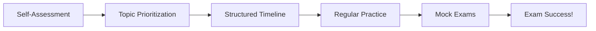

## Introduction

Let’s talk study strategy, shall we? It’s easy to feel overwhelmed when you see the sheer volume of material we have in this volume alone—from Intercorporate Investments to Pension Accounting to the complexities of FX Translation. I remember when I was prepping for my own CFA exam, I started by buying a stack of highlighters and thinking: “Well, guess I’ll highlight everything in bright yellow because it seems all of it’s important!” That approach, obviously, was a big mistake. It’s far more effective to figure out your unique path—your personal roadmap—so you can channel your time and energy in the right places. And that’s precisely what we’re going to map out here.

Below, we’ll explore how best to identify your strengths and weaknesses, how to put together a timeline, and how to keep yourself motivated when the going gets tough (spoiler: trust me, it will at some point). We’ll also see how a bit of creativity and flexibility in your timelines makes you more resilient, so if you fall behind, you can catch up without panicking.

## Identifying Strengths and Weaknesses

A real first step is figuring out where you’re strong and where you might need a little extra love. Now, if you’re the type of person who breezed through pensions at Level I but had a meltdown over currency translation, it means you’d probably want to allocate more hours to, say, the chapters on Multinational Operations (Chapters 11–13) in this volume. Or maybe Intercorporate Investments (Chapters 3–4) has haunted your dreams, and you want to clear that hurdle first.

How do you do this assessment? 
• Reflect on your Level I performance: Which topics were your Achilles’ heel?  
• Skim through the upcoming chapters in this volume: Jot down how confident you feel about concepts like share-based compensation or variable interest entities.  
• Use short quizzes: Quick, low-pressure questions (like 5–10 items) can highlight immediate gaps.  

Sometimes it helps to create a small spreadsheet rating each chapter from 1 to 5 (1 = “I have no clue,” 5 = “I can teach this to others, no sweat”). That way, you’ll have a clear map of what’s up ahead.

## Creating a Structured Timeline

Once you’ve assessed your knowledge base, it’s time to schedule your studies in a realistic way. Let’s face it: if you’re juggling a full-time job plus family commitments, you probably can’t do a 40-hour study sprint every single week. For that reason, break your plan into smaller building blocks:

• Target one or two chapters per week, depending on complexity.  
• Leave buffer weeks: Plan for unexpected work deadlines, holidays, or just the unpredictability of life.  
• Incorporate practice sets: Every week, set aside at least one intense day—or a weekend slot—to do vignette-style questions from past exams or a test bank.  

If you’re more visually inclined, you can map out your roadmap in a flowchart. This might look something like:

It’s kind of satisfying to watch the flow from honest self-assessment all the way to that sweet moment you (hopefully) see your passing results.

## Diversifying Learning Resources

Not everybody learns the same way. Some folks devour textbooks, others need videos or in-person classes. Here’s how to diversify:

• Official Curriculum: Dive deep into the official readings and end-of-chapter questions—it’s the gold standard.  
• Third-Party Prep: Supplement with summarized notes, concept-based question banks, or interactive learning apps.  
• Study Groups: Join a local or online group. Explaining something like Partial Goodwill (from Chapter 4) to peers helps cement your own understanding.  
• Practice Exams: Don’t wait until the last minute to test yourself. Attempt short sample exams or full-length mocks every few weeks.  

Using multiple resources from multiple angles really helps you see a concept from different perspectives. For example, reading the official text might highlight the theoretical underpinnings of pension accounting, while a third-party video might walk you through a super practical approach to the calculations on net pension expense. That synergy is invaluable.

## Maintaining Regular Practice with Item-Sets

If there’s one refrain I keep hearing from candidates, it’s: “I wish I had done more item-set practice sooner!” The item-set, or vignette, format at Level II is all about context. You’ll be given a scenario—maybe a fictional company dealing with a tricky consolidation scenario—and from that scenario, you’ll get half a dozen questions testing multiple facets of the learning objectives.

• Integrate item-set practice daily or weekly.  
• Deconstruct each question: Figure out the reasoning behind right and wrong choices.  
• Time yourself: This is critical. On exam day, time pressure is real. Practicing under timed conditions (even if you start with fewer, more targeted questions) will sharpen your instincts.

It is entirely possible that you know the material but struggle to complete questions quickly. Speed is a skill in itself—one you can cultivate through repeated practice.

## Celebrating Small Milestones

I remember being so bogged down by every page I turned. It seemed never-ending! One day, I realized I needed to track and celebrate my small wins. Finished Chapter 3? Reward yourself with, I don’t know, a short Netflix break or your favorite cappuccino from that fancy coffee shop. These mini-breaks or micro-celebrations can help keep your spirits high. 

And hey, if you’re in a study group, celebrate collectively. You might do quick group calls or message each other on chat apps: “We all made it through those gnarly IFRS vs. US GAAP differences. Let’s break for coffee and reconvene tomorrow.” It’s amazing how these tiny acknowledgments make a difference to motivation levels.

## Focusing on Conceptual Clarity

Although plenty of formulas and definitions exist in the FSA realm, it’s absolutely critical to understand the “why.” If you’re memorizing steps for, say, consolidation vs. equity method, but you don’t really get the underlying principle of controlling interest or significant influence, you’ll inevitably run into confusion when a curveball on exam day modifies a scenario slightly. 

So keep digging deeper:
• Ask “why” a method or an accounting treatment is used.  
• Check real-world examples. For instance, look at a public company’s annual report to see how they handle their subsidiaries.  
• Try summarizing complex ideas in your own words. If you can, teach it to a friend or study partner. Teaching forces clarity.  

You’ll find that once you “get it,” the details of each standard or IFRS vs. US GAAP difference become easier to map.

## Leveraging Mock Exams Under Timed Conditions

I wish I could freeze every candidate in time at least three or four weeks before the exam to force them to do a full practice test. Seriously. It’s that important. Full-length mock exams:

• Reveal blind spots or areas you might have overlooked.  
• Validate pacing: Are you spending too much time on tough item-sets and rushing easy ones?  
• Familiarize you with the stamina needed for the exam: Endurance counts.  

Use at least two or three full mocks. Ideally, mimic exam-day conditions—no phone, no distractions, a strict time limit. Compare your performance across these mocks to see if you’re improving. Maybe you had no clue about partial goodwill in the first test, but on the second, you nailed that question. That’s progress you can be proud of!

## Scheduling Continuous Revision

We all know the phenomenon of forgetfulness. You can study something thoroughly, and then two weeks later, you’re like, “Wait, how was that pension expense formula derived again?” Because of this, periodic review is a must:

• Weekly or Biweekly Recaps: Take half a day to revisit older topics.  
• Flashcards or Summaries: Keep them handy for quick refreshers (commuting, lunch breaks, etc.).  
• Integrate Old Quizzes: Redo item-sets from previous weeks. Notice if you’re still missing the same points.  

This cyclical approach keeps the knowledge fresh and links newly learned topics to older ones. In financial statement analysis especially, many areas overlap—like how IFRS vs. US GAAP differences tie into comparing statements in advanced ratio analysis. The more you tie everything together, the stronger your overall mastery.

## Potential Pitfalls and Strategies

Let’s get real: no matter how well you plan, things can (and do) go sideways. Some typical issues:

• Overcommitting: You might schedule too many chapters in a short timeframe, leading to burnout. Strategy? Space out your studies.  
• Neglecting Weak Spots: Spending all your time on topics you love (and ace) might feel good but doesn’t solve the actual challenge. Strategy? Tackle the tough ones first.  
• Procrastination: That’s a biggie! Sometimes the content is so heavy that we just avoid it. Try using short bursts of study (like the Pomodoro Method) to break it into bite-sized intervals.  

Keep adjusting. Your roadmap isn’t set in stone. If you find yourself behind schedule, regroup, revisit your plan, or maybe talk through it with a friend or mentor. The important part is to keep moving forward, not aim for unattainable perfection.

## Conclusion and Exam-Day Tips

Ultimately, your study roadmap is a living, breathing plan that evolves as you do. Start with an honest assessment, build out a logical timeline, and keep layering in item-set practice and review. Stay motivated by celebrating your milestones, big or small, and always anchor your knowledge in conceptual clarity. And absolutely—please do those timed mocks under realistic conditions. They’re essential for ironing out last-minute kinks in your understanding and exam technique.

On exam day, it’s all about execution:  
• Arrive fresh: There’s no point cramming at 3 a.m. the night before.  
• Skim vignettes well: Identify the big details and figures.  
• Manage your time: If a question is stumping you, park it and move on.  
• Stay positive: Trust your preparation and keep a cool head.

In the next chapters, we’ll dive deeper into the nitty-gritty of IFRS vs. US GAAP differences, Intercorporate Investments, and beyond. But with a structured plan in place, you’ll be able to handle these topics systematically. Good luck, and let’s get to work!

## Glossary

Study Roadmap  
A structured plan outlining key areas of focus, timelines, and resources to systematically prepare for the exam.

Assessment & Prioritization  
Evaluating one’s knowledge gaps and ranking them in order of importance or difficulty.

Mock Exams  
Full-length practice tests that mimic the exam format, used to assess preparedness and improve time management.

Timed Practice  
Solving questions within strict time limits to enhance recall speed and exam-day efficiency.

## References & Further Reading

• “Self-Study Roadmap” resources on the CFA Institute website (candidate resources section).  
• Tim Ferriss’ productivity techniques (e.g., Pomodoro Method) to maintain consistent study intervals and avoid burnout.  
• Free online question banks or Q&A forums focusing on Level II FSA exam preparedness.

## Test Your Knowledge: Building a Solid Study Roadmap for CFA Level II



### Which approach is most effective for identifying CFA exam study priorities?

- [ ] Focusing on topics in alphabetical order
- [x] Conducting a self-assessment to identify strengths and weaknesses
- [ ] Reviewing only past exam performance without current practice
- [ ] Randomly picking chapters

> **Explanation:** Prioritizing areas based on a self-assessment ensures you spend more time on weaker topics while refining areas of strength.

### Which benefit best describes the impact of diversifying study resources?

- [x] It provides multiple perspectives, strengthening conceptual understanding.
- [ ] It extends total study hours without new insights.
- [ ] It dilutes the focus on the main curriculum readings.
- [ ] It is an unnecessary approach as official curriculum alone is sufficient.

> **Explanation:** Using various resources—like videos, study groups, and question banks—exposes candidates to different teaching styles and examples, helping deepen comprehension.

### Why is integrating item-set practice throughout your study plan recommended?

- [x] It helps you become familiar with the vignette format and manage time.
- [ ] It allows you to skip reading the official book chapters entirely.
- [ ] It ensures you only study superficial concepts.
- [ ] It replaces the need for reviewing fundamental theories.

> **Explanation:** Regularly solving item sets not only solidifies retention but also trains you to work under the constraints of the vignette-based exam format.

### What is a key purpose of celebrating small victories during the study process?

- [ ] Distracting yourself from the magnitude of the curriculum
- [ ] Extending the total amount of time spent studying
- [x] Maintaining morale and motivation over a long study period
- [ ] Allowing for a longer break from all study for a few weeks

> **Explanation:** Recognizing and celebrating incremental progress helps sustain enthusiasm and prevents burnout.

### Which statement most accurately reflects the importance of conceptual clarity in FSA?

- [x] Understanding the reasoning behind accounting treatments helps with unpredictable exam scenarios.
- [ ] Memorizing formulas alone is sufficient for success.
- [ ] Conceptual clarity has minimal effect on item-set results.
- [ ] FSA doesn’t require conceptual understanding, only calculations.

> **Explanation:** The CFA exam frequently modifies details in item sets, so a deep conceptual grasp is crucial to adapt quickly.

### What is one of the main advantages of a structured timeline?

- [x] Preventing study topics from overlapping chaotically and ensuring systematic coverage
- [ ] Limiting the depth of study in each area
- [ ] Forcing you to memorize each chapter in order
- [ ] Discouraging flexibility in case of schedule disruptions

> **Explanation:** A structured timeline ensures coverage of all chapters without rushing or missing critical content, leaving room for flexibility to handle unforeseen events.

### How often should mock exams be incorporated into the study routine?

- [ ] Not at all, as they cause anxiety
- [ ] Only one final mock exam the week before
- [x] At least two to three times to diagnose pacing, stamina, and knowledge gaps
- [ ] After every single reading in the curriculum

> **Explanation:** Completing multiple mock exams under realistic time constraints is the best way to assess performance, pacing, and readiness.

### Why is continuous revision of previously studied content recommended?

- [x] It prevents forgetting material and connects new topics with old ones.
- [ ] It reduces available time to learn new topics.
- [ ] It eliminates the need to learn new material.
- [ ] It lengthens the overall preparation period unnecessarily.

> **Explanation:** By setting up regular reviews, you reinforce earlier concepts and maintain a solid foundation to build upon when studying advanced topics.

### What is a common pitfall in study planning?

- [x] Focusing only on favorite topics and ignoring weaker areas
- [ ] Creating a timeline with buffer weeks
- [ ] Practicing item sets under timed conditions
- [ ] Celebrating milestones whenever possible

> **Explanation:** Although it’s natural to gravitate to areas of strength, neglecting weaker areas can severely hurt your overall score, especially in an integrated exam.

### True or False: One of the best ways to maintain motivation is to incorporate personal rewards or breaks after major milestones.

- [x] True
- [ ] False

> **Explanation:** Breaking the monotony and acknowledging achievements—big or small—can help sustain focus and motivation throughout your prep.


