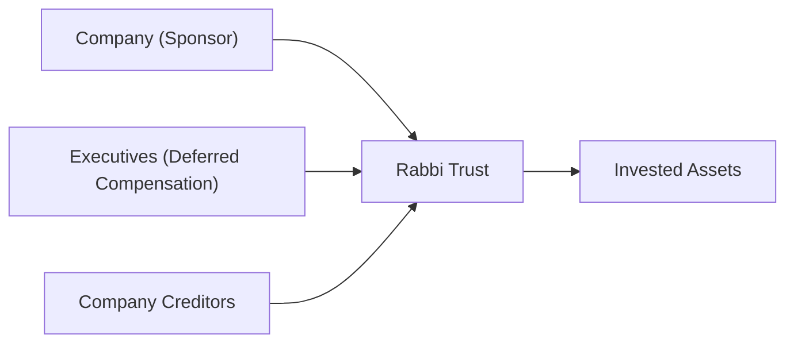

## Setting the Scene: Why Companies Use Deferred Compensation

Sometimes, you’ll hear finance folks chat about how top executives don’t always get paid all their salaries up front. Instead, they stash a chunk of the compensation in a “deferred” vehicle, which basically means the employee won’t see that money until a future date—often years down the road. From a big-picture standpoint, deferred compensation plans can do two key things:

• Align management incentives with shareholder interests by tying compensation to future performance.  
• Offer tax benefits or strategic financial planning opportunities, especially if the executive expects to be in a lower tax bracket upon retirement.  

But these plans are more than just fancy piggy banks. They can be complicated, especially regarding disclosures, discount rates, and potential consequences on the company’s balance sheet. Let’s figure out how these plans work, how they’re reported, and why analysts care so much about them.

## Plan Structures: Salary Deferrals, RSUs, and Other Incentives

Deferred compensation can take many shapes. Some of the most common structures include:

• Salary Deferrals: The executive (or sometimes a broader pool of employees) chooses to receive a portion of base pay or bonus later, instead of now.  
• RSUs (Restricted Stock Units): Shares that vest after a certain period or performance milestone, effectively deferring the compensation to when the shares fully vest.  
• Performance Share Units (PSUs): Similar to RSUs, but payouts hinge on performance metrics (e.g., achieving a certain ROE or EPS target).  
• Phantom Stock Plans: Provide a cash payout equivalent to the value of a certain number of shares, without issuing actual shares.

One advantage (or headache, depending on your perspective) is that these deferred plans typically come with vesting requirements. That means participants have to wait—sometimes three or five years or more—before the funds or shares are fully theirs. Plenty can happen in that time, from employee turnover to major swings in the company’s financial outlook. As an analyst, you’d want to keep an eye on these vesting schedules because they tell you how sticky (or flexible) the compensation liability is.

## Key Disclosures Under IFRS and US GAAP

From an accounting standpoint, IFRS and US GAAP try to ensure transparency in how deferred compensation is presented, especially so that investors understand:

• Timing of Payouts: How far into the future these obligations stretch.  
• Vesting Conditions and Forfeiture Rates: Criteria determining if (or when) amounts will be paid.  
• Potential Tax Consequences: Especially relevant if the deferred amount crosses multiple jurisdictions or is a nonqualified plan.  
• Fair Value Measurement: If the deferred compensation is equity-based, it typically goes through fair value calculations per standards like IFRS 2 (Share-based Payment) or FASB ASC 718 (Compensation—Stock Compensation). For non-equity deferrals, IFRS (like IAS 19, Employee Benefits) and FASB ASC 710 (Compensation—General) provide guidance on measuring the liability.

Under IFRS, we often look at IFRS 2 for share-based plans and IAS 19 for employee benefits. In the US GAAP world, you’ll see ASC 718 for stock comp and ASC 710 for other compensation arrangements. The main theme is consistent: companies must record the liability or equity portion in line with the agreement’s economic substance, fully disclose how the plan works, and highlight the costs recognized in each reporting period.

### Liability vs. Equity Classification

“Is this thing a liability or equity?” is a common question. Generally:

• For purely cash-settled deferred compensation (like a portion of salary put off until retirement), the company records a liability.  
• For equity-settled, or if the payoff depends on the company’s share price, it often goes into equity.  

But (and here’s the catch) you can have quirky plans that start as one classification and may reclassify if certain triggers occur. This classification can meaningfully affect leverage ratios, return on equity, and other metrics, so you’ll want to check those footnotes carefully.

## Nonqualified Plans and Their Risks

Many large companies in the United States have two flavors of deferred compensation: qualified versus nonqualified. The difference mostly revolves around regulatory compliance. Qualified plans (like your typical 401(k)) must comply with government regulations and have certain tax advantages. Nonqualified plans, on the other hand, don’t stick to all those rules—maybe there’s no limit on contributions or special triggers for distribution.

While nonqualified plans can offer more flexibility, they also come with bigger risks:

• No Guarantee: If the employer goes bankrupt, you might be out of luck because the deferred amounts are typically subject to claims by creditors.  
• Complex Tax Treatment: Executives might face immediate tax events on certain plan features or get hammered years later if the plan runs into compliance issues.  
• Potential for Late Payment or Nonpayment: Since these arrangements aren’t always pre-funded, an economic downturn can jeopardize payout.  

From a financial-statement user’s perspective, keep in mind that nonqualified plans add a contingent liability element to the firm’s obligations. You’ll probably see them in footnotes referencing the aggregate value, vesting schedules, or discount rates used to measure them.

## The Impact of Discount Rates

Here’s where the math gets interesting. If you’re an executive, deferring a chunk of your $1 million bonus for five years is a lot different from deferring it for just one year. Why? Because of the time value of money. Companies typically discount these future obligations back to their present value:


\text{Present Value} = \frac{\text{Future Payment}}{(1 + r)^n}


Where “r” is the discount rate and “n” is the number of periods until payout. The choice of discount rate can be a big factor in how large (or small) these liabilities appear on the balance sheet. A higher discount rate means a lower present value of future obligations, but that also means more potential volatility if rates change or if the company changes its estimate.

One quick personal anecdote: I once chatted with a CFO who scrambled when interest rates suddenly spiked—because it meant the firm’s discount rate assumptions on some newly granted deferral packages had changed, often requiring a revaluation of the liability. She joked she had about a million spreadsheets open on her laptop that week alone. So, you know, plan carefully.

## Analyst Perspective: Liquidity and Solvency Considerations

If you’re studying for the CFA exam, you probably know how to read a balance sheet. But in the context of deferred compensation, you should also think: “Okay, so what if the company has to make a lump-sum payout to executives soon?” That’s a potential liquidity drain. Analysts tend to:

• Examine Maturity Schedules: A big chunk of deferred payouts all coming due at the same time can strain the company’s cash.  
• Adjust Debt-Like Items: Sometimes, deferred comp is so large it functions like a hidden liability with a higher priority than equity.  
• Evaluate Share-Based Plans: If the plan is equity-settled, future dilutions might be relevant for forecasting EPS.  

If company profitability suddenly tanks or the company needs that cash for expansions (or to weather a crisis), having to pay out large deferred comp obligations can make things tricky.

## Funding Vehicles (Rabbi Trusts) and Credit Risk

Companies may set up “rabbi trusts” to earmark assets for these plans. The idea: put assets in a trust that’s somewhat dedicated to paying those future obligations. But here’s the catch: the assets in a rabbi trust remain accessible to the company’s creditors if the company goes bust. Yikes. So while a rabbi trust might offer some discipline—so the firm doesn’t just spend the money on other things—it doesn’t fully deodorize the credit risk for participants.

### Simple Mermaid Diagram of Rabbi Trusts

Below is a quick illustration of how a rabbi trust might relate to the company, the executives, and the creditors:

That’s a simplified view, but the key point is that the trust’s assets remain accessible to creditors in the event of bankruptcy. Thus, from a reporting perspective, the existence of a rabbi trust doesn’t remove the plan’s liability status.

## Additional Disclosures and Regulatory Nuances

Besides the big items like classification and discount rates, you’ll notice:

• Vesting Schedules: Check if it’s cliff vesting or graded vesting. Cliff vesting means 100% ownership happens at once (e.g., after five years); graded vesting means it happens bit by bit.  
• Forfeiture Rates: Sometimes executives leave before they’re fully vested, so the plan might never have to pay out the entire deferred balance.  
• Potential Contingencies: Some plans accelerate vesting upon a change in control, like a merger. That’s a big deal if you’re analyzing M&A deals.  

## Real-World Example: Hypothetical Scenario

Let’s say Willco Inc. has a large executive team that defers part of their annual bonus in RSUs. After three years, each RSU vests into one share of Willco’s stock. Willco must measure the fair value of these RSUs when granted and recognize the expense over the vesting period. If the share price skyrockets, the recognized expense can shoot up, boosting the recognized liability (if it’s cash-settled). Or if the plan is truly equity-settled, you’ll see an increase in contributed capital with a corresponding reduction in retained earnings over time. 

Meanwhile, from an analyst’s perspective, you’d want to:

• See how many shares are potentially dilutive (impacting EPS).  
• Check footnotes for the discount rate assumptions and any acceleration triggers.  
• Keep in mind that Willco’s executives might face a large payout at once—could that hamper Willco’s strategic liquidity?

## Putting It All Together

Deferred compensation is a big umbrella covering everything from a simple “I’ll just take that bonus later” arrangement to sophisticated performance-based RSUs. Because these plans can significantly affect a firm’s liquidity, leverage, and net income, it’s crucial to read footnotes detailing the discount rates, vesting requirements, and classification between liability and equity. Also, watch for nonqualified plans that can amplify credit risk issues both for the employees and the employer.

For the CFA Level II exam, pay particular attention to how the accounting interacts with corporate finance and equity valuation. After all, these obligations can change how you forecast free cash flow, project share dilution, or measure risk. In short, deferred compensation matters—for the exec getting it and the analyst evaluating the overall financial health of the business.

## Final Exam Tips

• Check the Footnotes: The fine print about vesting conditions and discount rates will often reveal more than the primary financial statements.  
• Avoid Overlooking Nonqualified Plans: They can carry hidden risks and rarely get as much coverage as standard pension plans.  
• Reconcile with Overall Capital Structure: Large deferred liabilities can shift a firm’s risk profile.  
• Remember IFRS vs. US GAAP Differences: IFRS 2 vs. ASC 718 might have nuances in measurement.  
• Be Ready for Selective Vignette Data: The exam likes to test how well you spot the “gotchas” in a complex item set.  

## Additional References

• IFRS 2 (Share-based Payment) and IAS 19 (Employee Benefits) from the IFRS Foundation  
  (https://www.ifrs.org/)  
• FASB ASC 718 (Compensation—Stock Compensation) and ASC 710 (Compensation—General) from the FASB Accounting Standards Codification  
  (https://asc.fasb.org/)  
• “Employee Stock Options and Equity Valuation” (CFA Institute readings)  
• Journal of Corporate Accounting & Finance articles on deferred compensation strategies  

--------------------------------------------------------------------------------

## Test Your Knowledge: Deferred Compensation Disclosures Quiz



### Which of the following statements best describes the main purpose of deferred compensation plans?

- [ ] They enable employees to receive higher pay in the current period.  
- [x] They allow employees to postpone a portion of their pay to align incentives and achieve tax advantages.  
- [ ] They allow employers to drastically reduce their labor costs.  
- [ ] They remove the need for any vesting schedule or forfeiture conditions.  

> **Explanation:** The essence of deferred compensation is to delay current pay, often aligning executive interests with long-term shareholder value, while potentially offering tax benefits.  

### If a deferred compensation arrangement is classified as cash-settled, how should it generally be reported on the financial statements?

- [ ] As an equity item.  
- [x] As a liability.  
- [ ] As part of paid-in capital.  
- [ ] It should not be reported until it vests.  

> **Explanation:** Cash-settled deferred compensation typically requires the company to record a liability, given that the company is obligated to pay cash in the future.  

### Suppose a company’s stock price rises substantially, and the company has deferred compensation tied to share price performance. Which of the following will likely occur?

- [x] The company may need to adjust its recognized expense or liability upward to reflect the higher fair value.  
- [ ] The deferred compensation liability disappears because the stock value is now higher.  
- [ ] The deferred compensation automatically converts into equity.  
- [ ] There is no effect on financials because the liability is fixed at issuance.  

> **Explanation:** If compensation is tied to share price and is cash-settled, the firm’s liability often increases when the share price rises. If it’s equity-settled, reported expense can still go up, but the classification may differ.  

### Which statement correctly characterizes a rabbi trust?

- [ ] Assets in the trust are completely shielded from the company’s creditors.  
- [ ] It guarantees payment to the executives in all cases.  
- [x] It is a funded vehicle for deferred compensation but remains accessible to creditors in bankruptcy.  
- [ ] It must be used exclusively for qualified plans.  

> **Explanation:** A rabbi trust sets aside assets for deferred compensation but does not protect those assets from creditors if the company files for bankruptcy.  

### How does a graded vesting schedule differ from cliff vesting?

- [x] Under graded vesting, ownership vests incrementally, while cliff vesting becomes fully vested at a specified date.  
- [ ] They are identical except for tax treatment.  
- [x] Graded vesting often provides partial ownership each year, whereas cliff vesting vests 100% all at once.  
- [ ] Cliff vesting offers better alignment with shareholder interests.  

> **Explanation:** Graded vesting allocates ownership gradually, while cliff vesting allocates ownership entirely at a single point in time.  

### What might be the primary concern for an analyst studying a firm with large nonqualified deferred compensation obligations?

- [x] The firm’s credit risk and the potential inability to fund future payouts.  
- [ ] That the obligations are completely protected from bankruptcy laws.  
- [ ] That employees are forced to retire early.  
- [ ] That the plan will not require any liability recognition.  

> **Explanation:** With nonqualified plans, the primary concern is the employer’s ability to fulfill these obligations, as they are often unfunded and not protected in bankruptcy.  

### Why is the discount rate crucial in measuring deferred compensation obligations?

- [x] A higher discount rate reduces the present value of future payouts, affecting the firm’s reported liability.  
- [ ] It has no effect on the liability measurement.  
- [x] A lower discount rate increases the present value, making the liability larger.  
- [ ] It only affects qualified plans.  

> **Explanation:** The discount rate directly influences the present value calculation. Changes in the discount rate can materially affect the reported amount of deferred compensation liabilities.  

### Under which circumstances might a company need to reclassify a deferred compensation item from equity to liability?

- [x] If the plan’s payout changes from equity-settled to cash-settled.  
- [ ] When vesting is accelerated due to a merger.  
- [ ] If the employee decides not to retire.  
- [ ] If the company stock price decreases by more than 50%.  

> **Explanation:** Reclassification may occur if the nature of the settlement changes from equity to cash, modifying the original classification criteria.  

### Which piece of disclosure is most critical when analyzing the effect of deferred compensation on a firm’s liquidity?

- [x] The maturity schedule of deferred compensation payouts.  
- [ ] The daily fluctuations of the firm’s stock price.  
- [ ] The employee turnover rate.  
- [ ] The plan’s year-end interest accrual for tax purposes.  

> **Explanation:** The maturity schedule tells an analyst when deferred obligations come due, which is vital for assessing near-term liquidity constraints.  

### True or False: A rabbi trust completely shields a deferred compensation plan from an employer’s creditors.

- [x] True  
- [ ] False  

> **Explanation:** Actually, this statement is false. Rabbi trusts do not protect assets from creditors if the employer declares bankruptcy.  


