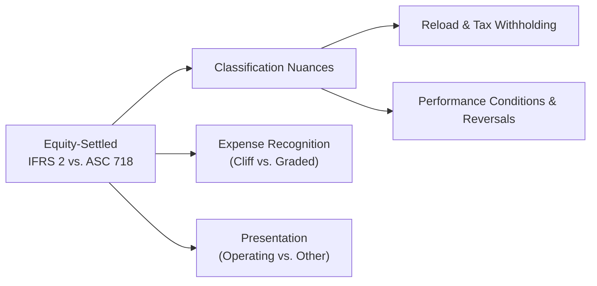

## Context and Overview

Ever found yourself a little confused—like, truly stumped—when you’ve tried to decipher the footnotes surrounding share-based compensation? You're not alone. Share-based payment plans can feel like a whirlwind of terms: "equity-settled," "cash-settled," "cliff-vesting," "graded-vesting," and so forth. On top of that, IFRS and US GAAP each set their own unique spin on the definitions, measurements, and disclosures. It’s a bit like navigating two different theme parks: both have roller coasters, but the rules for how tall you must be to ride can differ slightly.

In a nutshell, IFRS 2 (Share-based Payment) and FASB ASC 718 (Compensation—Stock Compensation) are the two titans here. They share many similarities in how to measure fair value for stock-based awards but diverge when it comes to classification, vesting patterns, performance conditions, expense reversals, and presentation. These differences can impact everything from net income to ratio analysis. That’s why it’s critical to know how each standard frames share-based compensation—and how you can interpret these differences in real-world financial statements.

Below, we’ll walk through the major considerations under both regimes. We’ll talk about classification for equity- vs. cash-settled awards, highlight the sometimes-subtle differences in fair value measurement (including reload features and performance-based awards), examine how each standard deals with vesting schedules, and see what happens if a performance condition is not met. Let’s dive in, shall we?

## Equity-Settled vs. Cash-Settled Awards

One of the foundational pillars of share-based payments is whether they’re equity-settled or cash-settled.

• Equity-Settled Awards: When a company grants share-based compensation to employees that will ultimately be settled in shares (e.g., stock options or restricted share units), this is considered equity-settled. Under both IFRS 2 and ASC 718, the company records an increase in equity, and the expense recognized is based on the fair value determined at the date of grant.

• Cash-Settled Awards: Here, employees are essentially cashing in on the value of the company’s stock. It might look like a stock appreciation right (SAR), where the company promises to pay the employee an amount of cash based on the appreciation of its stock over a specific timeframe. Under IFRS, these are classified as “liabilities” and must be remeasured at fair value each reporting period. US GAAP follows a similar approach, but watch out for subtle differences in how that fair value might be calculated or presented.

## Key Differences in IFRS vs. US GAAP

It’s one thing to know the broad strokes—equity vs. cash. But in practice, IFRS 2 and ASC 718 take slightly different paths. Let’s look at some major areas that can trip you up on exam day or in real-life analysis.

### Classification Nuances

Under both frameworks, you’d think it would be pretty straightforward: if it’s going to be paid in shares, it’s equity-settled; if it’s going to be paid in cash, it’s cash-settled. But IFRS adds additional layers of classification complexity around partially cash-settled plans or plans with net-settlement features (e.g., the company withholds some shares to cover tax obligations). IFRS often leans toward a detailed “look at the substance” approach to decide how to split or classify components as equity or liability.

In contrast, US GAAP can allow certain net-settlement arrangements to still be treated as equity if they meet specific criteria. This means that you might see a plan recognized entirely in equity under US GAAP, whereas IFRS might split that same plan into equity and liability components.

### Fair Value Measurement: Reload Features, Tax Withholding, and Performance-Based Awards

Both IFRS 2 and ASC 718 anchor on fair value measurement at grant date for equity-settled awards. However:

• Reload Features: IFRS typically requires that if there is a reload feature (where new options are automatically granted upon exercise of existing options), each additional reload option is treated as a new grant. With US GAAP, the approach is similar in principle but can differ in disclosures or the precise timing of measuring fair value for these reloads.  
• Tax Withholding: IFRS requires that if a company can repurchase shares from employees to meet tax withholding obligations, part of the award might be categorized as a liability if the arrangement is substantial. US GAAP has narrower exceptions allowing certain tax withholding features (up to a maximum statutory tax rate) to remain classified as equity.  
• Performance-Based Awards: If the payout depends on meeting performance metrics—like ROIC, EBITDA, or other benchmarks—IFRS typically says: “Look at the range of plausible outcomes, and account for each accordingly.” US GAAP might use either a single best estimate or a probability-weighted approach to measure the fair value. Furthermore, if performance conditions are not met, IFRS generally does not allow reversal of previously recognized expense when those performance conditions are non-market conditions (e.g., specific revenue or profitability targets). US GAAP can allow for partial reversal under certain scenarios if the performance condition is a service-based or performance-based vesting condition that was ultimately not satisfied.

### Cliff-Vesting vs. Graded-Vesting Expense Recognition

"Cliff-vesting" means the award vests in a single chunk—say after three years, all at once. "Graded-vesting" means the award vests in portions—for example, 25% per year over four years. Here’s the difference:

• IFRS: IFRS 2 tends to favor an accelerated method of expense recognition for graded-vesting (sometimes called front-loading). Essentially, each “tranche” is treated as a separate award with its own fair value and vesting period.  
• US GAAP: ASC 718 allows but does not strictly require the accelerated method. US filers can choose a straight-line approach over the entire vesting period, provided that the total recognized cost at the end of the vesting period matches the aggregate fair value. This can lead to more straightforward expense patterns, albeit with potential differences in the early years compared to IFRS.

### Performance Conditions and Reversals

Under IFRS, if a performance condition is tied to something within the employee’s control (e.g., sales goals) and that condition isn’t satisfied, previously recognized costs are typically not reversed once you’ve already recognized them—assuming these were considered probable earlier. This is because IFRS often draws lines between market-based conditions (e.g., share price targets) and non-market performance conditions (like hitting a sales figure). The standard’s emphasis is on accounting for all plausible outcomes at the grant date and adjusting only if the employee’s service is not provided.

US GAAP can be more prescriptive about whether a condition is service-based or performance-based. If the condition is not met, and it’s a performance or service condition, you could reverse some or all compensation expense if the award does not vest—assuming that outcome was deemed probable initially but eventually fails.

### Presentation and Impact on Ratios

All that discussion about the timing and the amounts recognized ultimately affects how your operating expenses (under IFRS) or various line items (under US GAAP) might look. IFRS tends to run the share-based payment expense through operating expenses (like SG&A), so that can lower operating margins. US GAAP filers sometimes include share-based compensation in cost of goods sold (for manufacturing employees), R&D, or SG&A—so you might see the expense scattered across multiple lines. As an analyst, you have to read the footnotes or the MD&A carefully to figure out the total share-based charges and how they’re allocated, or you risk miscalculating certain margins and profitability metrics.

### Valuation Assumptions: Expected Volatility and Expected Term

Both IFRS and US GAAP rely on option pricing models such as Black-Scholes or binomial models to estimate fair value. However, the standards offer slightly different guidance on how to select certain assumptions:

• Volatility: IFRS 2 emphasizes the importance of using historical volatility and implied volatility (when available) that reflect the expected pattern over the life of the option. US GAAP is also flexible, permitting historical and implied volatilities in a manner consistent with the firm’s approach but might place greater focus on “expected" rather than strictly historical metrics.  
• Expected Term: IFRS references the need to consider the early exercise behaviors and any contractual or employee-related factors when estimating the expected term. Meanwhile, US GAAP outlines some safe-harbor guidelines if a company doesn’t have enough experience data, but again the fundamental concept is “best estimate” in both frameworks.

### Footnote Disclosures and MD&A Integration

Let’s not forget: the real meaty stuff often appears in the footnotes and disclosures. IFRS annual reports tend to detail assumptions in a neat footnote, discussing the magnitude of share-based payments, the method used, and key assumptions (expected volatility, expected life, etc.). US GAAP filers also provide footnote disclosures but might integrate additional commentary within the MD&A to help justify or explain the assumptions used. Analysts, especially those prepping for the CFA exam, need to skim these sections fluidly to ensure they capture the full sense of management’s judgments and the possible range of outcomes.

## Visualizing Key Differences

Below is a rough flowchart capturing some crucial distinctions between IFRS and US GAAP for share-based awards:

The chart doesn’t do justice to all the subtle corners of share-based plans, but it does show how several branches of the standard can lead to different outcomes, especially for more complex plans.

## Real-World Example

Imagine a global tech startup, ByteStar Inc., that is headquartered in Europe but has a US subsidiary. Management grants stock options to key employees worldwide, and the plan includes cliff-vesting for some employees but graded-vesting for others, plus a reload feature for top executives.

• Under IFRS, ByteStar might separate the plan into distinct “tranches” for the graded-vesting portion and accelerate expense in the early years. That same plan, if it fell under US GAAP, might be expensed on a straight-line basis, meaning the earlier expense is lower under the US approach.  
• If ByteStar decides to net-settle (withhold shares for tax purposes), IFRS might require those withheld shares to be treated as a partial liability unless certain thresholds are met. US GAAP might let ByteStar classify the entire plan as equity if the arrangement meets certain criteria around statutory tax rates.  
• For the reload feature, IFRS sees each reload as a new grant with a new fair value measurement date. US GAAP also treats reloads as new grants, but differences in disclosures and how the additional compensation is measured may surface.

From an analyst’s perspective, you might see ByteStar’s IFRS statements reporting a higher expense in year one of the plan (due to front-loaded expense for the graded-vesting portion), while the US entity’s statements break out share-based expenses across multiple lines in the income statement. If you’re calculating margins or P/E ratios, discrepancies can arise. It reminds me of a time I was comparing two tech firms—one IFRS and one GAAP—and noticed their net incomes diverged primarily because of how share-based compensation was allocated and recognized. It wasn’t a trivial difference, either. Moral of the story: read footnotes religiously and adjust if needed.

## Best Practices, Common Pitfalls, and Exam Tips

• Read the Fine Print: If share-based compensation is a significant part of a company’s expense structure (looking at you, big technology firms), carefully parse how the cost is recognized.  
• Identify Vesting Patterns: Cliff-vesting vs. graded-vesting can drastically alter the timing of expense recognition. IFRS generally calls for an accelerated approach, while US GAAP might elect a straight-line approach.  
• Performance Conditions: IFRS requires separate accounting for plausible outcomes, so watch for whether management’s assumptions might inflate or deflate recognized expense across periods. US GAAP’s approach can differ in how it treats reversals if performance targets aren’t ultimately hit.  
• Classification of Tax Withholding Features: IFRS is typically stricter in classifying part of the award as a liability if the tax withholding feature is significant. US GAAP is somewhat more lenient.  
• Keep an Eye on Reversals: IFRS typically does not allow reversing recognized expense if a non-market performance condition is not met, while US GAAP might. Stay alert for big “negative” share-based compensation lines if performance metrics were missed under a US GAAP regime.  
• Potential Impact on Ratios: If you see a big difference in operating margins or net income when comparing an IFRS-based company to a US GAAP-based competitor, share-based comp classification could be a culprit.  
• On the Exam: Vignette-style item sets often bury the details about vesting terms, performance conditions, and plan classification in a short paragraph. You’ll have to glean from context whether the plan is equity- or cash-settled, how the vesting schedule works, and which standard’s approach to expense recognition is relevant. One quick tip? If the question highlights a reload clause or net-settlement for tax withholding, that’s your cue to check how classification might shift or how a standard might treat that scenario.

## Concluding Thoughts

Share-based compensation is a key area where IFRS and US GAAP converge in principle but diverge in practice. Their differing guidelines on classification, front-loaded vs. straight-line expense recognition, handling of tax withholding, and the possibility (or impossibility) of reversing recognized costs can lead to surprisingly large discrepancies in a company’s reported profits. If you’re analyzing or valuing a company with significant equity compensation, it’s worth taking that extra step to see exactly which standard they’re using and how they've chosen to implement it.

On exam day, you’ll need to be able to apply these differences quickly. That might mean recognizing how IFRS demands accelerated expense for graded-vesting or how US GAAP may allow partial reversal if performance conditions aren’t met. Don’t let yourself get blindsided. Focus on the essential aspects of classification, measurement, vesting, and presentation, and combine that with precise reading of vignettes to nail the item sets.

Stay curious, keep reading those footnotes (yes, footnotes are your friend!), and you’ll find yourself much more fluent in how companies reflect share-based compensation on their books.

## References

• IFRS 2 (Share-based Payment) – Available at:  
  https://www.ifrs.org/  
• FASB ASC 718 (Compensation—Stock Compensation) – Available at:  
  https://asc.fasb.org/  
• International Financial Statement Analysis, CFA Institute.  
• Various academic articles on IFRS vs. US GAAP in The Accounting Review and other scholarly journals.  

## Test Your Knowledge: IFRS vs. US GAAP for Share-Based Plans



### Which of the following describes a key difference in classification for share-based compensation under IFRS vs. US GAAP?

- [ ] Under both IFRS and US GAAP, no plans are ever classified as liabilities.
- [x] IFRS often classifies part of a plan as a liability if there is a significant net-settlement feature, while US GAAP may still allow equity classification.
- [ ] US GAAP requires all stock appreciation rights to be classified as equity.
- [ ] IFRS 2 mandates that plans with tax withholding cannot be equity-settled.

> **Explanation:** IFRS may split awards into equity and liability components if net-settlement features exist, while US GAAP provides more latitude for plans to remain in equity.

### How does IFRS typically approach expense recognition for share-based awards with graded-vesting?

- [x] IFRS accelerates expense recognition by treating each vesting tranche as a separate award.
- [ ] IFRS only uses a straight-line approach for all vesting.
- [ ] IFRS does not require expense recognition until vesting is complete.
- [ ] IFRS accelerates expense recognition but requires immediate expensing in year one.

> **Explanation:** IFRS 2 generally requires front-loading for each vesting tranche. In other words, each portion of the award is treated as a distinct grant with its own vesting period and fair value.

### When it comes to performance-based conditions, how does IFRS typically handle possible outcomes?

- [ ] IFRS takes a single best-estimate approach.
- [ ] IFRS always uses a binary (vest or not vest) logic for all performance awards.
- [x] IFRS requires the company to account for each plausible outcome separately.
- [ ] IFRS treats all performance-based awards as liability-classified.

> **Explanation:** IFRS 2 wants you to consider each plausible outcome, rather than taking a single best estimate. Multiple scenario analysis is often required.

### Under US GAAP, which statement is most accurate regarding the reversal of compensation expense for performance-based awards?

- [ ] US GAAP never allows reversal once expense is recognized.
- [ ] US GAAP always reverses all prior expense if the award does not vest.
- [ ] US GAAP treats all performance conditions as market-based.
- [x] US GAAP might permit partial or full reversal if a performance or service condition is not ultimately met.

> **Explanation:** Under ASC 718, if it becomes apparent that the performance condition will not be satisfied, the previously recognized expense can be reversed if the vesting never occurs.

### In measuring fair value for equity-settled awards, which approach is common to both IFRS 2 and ASC 718?

- [x] Estimating the fair value using an option pricing model at the grant date.
- [ ] Using the intrinsic value method at each reporting date.
- [ ] Basing fair value solely on the historical cost of the award.
- [ ] Foregoing fair value if the performance conditions are too complex.

> **Explanation:** Both IFRS and US GAAP emphasize measuring grant-date fair value using recognized option valuation models like Black-Scholes or binomial models.

### Which of the following best summarizes IFRS’s stance on reversing recognized expense if a non-market performance condition is not achieved?

- [x] IFRS generally does not allow reversing previously recognized expense.
- [ ] IFRS always requires a full reversal of previously recognized expense.
- [ ] IFRS never recognizes expense for performance conditions until the condition is fully met.
- [ ] IFRS measures expense based on the stock’s price at the date the condition fails.

> **Explanation:** IFRS does not typically allow reversal of expense for non-market (e.g., internal performance-based) conditions once recognized. 

### How might IFRS vs. US GAAP differ in presenting share-based compensation in the income statement?

- [ ] IFRS mandates that share-based compensation always be presented as a separate line item.
- [ ] US GAAP mandates a single “share-based expense” line in SG&A.
- [x] IFRS typically flows the cost into operating expenses, while US GAAP can distribute the cost across different functional categories.
- [ ] Both IFRS and US GAAP prohibit classification as an operating expense.

> **Explanation:** IFRS generally recognizes share-based expense in operating expenses. Under US GAAP, the expense can be recorded in various functional categories (e.g., COGS, R&D, SG&A).

### If a company needs to withhold shares for tax obligations, how might IFRS treat the plan?

- [ ] IFRS always retains equity classification for tax withholding features.
- [x] IFRS may require split classification or liability classification depending on the significance of the withholding.
- [ ] IFRS disallows tax withholding in share-based compensation.
- [ ] IFRS permits only partial expense recognition until taxes are paid.

> **Explanation:** IFRS sets strict guidelines; significant withholding features can trigger liability classification for part of the award.

### What is a “reload feature” in share-based compensation?

- [x] A provision allowing an employee to receive new options when they exercise existing options.
- [ ] A feature that automatically resets the vesting period each time the stock price declines.
- [ ] A way for the company to buy back shares from the market.
- [ ] A required add-on for compliance with IFRS and US GAAP.

> **Explanation:** A reload feature typically grants new stock options to employees upon exercise of their existing options, often intended to maintain certain ownership thresholds.

### True or False: Both IFRS 2 and ASC 718 rely on analyzing expected volatility from a combination of historical and implied measures when valuing options.

- [x] True
- [ ] False

> **Explanation:** Both standards encourage using reasonable estimates of future volatility, which can include historical data as well as implied volatility from market-traded options.


