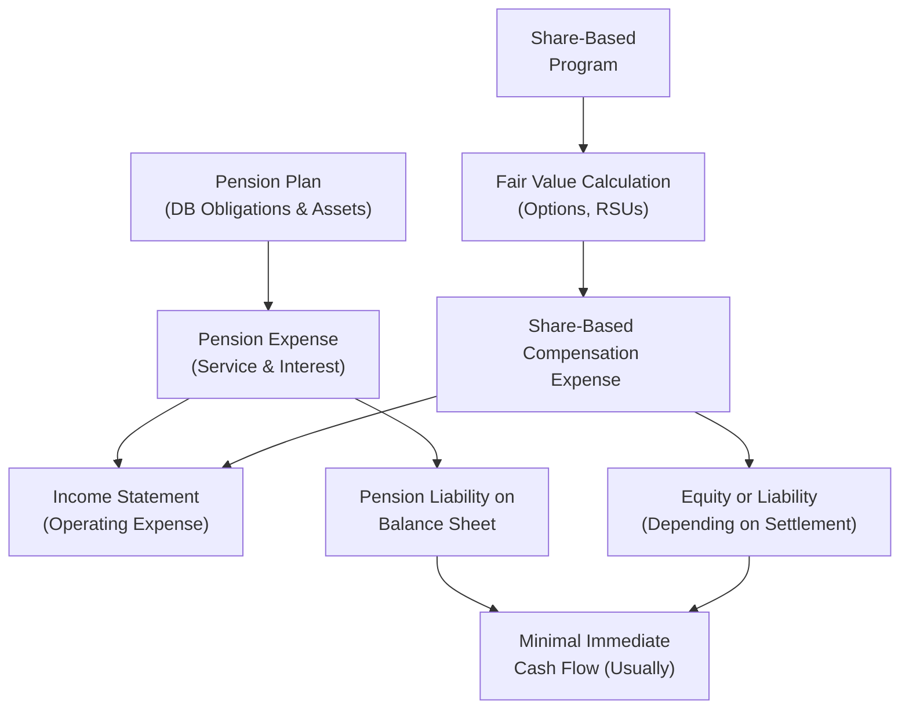

## Introduction and Overview

Let’s say you come across a company—maybe one your friend works at—that proudly unveils two big employee incentives: a robust defined benefit pension plan (the kind where future employee benefits are promised and the employer shoulders a bucket-load of risk) and a sweet share-based compensation program (those stock options and restricted shares everyone loves to talk about at parties). At first glance, it all looks amazing—top-notch benefits, happy employees, stable workforce. But from a financial analysis perspective, these two forms of compensation can create a swirl of adjustments on the financial statements. 

It’s a perfect example of where we need to analyze not just the what but the how: How exactly do these expense lines get reported in the income statement (IS)? How do they mold the balance sheet (BS)? Any effect on the statement of cash flows (CF)? And, crucially, how can these items obscure the company’s core or “normal” operating performance?

Below, we’ll launch into a step-by-step approach to evaluating the combined effect of pension costs and share-based compensation expenses. We’ll highlight common pitfalls, note areas where investors might be misled, and tap into an example scenario that you’d likely see in a Level II item-set vignette. 

Before we dig in, keep in mind a few terms from the “Glossary”:

• Defined Benefit Plan: Employer promises a specified pension payout, bearing the investment and actuarial risk.  
• Service Cost: Present value of pension benefits earned by employees in the current reporting period.  
• Expected Return on Plan Assets: Under certain standards (especially historically under US GAAP), an assumed return on pension assets that offsets pension expense.  
• Adjusted EPS: Earnings per share recast to remove certain items, like pension remeasurements or share-based modifications.  
• Cross-Topic Risk: Multiple changes in compensation structures happening at once, summing to a big shift in reported performance.  
• Discount Rate Impact: Changes in discount rates used for pension obligations or share-based calculations can sharply alter reported liabilities.  

## Scenario Setup: Combining Pensions and Share-Based Awards

Imagine KLM Corporation, a mid-sized manufacturing firm that:

• Sponsors a large defined benefit pension plan for its long-serving workforce.  
• Uses share-based compensation extensively for middle and senior management.  

During the year in question, KLM modifies its share-based compensation plan—adding a performance condition that accelerates vesting if certain profit targets are met. Around the same time, interest rates in the market drift upward, and KLM updates the discount rate it uses to measure its pension obligation. 

Sounds like a fairly realistic combination of events, right? Especially if you’ve read a few annual reports. In KLM’s footnotes, you’d see new lines describing additional cost from accelerated share-based awards and adjusted pension liabilities. This can be quite confusing if you’re looking at it for the first time—or if you’re in the homestretch of the CFA exam and your mind is swirling with IFRS vs. US GAAP distinctions.

Let’s walk through our footnote reading approach.

## Step 1: Pinpoint Pension Obligations, Assets, and Funded Status

We start with the pension footnote. KLM’s footnote might say:

• Projected benefit obligation (PBO) of $600 million.  
• Fair value of plan assets of $550 million.  
• Funded status: $(50) million (i.e., an underfunded plan).  
• Discount rate used for measuring obligations: 4.2% this year (was 3.5% last year).  
• Service cost for the period: $15 million.  
• Interest cost on the obligation: $21 million.  
• Expected return on plan assets (if measured under older US GAAP approaches or disclosed for informational purposes): 6%.  

Under IFRS or US GAAP, you might see somewhat different line-item definitions, but fundamentally, we want to know the plan’s funded status, the period’s pension expense components, and the assumptions used (particularly the discount rate and expected return). Because the discount rate changed from last year, KLM’s projected benefit obligation and interest cost are both affected. A higher discount rate typically reduces the present value of future obligations (i.e., lowers the liability), but it can also influence other aspects of the reported expense.

## Step 2: Examine Fair Value Assumptions for Share-Based Awards

Next, we peek at the share-based compensation footnote. Suppose KLM grants stock options and restricted stock units (RSUs). Under IFRS 2 or FASB ASC 718, share-based awards are measured at fair value on grant date. The recognized expense is spread over the vesting period. 

Let’s hypothesize:

• KLM’s total share-based compensation expense was $10 million this year under an original plan.  
• Because the plan was modified to add an accelerated vesting feature if net income meets a certain threshold, management recognized an incremental $3 million in additional expense in the same year.  
• The company uses a Black-Scholes model (or a binomial model) to measure the fair value of options, factoring in volatility, expected life, risk-free rate, and dividend yield.  

We’ll emphasize that any assumptions used in that fair value calculation could significantly shift recognized expense. If management changes volatility assumptions or the expected life of options, the recorded expense for the year might increase or decrease noticeably.

## Step 3: Combine the Impacts

Now that we know how each plan works, let’s see how these items appear on the financial statements.

### Income Statement Effects

• Pension expense components might include:  
  1) Service cost (typically in operating expenses),  
  2) Net interest cost (interest cost minus expected return on plan assets under some GAAP frameworks or IFRS’s net interest approach).  

• Share-based compensation expense:  
  1) The base expense from standard vesting,  
  2) The incremental expense from modifications (accelerated vesting).  

In total, you might see the pension service cost and share-based expenses all lumped under labor expense or SG&A. The interest cost component could go into interest expense or remain in operating expenses, depending on the accounting framework. Because so many lines are aggregated, an investor might not realize that part of the year-over-year jump in “compensation expense” is from a big discount rate shift or a modification of share-based plans rather than from normal wage growth.

### Balance Sheet Effects

• Pension liabilities: Underfunded plans show up as a net liability. Overfunded plans appear as a net asset.  
• Equity adjustments: Past service costs (if recognized immediately under IFRS) or unrecognized prior service costs under US GAAP can sit in other comprehensive income (OCI). Gains/losses from remeasurements can also flow through OCI.  
• Share-based compensation can increase equity (when shares are actually issued) but also lead to higher additional paid-in capital. If employees haven’t fully vested, you may see a portion of “unearned compensation” or “share-based compensation to be recognized” in equity.

### Cash Flow Statement Effects

• Pension contributions: The actual contributions to the plan are reported in operating or financing cash flows depending on the standard, but typically in operating cash flow under US GAAP. Not always the same as the recognized pension expense.  
• Share-based compensation: Typically a non-cash expense. Because awarding shares does not require immediate cash outflow, you won’t typically see it in CFO (unless you have payroll tax obligations on vesting, for instance).

When you combine these two compensation structures in the same year, the total reported “employee expense” can spike (or dip) for reasons that have nothing to do with a day-to-day, in-the-trenches cost. In short, it can obscure an investor’s view of “true” operational costs. 

## Mapping the Interplay Visually

Below is a simple Mermaid diagram showing how pension and share-based compensation flow into the financial statements. Think of it as a bird’s-eye map:

From this diagram, each compensation component hits the income statement differently, with the potential to feed through to the balance sheet and ultimately shape the statement of cash flows.

## Additional Complexity: Discount Rate and Share Award Changes in the Same Year

A problem arises when both the pension discount rate changes and the company modifies its share-based awards. If the discount rate goes up (dropping pension obligations somewhat), that portion might reduce recognized pension expense. But if share-based awards are accelerated or regraded, that portion might go up significantly. Or vice versa. 

Imagine that net income stays roughly the same from last year, but you’re left scratching your head as to why total compensation expense soared. Without digging into footnotes, it’s easy to miss that a discount rate change gave a “tailwind” in pension expense, which offset the “headwind” from share-based compensation adjustments. 

## Where Ratio Analysis Shines

Many sophisticated analysts recast pivotal ratios to isolate the effect of these compensation decisions. Let’s highlight a few:

• Interest Coverage (EBIT ÷ Interest Expense): Any portion of pension interest cost can distort your reported “interest” line item. Some analysts add back pension interest cost to the numerator and denominator to see a “core” coverage measure.  
• Return on Assets (ROA): If share-based compensation is large, total assets remain unaffected by the expense itself, but net income can be depressed. Excluding or separately adjusting for share-based comp might give a better sense of real operating performance.  
• Net Margin (Net Income ÷ Sales): When share-based comp or pension costs spike, net margin tumbles. It may be useful for year-to-year comparisons to strip out short-term lumps from discount rate changes or plan modifications.

It’s not about ignoring the compensation cost; it’s about untangling recurring operational costs from one-off or assumption-driven changes. This recast helps stakeholders see the firm’s real baseline profitability.

## Example: Adjusted EPS and Adjusted Debt Ratios

Often, the CFA exam or real-world analysis calls for adjusting EPS or debt ratios to reflect these hidden obligations:

• Adjusted EPS:  
  - If additional shares are granted mid-year, you must factor in the dilutive effect to the denominator.  
  - If there’s a big pension gain recognized in OCI, it might not affect net income directly, but a portion of pension expense does.  
  - Some questions might ask you to remove share-based comp from net income to view “cash-based EPS,” or “non-GAAP EPS.”  

• Adjusted Total Debt:  
  - Suppose the plan is underfunded by $50 million. Many analysts treat that shortfall as an additional liability.  
  - Add it to the firm’s reported interest-bearing debt to get total adjusted debt.  
  - This can significantly alter leverage ratios, such as Debt/Equity or Debt/EBITDA.

## Advanced Exam Tips

1. Multi-Topic Vignette Analysis: Carefully read each footnote reference. The pension section might mention a new discount rate, while the “Equity Compensation” footnote might show a re-pricing of options or a performance-based vesting condition.  
2. IFRS vs. US GAAP Differences: Under IFRS, pension remeasurements go to OCI. Under US GAAP, the mechanics of measuring net periodic pension cost differ slightly. For share-based comp, IFRS 2 and ASC 718 largely converge on measuring fair value, but watch for small differences in classification and timing.  
3. Cross-Checking Expense Recognition: Look for the period in which the expense is recognized. For example, if a plan modification grants immediate vesting, the entire incremental expense might appear in the current period.  
4. Don’t Miss the Stock Dilution: More shares granted means a bigger denominator for EPS. Weighted-average shares outstanding might be impacted, so read the note on “Diluted EPS.”  
5. Watch for Plan Amendments: A single line footnote note might say, “The plan was amended during the year to…” That’s a big red flag to investigate deeper and see how it skews each statement.

## Conclusion

When you see a company balancing a defined benefit plan obligation with a share-based compensation plan, get ready for deeper footnote detective work. The interplay of pension assumptions and equity-settled awards can create big swings in expense recognition—swings that don’t necessarily reflect core operating performance. By methodically parsing the footnotes, recasting certain ratios, and understanding how discount rates, plan modifications, or re-accelerated vesting can move the needle, you’ll be one step closer to seeing the “real” story behind the numbers.

Remember: Don’t be intimidated by multiple moving parts. Instead, break them down step by step, keep an eye out for IFRS vs. US GAAP nuances, and hang on to ratio analysis as your magnifying glass. The exam’s item sets often wrap these topics together, so be prepared to do exactly what we just did—only faster and under the time constraints of test day!

## References and Further Reading

• IFRS 2 (Share-based Payment) and IAS 19 (Employee Benefits) from IFRS Foundation (https://www.ifrs.org/)  
• FASB ASC 718 (Compensation—Stock Compensation) and ASC 715 (Compensation—Retirement Benefits) (https://asc.fasb.org/)  
• CFA Institute texts discussing multi-topic integrations in pension and compensation readings  
• “Cases in Financial Reporting” (John Wiley & Sons) for real-world corporate disclosures and synergy between share-based and pension costs  

## Practice Questions: Pension and Share-Based Compensation Analysis



### Question 1

Which of the following is most likely to obscure the true operational cost of a company’s compensation structure?  

- [ ] Recognizing share-based awards at grant date only  
- [x] Combining increased share-based compensation modification costs with lower pension expense due to a higher discount rate  
- [ ] Including all compensation expense in non-operating items  
- [ ] Treating pension contributions as financing outflows  

> **Explanation:** When a company’s pension expense is reduced by changes in assumptions (e.g., higher discount rate) at the same time that share-based compensation cost rises due to modifications, the net effect on the income statement can mask the actual trends in compensation cost.

### Question 2

Under IFRS, which section would most likely include pension remeasurements related to actuarial gains or losses on plan assets and obligations?  

- [ ] Net income  
- [ ] Financing cash flow  
- [x] Other comprehensive income (OCI)  
- [ ] Retained earnings directly  

> **Explanation:** IFRS requires actuarial gains and losses (remeasurements) to be recognized in OCI. In contrast, US GAAP has a slightly different process, but both standards typically keep these remeasurements out of net income.

### Question 3

A company accelerates the vesting of key employee stock options, resulting in an incremental $4 million of share-based compensation expense in the current year. How would this likely affect cash flows in the current period?  

- [ ] Increase operating cash flows by $4 million  
- [ ] Decrease operating cash flows by $4 million  
- [x] Have minimal net impact on current-period cash flows  
- [ ] Reclassify $4 million from investing to financing  

> **Explanation:** Share-based compensation is generally a non-cash expense. Accelerated vesting increases compensation expense on the income statement but does not directly reduce current-period cash flows (except for any payroll taxes paid on vesting, which is typically small relative to total expense).

### Question 4

If an analyst wants to assess a firm’s core interest coverage ratio excluding pension effects, which adjustment might be most appropriate?

- [x] Add back any pension interest cost to both EBIT and interest expense  
- [ ] Deduct pension service cost from EBIT  
- [ ] Exclude share-based compensation from total interest expense  
- [ ] Treat share-based compensation as a substitute for interest expense  

> **Explanation:** Pension interest cost can distort a firm’s interest expense, so an analyst often recalculates interest coverage by removing or isolating the pension interest portion. This approach clarifies how well the firm covers its “real” interest on debt obligations.

### Question 5

When computing an adjusted EPS to reflect the dilutive impact of newly granted shares from a share-based compensation plan, which approach is most consistent with standard practice?

- [x] Increase the weighted-average number of shares outstanding for the portion of the year the awards were in effect  
- [ ] Count all potential shares as outstanding at the beginning of the year  
- [ ] Only adjust for anti-dilutive shares in the denominator  
- [ ] Exclude unvested shares from the EPS calculation  

> **Explanation:** Standard practice for diluted EPS is to adjust the weighted-average number of shares outstanding for the portion of the reporting period during which potential shares were outstanding, reflecting the timing of issuances or vesting.

### Question 6

A major change in the discount rate used for pension calculations increases the discount rate from 3.5% to 4.5%. Which of the following outcomes is likely?

- [x] Lower present value of future pension obligations  
- [ ] Higher net pension liability  
- [ ] Instantly higher service cost  
- [ ] No effect on interest cost  

> **Explanation:** A higher discount rate decreases the present value of the future obligations, leading to a lower pension obligation on the balance sheet. This can reduce net pension liability.

### Question 7

Company ABC experiences a $30 million decrease in its pension obligation due to an interest rate change, while also incurring a $30 million increase in share-based compensation expense from plan modifications. Net income remains unchanged. Which statement best describes this phenomenon?

- [x] The pension “tailwind” offset the share-based “headwind” in compensation expense, leaving net income flat  
- [ ] Share-based compensation is most likely zero  
- [ ] The pension-plan discount rate has no material impact on net income  
- [ ] The cash flow statement will show a $30 million use of cash  

> **Explanation:** When discount rates rise, pension expenses and obligations can decrease, effectively offsetting the incremental cost recognized from share-based compensation modifications. As a result, net income may stay flat despite large moving pieces within compensation.

### Question 8

Which of the following adjustments to the balance sheet would most likely provide a clearer picture of a company’s leverage?

- [ ] Reclassifying share-based compensation expense to equity  
- [x] Adding underfunded pension amounts to total debt  
- [ ] Subtracting the fair value of restricted shares from equity  
- [ ] Removing intangible assets from total assets  

> **Explanation:** Many analysts “capitalize” or treat underfunded pension obligations as debt-like items. Including these in total debt helps gauge the true economic leverage.

### Question 9

Why might share-based compensation expenses not appear directly as cash outflows in the statement of cash flows?

- [ ] They are reported as operating outflows under IFRS but not US GAAP  
- [ ] They are capitalized and included in long-term assets  
- [x] They do not involve a direct movement of cash except for associated tax effects  
- [ ] They are paid by shareholders rather than the company  

> **Explanation:** Share-based compensation is recognized as an expense on the income statement for accounting purposes, but since no cash is actually paid to employees at the grant date (they receive equity instead), it does not directly reduce cash flows.

### Question 10

True or False: Under both IFRS and US GAAP, the fair value of share-based compensation is measured at the time of grant and not remeasured for subsequent changes in the company’s share price.

- [x] True
- [ ] False

> **Explanation:** Under IFRS 2 and ASC 718, the fair value of equity-settled share-based awards is determined at grant date and typically not remeasured for subsequent share-price changes. (Cash-settled awards follow a different approach, with remeasurement at each reporting date.)


